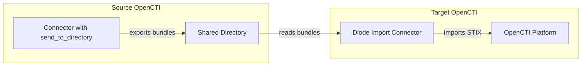

# OpenCTI Diode Import Connector

| Status | Date | Comment |
|--------|------|---------|
| Filigran Verified | -    | -       |

The Diode Import connector imports STIX bundles exported using OpenCTI's `send_to_directory` mode, enabling data synchronization between OpenCTI instances or air-gapped environments.

## Table of Contents

- [OpenCTI Diode Import Connector](#opencti-diode-import-connector)
  - [Table of Contents](#table-of-contents)
  - [Introduction](#introduction)
  - [Installation](#installation)
    - [Requirements](#requirements)
  - [Configuration variables](#configuration-variables)
    - [OpenCTI environment variables](#opencti-environment-variables)
    - [Base connector environment variables](#base-connector-environment-variables)
    - [Connector extra parameters environment variables](#connector-extra-parameters-environment-variables)
  - [Deployment](#deployment)
    - [Docker Deployment](#docker-deployment)
    - [Manual Deployment](#manual-deployment)
  - [Usage](#usage)
  - [Behavior](#behavior)
  - [Debugging](#debugging)
  - [Additional information](#additional-information)

## Introduction

The Diode Import connector acts as a data synchronization bridge between OpenCTI instances or environments. It reads STIX bundles from a local directory (exported by another connector using `send_to_directory` mode) and imports them into the target OpenCTI platform.

### Key Features

- Imports STIX bundles from a local directory
- Impersonates source connector registrations
- Maps source applicant IDs to target applicant IDs
- Supports automatic file cleanup with configurable retention
- Handles incremental imports without duplicate processing

## Installation

### Requirements

- OpenCTI Platform >= 6.0.0
- Shared directory accessible by both source (exporter) and this connector
- Bundles exported using `send_to_directory` mode from another OpenCTI connector

## Configuration variables

There are a number of configuration options, which are set either in `docker-compose.yml` (for Docker) or in `config.yml` (for manual deployment).

### OpenCTI environment variables

| Parameter     | config.yml | Docker environment variable | Mandatory | Description                                          |
|---------------|------------|-----------------------------|-----------|------------------------------------------------------|
| OpenCTI URL   | url        | `OPENCTI_URL`               | Yes       | The URL of the OpenCTI platform.                     |
| OpenCTI Token | token      | `OPENCTI_TOKEN`             | Yes       | The default admin token set in the OpenCTI platform. |

### Base connector environment variables

| Parameter         | config.yml        | Docker environment variable   | Default      | Mandatory | Description                                                              |
|-------------------|-------------------|-------------------------------|--------------|-----------|--------------------------------------------------------------------------|
| Connector ID      | id                | `CONNECTOR_ID`                |              | Yes       | A unique `UUIDv4` identifier for this connector instance.                |
| Connector Name    | name              | `CONNECTOR_NAME`              | Diode Import | No        | Name of the connector.                                                   |
| Run and Terminate | run_and_terminate | `CONNECTOR_RUN_AND_TERMINATE` | false        | No        | Run once and exit if `true`.                                             |
| Log Level         | log_level         | `CONNECTOR_LOG_LEVEL`         | info         | No        | Determines the verbosity of logs: `debug`, `info`, `warn`, or `error`.   |

### Connector extra parameters environment variables

| Parameter           | config.yml                             | Docker environment variable                    | Default | Mandatory | Description                                                    |
|---------------------|----------------------------------------|------------------------------------------------|---------|-----------|----------------------------------------------------------------|
| Directory Path      | diode_import.get_from_directory_path   | `DIODE_IMPORT_GET_FROM_DIRECTORY_PATH`         |         | Yes       | Path to directory containing exported bundles.                 |
| Directory Retention | diode_import.get_from_directory_retention | `DIODE_IMPORT_GET_FROM_DIRECTORY_RETENTION` | 7       | No        | Days to retain processed files before deletion.                |
| Delete After Import | diode_import.delete_after_import       | `DIODE_IMPORT_DELETE_AFTER_IMPORT`             | true    | No        | Delete files immediately after successful processing.          |
| Applicant Mappings  | diode_import.applicant_mappings        | `DIODE_IMPORT_APPLICANT_MAPPINGS`              |         | Yes       | Mapping of source applicant IDs to target IDs (format: `id1:id2,id3:id4`). |

## Deployment

### Docker Deployment

Build the Docker image:

```bash
docker build -t opencti/connector-diode-import:latest .
```

Configure the connector in `docker-compose.yml`:

```yaml
  connector-diode-import:
    image: opencti/connector-diode-import:latest
    environment:
      - OPENCTI_URL=http://localhost
      - OPENCTI_TOKEN=ChangeMe
      - CONNECTOR_ID=ChangeMe
      - CONNECTOR_NAME=Diode Import
      - CONNECTOR_LOG_LEVEL=info
      - CONNECTOR_RUN_AND_TERMINATE=false
      - DIODE_IMPORT_GET_FROM_DIRECTORY_PATH=/data/diode
      - DIODE_IMPORT_GET_FROM_DIRECTORY_RETENTION=7
      - DIODE_IMPORT_DELETE_AFTER_IMPORT=true
      - DIODE_IMPORT_APPLICANT_MAPPINGS=source-user-id:target-user-id
    volumes:
      - /path/to/shared/directory:/data/diode
    restart: always
```

Start the connector:

```bash
docker compose up -d
```

### Manual Deployment

1. Create `config.yml` based on `config.yml.sample`.

2. Install dependencies:

```bash
pip3 install -r requirements.txt
```

3. Start the connector:

```bash
python3 main.py
```

## Usage

The connector continuously monitors the configured directory for new STIX bundles. To force a re-process:

**Data Management → Ingestion → Connectors**

Find the connector and click the refresh button to reset the connector's state.

## Behavior

The connector reads STIX bundles from a directory and imports them into OpenCTI.

### Data Flow



### Entity Mapping

| Source Data           | Target Entity         | Description                                  |
|-----------------------|-----------------------|----------------------------------------------|
| STIX Bundle           | STIX Bundle           | Direct import of all STIX objects            |
| Source Applicant ID   | Target Applicant ID   | Mapped via `applicant_mappings`              |
| Source Connector      | Impersonated Connector| Connector registration preserved             |

### Processing Details

1. **Directory Monitoring**:
   - Scans configured directory for bundle files
   - Processes files in order (typically by timestamp)
   - Validates file format before import

2. **Bundle Import**:
   - Reads STIX bundle from file
   - Validates bundle structure
   - Maps applicant IDs from source to target
   - Imports all STIX objects to OpenCTI

3. **Connector Impersonation**:
   - Preserves original connector registration
   - Maintains data provenance from source system
   - Enables accurate tracking of data origins

4. **User Impersonation**:
   - Maps source user IDs to target user IDs
   - Required because internal IDs differ between instances
   - Configure via `applicant_mappings` parameter

5. **File Retention**:
   - Processed files are retained for configured period
   - Automatic cleanup after retention period expires
   - Prevents disk space issues in long-running deployments

### File Format Requirements

Files must be:
- Generated by a connector with `send_to_directory` enabled
- Valid STIX 2.1 bundle format
- Named according to OpenCTI export conventions

> **Warning**: Files added manually or with incorrect format will be ignored.

## Debugging

Enable verbose logging:

```env
CONNECTOR_LOG_LEVEL=debug
```

Common issues:
- **Files not processed**: Verify file format and naming convention
- **User not mapped**: Add missing user to `applicant_mappings`
- **Permission denied**: Check directory permissions for connector process
- **Duplicate data**: Check if files were already processed (check state)

## Additional information

### Use Cases

| Scenario            | Description                                          |
|---------------------|------------------------------------------------------|
| Air-gapped Transfer | Move data between isolated networks via removable media |
| Multi-instance Sync | Synchronize data between OpenCTI instances           |
| Backup Import       | Restore data from exported bundles                   |
| Data Migration      | Migrate data from one OpenCTI instance to another    |

### Applicant Mappings Format

The `DIODE_IMPORT_APPLICANT_MAPPINGS` parameter accepts comma-separated `key:value` pairs:

```
source-user-uuid-1:target-user-uuid-1,source-user-uuid-2:target-user-uuid-2
```

### Related Configuration

On the source side, ensure the exporting connector has:

```yaml
connector:
  send_to_directory: true
  send_to_directory_path: '/shared/diode'
```
