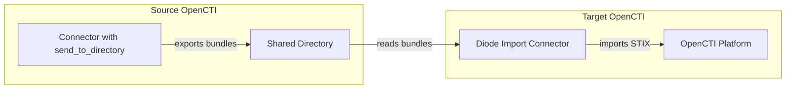

# OpenCTI Diode Import Connector

| Status            | Date | Comment |
|-------------------|------|---------|
| Filigran Verified | -    | -       |

## Table of Contents

- [Introduction](#introduction)
- [Installation](#installation)
  - [Requirements](#requirements)
- [Configuration](#configuration)
  - [Configuration Variables](#configuration-variables)
- [Deployment](#deployment)
  - [Docker Deployment](#docker-deployment)
  - [Manual Deployment](#manual-deployment)
- [Behavior](#behavior)
  - [Data Flow](#data-flow)
  - [Entity Mapping](#entity-mapping)
- [Debugging](#debugging)
- [Additional Information](#additional-information)

---

## Introduction

The Diode Import connector enables importing STIX bundles that were exported using OpenCTI's `send_to_directory` mode. This connector acts as a data synchronization bridge between OpenCTI instances or between environments, allowing offline or air-gapped data transfer.

### Key Features

- Imports STIX bundles from a local directory
- Impersonates source connector registrations
- Maps source applicant IDs to target applicant IDs
- Supports automatic file cleanup with configurable retention
- Handles incremental imports without duplicate processing

---

## Installation

### Requirements

- OpenCTI Platform >= 6.0.0
- Shared directory accessible by both source (exporter) and this connector
- Bundles exported using `send_to_directory` mode from another OpenCTI connector

---

## Configuration

### Configuration Variables

#### OpenCTI Parameters

| Parameter | Docker envvar | Mandatory | Description |
|-----------|---------------|-----------|-------------|
| OpenCTI URL | `OPENCTI_URL` | Yes | The URL of the OpenCTI platform |
| OpenCTI Token | `OPENCTI_TOKEN` | Yes | The default admin token set in the OpenCTI platform |

#### Base Connector Parameters

| Parameter | Docker envvar | Mandatory | Default | Description |
|-----------|---------------|-----------|---------|-------------|
| Connector ID | `CONNECTOR_ID` | Yes | - | A unique `UUIDv4` identifier for this connector |
| Connector Name | `CONNECTOR_NAME` | Yes | `Diode Import` | Name of the connector |
| Run and Terminate | `CONNECTOR_RUN_AND_TERMINATE` | No | `False` | Run once and exit if `True` |
| Log Level | `CONNECTOR_LOG_LEVEL` | Yes | - | Log level: `debug`, `info`, `warn`, or `error` |

#### Connector Extra Parameters

| Parameter | Docker envvar | Mandatory | Default | Description |
|-----------|---------------|-----------|---------|-------------|
| Directory Path | `DIODE_IMPORT_GET_FROM_DIRECTORY_PATH` | Yes | - | Path to directory containing exported bundles |
| Directory Retention | `DIODE_IMPORT_GET_FROM_DIRECTORY_RETENTION` | No | `7` | Days to retain processed files before deletion |
| Applicant Mappings | `DIODE_IMPORT_APPLICANT_MAPPINGS` | Yes | - | JSON mapping of source applicant IDs to target IDs |

---

## Deployment

### Docker Deployment

Use the following `docker-compose.yml`:

```yaml
services:
  connector-diode-import:
    image: opencti/connector-diode-import:latest
    environment:
      - OPENCTI_URL=http://opencti:8080
      - OPENCTI_TOKEN=${OPENCTI_ADMIN_TOKEN}
      - CONNECTOR_ID=${CONNECTOR_DIODE_IMPORT_ID}
      - CONNECTOR_NAME=Diode Import
      - CONNECTOR_LOG_LEVEL=info
      - CONNECTOR_RUN_AND_TERMINATE=false
      - DIODE_IMPORT_GET_FROM_DIRECTORY_PATH=/data/diode
      - DIODE_IMPORT_GET_FROM_DIRECTORY_RETENTION=7
      - DIODE_IMPORT_APPLICANT_MAPPINGS={"source-user-id":"target-user-id"}
    volumes:
      - /path/to/shared/directory:/data/diode
    restart: always
    depends_on:
      - opencti
```

### Manual Deployment

1. Clone the repository and navigate to the connector directory
2. Install dependencies: `pip install -r requirements.txt`
3. Configure `config.yml`:

```yaml
opencti:
  url: 'http://localhost:8080'
  token: 'your-token'

connector:
  id: 'your-uuid'
  name: 'Diode Import'
  log_level: 'info'
  run_and_terminate: false

diode_import:
  get_from_directory_path: '/data/diode'
  get_from_directory_retention: 7
  applicant_mappings:
    source-user-id-1: target-user-id-1
    source-user-id-2: target-user-id-2
```

4. Run: `python main.py`

---

## Behavior

### Data Flow



### Entity Mapping

| Source Data | Target Entity | Notes |
|-------------|---------------|-------|
| STIX Bundle | STIX Bundle | Direct import of all STIX objects |
| Source Applicant ID | Target Applicant ID | Mapped via `applicant_mappings` |
| Source Connector | Impersonated Connector | Connector registration preserved |

### Processing Details

1. **Directory Monitoring**:
   - Scans configured directory for bundle files
   - Processes files in order (typically by timestamp)
   - Validates file format before import

2. **Bundle Import**:
   - Reads STIX bundle from file
   - Validates bundle structure
   - Maps applicant IDs from source to target
   - Imports all STIX objects to OpenCTI

3. **Connector Impersonation**:
   - Preserves original connector registration
   - Maintains data provenance from source system
   - Enables accurate tracking of data origins

4. **User Impersonation**:
   - Maps source user IDs to target user IDs
   - Required because internal IDs differ between instances
   - Configure via `applicant_mappings` parameter

5. **File Retention**:
   - Processed files are retained for configured period
   - Automatic cleanup after retention period expires
   - Prevents disk space issues in long-running deployments

### File Format Requirements

Files must be:
- Generated by a connector with `send_to_directory` enabled
- Valid STIX 2.1 bundle format
- Named according to OpenCTI export conventions

⚠️ **Warning**: Files added manually or with incorrect format will be ignored.

---

## Debugging

Enable debug logging by setting `CONNECTOR_LOG_LEVEL=debug`. Common issues:

- **Files not processed**: Verify file format and naming convention
- **User not mapped**: Add missing user to `applicant_mappings`
- **Permission denied**: Check directory permissions for connector process
- **Duplicate data**: Check if files were already processed (check state)

---

## Additional Information

### Use Cases

| Scenario | Description |
|----------|-------------|
| Air-gapped Transfer | Move data between isolated networks via removable media |
| Multi-instance Sync | Synchronize data between OpenCTI instances |
| Backup Import | Restore data from exported bundles |
| Data Migration | Migrate data from one OpenCTI instance to another |

### Applicant Mappings Format

The `DIODE_IMPORT_APPLICANT_MAPPINGS` parameter accepts JSON format:

```json
{
  "source-user-uuid-1": "target-user-uuid-1",
  "source-user-uuid-2": "target-user-uuid-2"
}
```

### Related Configuration

On the source side, ensure the exporting connector has:
```yaml
connector:
  send_to_directory: true
  send_to_directory_path: '/shared/diode'
```