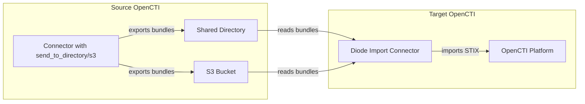

# OpenCTI Diode Import Connector

| Status | Date | Comment |
|--------|------|---------|
| Filigran Verified | -    | -       |

The Diode Import connector imports STIX bundles exported using OpenCTI's `send_to_directory` or `send_to_s3` modes, enabling data synchronization between OpenCTI instances or air-gapped environments.

## Table of Contents

- [OpenCTI Diode Import Connector](#opencti-diode-import-connector)
  - [Table of Contents](#table-of-contents)
  - [Introduction](#introduction)
  - [Installation](#installation)
    - [Requirements](#requirements)
  - [Configuration variables](#configuration-variables)
    - [OpenCTI environment variables](#opencti-environment-variables)
    - [Base connector environment variables](#base-connector-environment-variables)
    - [Directory consumption parameters](#directory-consumption-parameters)
    - [S3 consumption parameters](#s3-consumption-parameters)
    - [Common parameters](#common-parameters)
  - [Deployment](#deployment)
    - [Docker Deployment](#docker-deployment)
    - [Manual Deployment](#manual-deployment)
  - [Usage](#usage)
  - [Behavior](#behavior)
  - [Debugging](#debugging)
  - [Additional information](#additional-information)

## Introduction

The Diode Import connector acts as a data synchronization bridge between OpenCTI instances or environments. It reads STIX bundles from a local directory or S3 bucket (exported by another connector using `send_to_directory` or `send_to_s3` mode) and imports them into the target OpenCTI platform.

### Key Features

- Imports STIX bundles from a local directory or S3 bucket
- Supports both directory and S3 consumption simultaneously
- Can use OpenCTI's S3 credentials or custom S3 credentials
- Impersonates source connector registrations
- Maps source applicant IDs to target applicant IDs
- Supports automatic file cleanup with configurable retention
- Handles incremental imports without duplicate processing

## Installation

### Requirements

- OpenCTI Platform >= 6.0.0
- For directory mode: Shared directory accessible by both source (exporter) and this connector
- For S3 mode: Access to S3-compatible storage (AWS S3, MinIO, etc.)
- Bundles exported using `send_to_directory` or `send_to_s3` mode from another OpenCTI connector

## Configuration variables

There are a number of configuration options, which are set either in `docker-compose.yml` (for Docker) or in `config.yml` (for manual deployment).

### OpenCTI environment variables

| Parameter     | config.yml | Docker environment variable | Mandatory | Description                                          |
|---------------|------------|-----------------------------|-----------|------------------------------------------------------|
| OpenCTI URL   | url        | `OPENCTI_URL`               | Yes       | The URL of the OpenCTI platform.                     |
| OpenCTI Token | token      | `OPENCTI_TOKEN`             | Yes       | The default admin token set in the OpenCTI platform. |

### Base connector environment variables

| Parameter         | config.yml        | Docker environment variable   | Default      | Mandatory | Description                                                              |
|-------------------|-------------------|-------------------------------|--------------|-----------|--------------------------------------------------------------------------|
| Connector ID      | id                | `CONNECTOR_ID`                |              | Yes       | A unique `UUIDv4` identifier for this connector instance.                |
| Connector Name    | name              | `CONNECTOR_NAME`              | Diode Import | No        | Name of the connector.                                                   |
| Run and Terminate | run_and_terminate | `CONNECTOR_RUN_AND_TERMINATE` | false        | No        | Run once and exit if `true`.                                             |
| Log Level         | log_level         | `CONNECTOR_LOG_LEVEL`         | info         | No        | Determines the verbosity of logs: `debug`, `info`, `warn`, or `error`.   |

### Directory consumption parameters

| Parameter           | config.yml                                | Docker environment variable                    | Default | Mandatory | Description                                                    |
|---------------------|-------------------------------------------|------------------------------------------------|---------|-----------|----------------------------------------------------------------|
| Get From Directory  | diode_import.get_from_directory           | `DIODE_IMPORT_GET_FROM_DIRECTORY`              | true    | No        | Enable directory consumption mode.                             |
| Directory Path      | diode_import.get_from_directory_path      | `DIODE_IMPORT_GET_FROM_DIRECTORY_PATH`         |         | No*       | Path to directory containing exported bundles.                 |
| Directory Retention | diode_import.get_from_directory_retention | `DIODE_IMPORT_GET_FROM_DIRECTORY_RETENTION`    | 7       | No        | Days to retain processed files before deletion (0 = disable).  |

*Required if `get_from_directory` is enabled.

### S3 consumption parameters

| Parameter        | config.yml                          | Docker environment variable              | Default     | Mandatory | Description                                                    |
|------------------|-------------------------------------|------------------------------------------|-------------|-----------|----------------------------------------------------------------|
| Get From S3      | diode_import.get_from_s3            | `DIODE_IMPORT_GET_FROM_S3`               | false       | No        | Enable S3 consumption mode.                                    |
| S3 Bucket        | diode_import.get_from_s3_bucket     | `DIODE_IMPORT_GET_FROM_S3_BUCKET`        |             | No        | S3 bucket name. If empty, uses OpenCTI bucket.                 |
| S3 Folder        | diode_import.get_from_s3_folder     | `DIODE_IMPORT_GET_FROM_S3_FOLDER`        | connectors  | No        | Folder/prefix in bucket. Use "/" or "." for root.              |
| S3 Retention     | diode_import.get_from_s3_retention  | `DIODE_IMPORT_GET_FROM_S3_RETENTION`     | 7           | No        | Days to retain processed objects before deletion (0 = disable).|
| S3 Endpoint      | diode_import.s3_endpoint            | `DIODE_IMPORT_S3_ENDPOINT`               |             | No        | S3 endpoint. If empty, uses OpenCTI S3 credentials.            |
| S3 Port          | diode_import.s3_port                | `DIODE_IMPORT_S3_PORT`                   |             | No        | S3 port. If empty, uses OpenCTI S3 credentials.                |
| S3 Access Key    | diode_import.s3_access_key          | `DIODE_IMPORT_S3_ACCESS_KEY`             |             | No        | S3 access key. If empty, uses OpenCTI S3 credentials.          |
| S3 Secret Key    | diode_import.s3_secret_key          | `DIODE_IMPORT_S3_SECRET_KEY`             |             | No        | S3 secret key. If empty, uses OpenCTI S3 credentials.          |
| S3 Use SSL       | diode_import.s3_use_ssl             | `DIODE_IMPORT_S3_USE_SSL`                | true        | No        | Use SSL for S3 connection.                                     |
| S3 Bucket Region | diode_import.s3_bucket_region       | `DIODE_IMPORT_S3_BUCKET_REGION`          |             | No        | S3 bucket region. If empty, uses OpenCTI S3 credentials.       |

### Common parameters

| Parameter           | config.yml                       | Docker environment variable           | Default | Mandatory | Description                                                    |
|---------------------|----------------------------------|---------------------------------------|---------|-----------|----------------------------------------------------------------|
| Delete After Import | diode_import.delete_after_import | `DIODE_IMPORT_DELETE_AFTER_IMPORT`    | true    | No        | Delete files/objects immediately after successful processing.  |
| Applicant Mappings  | diode_import.applicant_mappings  | `DIODE_IMPORT_APPLICANT_MAPPINGS`     |         | No        | Mapping of source applicant IDs to target IDs (format: `id1:id2,id3:id4`). |

## Deployment

### Docker Deployment

Build the Docker image:

```bash
docker build -t opencti/connector-diode-import:latest .
```

#### Example: Directory consumption

```yaml
  connector-diode-import:
    image: opencti/connector-diode-import:latest
    environment:
      - OPENCTI_URL=http://localhost
      - OPENCTI_TOKEN=ChangeMe
      - CONNECTOR_ID=ChangeMe
      - CONNECTOR_NAME=Diode Import
      - CONNECTOR_LOG_LEVEL=info
      - CONNECTOR_RUN_AND_TERMINATE=false
      - DIODE_IMPORT_GET_FROM_DIRECTORY=true
      - DIODE_IMPORT_GET_FROM_DIRECTORY_PATH=/data/diode
      - DIODE_IMPORT_GET_FROM_DIRECTORY_RETENTION=7
      - DIODE_IMPORT_DELETE_AFTER_IMPORT=true
      - DIODE_IMPORT_APPLICANT_MAPPINGS=source-user-id:target-user-id
    volumes:
      - /path/to/shared/directory:/data/diode
    restart: always
```

#### Example: S3 consumption (using OpenCTI credentials)

```yaml
  connector-diode-import:
    image: opencti/connector-diode-import:latest
    environment:
      - OPENCTI_URL=http://localhost
      - OPENCTI_TOKEN=ChangeMe
      - CONNECTOR_ID=ChangeMe
      - CONNECTOR_NAME=Diode Import
      - CONNECTOR_LOG_LEVEL=info
      - DIODE_IMPORT_GET_FROM_S3=true
      - DIODE_IMPORT_GET_FROM_S3_FOLDER=connectors
      - DIODE_IMPORT_GET_FROM_S3_RETENTION=7
      - DIODE_IMPORT_DELETE_AFTER_IMPORT=true
      - DIODE_IMPORT_APPLICANT_MAPPINGS=source-user-id:target-user-id
    restart: always
```

#### Example: S3 consumption (with custom credentials)

```yaml
  connector-diode-import:
    image: opencti/connector-diode-import:latest
    environment:
      - OPENCTI_URL=http://localhost
      - OPENCTI_TOKEN=ChangeMe
      - CONNECTOR_ID=ChangeMe
      - CONNECTOR_NAME=Diode Import
      - CONNECTOR_LOG_LEVEL=info
      - DIODE_IMPORT_GET_FROM_S3=true
      - DIODE_IMPORT_GET_FROM_S3_BUCKET=my-bucket
      - DIODE_IMPORT_GET_FROM_S3_FOLDER=connectors
      - DIODE_IMPORT_S3_ENDPOINT=s3.amazonaws.com
      - DIODE_IMPORT_S3_PORT=443
      - DIODE_IMPORT_S3_ACCESS_KEY=my-access-key
      - DIODE_IMPORT_S3_SECRET_KEY=my-secret-key
      - DIODE_IMPORT_S3_USE_SSL=true
      - DIODE_IMPORT_S3_BUCKET_REGION=us-east-1
      - DIODE_IMPORT_DELETE_AFTER_IMPORT=true
      - DIODE_IMPORT_APPLICANT_MAPPINGS=source-user-id:target-user-id
    restart: always
```

Start the connector:

```bash
docker compose up -d
```

### Manual Deployment

1. Create `config.yml` based on `config.yml.sample`.

2. Install dependencies:

```bash
pip3 install -r requirements.txt
```

3. Start the connector:

```bash
python3 main.py
```

## Usage

The connector continuously monitors the configured directory and/or S3 bucket for new STIX bundles. To force a re-process:

**Data Management → Ingestion → Connectors**

Find the connector and click the refresh button to reset the connector's state.

## Behavior

The connector reads STIX bundles from a directory and/or S3 bucket and imports them into OpenCTI.

### Data Flow



### Entity Mapping

| Source Data           | Target Entity         | Description                                  |
|-----------------------|-----------------------|----------------------------------------------|
| STIX Bundle           | STIX Bundle           | Direct import of all STIX objects            |
| Source Applicant ID   | Target Applicant ID   | Mapped via `applicant_mappings`              |
| Source Connector      | Impersonated Connector| Connector registration preserved             |

### Processing Details

1. **Directory Monitoring** (if enabled):
   - Scans configured directory for bundle files
   - Processes files in order (typically by timestamp)
   - Validates file format before import

2. **S3 Monitoring** (if enabled):
   - Lists objects in configured S3 bucket/folder
   - Processes objects in order by last modified time
   - Only processes `.json` files

3. **Bundle Import**:
   - Reads STIX bundle from file/object
   - Validates bundle structure
   - Maps applicant IDs from source to target
   - Imports all STIX objects to OpenCTI

4. **Connector Impersonation**:
   - Preserves original connector registration
   - Maintains data provenance from source system
   - Enables accurate tracking of data origins

5. **User Impersonation**:
   - Maps source user IDs to target user IDs
   - Required because internal IDs differ between instances
   - Configure via `applicant_mappings` parameter

6. **File/Object Retention**:
   - Processed files/objects are retained for configured period
   - Automatic cleanup after retention period expires
   - Prevents disk/storage space issues in long-running deployments

### File Format Requirements

Files must be:
- Generated by a connector with `send_to_directory` or `send_to_s3` enabled
- Valid STIX 2.1 bundle format
- Named with `.json` extension

> **Warning**: Files added manually or with incorrect format will be ignored.

## Debugging

Enable verbose logging:

```env
CONNECTOR_LOG_LEVEL=debug
```

Common issues:
- **Files not processed**: Verify file format and naming convention
- **User not mapped**: Add missing user to `applicant_mappings`
- **Permission denied**: Check directory permissions for connector process
- **S3 connection failed**: Verify S3 credentials and endpoint configuration
- **Duplicate data**: Check if files were already processed (check state)

## Additional information

### Use Cases

| Scenario            | Description                                          |
|---------------------|------------------------------------------------------|
| Air-gapped Transfer | Move data between isolated networks via removable media or S3 |
| Multi-instance Sync | Synchronize data between OpenCTI instances           |
| Backup Import       | Restore data from exported bundles                   |
| Data Migration      | Migrate data from one OpenCTI instance to another    |
| Cloud-based Sync    | Use S3 as intermediate storage for cross-region sync |

### Applicant Mappings Format

The `DIODE_IMPORT_APPLICANT_MAPPINGS` parameter accepts comma-separated `key:value` pairs:

```
source-user-uuid-1:target-user-uuid-1,source-user-uuid-2:target-user-uuid-2
```

### Related Configuration

On the source side, ensure the exporting connector has one of:

**Directory mode:**
```yaml
connector:
  send_to_directory: true
  send_to_directory_path: '/shared/diode'
```

**S3 mode:**
```yaml
connector:
  send_to_s3: true
  send_to_s3_bucket: 'my-bucket'  # Optional, uses OpenCTI bucket if empty
  send_to_s3_folder: 'connectors'  # Optional, default is 'connectors'
```

### S3 Credentials

The connector can use S3 credentials from two sources:

1. **OpenCTI credentials** (default): When no S3 credentials are provided, the connector automatically uses the S3 configuration from the OpenCTI platform (provided during connector registration).

2. **Custom credentials**: Override any or all S3 settings using the `DIODE_IMPORT_S3_*` environment variables to connect to a different S3 bucket or endpoint.
