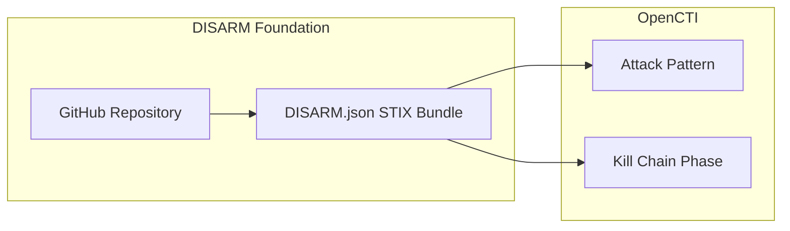

# OpenCTI DISARM Framework Connector

| Status            | Date | Comment |
| ----------------- | ---- | ------- |
| Filigran Verified | -    | -       |

The DISARM Framework connector imports the DISARM (Disinformation Analysis and Risk Management) framework into OpenCTI, providing a structured approach for describing and countering disinformation campaigns.

## Table of Contents

- [OpenCTI DISARM Framework Connector](#opencti-disarm-framework-connector)
  - [Table of Contents](#table-of-contents)
  - [Introduction](#introduction)
  - [Installation](#installation)
    - [Requirements](#requirements)
  - [Configuration variables](#configuration-variables)
    - [OpenCTI environment variables](#opencti-environment-variables)
    - [Base connector environment variables](#base-connector-environment-variables)
    - [Connector extra parameters environment variables](#connector-extra-parameters-environment-variables)
  - [Deployment](#deployment)
    - [Docker Deployment](#docker-deployment)
    - [Manual Deployment](#manual-deployment)
  - [Usage](#usage)
  - [Behavior](#behavior)
  - [Debugging](#debugging)
  - [Additional information](#additional-information)

## Introduction

The [DISARM Framework](https://www.disarm.foundation/) (Disinformation Analysis and Risk Management) is a framework designed to describe and counter disinformation campaigns. It provides a structured approach similar to MITRE ATT&CK but focused on information operations and influence campaigns.

The framework provides a common language for describing disinformation tactics and techniques, enabling defenders to identify, analyze, and counter information manipulation campaigns.

## Installation

### Requirements

- OpenCTI Platform >= 6.0.0
- Network access to the DISARM Framework STIX bundle URL

## Configuration variables

Find all the configuration variables available here: [Connector Configurations](./__metadata__/CONNECTOR_CONFIG_DOC.md)

_The `opencti` and `connector` options in the `docker-compose.yml` and `config.yml` are the same as for any other connector.
For more information regarding variables, please refer to [OpenCTI's documentation on connectors](https://docs.opencti.io/latest/deployment/connectors/)._

## Deployment

### Docker Deployment

Build the Docker image:

```bash
docker build -t opencti/connector-disarm-framework:latest .
```

Configure the connector in `docker-compose.yml`:

```yaml
connector-disarm-framework:
  image: opencti/connector-disarm-framework:latest
  environment:
    - OPENCTI_URL=http://localhost
    - OPENCTI_TOKEN=ChangeMe
    - CONNECTOR_ID=ChangeMe
    - CONNECTOR_NAME=DISARM Framework
    - CONNECTOR_SCOPE=attack-pattern
    - CONNECTOR_LOG_LEVEL=info
    - CONNECTOR_UPDATE_EXISTING_DATA=true
    - DISARM_FRAMEWORK_URL=https://raw.githubusercontent.com/DISARMFoundation/DISARMframeworks/main/generated_files/DISARM_STIX/DISARM.json
    - DISARM_FRAMEWORK_INTERVAL=7
  restart: always
```

Start the connector:

```bash
docker compose up -d
```

### Manual Deployment

1. Create `config.yml` based on `config.yml.sample`.

2. Install dependencies:

```bash
pip3 install -r requirements.txt
```

3. Start the connector:

```bash
python3 disarm_framework.py
```

## Usage

The connector runs automatically at the interval defined by `DISARM_FRAMEWORK_INTERVAL`. To force an immediate run:

**Data Management → Ingestion → Connectors**

Find the connector and click the refresh button to reset the state and trigger a new data fetch.

## Behavior

The connector fetches the DISARM framework STIX bundle and imports it into OpenCTI.

### Data Flow



### Entity Mapping

| DISARM Data        | OpenCTI Entity   | Description                                                        |
| ------------------ | ---------------- | ------------------------------------------------------------------ |
| Technique          | Attack Pattern   | Disinformation techniques mapped as STIX Attack Patterns           |
| Tactic             | Kill Chain Phase | Tactics mapped as kill chain phases with `kill_chain_name: disarm` |
| Framework Metadata | Identity         | DISARM Foundation as author                                        |

### DISARM Framework Structure

The DISARM framework is organized into phases (similar to MITRE ATT&CK tactics):

| Phase   | Description                           |
| ------- | ------------------------------------- |
| Plan    | Planning operations and objectives    |
| Prepare | Preparing resources and capabilities  |
| Execute | Executing the disinformation campaign |
| Assess  | Assessing impact and effectiveness    |

### Processing Details

1. **Bundle Retrieval**:
   - Fetches STIX bundle from configured URL
   - Default: DISARM GitHub repository

2. **Kill Chain Transformation**:
   - Modifies `kill_chain_name` to `disarm` for all attack patterns
   - Ensures proper categorization separate from MITRE ATT&CK

3. **Entity Import**:
   - Attack Patterns: Disinformation techniques
   - Kill Chain Phases: Disinformation tactics/stages
   - External References: Links to DISARM documentation

## Debugging

Enable verbose logging:

```env
CONNECTOR_LOG_LEVEL=debug
```

Common issues:

- **Network errors**: Verify access to GitHub/DISARM URL
- **Bundle format**: Ensure the STIX bundle is valid JSON
- **Kill chain conflicts**: Check for naming conflicts with other frameworks

## Additional information

### About DISARM

- **Website**: [disarm.foundation](https://www.disarm.foundation/)
- **GitHub**: [DISARMFoundation/DISARMframeworks](https://github.com/DISARMFoundation/DISARMframeworks)
- **Purpose**: Counter disinformation through structured analysis

### Use Cases

| Use Case                | Description                                     |
| ----------------------- | ----------------------------------------------- |
| Disinformation Analysis | Map observed disinformation to known techniques |
| Campaign Attribution    | Link campaigns to specific tactics/techniques   |
| Defense Planning        | Develop countermeasures based on framework      |
| Reporting               | Standardized language for threat reports        |

### Related Frameworks

| Framework        | Focus                                   |
| ---------------- | --------------------------------------- |
| MITRE ATT&CK     | Cyber attack techniques                 |
| MITRE ATT&CK ICS | Industrial control systems              |
| DISARM           | Disinformation and influence operations |
