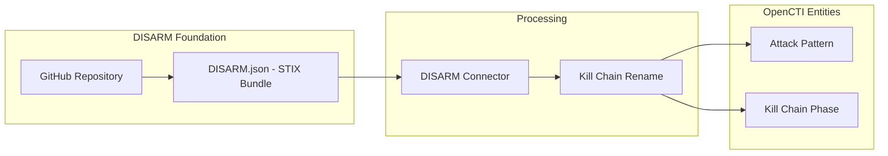

# DISARM Framework Connector

| Status            | Date | Comment |
|-------------------|------|---------|
| Filigran Verified | -    | -       |

## Table of Contents

- [Introduction](#introduction)
- [Installation](#installation)
  - [Requirements](#requirements)
- [Configuration](#configuration)
  - [Configuration Variables](#configuration-variables)
- [Deployment](#deployment)
  - [Docker Deployment](#docker-deployment)
  - [Manual Deployment](#manual-deployment)
- [Behavior](#behavior)
  - [Data Flow](#data-flow)
  - [Entity Mapping](#entity-mapping)
- [Debugging](#debugging)
- [Additional Information](#additional-information)

---

## Introduction

This connector imports the [DISARM Framework](https://www.disarm.foundation/) (Disinformation Analysis and Risk Management) into OpenCTI. DISARM is a framework designed to describe and counter disinformation campaigns, providing a structured approach similar to MITRE ATT&CK but focused on information operations and influence campaigns.

The framework provides a common language for describing disinformation tactics and techniques, enabling defenders to identify, analyze, and counter information manipulation campaigns.

---

## Installation

### Requirements

- OpenCTI Platform version 6.0.0 or higher
- Network access to the DISARM Framework STIX bundle URL

---

## Configuration

### Configuration Variables

#### OpenCTI Parameters

| Parameter | Docker envvar | Mandatory | Description |
|-----------|---------------|-----------|-------------|
| OpenCTI URL | `OPENCTI_URL` | Yes | The URL of the OpenCTI platform |
| OpenCTI Token | `OPENCTI_TOKEN` | Yes | The default admin token configured in the OpenCTI platform |

#### Base Connector Parameters

| Parameter | Docker envvar | Mandatory | Description |
|-----------|---------------|-----------|-------------|
| Connector ID | `CONNECTOR_ID` | Yes | A unique `UUIDv4` for this connector |
| Connector Name | `CONNECTOR_NAME` | Yes | Name displayed in OpenCTI (e.g., `DISARM Framework`) |
| Connector Scope | `CONNECTOR_SCOPE` | Yes | Supported scope (e.g., `attack-pattern`) |
| Log Level | `CONNECTOR_LOG_LEVEL` | Yes | Log level: `debug`, `info`, `warn`, or `error` |
| Update Existing Data | `CONNECTOR_UPDATE_EXISTING_DATA` | No | Whether to update existing data |

#### Connector Extra Parameters

| Parameter | Docker envvar | Mandatory | Description |
|-----------|---------------|-----------|-------------|
| Framework URL | `DISARM_FRAMEWORK_URL` | Yes | URL of the DISARM STIX bundle |
| Interval | `DISARM_FRAMEWORK_INTERVAL` | Yes | Polling interval in days (e.g., `7`) |

---

## Deployment

### Docker Deployment

Use the following `docker-compose.yml`:

```yaml
services:
  connector-disarm-framework:
    image: opencti/connector-disarm-framework:latest
    environment:
      - OPENCTI_URL=http://opencti:8080
      - OPENCTI_TOKEN=${OPENCTI_ADMIN_TOKEN}
      - CONNECTOR_ID=${CONNECTOR_DISARM_ID}
      - CONNECTOR_NAME=DISARM Framework
      - CONNECTOR_SCOPE=attack-pattern
      - CONNECTOR_LOG_LEVEL=info
      - CONNECTOR_UPDATE_EXISTING_DATA=true
      - DISARM_FRAMEWORK_URL=https://raw.githubusercontent.com/DISARMFoundation/DISARMframeworks/main/generated_files/DISARM_STIX/DISARM.json
      - DISARM_FRAMEWORK_INTERVAL=7
    restart: always
    depends_on:
      - opencti
```

### Manual Deployment

1. Clone the repository and navigate to the connector directory
2. Install dependencies: `pip install -r requirements.txt`
3. Configure `config.yml`:

```yaml
opencti:
  url: 'http://localhost:8080'
  token: 'your-token'

connector:
  id: 'your-uuid'
  name: 'DISARM Framework'
  scope: 'attack-pattern'
  log_level: 'info'
  update_existing_data: true

disarm_framework:
  url: 'https://raw.githubusercontent.com/DISARMFoundation/DISARMframeworks/main/generated_files/DISARM_STIX/DISARM.json'
  interval: 7  # Days
```

4. Run: `python disarm_framework.py`

---

## Behavior

### Data Flow



### Entity Mapping

| DISARM Data | OpenCTI Entity | Notes |
|-------------|----------------|-------|
| Technique | Attack Pattern | Disinformation techniques mapped as STIX Attack Patterns |
| Tactic | Kill Chain Phase | Tactics mapped as kill chain phases with `kill_chain_name: disarm` |
| Framework Metadata | Identity/External Reference | DISARM Foundation as author |

### Processing Details

1. **Bundle Retrieval**:
   - Fetches STIX bundle from configured URL
   - Default: DISARM GitHub repository

2. **Kill Chain Transformation**:
   - Modifies `kill_chain_name` to `disarm` for all attack patterns
   - Ensures proper categorization separate from MITRE ATT&CK

3. **Entity Import**:
   - Attack Patterns: Disinformation techniques
   - Kill Chain Phases: Disinformation tactics/stages
   - External References: Links to DISARM documentation

### DISARM Framework Structure

| Phase | Description |
|-------|-------------|
| Plan | Planning operations and objectives |
| Prepare | Preparing resources and capabilities |
| Execute | Executing the disinformation campaign |
| Assess | Assessing impact and effectiveness |

---

## Debugging

Enable debug logging by setting `CONNECTOR_LOG_LEVEL=debug`. Common issues:

- **Network errors**: Verify access to GitHub/DISARM URL
- **Bundle format**: Ensure the STIX bundle is valid JSON
- **Kill chain conflicts**: Check for naming conflicts with other frameworks

---

## Additional Information

### About DISARM

- **Website**: [disarm.foundation](https://www.disarm.foundation/)
- **GitHub**: [DISARMFoundation/DISARMframeworks](https://github.com/DISARMFoundation/DISARMframeworks)
- **Purpose**: Counter disinformation through structured analysis

### Use Cases

| Use Case | Description |
|----------|-------------|
| Disinformation Analysis | Map observed disinformation to known techniques |
| Campaign Attribution | Link campaigns to specific tactics/techniques |
| Defense Planning | Develop countermeasures based on framework |
| Reporting | Standardized language for threat reports |

### Related Frameworks

- **MITRE ATT&CK**: Cyber attack techniques
- **MITRE ATT&CK for ICS**: Industrial control systems
- **DISARM**: Disinformation and influence operations

