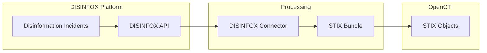

# OpenCTI DISINFOX Connector

| Status    | Date | Comment |
|-----------|------|---------|
| Community | -    | -       |

## Table of Contents

- [Introduction](#introduction)
- [Installation](#installation)
  - [Requirements](#requirements)
- [Configuration](#configuration)
  - [Configuration Variables](#configuration-variables)
- [Deployment](#deployment)
  - [Docker Deployment](#docker-deployment)
  - [Manual Deployment](#manual-deployment)
- [Behavior](#behavior)
  - [Data Flow](#data-flow)
  - [Entity Mapping](#entity-mapping)
- [Usage](#usage)
- [Debugging](#debugging)
- [Additional Information](#additional-information)

---

## Introduction

This connector imports disinformation incident data from [DISINFOX](https://github.com/CyberDataLab/disinfox) into OpenCTI. DISINFOX is a platform for tracking and analyzing disinformation campaigns, providing structured data about influence operations and their characteristics.

The connector fetches STIX 2.1 bundles from the DISINFOX API, enabling automated ingestion of disinformation intelligence into your OpenCTI instance for analysis and correlation with other threat data.

---

## Installation

### Requirements

- OpenCTI Platform >= 6.0.0
- A reachable [DISINFOX](https://github.com/CyberDataLab/disinfox) API instance
- A DISINFOX API Key (available from your DISINFOX Profile page)

---

## Configuration

### Configuration Variables

#### OpenCTI Parameters

| Parameter | Docker envvar | Mandatory | Description |
|-----------|---------------|-----------|-------------|
| OpenCTI URL | `OPENCTI_URL` | Yes | The URL of the OpenCTI platform |
| OpenCTI Token | `OPENCTI_TOKEN` | Yes | The default admin token set in the OpenCTI platform |

#### Base Connector Parameters

| Parameter | Docker envvar | Mandatory | Default | Description |
|-----------|---------------|-----------|---------|-------------|
| Connector ID | `CONNECTOR_ID` | Yes | - | A unique `UUIDv4` identifier for this connector instance |
| Connector Name | `CONNECTOR_NAME` | No | `DISINFOX` | Name of the connector |
| Log Level | `CONNECTOR_LOG_LEVEL` | No | `info` | Log level: `debug`, `info`, `warn`, or `error` |
| Duration Period | `CONNECTOR_DURATION_PERIOD` | No | `PT1H` | Polling interval in ISO 8601 format |

#### Connector Extra Parameters

| Parameter | Docker envvar | Mandatory | Description |
|-----------|---------------|-----------|-------------|
| DISINFOX URL | `DISINFOX_URL` | Yes | URL of a reachable DISINFOX installation |
| DISINFOX API Key | `DISINFOX_API_KEY` | Yes | API key from DISINFOX Profile section |

---

## Deployment

### Docker Deployment

Build the Docker image:

```shell
docker build . -t opencti/connector-disinfox:latest
```

Use the following `docker-compose.yml`:

```yaml
services:
  connector-disinfox:
    image: opencti/connector-disinfox:latest
    environment:
      - OPENCTI_URL=http://opencti:8080
      - OPENCTI_TOKEN=${OPENCTI_ADMIN_TOKEN}
      - CONNECTOR_ID=${CONNECTOR_DISINFOX_ID}
      - CONNECTOR_NAME=DISINFOX
      - CONNECTOR_LOG_LEVEL=info
      - CONNECTOR_DURATION_PERIOD=PT1H
      - DISINFOX_URL=${DISINFOX_URL}
      - DISINFOX_API_KEY=${DISINFOX_API_KEY}
    restart: always
    depends_on:
      - opencti
```

Configuration via `.env` file:

1. Duplicate `example.env` to `.env`
2. Edit with your environment values
3. Run: `docker compose up -d`

### Manual Deployment

1. Clone the repository and navigate to the connector directory
2. Install dependencies: `pip install -r requirements.txt`
3. Configure environment variables or `config.yml`
4. Run: `python main.py`

---

## Behavior

### Data Flow



### Entity Mapping

| DISINFOX Data | OpenCTI Entity | Notes |
|---------------|----------------|-------|
| Disinformation Incident | Various STIX Types | Native STIX bundle import |
| Incident Metadata | SDO Properties | Timestamps, descriptions, references |
| Related Entities | STIX Objects | Actors, campaigns, indicators |

### Processing Details

1. **Incremental Fetching**:
   - Tracks `last_fetch` timestamp in connector state
   - Fetches only incidents newer than last fetch
   - First run fetches all available data (from epoch)

2. **STIX Bundle Import**:
   - Retrieves native STIX 2.1 bundles from DISINFOX API
   - Direct import without transformation
   - Preserves all DISINFOX entity relationships

3. **State Management**:
   - Stores `last_fetch` timestamp
   - Stores `last_run` for connector status
   - Enables efficient incremental updates

### API Authentication

The connector authenticates using the `DISINFOX_API_KEY` parameter with requests to:
```
{DISINFOX_URL}/api/...?newer_than={last_fetch}
```

---

## Usage

After installation, the connector runs automatically at the interval specified by `CONNECTOR_DURATION_PERIOD`.

To force an immediate sync:

1. Navigate to `Data management` → `Ingestion` → `Connectors`
2. Find the DISINFOX connector
3. Click the refresh button to reset state and trigger a new download

---

## Debugging

Enable debug logging by setting `CONNECTOR_LOG_LEVEL=debug`.

Logging in code:
```python
self.helper.connector_logger.info("Message")
self.helper.connector_logger.error("Error message")
```

Common issues:

- **API authentication failed**: Verify DISINFOX API key
- **Connection refused**: Check DISINFOX URL accessibility
- **Empty results**: Confirm data exists in DISINFOX for the time range

---

## Additional Information

### About DISINFOX

- **Repository**: [CyberDataLab/disinfox](https://github.com/CyberDataLab/disinfox)
- **Purpose**: Track and analyze disinformation campaigns
- **Data Format**: Native STIX 2.1 bundles

### Use Cases

| Use Case | Description |
|----------|-------------|
| Disinformation Tracking | Monitor emerging influence operations |
| Campaign Analysis | Correlate disinformation with other threats |
| Attribution | Link incidents to known actors |
| Reporting | Generate intelligence reports |

### API Key

**Essential**: Obtain your DISINFOX API Key from the Profile page in your DISINFOX installation.
