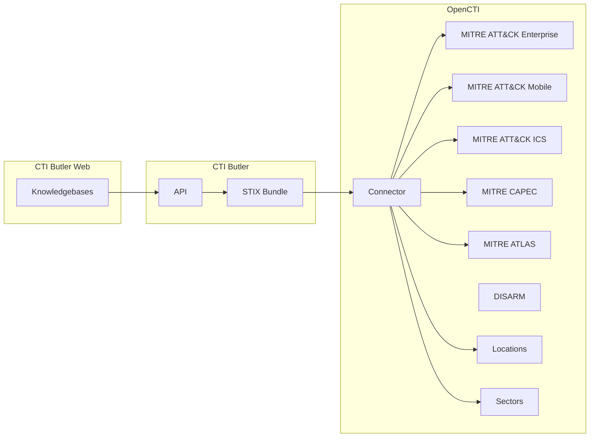

# OpenCTI CTI Butler Connector

| Status | Date | Comment |
|--------|------|---------|
| Community | -    | -       |

## Table of Contents

- [Introduction](#introduction)
  - [Screenshots](#screenshots)
- [Installation](#installation)
  - [Requirements](#requirements)
- [Configuration](#configuration)
  - [Configuration Variables](#configuration-variables)
- [Deployment](#deployment)
  - [Docker Deployment](#docker-deployment)
  - [Manual Deployment](#manual-deployment)
- [Behavior](#behavior)
  - [Data Flow](#data-flow)
  - [Entity Mapping](#entity-mapping)
  - [Processing Details](#processing-details)
- [Debugging](#debugging)
- [Additional Information](#additional-information)

---

## Introduction

[CTI Butler](https://www.ctibutler.com/) is a web application that stores common cyber threat intelligence knowledge bases (e.g., MITRE ATT&CK, MITRE CWE, MITRE CAPEC, MITRE ATLAS...) as STIX Objects.

The OpenCTI CTI Butler Connector syncs intelligence from CTI Butler's knowledge bases to OpenCTI, enabling automated import of standardized threat intelligence frameworks.

The OpenCTI CTI Butler Connector can be used to replace the following connectors, [MITRE ATLAS](https://hub.filigran.io/cybersecurity-solutions/open-cti-integrations/mitre-atlas), [MITRE ATT&CK](https://hub.filigran.io/cybersecurity-solutions/open-cti-integrations/mitre), and [DISARM Framework](https://hub.filigran.io/cybersecurity-solutions/open-cti-integrations/disarm-framework).

> **Note**: This connector only works with CTI Butler Web. It does not support self-hosted CTI Butler installations at this time.

### Screenshots


---

## Installation

### Requirements

- OpenCTI >= 6.5.10
- CTI Butler team subscribed to a plan with API access enabled
- CTI Butler API Key

### Generating an API Key

[](https://www.youtube.com/watch?v=AENI22ybO14)

[This video demonstrates the steps outlined below](https://www.youtube.com/watch?v=AENI22ybO14).

1. Log in to your CTI Butler account
2. Navigate to "Account Settings"
3. Locate the API section and select "Create Token"
4. Select the team you want to use and generate the key
  * If you don't see a team listed, you do not belong to a team on a plan with API access. Please upgrade the teams account to continue.
5. Copy the key for configuration

---

## Configuration

### Configuration Variables

#### OpenCTI Parameters

| Parameter | Docker envvar | Mandatory | Description |
|-----------|---------------|-----------|-------------|
| OpenCTI URL | `OPENCTI_URL` | Yes | The URL of the OpenCTI platform |
| OpenCTI Token | `OPENCTI_TOKEN` | Yes | The default admin token configured in the OpenCTI platform |

#### Base Connector Parameters

| Parameter | Docker envvar | Mandatory | Description |
|-----------|---------------|-----------|-------------|
| Connector ID | `CONNECTOR_ID` | Yes | A unique `UUIDv4` for this connector |
| Connector Name | `CONNECTOR_NAME` | Yes | Name displayed in OpenCTI |
| Log Level | `CONNECTOR_LOG_LEVEL` | No | Log level: `debug`, `info`, `warn`, or `error` |

#### Connector Extra Parameters

| Parameter | Docker envvar | config.yml | Required | Default | Description |
|-----------|---------------|------------|----------|---------|-------------|
| Base URL | `CTIBUTLER_BASE_URL` | `ctibutler.base_url` | Yes | `https://api.ctibutler.com/` | CTI Butler API URL |
| API Key | `CTIBUTLER_API_KEY` | `ctibutler.api_key` | Yes | - | API key for authentication |
| Knowledge Bases | `CTIBUTLER_KNOWLEDGEBASES` | `ctibutler.knowledgebases` | Yes | - | Comma-separated list of knowledge bases. See Available Knowledgebases section for a full list of available options. |
| Interval Days | `CTIBUTLER_INTERVAL_DAYS` | `ctibutler.interval_days` | Yes | `7` | Polling interval in days. Minimum and recommended is `7` days is recommended (because knowledgebases change very infrequently). |

##### Available Knowledge Bases

| Knowledge Base | Description |
|----------------|-------------|
| `attack-enterprise` | MITRE ATT&CK for Enterprise |
| `attack-mobile` | MITRE ATT&CK for Mobile |
| `attack-ics` | MITRE ATT&CK for ICS |
| `capec` | Common Attack Pattern Enumeration and Classification |
| `disarm` | DISARM Framework |
| `atlas` | MITRE ATLAS (AI/ML threats) |
| `location` | Location data |
| `sector` | Industry sector data |

---

## Deployment

### Docker Deployment

Use the following `docker-compose.yml`:

```yaml
services:
  connector-ctibutler:
    image: opencti/connector-dogesec-ctibutler:latest
    environment:
      - OPENCTI_URL=http://opencti:8080
      - OPENCTI_TOKEN=${OPENCTI_ADMIN_TOKEN}
      - CONNECTOR_ID=${CONNECTOR_CTIBUTLER_ID}
      - CONNECTOR_NAME=CTIButler
      - CONNECTOR_LOG_LEVEL=info
      - CTIBUTLER_BASE_URL=https://api.ctibutler.com/
      - CTIBUTLER_API_KEY=${CTIBUTLER_API_KEY}
      - CTIBUTLER_KNOWLEDGEBASES=attack-enterprise,capec
      - CTIBUTLER_INTERVAL_DAYS=7
    restart: always
    depends_on:
      - opencti
```

### Manual Deployment

1. Clone the repository and navigate to the connector directory
2. Install dependencies: `pip install -r requirements.txt`
3. Configure `config.yml`:

```yaml
opencti:
  url: 'http://localhost:8080'
  token: 'your-token'

connector:
  id: 'your-uuid'
  name: 'CTI Butler'
  log_level: 'info'

ctibutler:
  base_url: 'https://api.ctibutler.com/'
  api_key: 'your-api-key'
  knowledgebases: 'attack-enterprise,capec'
  interval_days: 7
```

4. Run: `python main.py`

---

## Behavior

### Data Flow



### Entity Mapping

#### MITRE ATT&CK Enterprise/Mobile/ICS

| CTI Butler Data | OpenCTI Entity | Notes |
|---------------------------|----------------|-------|
| Tactic | x-mitre-tactic | ATT&CK Tactics |
| Technique/Sub-technique | Attack Pattern | ATT&CK Techniques |
| Campaign | Campaign | ATT&CK Campaigns |
| Mitigation | Course of Action | ATT&CK Mitigations |
| Software | Tool / Malware | ATT&CK Softwares |
| Group | Intrusion Set | ATT&CK Intrusion Set |
| Data Source | x-mitre-data-source | ATT&CK Data Sources |
| Data Component | x-mitre-data-component | ATT&CK Data Components |
| Asset | x-mitre-asset| ATT&CK ICS Assets |

Note, Detection Stratergy (`x-mitre-detection-strategy`) and Analytic (`x-mitre-analytic`) objects (introduced in ATT&CK v18 are not currently supported in OpenCTI but are supported by Open CTI. You will see failures in the logs when the connector tries to import these objects

#### MITRE CWE

CTI Butler also has a CWE Knowledgebase. You cannot use this connector to import the CWE knowledgebase because OpenCTI does not support the custom STIX `weakness` objects used by CTI Butler to represent CWEs.

#### MITRE CAPEC

| CTI Butler Data | OpenCTI Entity | Notes |
|---------------------------|----------------|-------|
| Technique | Attack Pattern | CAPEC Techniques |

#### MITRE ATLAS

| CTI Butler Data | OpenCTI Entity | Notes |
|---------------------------|----------------|-------|
| Tactic | x-mitre-tactic | ATLAS Tactics |
| Technique/Sub-technique | Attack Pattern | ATLAS Techniques |
| Mitigation | Course of Action | ATLAS Mitigations |

#### DISARM

| CTI Butler Data | OpenCTI Entity | Notes |
|---------------------------|----------------|-------|
| Tactic | x-mitre-tactic | DISARM Tactics |
| Technique/Sub-technique | Attack Pattern | DISARM Techniques |

#### MITRE Location

| CTI Butler Data | OpenCTI Entity | Notes |
|---------------------------|----------------|-------|
| Country | Location | Countries |
| Region | Location | Regions |
| Sub-region | Location | Sub-regions |
| Intermediate Region | Location | Intermediate Regions |

#### MITRE Sector

| CTI Butler Data | OpenCTI Entity | Notes |
|---------------------------|----------------|-------|
| Sectors | Identity | Industrial Sectors |

### Processing Details

1. **Knowledge Base Selection**:
   - Configure which knowledge bases to import via `CTIBUTLER_KNOWLEDGEBASES`
   - Each knowledge base is fetched independently

2. **STIX Import**:
   - CTI Butler provides native STIX 2.1 objects
   - Direct import preserves all relationships and metadata
   - Includes external references to source documentation

3. **Update Frequency**:
   - Controlled by `CTIBUTLER_INTERVAL_DAYS`
   - Recommended: Weekly updates (7 days)
   - Knowledge bases are updated at source periodically

---

## Debugging

Enable debug logging by setting `CONNECTOR_LOG_LEVEL=debug`.

### Verification

Navigate to `Data` → `Ingestion` → `Connectors` → `CTI Butler` to verify the connector is working.

Common issues:

- **Authentication failed**: Verify API key and team subscription
- **Empty imports**: Check knowledge base names are spelled correctly
- **Connection errors**: Verify network access to `api.ctibutler.com`

---

## Additional Information

### About CTI Butler

- **Website**: [ctibutler.com](https://www.ctibutler.com/)
- **Sign up**: Free tier available
- **Provider**: [dogesec](https://dogesec.com/)

### Support

- **OpenCTI Support**: For general connector installation help
- **dogesec Community Forum**: [community.dogesec.com](https://community.dogesec.com/) (recommended)
- **dogesec Support Portal**: [support.dogesec.com](https://support.dogesec.com/) (requires plan with email support)

### Use Cases

| Use Case | Description |
|----------|-------------|
| ATT&CK Integration | Import MITRE ATT&CK techniques |
| Weakness Analysis | Track CWE entries |
| Attack Pattern Library | Import CAPEC attack patterns |
| Multi-Framework | Combine multiple frameworks in one import |
