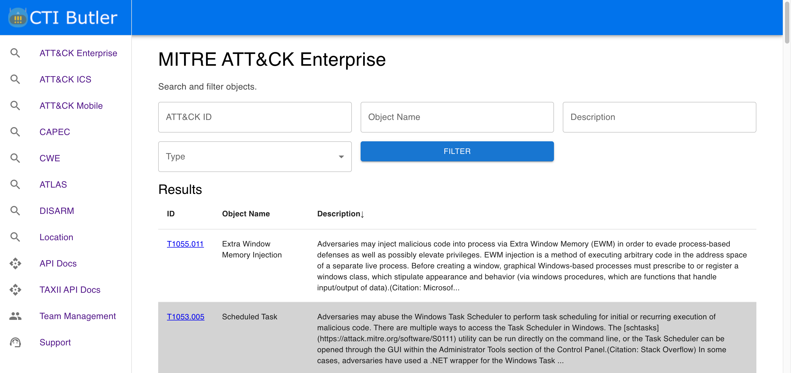
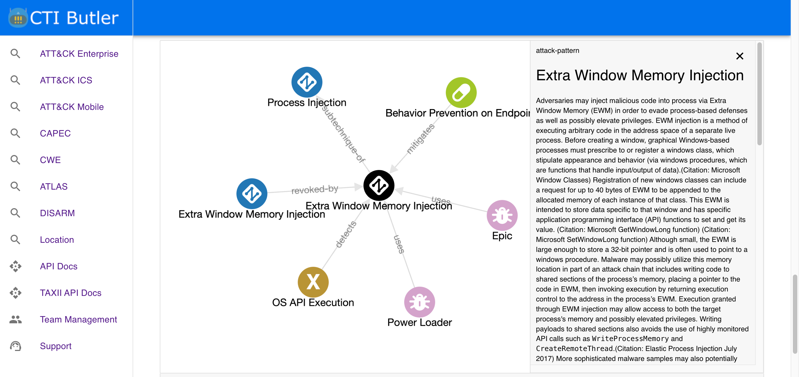

# OpenCTI CTI Butler Connector

## Overview

CTI Butler is a web application that stores common cyber threat intelligence knowledgebases (e.g. MITRE ATT&CK, MITRE CWE, MITRE CAPEC, etc.) as STIX Objects

[You can read more and sign up for CTI Butler for free here](https://www.ctibutler.com/).

The OpenCTI CTI Butler Connector syncs the intelligence reports held in CTI Butler Dossier to OpenCTI.

_Note: The OpenCTI CTI Butler Connector only works with CTI Butler Web. It does not work with self-hosted CTI Butler installations at this time._

## Installation

### Prerequisites

* An CTI Butler team subscribed to a plan with API access enabled
* OpenCTI >= 6.5.10

### Generating an CTI Butler API Key

1. Log in to your CTI Butler account and navigate to "Account Settings"
2. Locate the API section and select "Create Token"
3. Select the team you want to use and generate the key
4. Copy the key, it will be needed for the configoration

### Configoration

If you are unfamiliar with how to install OpenCTI Connectors, [you should read the official documentation here](https://docs.opencti.io/latest/deployment/connectors/).

There are a number of configuration options specific to CTI Butler, which are set either in `docker-compose.yml` (for Docker) or in `config.yml` (for manual deployment). These options are as follows:

| Docker Env variable          | config variable          | Required | Data Type  | Recommended                                              | Description                                                                                                                                                                                                                                            |
| ---------------------------- | ------------------------ | -------- | ---------- | -------------------------------------------------------- | ------------------------------------------------------------------------------------------------------------------------------------------------------------------------------------------------------------------------------------------------------ |
| `CTIBUTLER_BASE_URL`       | `ctibutler.base_url`       | TRUE     | url        | [https://api.ctibutler.com/](https://api.ctibutler.com/) | Should always be https://api.ctibutler.com/                                                                                                                                                                                                            |
| `CTIBUTLER_API_KEY`        | `ctibutler.api_key`        | TRUE     | string     | n/a                                                      | The API key used to authenticate to CTI Butler Web                                                                                                                                                                                                     |
| `CTIBUTLER_KNOWLEDGEBASES` | `ctibutler.knowledgebases` | TRUE     | dictionary | n/a                                                      | A list of comma separated knowledgebase names (e.g. `'attack-enterprise,cwe'`. The following knowledgebases are available to use; `attack-enterprise`, `attack-mobile`, `attack-ics`, `cwe`, `capec`, `disarm`, `atlas`, `location`. |
| `CTIBUTLER_INTERVAL_DAYS`  | `ctibutler.interval_days` | TRUE     | integer    | `7`                                                    | How often (in days) this Connector should poll CTI Butler Web for updates.                                                                                                                                                                             |

### Verification

To verify the connector is working, you can navigate to `Data` -> `Ingestion` -> `Connectors` -> `CTI Butler`.

## Support

You should contact OpenCTI if you are new to installing Connectors and need support.

If you run into issues when installing this Connector, you can reach the dogesec team as follows:

* [dogesec Community Forum](https://community.dogesec.com/) (recommended)
* [dogesec Support Portal](https://support.dogesec.com/) (requires a plan with email support)