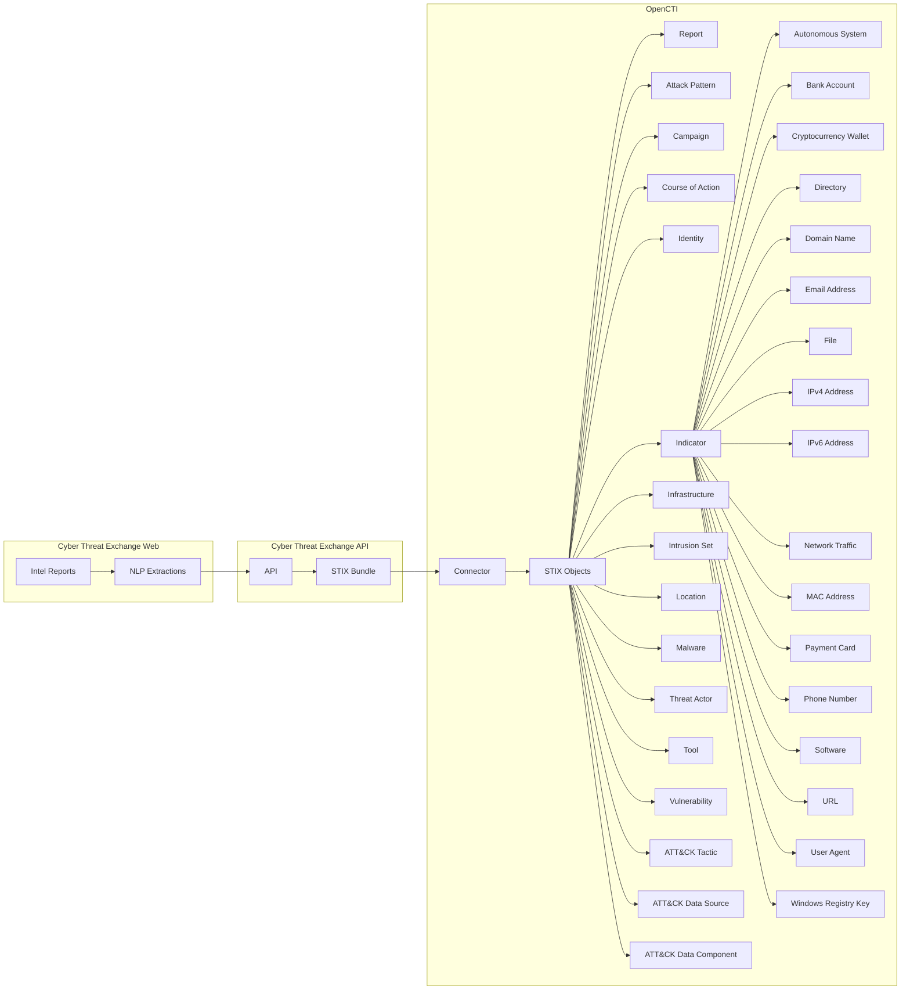

# OpenCTI Cyber Threat Exchange Connector

| Status | Date | Comment |
|--------|------|---------|
| Partner | -    | -       |

## Table of Contents

- [Introduction](#introduction)
  - [Screenshots](#screenshots)
- [Installation](#installation)
  - [Requirements](#requirements)
- [Configuration](#configuration)
  - [Configuration Variables](#configuration-variables)
- [Deployment](#deployment)
  - [Docker Deployment](#docker-deployment)
  - [Manual Deployment](#manual-deployment)
- [Behavior](#behavior)
  - [Data Flow](#data-flow)
  - [Entity Mapping](#entity-mapping)
  - [Custom STIX Objects and OpenCTI Compatibility](#custom-stix-objects-and-opencti-compatibility)
  - [Processing Details](#processing-details)
- [Debugging](#debugging)
- [Additional Information](#additional-information)

---

## Introduction

[Cyber Threat Exchange](https://www.cyberthreatexchange.com/) is a market place for threat intelligence.

The OpenCTI Cyber Threat Exchange Connector synchronizes intelligence from Feeds you are subsribed to Cyber Threat Exchange into OpenCTI.

> **Note**: This connector only works with Cyber Threat Exchange Web ([https://www.cyberthreatexchange.com](https://www.cyberthreatexchange.com)). It does not support self-hosted Cyber Threat Exchange installations at this time.

---

## Installation

### Requirements

- OpenCTI >= 6.5.10
- Cyber Threat Exchange team subscribed to a plan with API access enabled
- Cyber Threat Exchange API Key

### Generating an API Key

1. Log in to your Cyber Threat Exchange account
2. Navigate to "Account Settings"
3. Locate the API section and select "Create Token"
4. Select the team you want to use and generate the key
  * If you don't see a team listed, you do not belong to a team on a plan with API access. Please upgrade the teams account to continue.
5. Copy the key for configuration

---

## Configuration

### Configuration Variables

#### OpenCTI Parameters

| Parameter | Docker envvar | Mandatory | Description |
|-----------|---------------|-----------|-------------|
| OpenCTI URL | `OPENCTI_URL` | Yes | The URL of the OpenCTI platform |
| OpenCTI Token | `OPENCTI_TOKEN` | Yes | The default admin token configured in the OpenCTI platform |

#### Base Connector Parameters

| Parameter | Docker envvar | Mandatory | Description |
|-----------|---------------|-----------|-------------|
| Connector ID | `CONNECTOR_ID` | Yes | A unique `UUIDv4` for this connector |
| Connector Name | `CONNECTOR_NAME` | Yes | Name displayed in OpenCTI |
| Log Level | `CONNECTOR_LOG_LEVEL` | No | Log level: `debug`, `info`, `warn`, or `error` |

#### Connector Extra Parameters

| Parameter | Docker envvar | config.yml | Required | Default | Description |
|-----------|---------------|------------|----------|---------|-------------|
| Base URL | `CYBERTHREATEXCHANGE_BASE_URL` | `cyberthreatexchange.base_url` | Yes | `https://api.cyberthreatexchange.com/` | Cyber Threat Exchange API URL |
| API Key | `CYBERTHREATEXCHANGE_API_KEY` | `cyberthreatexchange.api_key` | Yes | - | API key for authentication |
| Feed IDs | `CYBERTHREATEXCHANGE_FEED_IDS` | `cyberthreatexchange.feed_ids` | Yes | - | Comma-separated Feed IDs. Pass the Feed IDs like so `f0895eb3-7d90-4b45-8664-a7e157ba880f,b63c638e-43e6-43d4-bfac-5b71c264b132` |
| Interval Hours | `CYBERTHREATEXCHANGE_INTERVAL_HOURS` | `cyberthreatexchange.interval_hours` | Yes | `1` | Polling interval in hours. The connector with poll Cyber Threat Exchange for new Reports in the Feed(s) at this schedule. The minimum value allowed and recommended value is `1` |

---

## Deployment

### Docker Deployment

Use the following `docker-compose.yml`:

```yaml
services:
  connector-cyberthreatexchange:
    image: opencti/connector-dogesec-cyberthreatexchange:latest
    environment:
      - OPENCTI_URL=http://opencti:8080
      - OPENCTI_TOKEN=${OPENCTI_ADMIN_TOKEN}
      - CONNECTOR_ID=${CONNECTOR_CYBERTHREATEXCHANGE_ID}
      - CONNECTOR_NAME=CyberThreatExchange
      - CONNECTOR_LOG_LEVEL=info
      - CYBERTHREATEXCHANGE_BASE_URL=https://api.cyberthreatexchange.com/
      - CYBERTHREATEXCHANGE_API_KEY=${CYBERTHREATEXCHANGE_API_KEY}
      - CYBERTHREATEXCHANGE_FEED_IDS=feed1-uuid,feed2-uuid
      - CYBERTHREATEXCHANGE_INTERVAL_HOURS=12
    restart: always
    depends_on:
      - opencti
```

### Manual Deployment

1. Clone the repository and navigate to the connector directory
2. Install dependencies: `pip install -r requirements.txt`
3. Configure `config.yml`
4. Run: `python main.py`

---

## Behavior

### Data Flow



### Entity Mapping

| Cyber Threat Exchange Data | OpenCTI Entity | Notes |
|----------------|----------------|-------|
| Uploaded Report | Report | Original report as a STIX report |
| Extracted Relationships | Relationships | Cyber Threat Exchange uses NLP to define descriptive relationships between extracted objects |
| Extracted Attack Patterns | Attack Pattern | Extracted Attack Patterns, includes MITRE ATT&CK Techniques |
| Extracted Campaigns | Campaign | Extracted Campaigns, includes MITRE ATT&CK Campaigns |
| Extracted Course of Actions | Course of Action | Extracted Course of Actions, includes MITRE ATT&CK Mitigations |
| Extracted Identities | Identity | Extracted Identities. Also includes Identities created for the Feed (blog) |
| Extracted Infrastructure | Infrastructure | Extracted Infrastructure |
| Extracted Intrusion Sets | Intrusion Set | Extracted Intrusion Sets, includes MITRE ATT&CK Groups |
| Extracted Locations | Location | Extracted Locations |
| Extracted Malwares | Malware | Extracted Malware families, includes MITRE ATT&CK Software |
| Extracted Actors | Threat Actor | Named threat actors |
| Extracted Tools | Tool | Extracted Tools, includes MITRE ATT&CK Software |
| Extracted Vulnerabilities | Vulnerability | Named vulnerabilities |
| Extracted ATT&CK Tactics | x-mitre-tactic | ATT&CK Tactics |
| Extracted ATT&CK Data Sources | x-mitre-data-source | ATT&CK Data Sources |
| Extracted ATT&CK Data Components | x-mitre-date-component | ATT&CK Data Components |
| Extracted IOCs | Indicator/Observable | For each IOC extraction, an Indicator will also be created. The following Observables (SCOs) are supported; autonomous-system, bank-account, cryptocurrency-wallet, directory, domain-name, email-addr, file, ipv4-addr, ipv6-addr, network-traffic, mac-addr, payment-card, phone-number, software, url, user-agent, windows-registry-key |

### Custom STIX Objects and OpenCTI Compatibility

Cyber Threat Exchange includes several custom STIX object types that are not currently supported by OpenCTI. These custom objects are:

* `attack-action` (SDO)
* `attack-flow` (SDO)
* `exploit` (SDO)
* `weaknesses` (SDO)
* `x-mitre-asset` (SDO MITRE ATT&CK)
* `x-mitre-analytic` (SDO MITRE ATT&CK)
* `x-mitre-detection-strategy` (SDO MITRE ATT&CK)
* `cryptocurrency-transaction` (SCO)
* `data-source` (SCO)

When a STIX Bundle associated with a Report contains any of these object types, OpenCTI will report import errors for those specific objects. This behavior is expected.

All other supported STIX objects in the bundle will import successfully and remain usable in OpenCTI.

### Processing Details

1. **Feed Selection**:
   - At least one Feed ID must be provided
   - Can import from multiple feeds (comma-separated)
   - Access to feeds visible to authenticated team

2. **Historical Import**:
   - All historical intelligence from reports is ingested
   - New intelligence added to feeds is imported on schedule

3. **Incremental Updates**:
   - Polls at configured interval (default: 12 hours)
   - Only fetches new/updated intelligence since last run

---

## Debugging

Enable debug logging by setting `CONNECTOR_LOG_LEVEL=debug`.

### Verification

Navigate to `Data` → `Ingestion` → `Connectors` → `CyberThreatExchange` to verify the connector is working.

---

## Additional Information

### About CyberThreatExchange

- **Website**: [cyberthreatexchange.com](https://www.cyberthreatexchange.com/)
- **Sign up**: Free tier available
- **Provider**: [dogesec](https://dogesec.com/)

### Support

- **OpenCTI Support**: For general connector installation help
- **dogesec Community Forum**: [community.dogesec.com](https://community.dogesec.com/) (recommended)
- **dogesec Support Portal**: [support.dogesec.com](https://support.dogesec.com/) (requires plan with email support)

### Use Cases

| Use Case | Description |
|----------|-------------|
| Report Processing | Extract intelligence from PDF threat reports |
| Document Analysis | Analyze advisories, bulletins, research papers |
| IOC Extraction | Automate indicator extraction from documents |
| Intelligence Library | Build searchable intelligence from reports |
