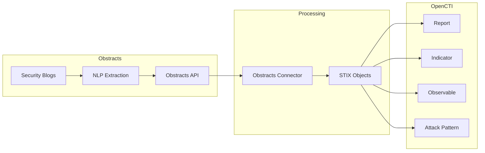

# OpenCTI Obstracts Connector

| Status | Date | Comment |
|--------|------|---------|
| Partner | -    | -       |

## Table of Contents

- [Introduction](#introduction)
- [Installation](#installation)
  - [Requirements](#requirements)
- [Configuration](#configuration)
  - [Configuration Variables](#configuration-variables)
- [Deployment](#deployment)
  - [Docker Deployment](#docker-deployment)
  - [Manual Deployment](#manual-deployment)
- [Behavior](#behavior)
  - [Data Flow](#data-flow)
  - [Entity Mapping](#entity-mapping)
- [Debugging](#debugging)
- [Additional Information](#additional-information)

---

## Introduction

[Obstracts](https://www.obstracts.com/) is a web application that turns blog posts from your favorite security blogs into structured threat intelligence.


The OpenCTI Obstracts Connector syncs the intelligence created from blogs you subscribe to with OpenCTI, enabling automated extraction and import of indicators, attack patterns, and other threat intelligence from security blog posts.

> **Note**: This connector only works with Obstracts Web. It does not support self-hosted Obstracts installations at this time.

---

## Installation

### Requirements

- OpenCTI >= 6.5.10
- Obstracts team subscribed to a plan with API access enabled
- Obstracts API Key

### Generating an API Key

1. Log in to your Obstracts account
2. Navigate to "Account Settings"
3. Locate the API section and select "Create Token"
4. Select the team you want to use and generate the key
5. Copy the key for configuration

---

## Configuration

### Configuration Variables

#### OpenCTI Parameters

| Parameter | Docker envvar | Mandatory | Description |
|-----------|---------------|-----------|-------------|
| OpenCTI URL | `OPENCTI_URL` | Yes | The URL of the OpenCTI platform |
| OpenCTI Token | `OPENCTI_TOKEN` | Yes | The default admin token configured in the OpenCTI platform |

#### Base Connector Parameters

| Parameter | Docker envvar | Mandatory | Description |
|-----------|---------------|-----------|-------------|
| Connector ID | `CONNECTOR_ID` | Yes | A unique `UUIDv4` for this connector |
| Connector Name | `CONNECTOR_NAME` | Yes | Name displayed in OpenCTI |
| Log Level | `CONNECTOR_LOG_LEVEL` | No | Log level: `debug`, `info`, `warn`, or `error` |

#### Connector Extra Parameters

| Parameter | Docker envvar | config.yml | Required | Default | Description |
|-----------|---------------|------------|----------|---------|-------------|
| Base URL | `OBSTRACTS_BASE_URL` | `obstracts.base_url` | Yes | `https://api.obstracts.com/` | Obstracts API URL |
| API Key | `OBSTRACTS_API_KEY` | `obstracts.api_key` | Yes | - | API key for authentication |
| Feed IDs | `OBSTRACTS_FEED_IDS` | `obstracts.feed_ids` | No | - | Comma-separated feed IDs (blank = all subscribed feeds) |
| Interval Hours | `OBSTRACTS_INTERVAL_HOURS` | `obstracts.interval_hours` | Yes | `12` | Polling interval in hours |
| Days to Backfill | `OBSTRACTS_DAYS_TO_BACKFILL` | `obstracts.days_to_backfill` | Yes | `90` | Days of historical data to import (max `365`) |

---

## Deployment

### Docker Deployment

Use the following `docker-compose.yml`:

```yaml
services:
  connector-obstracts:
    image: opencti/connector-dogesec-obstracts:latest
    environment:
      - OPENCTI_URL=http://opencti:8080
      - OPENCTI_TOKEN=${OPENCTI_ADMIN_TOKEN}
      - CONNECTOR_ID=${CONNECTOR_OBSTRACTS_ID}
      - CONNECTOR_NAME=Obstracts
      - CONNECTOR_LOG_LEVEL=info
      - OBSTRACTS_BASE_URL=https://api.obstracts.com/
      - OBSTRACTS_API_KEY=${OBSTRACTS_API_KEY}
      - OBSTRACTS_FEED_IDS=
      - OBSTRACTS_INTERVAL_HOURS=12
      - OBSTRACTS_DAYS_TO_BACKFILL=90
    restart: always
    depends_on:
      - opencti
```

### Manual Deployment

1. Clone the repository and navigate to the connector directory
2. Install dependencies: `pip install -r requirements.txt`
3. Configure `config.yml`
4. Run: `python main.py`

---

## Behavior

### Data Flow



### Entity Mapping

| Obstracts Data | OpenCTI Entity | Notes |
|----------------|----------------|-------|
| Blog Post | Report | Original blog post as report |
| Extracted IOCs | Indicator/Observable | IPs, domains, hashes, URLs |
| Extracted TTPs | Attack Pattern | MITRE ATT&CK techniques |
| Extracted Actors | Threat Actor | Named threat actors |
| Extracted Malware | Malware | Malware families |

### Processing Details

1. **Feed Selection**:
   - Specify feed IDs for selective import
   - Leave blank to import all subscribed feeds
   - New feed subscriptions are automatically included

2. **Backfill Logic**:
   - On first run or new feed subscription, backfills historical data
   - Maximum backfill period: 365 days
   - Configurable via `OBSTRACTS_DAYS_TO_BACKFILL`

3. **Incremental Updates**:
   - Polls at configured interval (default: 12 hours)
   - Only fetches new/updated intelligence since last run

---

## Debugging

Enable debug logging by setting `CONNECTOR_LOG_LEVEL=debug`.

### Verification

Navigate to `Data` → `Ingestion` → `Connectors` → `Obstracts` to verify the connector is working.

---

## Additional Information

### About Obstracts

- **Website**: [obstracts.com](https://www.obstracts.com/)
- **Sign up**: Free tier available
- **Provider**: [dogesec](https://dogesec.com/)

### Support

- **OpenCTI Support**: For general connector installation help
- **dogesec Community Forum**: [community.dogesec.com](https://community.dogesec.com/) (recommended)
- **dogesec Support Portal**: [support.dogesec.com](https://support.dogesec.com/) (requires plan with email support)

### Use Cases

| Use Case | Description |
|----------|-------------|
| Blog Intelligence | Automate extraction of IOCs from security blogs |
| Threat Research | Track threat actor/malware mentions |
| TTP Tracking | Identify ATT&CK techniques discussed in blogs |
| Early Warning | Get indicators before formal advisories |
