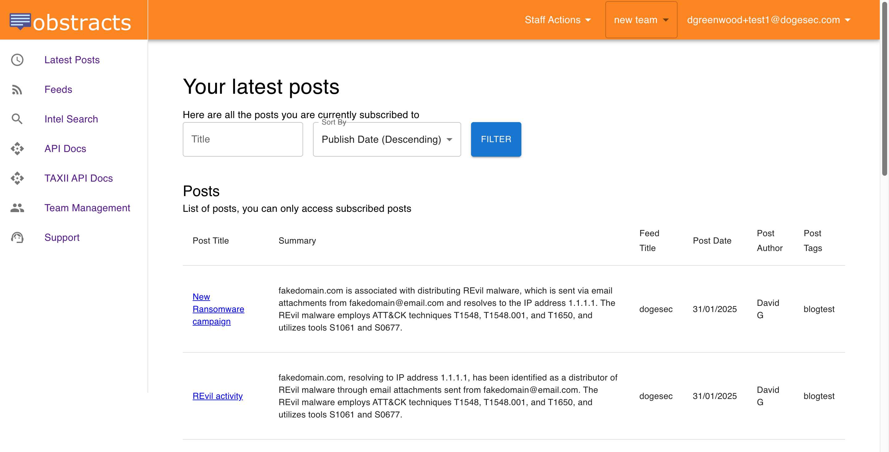
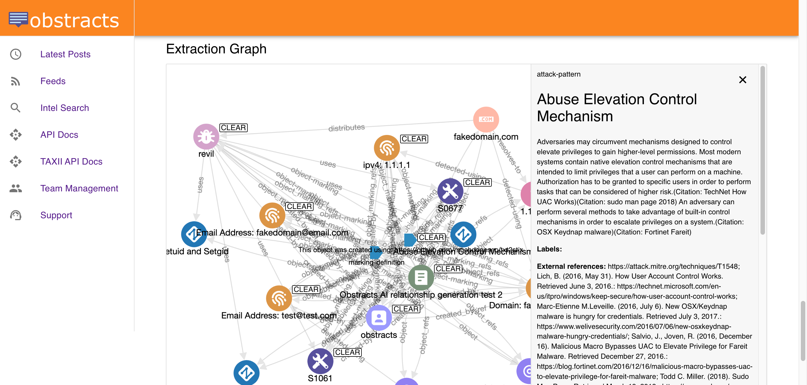

# OpenCTI Obstracts Connector

## Overview

Obstracts is a web application that turns blog posts from your favourite security blogs into structured threat intelligence.

[You can read more and sign up for Obstracts for free here](https://www.obstracts.com/).

The OpenCTI Obstracts Connector syncs the intelligence created from blogs you subscribe to with OpenCTI.

_Note: The OpenCTI Obstracts Connector only works with Obstracts Web. It does not work with self-hosted Obstracts installations at this time._

## Installation

### Prerequisites

* An Obstracts team subscribed to a plan with API access enabled
* OpenCTI >= 6.5.10

### Generating an Obstracts API Key

1. Log in to your Obstracts account and navigate to "Account Settings"
2. Locate the API section and select "Create Token"
3. Select the team you want to use and generate the key
4. Copy the key, it will be needed for the configoration

### Configoration

If you are unfamiliar with how to install OpenCTI Connectors, [you should read the official documentation here](https://docs.opencti.io/latest/deployment/connectors/).

There are a number of configuration options specific to Obstracts, which are set either in `docker-compose.yml` (for Docker) or in `config.yml` (for manual deployment). These options are as follows:

| Docker Env variable        | config variable            | Required | Data Type | Recommended                                                | Description                                                                                                                                                                                                                                                                                                                                                                                                                                |
| -------------------------- | -------------------------- | -------- | --------- | ---------------------------------------------------------- | ------------------------------------------------------------------------------------------------------------------------------------------------------------------------------------------------------------------------------------------------------------------------------------------------------------------------------------------------------------------------------------------------------------------------------------------ |
| `OBSTRACTS_BASE_URL`         | `obstracts.base_url`         | TRUE     | url       | `https://api.obstracts.com/` | Should always be `https://api.obstracts.com/`                                                                                                                                                                                                                                                                                                                                                                                              |
| `OBSTRACTS_API_KEY`          | `obstracts.api_key`          | TRUE     | string    | n/a                                                        | The API key used to authenticate to Obstracts Web                                                                                                                                                                                                                                                                                                                                                                                          |
| `OBSTRACTS_FEED_IDS`         | `obstracts.feed_ids`         | FALSE    | uuid      | n/a                                                        | You can use the connector in 2 ways, 1) using a list of comma separated feed IDs (e.g. `'feed1id,feed2id,feed3id'`. You can get a feed ID in the Obstracts Web feed view, or 2) if value is left blank, all intelligence for feeds you are subscribed will be ingested (this includes feeds you subscribe to after the connector is configured).                                                                                         |
| `OBSTRACTS_INTERVAL_HOURS`   | `obstracts.interval_hours`   | TRUE     | integer   | `12`                                                     | How often (in hours) this Connector should poll Obstracts Web for updates.                                                                                                                                                                                                                                                                                                                                                                 |
| `OBSTRACTS_DAYS_TO_BACKFILL` | `obstracts.days_to_backfill` | TRUE     | integer   | `90`                                                     | When a new feed is added, this setting determines the number of days to backfill. For example, setting `30` will ingest any posts from the blog within the last 30 days. Max value is `365`. Will consider all feeds you are newly subscribed to (e.g. if you subscribe to a new feed after connector install, the old data will still be backfilled for that post from the date subscribed back to the backfill date specified here). |

### Verification

To verify the connector is working, you can navigate to `Data` -> `Ingestion` -> `Connectors` -> `Obstracts`.

## Support

You should contact OpenCTI if you are new to installing Connectors and need support.

If you run into issues when installing this Connector, you can reach the dogesec team as follows:

* [dogesec Community Forum](https://community.dogesec.com/) (recommended)
* [dogesec Support Portal](https://support.dogesec.com/) (requires a plan with email support)