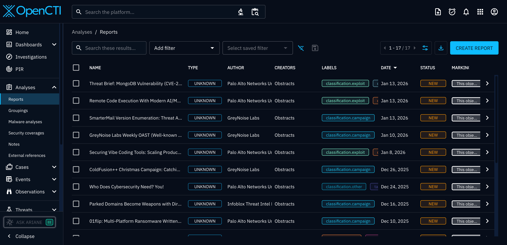
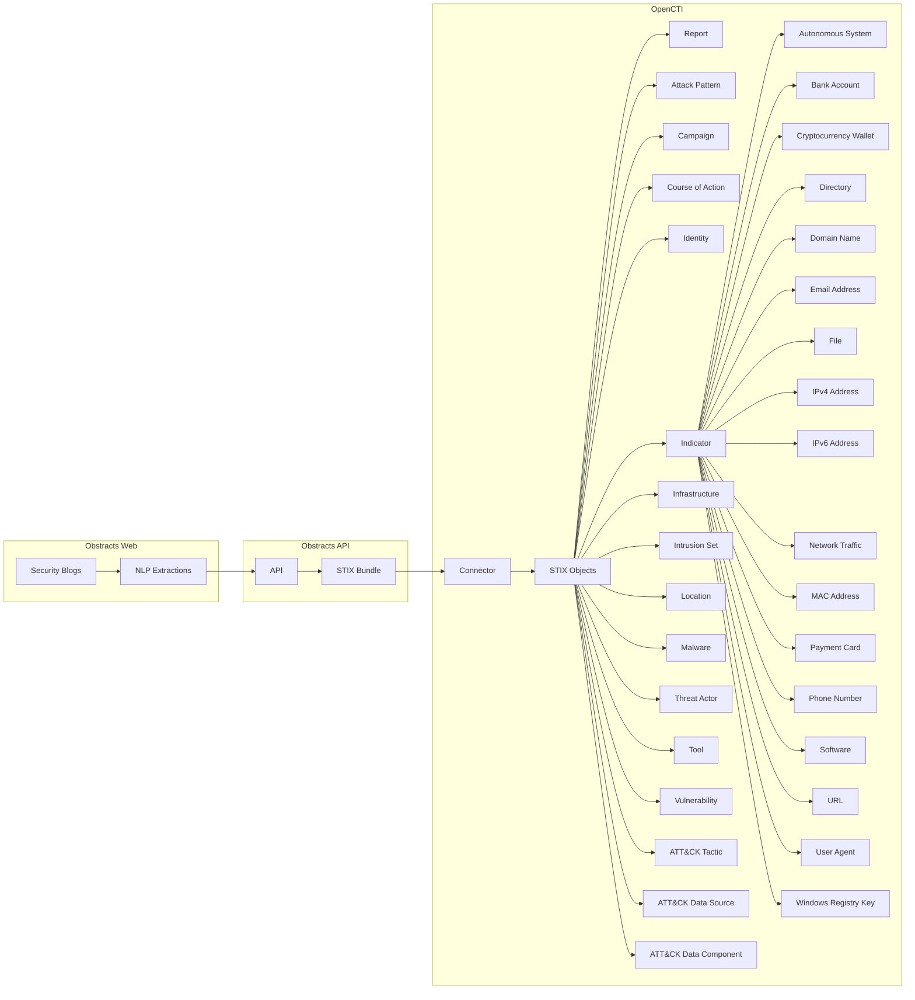

# OpenCTI Obstracts Connector

| Status | Date | Comment |
|--------|------|---------|
| Partner | -    | -       |

## Table of Contents

- [Introduction](#introduction)
  - [Screenshots](#screenshots)
- [Installation](#installation)
  - [Requirements](#requirements)
- [Configuration](#configuration)
  - [Configuration Variables](#configuration-variables)
- [Deployment](#deployment)
  - [Docker Deployment](#docker-deployment)
  - [Manual Deployment](#manual-deployment)
- [Behavior](#behavior)
  - [Data Flow](#data-flow)
  - [Entity Mapping](#entity-mapping)
  - [Custom STIX Objects and OpenCTI Compatibility](#custom-stix-objects-and-opencti-compatibility)
  - [Processing Details](#processing-details)
- [Debugging](#debugging)
- [Additional Information](#additional-information)

---

## Introduction

[Obstracts](https://www.obstracts.com/) is a web application that transforms posts from leading security blogs into structured, actionable threat intelligence.

The OpenCTI Obstracts Connector synchronizes intelligence from the blogs you are subscribed to in Obstracts into OpenCTI.

> **Note**: This connector only works with Obstracts Web ([https://www.obstracts.com](https://www.obstracts.com)). It does not support self-hosted Obstracts installations at this time.

### Screenshots




---

## Installation

### Requirements

- OpenCTI >= 6.5.10
- Obstracts team subscribed to a plan with API access enabled
- Obstracts API Key

### Generating an API Key

[](https://www.youtube.com/watch?v=IeP9blaF2U4)

[This video demonstrates the steps outlined below](https://www.youtube.com/watch?v=IeP9blaF2U4).

1. Log in to your Obstracts account
2. Navigate to "Account Settings"
3. Locate the API section and select "Create Token"
4. Select the team you want to use and generate the key
  * If you don't see a team listed, you do not belong to a team on a plan with API access. Please upgrade the teams account to continue.
5. Copy the API Key for the OpenCTI Connector configuration

---

## Configuration

### Configuration Variables

#### OpenCTI Parameters

| Parameter | Docker envvar | Mandatory | Description |
|-----------|---------------|-----------|-------------|
| OpenCTI URL | `OPENCTI_URL` | Yes | The URL of the OpenCTI platform |
| OpenCTI Token | `OPENCTI_TOKEN` | Yes | The default admin token configured in the OpenCTI platform |

#### Base Connector Parameters

| Parameter | Docker envvar | Mandatory | Description |
|-----------|---------------|-----------|-------------|
| Connector ID | `CONNECTOR_ID` | Yes | A unique `UUIDv4` for this connector |
| Connector Name | `CONNECTOR_NAME` | Yes | Name displayed in OpenCTI |
| Log Level | `CONNECTOR_LOG_LEVEL` | No | Log level: `debug`, `info`, `warn`, or `error` |

#### Connector Extra Parameters

| Parameter | Docker envvar | config.yml | Required | Default | Description |
|-----------|---------------|------------|----------|---------|-------------|
| Base URL | `OBSTRACTS_BASE_URL` | `obstracts.base_url` | Yes | `https://api.obstracts.com/` | Obstracts API URL |
| API Key | `OBSTRACTS_API_KEY` | `obstracts.api_key` | Yes | - | The Obstracts API key for authentication (steps to generate described earlier in this document) |
| Feed IDs | `OBSTRACTS_FEED_IDS` | `obstracts.feed_ids` | No | - | It is recommended to leave this property empty. When left blank, the connector will download post content for all feeds your team is subscribed to in Obstracts. If you only want to ingest data into OpenCTI from specific feeds, you can instead provide a comma-separated list of feed IDs (for example: `a0850464-c04e-42cc-9b4f-6e8094ad90ea,87295120-5ac0-4e91-907d-32f50cd50147`). |
| Interval Hours | `OBSTRACTS_INTERVAL_HOURS` | `obstracts.interval_hours` | Yes | `1` | Polling interval in hours. The connector polls Obstracts for new posts in your subscriptions at this interval. The minimum (and recommended) value is `1`. |
| Days to Backfill | `OBSTRACTS_DAYS_TO_BACKFILL` | `obstracts.days_to_backfill` | Yes | `90` | Number of days of historical data to import (maximum: `365`). Uses the `created` value of the report. This setting will be used if any new feed subscriptions are added in Obstracts to backfill the data for that feed. |

---

## Deployment

### Docker Deployment

Use the following `docker-compose.yml`:

```yaml
services:
  connector-obstracts:
    image: opencti/connector-dogesec-obstracts:latest
    environment:
      - OPENCTI_URL=http://opencti:8080
      - OPENCTI_TOKEN=${OPENCTI_ADMIN_TOKEN}
      - CONNECTOR_ID=${CONNECTOR_OBSTRACTS_ID}
      - CONNECTOR_NAME=Obstracts
      - CONNECTOR_LOG_LEVEL=info
      - OBSTRACTS_BASE_URL=https://api.obstracts.com/
      - OBSTRACTS_API_KEY=${OBSTRACTS_API_KEY}
      - OBSTRACTS_FEED_IDS=
      - OBSTRACTS_INTERVAL_HOURS=12
      - OBSTRACTS_DAYS_TO_BACKFILL=90
    restart: always
    depends_on:
      - opencti
```

### Manual Deployment

1. Clone the repository and navigate to the connector directory
2. Install dependencies: `pip install -r requirements.txt`
3. Configure `config.yml`
4. Run: `python main.py`

---

## Behavior

### Data Flow



### Entity Mapping

| Obstracts Data | OpenCTI Entity | Notes |
|----------------|----------------|-------|
| Blog Post | Report | Original blog post as report |
| Extracted Relationships | Relationships | Obstracts uses NLP to define descriptive relationships between extracted objects |
| Extracted Attack Patterns | Attack Pattern | Extracted Attack Patterns, includes MITRE ATT&CK Techniques |
| Extracted Campaigns | Campaign | Extracted Campaigns, includes MITRE ATT&CK Campaigns |
| Extracted Course of Actions | Course of Action | Extracted Course of Actions, includes MITRE ATT&CK Mitigations |
| Extracted Identities | Identity | Extracted Identities. Also includes Identities created for the Feed (blog) |
| Extracted Infrastructure | Infrastructure | Extracted Infrastructure |
| Extracted Intrusion Sets | Intrusion Set | Extracted Intrusion Sets, includes MITRE ATT&CK Groups |
| Extracted Locations | Location | Extracted Locations |
| Extracted Malwares | Malware | Extracted Malware families, includes MITRE ATT&CK Software |
| Extracted Actors | Threat Actor | Named threat actors |
| Extracted Tools | Tool | Extracted Tools, includes MITRE ATT&CK Software |
| Extracted Vulnerabilities | Vulnerability | Named vulnerabilities |
| Extracted ATT&CK Tactics | x-mitre-tactic | ATT&CK Tactics |
| Extracted ATT&CK Data Sources | x-mitre-data-source | ATT&CK Data Sources |
| Extracted ATT&CK Data Components | x-mitre-date-component | ATT&CK Data Components |
| Extracted IOCs | Indicator/Observable | For each IOC extraction, an Indicator will also be created. The following Observables (SCOs) are supported; autonomous-system, bank-account, cryptocurrency-wallet, directory, domain-name, email-addr, file, ipv4-addr, ipv6-addr, network-traffic, mac-addr, payment-card, phone-number, software, url, user-agent, windows-registry-key |

### Custom STIX Objects and OpenCTI Compatibility

Obstracts includes several custom STIX object types that are not currently supported by OpenCTI. These custom objects are:

* `attack-action` (SDO)
* `attack-flow` (SDO)
* `exploit` (SDO)
* `weaknesses` (SDO)
* `x-mitre-asset` (SDO MITRE ATT&CK)
* `x-mitre-analytic` (SDO MITRE ATT&CK)
* `x-mitre-detection-strategy` (SDO MITRE ATT&CK)
* `cryptocurrency-transaction` (SCO)
* `data-source` (SCO)

When a STIX Bundle associated with a Post contains any of these object types, OpenCTI will report import errors for those specific objects. This behavior is expected.

All other supported STIX objects in the bundle will import successfully and remain usable in OpenCTI.

### Processing Details

1. **Feed Selection**:
   - Specify feed IDs for selective import
   - Leave blank to import all subscribed feeds
   - New feed subscriptions are automatically included

2. **Backfill Logic**:
   - On first run or new feed subscription, backfills historical data
   - Maximum backfill period: 365 days
   - Configurable via `OBSTRACTS_DAYS_TO_BACKFILL`

3. **Incremental Updates**:
   - Polls at configured interval (default: 12 hours)
   - Only fetches new/updated intelligence since last run

---

## Debugging

Enable debug logging by setting `CONNECTOR_LOG_LEVEL=debug`.

### Verification

Navigate to `Data` → `Ingestion` → `Connectors` → `Obstracts` to verify the connector is working.

---

## Additional Information

### About Obstracts

- **Website**: [obstracts.com](https://www.obstracts.com/)
- **Sign up**: Free tier available
- **Provider**: [dogesec](https://dogesec.com/)

### Support

- **OpenCTI Support**: For general connector installation help
- **dogesec Community Forum**: [community.dogesec.com](https://community.dogesec.com/) (recommended)
- **dogesec Support Portal**: [support.dogesec.com](https://support.dogesec.com/) (requires plan with email support)

### Use Cases

| Use Case | Description |
|----------|-------------|
| Blog Intelligence | Automate extraction of IOCs from security blogs |
| Threat Research | Track threat actor/malware mentions |
| TTP Tracking | Identify ATT&CK techniques discussed in blogs |
| Early Warning | Get indicators before formal advisories |
