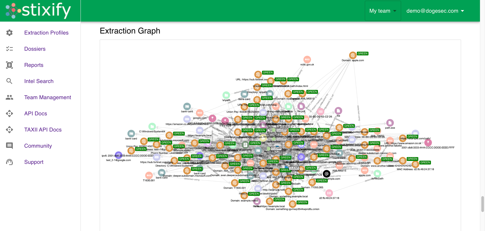
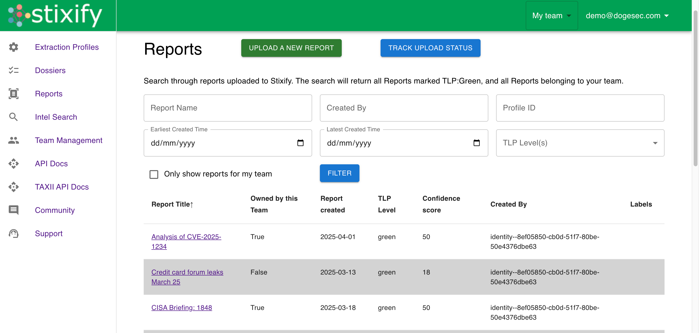
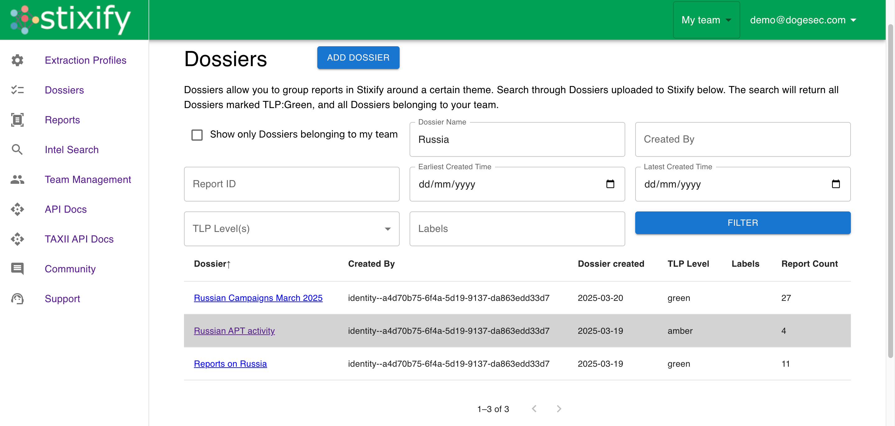

# OpenCTI Siemrules Connector

## Overview

Siemrules is a web application that turns reports into structured threat intelligence.

[You can read more and sign up for Siemrules for free here](https://www.siemrules.com/).

The OpenCTI Siemrules Connector syncs the intelligence reports held in Siemrules Detection Pack to OpenCTI.

_Note: The OpenCTI Siemrules Connector only works with Siemrules Web. It does not work with self-hosted Siemrules installations at this time._

## Installation

### Prerequisites

* An Siemrules team subscribed to a plan with API access enabled
* OpenCTI >= 6.5.10

### Generating an Siemrules API Key

1. Log in to your Siemrules account and navigate to "Account Settings"
2. Locate the API section and select "Create Token"
3. Select the team you want to use and generate the key
4. Copy the key, it will be needed for the configoration

### Configoration

If you are unfamiliar with how to install OpenCTI Connectors, [you should read the official documentation here](https://docs.opencti.io/latest/deployment/connectors/).

There are a number of configuration options specific to Siemrules, which are set either in `docker-compose.yml` (for Docker) or in `config.yml` (for manual deployment). These options are as follows:

| Docker Env variable    | config variable        | Required | Data Type | Recommended                                            | Description                                                                                                                                                                                                                                                                                                                                                                                                                                          |
| ---------------------- | ---------------------- | -------- | --------- | ------------------------------------------------------ | ---------------------------------------------------------------------------------------------------------------------------------------------------------------------------------------------------------------------------------------------------------------------------------------------------------------------------------------------------------------------------------------------------------------------------------------------------- |
| `SIEMRULES_BASE_URL`       | `siemrules.base_url`       | TRUE     | url       | `https://api.siemrules.com/` | Should always be `https://api.siemrules.com/`                                                                                                                                                                                                                                                                                                                                                                                                          |
| `SIEMRULES_API_KEY`        | `siemrules.api_key`        | TRUE     | string    | n/a                                                    | The API key used to authenticate to Siemrules Web                                                                                                                                                                                                                                                                                                                                                                                                      |
| `SIEMRULES_DETECTION_PACKS`    | `siemrules.detection_packs`    | TRUE     | uuid      | n/a                                                    | A list of comma separated Detection Pack IDs (e.g. `'pack_id1,pack2_id,pack3_id'`. You can get a Detection Pack ID in the Siemrules web app. At least one Detection Pack ID must be passed. All historical intelligence from reports will be ingested, and new intelligence added to the Detection Pack will be ingested as per the interval setting. You can use any Detection Pack visible to the authenticated team (even if the team you're using to authenticate with does not own it). |
| `SIEMRULES_INTERVAL_HOURS` | `siemrules.interval_hours` | TRUE     | integer   | `12`                                                 | How often (in hours) this Connector should poll Siemrules Web for updates.                                                                                                                                                                                                                                                                                                                                                                             |                                                                      

### Verification

To verify the connector is working, you can navigate to `Data` -> `Ingestion` -> `Connectors` -> `Siemrules`.

## Support

You should contact OpenCTI if you are new to installing Connectors and need support.

If you run into issues when installing this Connector, you can reach the dogesec team as follows:

* [dogesec Community Forum](https://community.dogesec.com/) (recommended)
* [dogesec Support Portal](https://support.dogesec.com/) (requires a plan with email support)