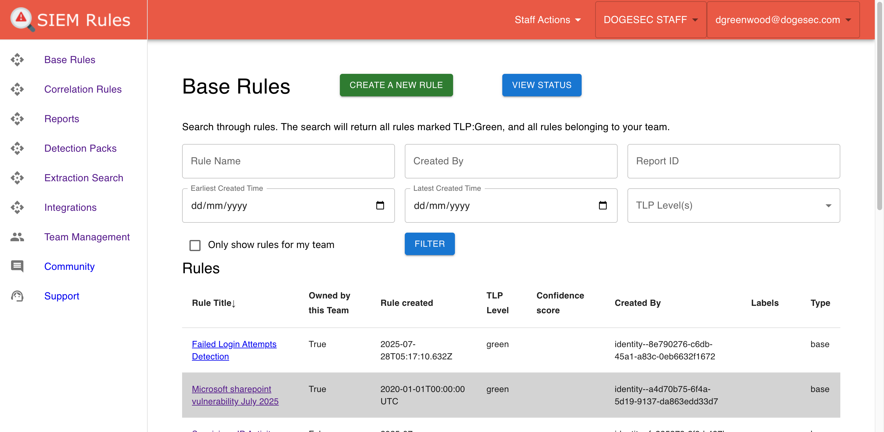
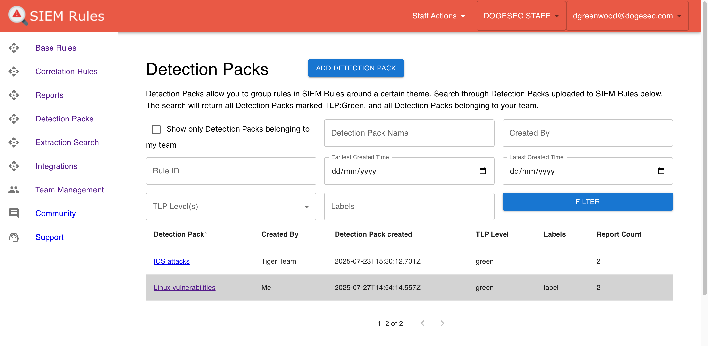
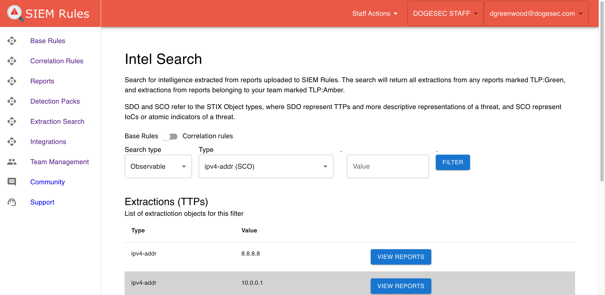

# OpenCTI SIEM Rules Connector

## Overview

SIEM Rules is a web application that turns threat intelligence reports into detection rules.

[You can read more and sign up for SIEM Rules for free here](https://www.siemrules.com/).

The OpenCTI SIEM Rules Connector syncs the detection rules held in SIEM Rules Detection Packs to OpenCTI.

_Note: The OpenCTI SIEM Rules Connector only works with SIEM Rules Web. It does not work with self-hosted SIEM Rules installations at this time._

## Installation

### Prerequisites

* An SIEM Rules team subscribed to a plan with API access enabled
* OpenCTI >= 6.5.10

### Generating an SIEM Rules API Key

1. Log in to your SIEM Rules account and navigate to "Account Settings"
2. Locate the API section and select "Create Token"
3. Select the team you want to use and generate the key
4. Copy the key, it will be needed for the configoration

### Configoration

If you are unfamiliar with how to install OpenCTI Connectors, [you should read the official documentation here](https://docs.opencti.io/latest/deployment/connectors/).

There are a number of configuration options specific to SIEM Rules, which are set either in `docker-compose.yml` (for Docker) or in `config.yml` (for manual deployment). These options are as follows:

| Docker Env variable    | config variable        | Required | Data Type | Recommended                                            | Description                                                                                                                                                                                                                                                                                                                                                                                                                                          |
| ---------------------- | ---------------------- | -------- | --------- | ------------------------------------------------------ | ---------------------------------------------------------------------------------------------------------------------------------------------------------------------------------------------------------------------------------------------------------------------------------------------------------------------------------------------------------------------------------------------------------------------------------------------------- |
| `SIEMRULES_BASE_URL`       | `siemrules.base_url`       | TRUE     | url       | `https://api.siemrules.com/` | Should always be `https://api.siemrules.com/`                                                                                                                                                                                                                                                                                                                                                                                                          |
| `SIEMRULES_API_KEY`        | `siemrules.api_key`        | TRUE     | string    | n/a                                                    | The API key used to authenticate to SIEM Rules Web                                                                                                                                                                                                                                                                                                                                                                                                      |
| `SIEMRULES_DETECTION_PACKS`    | `siemrules.detection_packs`    | TRUE     | uuid      | n/a                                                    | A list of comma separated Detection Pack IDs (e.g. `'pack_id1,pack2_id,pack3_id'`. You can get a Detection Pack ID in the SIEM Rules web app. At least one Detection Pack ID must be passed. All historical intelligence from reports will be ingested, and new intelligence added to the Detection Pack will be ingested as per the interval setting. You can use any Detection Pack visible to the authenticated team (even if the team you're using to authenticate with does not own it). |
| `SIEMRULES_INTERVAL_HOURS` | `siemrules.interval_hours` | TRUE     | integer   | `12`                                                 | How often (in hours) this Connector should poll SIEM Rules Web for updates.                                                                                                                                                                                                                                                                                                                                                                             |                                                                      

### Verification

To verify the connector is working, you can navigate to `Data` -> `Ingestion` -> `Connectors` -> `SIEM Rules`.

## Behavior

Each rule of the selected Detection Packs is imported with the STIX bundle SIEM Rules builds for it. On every Sigma rule Indicator (`pattern_type: sigma`) the connector also sets, from the rule itself:

* `x_opencti_rule_status`: the Sigma `status` (`stable`, `test`, `experimental`, `deprecated`, `unsupported`),
* `x_opencti_rule_level`: the Sigma `level` (`informational`, `low`, `medium`, `high`, `critical`),
* `x_opencti_rule_logsource`: the Sigma `logsource` keys present in the rule (`category`, `product`, `service`), lowercased,

and adds one `indicates` relationship per ATT&CK technique or sub-technique tag (`attack.t1059`, `attack.t1059.001`), targeting the Attack Pattern whose id is derived from the MITRE id, next to the `related-to` relationships SIEM Rules provides. Tactic tags (`attack.execution`) create no relationship. Techniques OpenCTI already holds are referenced as they are and never renamed; the others are created under the MITRE ATT&CK name carried by the bundle. When OpenCTI cannot be asked which techniques it holds and the bundle does not name a tagged technique, the rule is not imported with a link to a technique that may not exist: its Detection Pack stops at this rule and the next run imports it again.

Requires `pycti==7.261008.0` (pinned in `requirements.txt`). The rule metadata properties are stored from the OpenCTI release shipping the Threat-Informed Defense Matrix; older platforms ignore them.

## Support

You should contact OpenCTI if you are new to installing Connectors and need support.

If you run into issues when installing this Connector, you can reach the dogesec team as follows:

* [dogesec Community Forum](https://community.dogesec.com/) (recommended)
* [dogesec Support Portal](https://support.dogesec.com/) (requires a plan with email support)