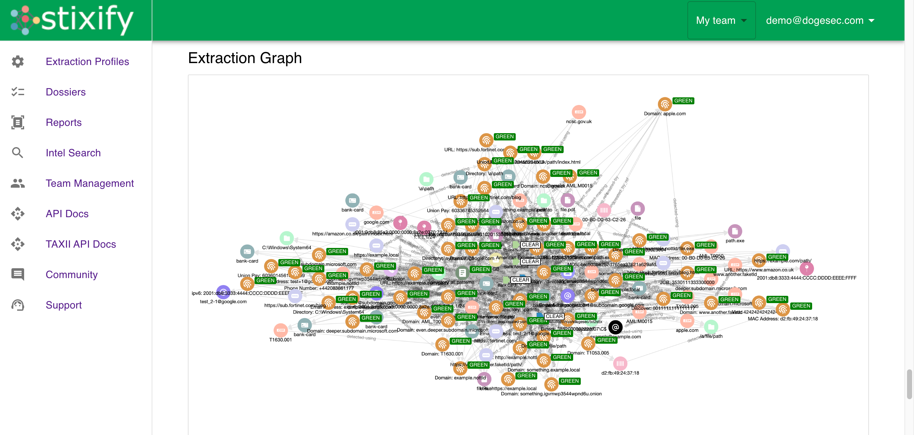
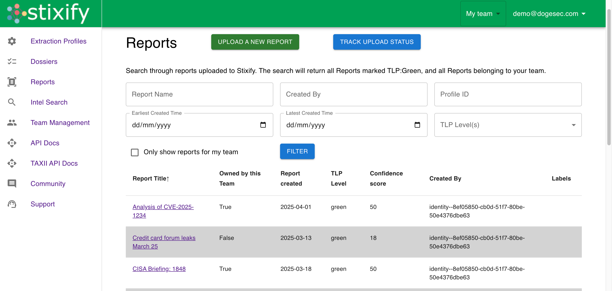
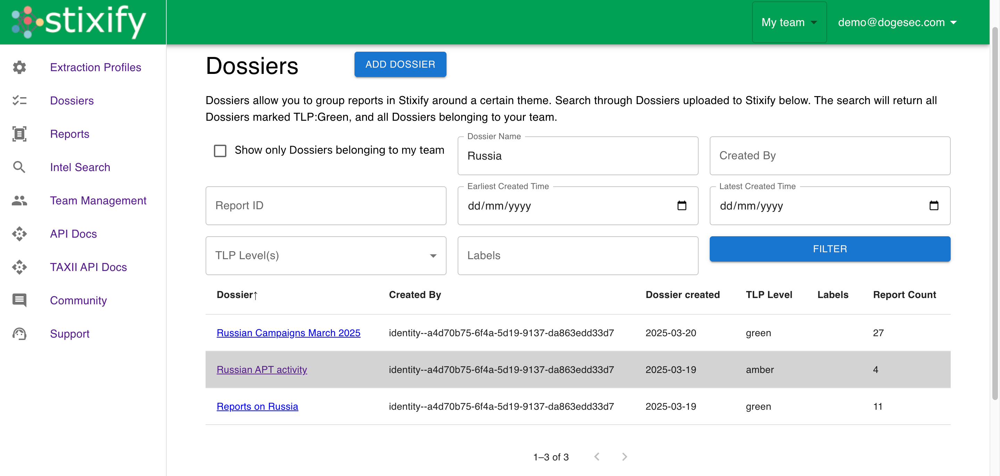

# OpenCTI Stixify Connector

## Overview

Stixify is a web application that turns reports into structured threat intelligence.

[You can read more and sign up for Stixify for free here](https://www.stixify.com/).

The OpenCTI Stixify Connector syncs the intelligence reports held in Stixify Dossier to OpenCTI.

_Note: The OpenCTI Stixify Connector only works with Stixify Web. It does not work with self-hosted Stixify installations at this time._

## Installation

### Prerequisites

* An Stixify team subscribed to a plan with API access enabled
* OpenCTI >= 6.5.10

### Generating an Stixify API Key

1. Log in to your Stixify account and navigate to "Account Settings"
2. Locate the API section and select "Create Token"
3. Select the team you want to use and generate the key
4. Copy the key, it will be needed for the configoration

### Configoration

If you are unfamiliar with how to install OpenCTI Connectors, [you should read the official documentation here](https://docs.opencti.io/latest/deployment/connectors/).

There are a number of configuration options specific to Stixify, which are set either in `docker-compose.yml` (for Docker) or in `config.yml` (for manual deployment). These options are as follows:

| Docker Env variable    | config variable        | Required | Data Type | Recommended                                            | Description                                                                                                                                                                                                                                                                                                                                                                                                                                          |
| ---------------------- | ---------------------- | -------- | --------- | ------------------------------------------------------ | ---------------------------------------------------------------------------------------------------------------------------------------------------------------------------------------------------------------------------------------------------------------------------------------------------------------------------------------------------------------------------------------------------------------------------------------------------- |
| `STIXIFY_BASE_URL`       | `stixify.base_url`       | TRUE     | url       | `https://api.stixify.com/` | Should always be `https://api.stixify.com/`                                                                                                                                                                                                                                                                                                                                                                                                          |
| `STIXIFY_API_KEY`        | `stixify.api_key`        | TRUE     | string    | n/a                                                    | The API key used to authenticate to Stixify Web                                                                                                                                                                                                                                                                                                                                                                                                      |
| `STIXIFY_DOSSIER_IDS`    | `stixify.dossier_ids`    | TRUE     | uuid      | n/a                                                    | A list of comma separated dossier IDs (e.g. `'dossier1id,dossier2id'`. You can get a Dossier ID in the Stixify web app. At least one Dossier ID must be passed. All historical intelligence from reports will be ingested, and new intelligence added to the Dossier will be ingested as per the interval setting. You can use any Dossier visible to the authenticated team (even if the team you're using to authenticate with does not own it). |
| `STIXIFY_INTERVAL_HOURS` | `stixify.interval_hours` | TRUE     | integer   | `12`                                                 | How often (in hours) this Connector should poll Stixify Web for updates.                                                                                                                                                                                                                                                                                                                                                                             |                                                                      

### Verification

To verify the connector is working, you can navigate to `Data` -> `Ingestion` -> `Connectors` -> `Stixify`.

## Support

You should contact OpenCTI if you are new to installing Connectors and need support.

If you run into issues when installing this Connector, you can reach the dogesec team as follows:

* [dogesec Community Forum](https://community.dogesec.com/) (recommended)
* [dogesec Support Portal](https://support.dogesec.com/) (requires a plan with email support)