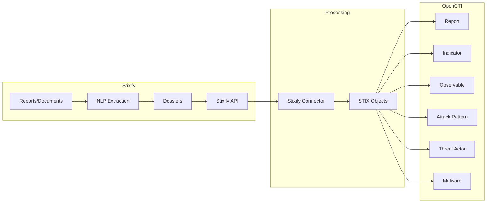

# OpenCTI Stixify Connector

| Status | Date | Comment |
|--------|------|---------|
| Partner | -    | -       |

## Table of Contents

- [Introduction](#introduction)
- [Installation](#installation)
  - [Requirements](#requirements)
- [Configuration](#configuration)
  - [Configuration Variables](#configuration-variables)
- [Deployment](#deployment)
  - [Docker Deployment](#docker-deployment)
  - [Manual Deployment](#manual-deployment)
- [Behavior](#behavior)
  - [Data Flow](#data-flow)
  - [Entity Mapping](#entity-mapping)
- [Debugging](#debugging)
- [Additional Information](#additional-information)

---

## Introduction

[Stixify](https://www.stixify.com/) is a web application that turns reports into structured threat intelligence.


The OpenCTI Stixify Connector syncs the intelligence reports held in Stixify Dossiers to OpenCTI, enabling automated extraction and import of structured STIX data from PDF reports, documents, and other file formats.

> **Note**: This connector only works with Stixify Web. It does not support self-hosted Stixify installations at this time.

---

## Installation

### Requirements

- OpenCTI >= 6.5.10
- Stixify team subscribed to a plan with API access enabled
- Stixify API Key

### Generating an API Key

1. Log in to your Stixify account
2. Navigate to "Account Settings"
3. Locate the API section and select "Create Token"
4. Select the team you want to use and generate the key
5. Copy the key for configuration

---

## Configuration

### Configuration Variables

#### OpenCTI Parameters

| Parameter | Docker envvar | Mandatory | Description |
|-----------|---------------|-----------|-------------|
| OpenCTI URL | `OPENCTI_URL` | Yes | The URL of the OpenCTI platform |
| OpenCTI Token | `OPENCTI_TOKEN` | Yes | The default admin token configured in the OpenCTI platform |

#### Base Connector Parameters

| Parameter | Docker envvar | Mandatory | Description |
|-----------|---------------|-----------|-------------|
| Connector ID | `CONNECTOR_ID` | Yes | A unique `UUIDv4` for this connector |
| Connector Name | `CONNECTOR_NAME` | Yes | Name displayed in OpenCTI |
| Log Level | `CONNECTOR_LOG_LEVEL` | No | Log level: `debug`, `info`, `warn`, or `error` |

#### Connector Extra Parameters

| Parameter | Docker envvar | config.yml | Required | Default | Description |
|-----------|---------------|------------|----------|---------|-------------|
| Base URL | `STIXIFY_BASE_URL` | `stixify.base_url` | Yes | `https://api.stixify.com/` | Stixify API URL |
| API Key | `STIXIFY_API_KEY` | `stixify.api_key` | Yes | - | API key for authentication |
| Dossier IDs | `STIXIFY_DOSSIER_IDS` | `stixify.dossier_ids` | Yes | - | Comma-separated dossier IDs to import |
| Interval Hours | `STIXIFY_INTERVAL_HOURS` | `stixify.interval_hours` | Yes | `12` | Polling interval in hours |

---

## Deployment

### Docker Deployment

Use the following `docker-compose.yml`:

```yaml
services:
  connector-stixify:
    image: opencti/connector-dogesec-stixify:latest
    environment:
      - OPENCTI_URL=http://opencti:8080
      - OPENCTI_TOKEN=${OPENCTI_ADMIN_TOKEN}
      - CONNECTOR_ID=${CONNECTOR_STIXIFY_ID}
      - CONNECTOR_NAME=Stixify
      - CONNECTOR_LOG_LEVEL=info
      - STIXIFY_BASE_URL=https://api.stixify.com/
      - STIXIFY_API_KEY=${STIXIFY_API_KEY}
      - STIXIFY_DOSSIER_IDS=dossier1-uuid,dossier2-uuid
      - STIXIFY_INTERVAL_HOURS=12
    restart: always
    depends_on:
      - opencti
```

### Manual Deployment

1. Clone the repository and navigate to the connector directory
2. Install dependencies: `pip install -r requirements.txt`
3. Configure `config.yml`
4. Run: `python main.py`

---

## Behavior

### Data Flow



### Entity Mapping

| Stixify Data | OpenCTI Entity | Notes |
|--------------|----------------|-------|
| Source Report | Report | Original document with extracted intelligence |
| Extracted IOCs | Indicator/Observable | IPs, domains, URLs, hashes |
| Extracted TTPs | Attack Pattern | MITRE ATT&CK techniques |
| Extracted Actors | Threat Actor | Named threat actors from text |
| Extracted Malware | Malware | Malware families and samples |
| Extracted Tools | Tool | Software tools mentioned |

### Processing Details

1. **Dossier Selection**:
   - At least one Dossier ID must be provided
   - Can import from multiple dossiers (comma-separated)
   - Access to dossiers visible to authenticated team

2. **Historical Import**:
   - All historical intelligence from reports is ingested
   - New intelligence added to dossiers is imported on schedule

3. **Incremental Updates**:
   - Polls at configured interval (default: 12 hours)
   - Only fetches new/updated intelligence since last run

---

## Debugging

Enable debug logging by setting `CONNECTOR_LOG_LEVEL=debug`.

### Verification

Navigate to `Data` → `Ingestion` → `Connectors` → `Stixify` to verify the connector is working.

---

## Additional Information

### About Stixify

- **Website**: [stixify.com](https://www.stixify.com/)
- **Sign up**: Free tier available
- **Provider**: [dogesec](https://dogesec.com/)

### Support

- **OpenCTI Support**: For general connector installation help
- **dogesec Community Forum**: [community.dogesec.com](https://community.dogesec.com/) (recommended)
- **dogesec Support Portal**: [support.dogesec.com](https://support.dogesec.com/) (requires plan with email support)

### Use Cases

| Use Case | Description |
|----------|-------------|
| Report Processing | Extract intelligence from PDF threat reports |
| Document Analysis | Analyze advisories, bulletins, research papers |
| IOC Extraction | Automate indicator extraction from documents |
| Intelligence Library | Build searchable intelligence from reports |
