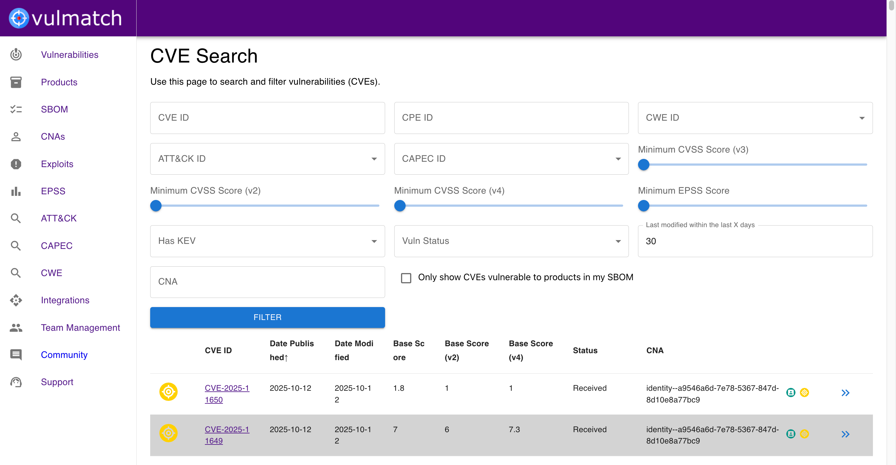
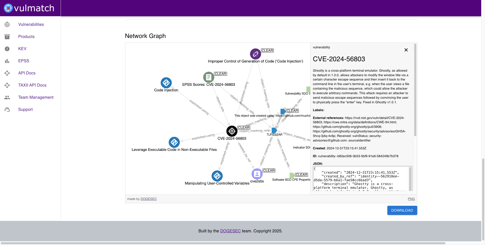

# OpenCTI Vulmatch Connector

## Overview

Vulmatch is a web application that turns blog posts from your favourite security blogs into structured threat intelligence.

[You can read more and sign up for Vulmatch for free here](https://www.vulmatch.com/).

The OpenCTI Vulmatch Connector syncs vulnerability intelligence from Vulmatch to OpenCTI.

_Note: The OpenCTI Vulmatch Connector only works with Vulmatch Web. It does not work with self-hosted Vulmatch installations at this time._

## Installation

### Prerequisites

* A Vulmatch team subscribed to a plan with API access enabled
* OpenCTI >= 6.5.10

### Generating an Vulmatch API Key

1. Log in to your Vulmatch account and navigate to "Account Settings"
2. Locate the API section and select "Create Token"
3. Select the team you want to use and generate the key
4. Copy the key, it will be needed for the configoration

### Configoration

If you are unfamiliar with how to install OpenCTI Connectors, [you should read the official documentation here](https://docs.opencti.io/latest/deployment/connectors/).

There are a number of configuration options specific to Vulmatch, which are set either in `docker-compose.yml` (for Docker) or in `config.yml` (for manual deployment). These options are as follows:

| Docker Env variable     | config variable         | Required | Data Type                   | Recommended                                              | Description                                                                                                                                                                                                                                                                                                                               |
| ----------------------- | ----------------------- | -------- | --------------------------- | -------------------------------------------------------- | ----------------------------------------------------------------------------------------------------------------------------------------------------------------------------------------------------------------------------------------------------------------------------------------------------------------------------------------- |
| `VULMATCH_BASE_URL`       | `vulmatch.base_url`       | TRUE     | url                         | `https://api.vulmatch.com/` | Should always be `https://api.vulmatch.com/`                                                                                                                                                                                                                                                                                              |
| `VULMATCH_API_KEY`        | `vulmatch.api_key`        | TRUE     | string                      | n/a                                                      | The API key used to authenticate to Vulmatch Web                                                                                                                                                                                                                                                                                          |
| `VULMATCH_SBOM_ONLY`      | `vulmatch.sbom_only`       | TRUE     | boolean                     | n/a                                                      | You can use the Vulmatch connector in two ways. 1) to only ingest vulnerability data related to products in your Vulmatch SBoM (set to true, or 2) to ingest all vulnerabilities that match filters (set to false)                                                                                                                        |
| `VULMATCH_EPSS_SCORE_MIN` | `vulmatch.epss_score_min` | TRUE     | float (to 5 decimal places) | `-1`                                                   | The minimum EPSS score for the vulnerabilities to be ingested. Between `0` - `1`. Setting to `-1` will include vulnerabilities with no EPSS scores.                                                                                                                                                                                 |
| `VULMATCH_CVSS_SCORE_MIN` | `vulmatch.cvss_score_min` | TRUE     | float (to 1 decimal place)  | `-1`                                                   | The minimum CVSS base score for the vulnerabilities to be ingested. Between `0` - `10`. Setting to `-1` will include vulnerabilities with no CVSS scores.                                                                                                                                                                           |
| `VULMATCH_INTERVAL_DAYS`  | `vulmatch.interval_days`  | TRUE     | integer                     | `1`                                                    | How often, in days, this Connector should poll Vulmatch Web for updates. The Vulmatch data is updated once per day.                                                                                                                                                                                                                       |
| `VULMATCH_DAYS_TO_BACKFILL`  | `vulmatch.days_to_backfill`  | TRUE     | integer                     | `90`                                                   | When the connector is first configured, this setting determines the number of days to backfill for vulnerability data. It uses the modified time of the vulnerability. For example, setting 30 will ingest any vulnerabilities updated within the last 30 days, regardless of when they were published. Maximum value is `365` (1 year) |

### Verification

To verify the connector is working, you can navigate to `Data` -> `Ingestion` -> `Connectors` -> `Vulmatch`.

## Support

You should contact OpenCTI if you are new to installing Connectors and need support.

If you run into issues when installing this Connector, you can reach the dogesec team as follows:

* [dogesec Community Forum](https://community.dogesec.com/) (recommended)
* [dogesec Support Portal](https://support.dogesec.com/) (requires a plan with email support)