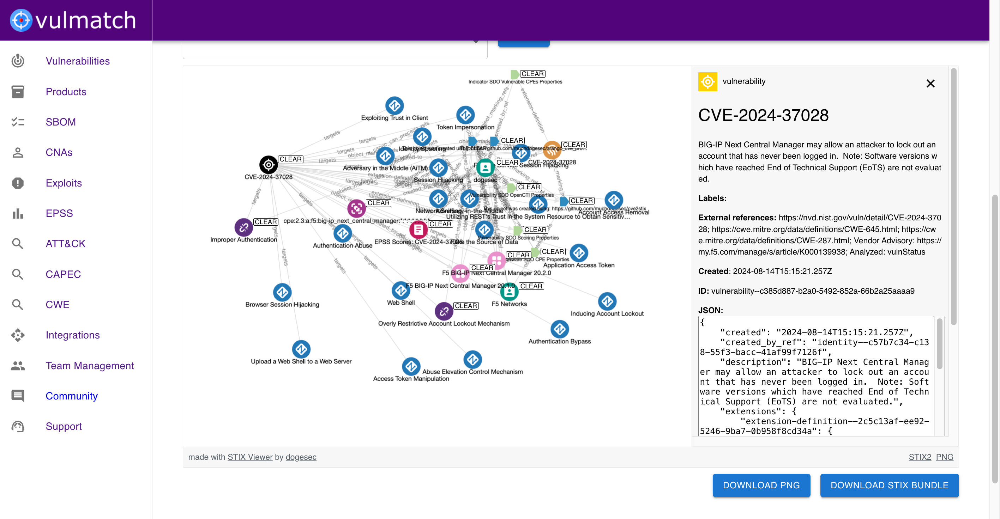
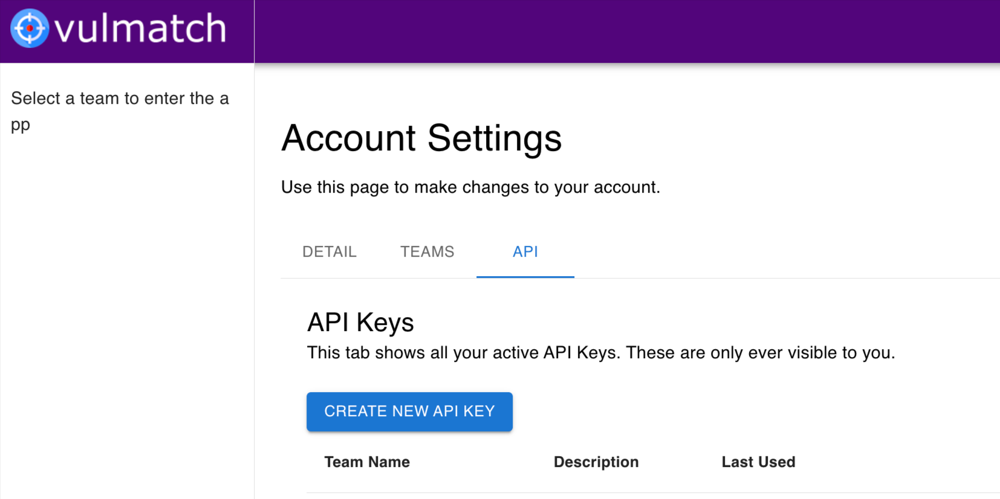

# OpenCTI Vulmatch Connector

* OpenCTI Connector type: [EXTERNAL_IMPORT](https://docs.opencti.io/latest/deployment/connectors/)

## Overview

Vulmatch is a web application that turns CVEs into STIX objects.




[vulmatch.com](https://www.vulmatch.com/).

The OpenCTI Vulmatch Connector syncs vulnerability intelligence from Vulmatch to OpenCTI.

_Note: The OpenCTI Vulmatch Connector only works with Vulmatch Web. It does not work with self-hosted Vulmatch installations at this time._

## Installation

### Prerequisites

* A Vulmatch team subscribed to a plan with API access enabled
* OpenCTI >= 6.5.10

### Generating an Vulmatch API Key



1. Log in to your Vulmatch account and navigate to "Account Settings"
2. Locate the API section and select "Create New API Key"
3. Select the team you want to use and generate the key
4. Copy the key, it will be needed for the configoration

### Configoration

If you are unfamiliar with how to install OpenCTI Connectors, [you should read the official documentation here](https://docs.opencti.io/latest/deployment/connectors/).

There are a number of configuration options specific to Vulmatch, which are set either in `docker-compose.yml` (for Docker) or in `config.yml` (for manual deployment). These options are as follows:

| Docker Env variable     | config variable         | Required | Data Type                   | Recommended                                              | Description                                                                                                                                                                                                                                                                                                                               |
| ----------------------- | ----------------------- | -------- | --------------------------- | -------------------------------------------------------- | ----------------------------------------------------------------------------------------------------------------------------------------------------------------------------------------------------------------------------------------------------------------------------------------------------------------------------------------- |
| `VULMATCH_BASE_URL`       | `vulmatch.base_url`       | TRUE     | url                         | `https://api.vulmatch.com/` | Should always be `https://api.vulmatch.com/`                                                                                                                                                                                                                                                                                              |
| `VULMATCH_API_KEY`        | `vulmatch.api_key`        | TRUE     | string                      | n/a                                                      | The API key used to authenticate to Vulmatch Web                                                                                                                                                                                                                                                                                          |
| `VULMATCH_SBOM_ONLY`      | `vulmatch.sbom_only`       | TRUE     | boolean                     | n/a                                                      | You can use the Vulmatch connector in two ways. 1) to only ingest vulnerability data related to products in your Vulmatch SBoM (set this to `TRUE`), or 2) to ingest all vulnerabilities that match filters (set this to `FALSE`)                                                                                                                        |
| `VULMATCH_EPSS_SCORE_MIN` | `vulmatch.epss_score_min` | TRUE     | float (to 5 decimal places) | `-1`                                                   | The minimum EPSS score for the vulnerabilities to be ingested. Between `0` - `1`. Setting to `-1` will include vulnerabilities with no EPSS scores.                                                                                                                                                                                 |
| `VULMATCH_CVSS_V2_SCORE_MIN` | `vulmatch.cvss_v2_score_min` | TRUE     | float (to 1 decimal place)  | `-1`                                                   | The minimum CVSS v2 base score for the vulnerabilities to be ingested. Between `0` - `10`. Setting to `-1` will include vulnerabilities with no CVSS scores.                                                                                                                                                                           |
| `VULMATCH_CVSS_V3_SCORE_MIN` | `vulmatch.cvss_v3_score_min` | TRUE     | float (to 1 decimal place)  | `-1`                                                   | The minimum CVSS v3 base score for the vulnerabilities to be ingested. Between `0` - `10`. Setting to `-1` will include vulnerabilities with no CVSS scores.                                                                                                                                                                           |
| `VULMATCH_CVSS_V4_SCORE_MIN` | `vulmatch.cvss_v4_score_min` | TRUE     | float (to 1 decimal place)  | `-1`                                                   | The minimum CVSS v4 base score for the vulnerabilities to be ingested. Between `0` - `10`. Setting to `-1` will include vulnerabilities with no CVSS scores.                                                                                                                                                                           |
| `VULMATCH_INTERVAL_DAYS`  | `vulmatch.interval_days`  | TRUE     | integer                     | `1`                                                    | How often, in days, this Connector should poll Vulmatch Web for updates. The Vulmatch data is updated once per day.                                                                                                                                                                                                                       |
| `VULMATCH_DAYS_TO_BACKFILL`  | `vulmatch.days_to_backfill`  | TRUE     | integer                     | `90`                                                   | When the connector is first configured, this setting determines the number of days to backfill for vulnerability data. It uses the modified time of the vulnerability. For example, setting 30 will ingest any vulnerabilities updated within the last 30 days, regardless of when they were published. Maximum value is `90` (90 days) |

### Verification

To verify the connector is working, you can navigate to `Data` -> `Ingestion` -> `Connectors` -> `Vulmatch`.

## Data model

There are some important considerations when using this integration.

Below, shows the Vulmatch data model at a high-level;

<iframe width="768" height="432" src="https://miro.com/app/live-embed/uXjVL5tH2Ro=/?embedMode=view_only_without_ui&moveToViewport=-487,-959,3644,2026&embedId=331026460624" frameborder="0" scrolling="no" allow="fullscreen; clipboard-read; clipboard-write" allowfullscreen></iframe>

Whilst Vulmatch supports the full STIX specification, OpenCTI does not. This causes a few differences between what you will see in Vulmatch and OpenCTI. 

### 1. No custom STIX objects imported

In Vulmatch:

* [CWEs are modelled as STIX Weakness objects](https://github.com/muchdogesec/stix2extensions/blob/main/extension-definitions/sdos/weakness.json).
* [Known exploits are modelled as STIX Exploit objects](https://github.com/muchdogesec/stix2extensions/blob/main/extension-definitions/sdos/exploit.json)

OpenCTI does not support custom STIX objects by default.

As such, we skip the import of

1. `weakness` and `exploit` objects
2. any `relationship` objects where a `weakness` or `exploit` object is referenced in either the `source_ref` or `target_ref`

The workarounds:

* CWE references can still be found in the `vulnerability` objects imported.
* KEVs are modelled as `report` (and imported using this connector). You just won't be able to see the actual exploits discovered.

### 2. No custom `relationship_type`s supported

In Vulmatch, `grouping` objects are used to model CPE matches in NVD (which are then linked to the actual CPE `software` objects).

Whilst OpenCTI does support the ingest of `grouping` objects, it does not support the use of custom `relationship_type` linking the Indicator to Grouping in Vulmatch. This is vital, because the `relationship_type` defines if the CPEs are vulnerable (or not) the the CVE. For example, Chrome might be vulnerable, but needs to be running on Windows to make if vulnerable.

The workaround:

We don't import any `grouping` objects (or `relationships`s referencing them)

We do however create `relationship` objects on the fly in this connector to link Vulnerabilities to known vulnerable CPEs (i.e. CPEs linked to `grouping` objects with a connection to the CVE `indicator` with `relationship_type=x-cpes-vulnerable`). The relationship objects are created as follows:

```json
{
    "type": "relationship",
    "spec_version": "2.1",
    "id": "relationship--<UUIDV5 GENERATION LOGIC>",
    "created_by_ref": "identity--9779a2db-f98c-5f4b-8d08-8ee04e02dbb5",
    "created": "<vulnerability.published>",
    "modified": "<vulnerability.modified>",
    "relationship_type": "has",
    "source_ref": "software--<ID>",
    "target_ref": "vulnerability--<ID>",
    "description": "<SOFTWARE NAME> is vulnerable to <VULNERABILITY NAME>",
    "object_marking_refs": [
        "marking-definition--94868c89-83c2-464b-929b-a1a8aa3c8487",
        "marking-definition--152ecfe1-5015-522b-97e4-86b60c57036d"
    ],
    "external_references": [
        {
            "source_name": "cve",
            "external_id": "<vulnerabilities.cve.id>",
            "url": "https://nvd.nist.gov/vuln/detail/<vulnerabilities.cve.id>"
        }
    ]
}

```

The UUIDv5 logic uses 

* namespace: `152ecfe1-5015-522b-97e4-86b60c57036d`
* value: `<relationship_type>+<source_ref>+<target_ref>`

This does mean some context is lost (i.e. not vulnerable CPEs, CPE Match information). However, this can be obtained in Vulmatch if needed.

### How the data is structured in OpenCTI

To help visualise what data is imported for each vulnerability using this connector, we have created the following diagram showing all objects, and the relationships that will be imported:

<iframe width="768" height="432" src="https://miro.com/app/live-embed/uXjVJ7eYHgs=/?embedMode=view_only_without_ui&moveToViewport=74,-901,3059,1526&embedId=970160109844" frameborder="0" scrolling="no" allow="fullscreen; clipboard-read; clipboard-write" allowfullscreen></iframe>

## Support

You should contact OpenCTI if you are new to installing Connectors and need support.

If you run into issues when installing this Connector, you can reach the dogesec team as follows:

* [dogesec Community Forum](https://community.dogesec.com/) (recommended)
* [dogesec Support Portal](https://support.dogesec.com/) (requires a plan with email support)