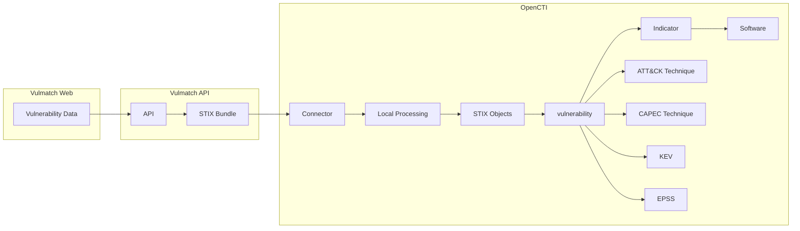

# OpenCTI Vulmatch Connector

| Status | Date | Comment |
|--------|------|---------|
| Partner | -    | -       |

## Table of Contents

- [Introduction](#introduction)
  - [Screenshots](#screenshots)
- [Installation](#installation)
  - [Requirements](#requirements)
- [Configuration](#configuration)
  - [Configuration Variables](#configuration-variables)
- [Deployment](#deployment)
  - [Docker Deployment](#docker-deployment)
  - [Manual Deployment](#manual-deployment)
- [Behavior](#behavior)
  - [Data Flow](#data-flow)
  - [Entity Mapping](#entity-mapping)
  - [Custom STIX Objects and OpenCTI Compatibility](#custom-stix-objects-and-opencti-compatibility)
  - [Processing Details](#processing-details)
- [Debugging](#debugging)
- [Additional Information](#additional-information)

---

## Introduction

[Vulmatch](https://www.vulmatch.com/) is a web application that turns CVEs into STIX objects enriched with intelligence.

The OpenCTI Vulmatch Connector syncs vulnerability intelligence from Vulmatch to OpenCTI, enabling automated import of CVE data with CVSS scores, EPSS predictions, CWE/ATT&CK/CAPEC mappings, Known Exploits, and CPE software associations.

The OpenCTI Vulmatch Connector enriches vulnerability data with additional intelligence beyond what is available through the [NIST NVD CVE](https://hub.filigran.io/cybersecurity-solutions/open-cti-integrations/nist-nvd-cve), [CISA Known Exploited Vulnerabilities (KEV)](https://hub.filigran.io/cybersecurity-solutions/open-cti-integrations/cisa-kev), and [FIRST EPSS](https://hub.filigran.io/cybersecurity-solutions/open-cti-integrations/first-epss) Connectors.

> **Note**: This connector only works with Vulmatch Web. It does not support self-hosted Vulmatch installations at this time.

### Screenshots


---

## Installation

### Requirements

- OpenCTI >= 6.5.10
- Vulmatch team subscribed to a plan with API access enabled
- Vulmatch API Key

### Generating an API Key

[](https://www.youtube.com/watch?v=OabQepWZU4Q)

[This video demonstrates the steps outlined below](https://www.youtube.com/watch?v=OabQepWZU4Q).

1. Log in to your Vulmatch account
2. Navigate to "Account Settings"
3. Locate the API section and select "Create New API Key"
4. Select the team you want to use and generate the key
  * If you don't see a team listed, you do not belong to a team on a plan with API access. Please upgrade the teams account to continue.
5. Copy the API Key for the OpenCTI Connector configuration

---

## Configuration

### Configuration Variables

#### OpenCTI Parameters

| Parameter | Docker envvar | Mandatory | Description |
|-----------|---------------|-----------|-------------|
| OpenCTI URL | `OPENCTI_URL` | Yes | The URL of the OpenCTI platform |
| OpenCTI Token | `OPENCTI_TOKEN` | Yes | The default admin token configured in the OpenCTI platform |

#### Base Connector Parameters

| Parameter | Docker envvar | Mandatory | Description |
|-----------|---------------|-----------|-------------|
| Connector ID | `CONNECTOR_ID` | Yes | A unique `UUIDv4` for this connector |
| Connector Name | `CONNECTOR_NAME` | Yes | Name displayed in OpenCTI |
| Log Level | `CONNECTOR_LOG_LEVEL` | No | Log level: `debug`, `info`, `warn`, or `error` |

#### Connector Extra Parameters

| Parameter | Docker envvar | config.yml | Required | Default | Description |
|-----------|---------------|------------|----------|---------|-------------|
| Base URL | `VULMATCH_BASE_URL` | `vulmatch.base_url` | Yes | `https://api.vulmatch.com/` | Vulmatch API URL |
| API Key | `VULMATCH_API_KEY` | `vulmatch.api_key` | Yes | - | The Vulmatch API key for authentication (steps to generate described earlier in this document) |                                                                      | SBoM Only | `VULMATCH_SBOM_ONLY` | `vulmatch.sbom_only` | Yes | `FALSE` | You can use the Vulmatch connector in two ways. 1) to only ingest vulnerability data related to products in your Vulmatch SBoM (set this to `TRUE`), or 2) to ingest all vulnerabilities that match filters (set this to `FALSE`) |
| Minimum EPSS Score | `VULMATCH_EPSS_SCORE_MIN` | `vulmatch.epss_score_min` | Yes | `-1` | The minimum EPSS score for the vulnerabilities to be ingested. Between `0` and `1`. Setting to `-1` will include vulnerabilities with no EPSS scores. |
| Minimum CVSSv2 Score | `VULMATCH_CVSS_V2_SCORE_MIN` | `vulmatch.cvss_v2_score_min` | Yes | `-1` | The minimum CVSS v2 base score for the vulnerabilities to be ingested. Between `0.01` - `10.00`. Setting to `-1` will include vulnerabilities with no CVSS scores. |
| Minimum CVSSv3 Score | `VULMATCH_CVSS_V3_SCORE_MIN` | `vulmatch.cvss_v3_score_min` | Yes | `-1` | The minimum CVSS v3 base score for the vulnerabilities to be ingested. Between `0.01` - `10.00`. Setting to `-1` will include vulnerabilities with no CVSS scores. |
| Minimum CVSSv4 Score | `VULMATCH_CVSS_V4_SCORE_MIN` | `vulmatch.cvss_v4_score_min` | Yes | `-1` | The minimum CVSS v4 base score for the vulnerabilities to be ingested. Between `0.01` - `10.00`. Setting to `-1` will include vulnerabilities with no CVSS scores. |
| Interval Days | `VULMATCH_INTERVAL_DAYS` | `vulmatch.interval_days` | Yes | `1` | Polling interval in hours. The connector polls Vulmatch for new and updated CVEs at this schedule. The minimum (and recommended) value is `1`. |
| Days to Backfill | `VULMATCH_DAYS_TO_BACKFILL` | `vulmatch.days_to_backfill` | Yes | `90` | Number of days of historical data to import (maximum: `90`). Uses the `created` value of the CVE. This setting only applies during the initial data polling (backfill). Changing it after the backfill has completed has no effect. |

---

## Deployment

### Docker Deployment

Use the following `docker-compose.yml`:

```yaml
services:
  connector-vulmatch:
    image: opencti/connector-dogesec-vulmatch:latest
    environment:
      - OPENCTI_URL=http://opencti:8080
      - OPENCTI_TOKEN=${OPENCTI_ADMIN_TOKEN}
      - CONNECTOR_ID=${CONNECTOR_VULMATCH_ID}
      - CONNECTOR_NAME=Vulmatch
      - CONNECTOR_LOG_LEVEL=info
      - VULMATCH_BASE_URL=https://api.vulmatch.com/
      - VULMATCH_API_KEY=${VULMATCH_API_KEY}
      - VULMATCH_SBOM_ONLY=FALSE
      - VULMATCH_EPSS_SCORE_MIN=-1
      - VULMATCH_CVSS_V2_SCORE_MIN=-1
      - VULMATCH_CVSS_V3_SCORE_MIN=-1
      - VULMATCH_CVSS_V4_SCORE_MIN=-1
      - VULMATCH_INTERVAL_DAYS=1
      - VULMATCH_DAYS_TO_BACKFILL=90
    restart: always
    depends_on:
      - opencti
```

### Manual Deployment

1. Clone the repository and navigate to the connector directory
2. Install dependencies: `pip install -r requirements.txt`
3. Configure `config.yml`
4. Run: `python main.py`

---

## Behavior

### Data Flow



### Custom STIX Objects and OpenCTI Compatibility

#### Custom Objects

Vulmatch includes several custom STIX object types that are not currently supported by OpenCTI. These custom objects are:

* `exploit` (SDO)
    * Associated KEVs are still imported as reports. You just won't be able to see the actual exploits discovered by Vulmatch.
* `weaknesses` (SDO)
    * CWE references can still be found in the `vulnerability` objects imported.

The connector will reprocess the bundle it receives from Vulmatch to remove these objects.

#### Custom Relationships

In Vulmatch, `grouping` objects are used to model CPE matches in NVD (which are then linked to the actual CPE `software` objects).

Whilst OpenCTI does support the ingest of `grouping` objects, it does not support the use of custom `relationship_type` linking the Indicator to Grouping in Vulmatch. This is vital, because the `relationship_type` defines if the CPEs are vulnerable (or not) the the CVE. For example, Chrome might be vulnerable, but needs to be running on Windows to make if vulnerable.

The workaround:

We don't import any `grouping` objects (or `relationships`s referencing them)

We do however create `relationship` objects on the fly in this connector to link Vulnerabilities to known vulnerable CPEs (i.e. CPEs linked to `grouping` objects with a connection to the CVE `indicator` with `relationship_type=x-cpes-vulnerable`). The relationship objects are created as follows:

```json
{
    "type": "relationship",
    "spec_version": "2.1",
    "id": "relationship--<UUIDV5 GENERATION LOGIC>",
    "created_by_ref": "identity--9779a2db-f98c-5f4b-8d08-8ee04e02dbb5",
    "created": "<vulnerability.published>",
    "modified": "<vulnerability.modified>",
    "relationship_type": "has",
    "source_ref": "software--<ID>",
    "target_ref": "vulnerability--<ID>",
    "description": "<SOFTWARE NAME> is vulnerable to <VULNERABILITY NAME>",
    "object_marking_refs": [
        "marking-definition--94868c89-83c2-464b-929b-a1a8aa3c8487",
        "marking-definition--152ecfe1-5015-522b-97e4-86b60c57036d"
    ],
    "external_references": [
        {
            "source_name": "cve",
            "external_id": "<vulnerabilities.cve.id>",
            "url": "https://nvd.nist.gov/vuln/detail/<vulnerabilities.cve.id>"
        }
    ]
}

```

The UUIDv5 logic uses 

* namespace: `152ecfe1-5015-522b-97e4-86b60c57036d`
* value: `<relationship_type>+<source_ref>+<target_ref>`

This does mean some context is lost (i.e. not vulnerable CPEs, CPE Match information). However, this can be obtained in Vulmatch if needed.

### Processing Details

1. **Vulnerability Selection**:
   - Specify if vulnerabilities in SBoM or all vulnerabilities should be imported from Vulmatch

2. **Historical Import**:
   - On first run, backfills historical data
   - Maximum backfill period: 90 days
   - Configurable via `VULMATCH_DAYS_TO_BACKFILL`

3. **Incremental Updates**:
   - Polls at configured interval (default: 1 day)
   - Only fetches new/updated vulnerability intelligence since last run

---

## Debugging

Enable debug logging by setting `CONNECTOR_LOG_LEVEL=debug`.

### Verification

Navigate to `Data` → `Ingestion` → `Connectors` → `Vulmatch` to verify the connector is working.

---

## Additional Information

### About Vulmatch

- **Website**: [vulmatch.com](https://www.vulmatch.com/)
- **Sign up**: Free tier available
- **Provider**: [dogesec](https://dogesec.com/)

### Support

- **OpenCTI Support**: For general connector installation help
- **dogesec Community Forum**: [community.dogesec.com](https://community.dogesec.com/) (recommended)
- **dogesec Support Portal**: [support.dogesec.com](https://support.dogesec.com/) (requires plan with email support)

### Use Cases

| Use Case | Description |
|---------|-------------|
| Vulnerability Intelligence | Enrich CVE data in OpenCTI with CVSS, EPSS, CWE, KEV, and vulnerable software relationships from Vulmatch. |
| Risk-Based Vulnerability Prioritization | Prioritize vulnerabilities using EPSS and CVSS scores to focus on the most likely and impactful threats. |