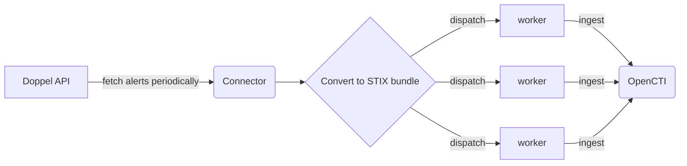
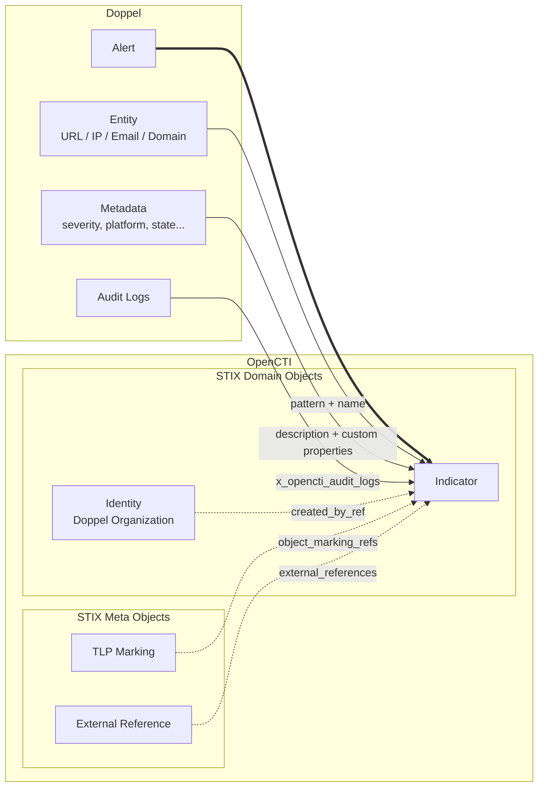

# OpenCTI Doppel Connector

| Status           | Date       | Comment |
|------------------|------------|---------|
| Partner Verified | -          | -       |

## Table of Contents

- [OpenCTI Doppel Connector](#opencti-doppel-connector)
  - [Introduction](#introduction)
  - [Installation](#installation)
    - [Requirements](#requirements)
  - [Configuration variables](#configuration-variables)
    - [OpenCTI environment variables](#opencti-environment-variables)
    - [Base connector environment variables](#base-connector-environment-variables)
    - [Connector extra parameters environment variables](#connector-extra-parameters-environment-variables)
  - [Deployment](#deployment)
    - [Docker Deployment](#docker-deployment)
    - [Manual Deployment](#manual-deployment)
  - [Usage](#usage)
  - [Behavior](#behavior)
    - [Mapping to OpenCTI entities](#mapping-to-opencti-entities)
    - [Entity type detection](#entity-type-detection)
  - [Debugging](#debugging)
  - [Additional information](#additional-information)

## Introduction

**Doppel** is a modern Digital Risk Protection solution that detects phishing and brand cyberattacks across channels like social media, domains, ads, and the dark web. By identifying malicious content and threats early, Doppel helps organizations proactively remove digital risks.

This connector integrates OpenCTI with the Doppel platform by fetching alerts from the Doppel API and importing them as STIX 2.1 Indicators. Each alert is converted into an Indicator object enriched with metadata such as severity, entity state, platform, audit logs, and more.

More information: [https://www.doppel.com](https://www.doppel.com)

The connector leverages the OpenCTI connector scheduler to import Doppel alerts periodically and create corresponding entities in OpenCTI.



## Installation

### Requirements

- OpenCTI Platform >= 6.5.1
- Doppel API access (API Key required, User API Key optional)

## Configuration variables

There are a number of configuration options, which are set either in `docker-compose.yml` (for Docker) or in `config.yml` (for manual deployment).

Below are the parameters you'll need to set for OpenCTI:

### OpenCTI environment variables

| Parameter     | config.yml `opencti` | Docker environment variable | Default | Mandatory | Description                                          |
|---------------|----------------------|-----------------------------|---------|-----------|------------------------------------------------------|
| OpenCTI URL   | `url`                | `OPENCTI_URL`               | /       | Yes       | The URL of the OpenCTI platform.                     |
| OpenCTI Token | `token`              | `OPENCTI_TOKEN`             | /       | Yes       | The default admin token set in the OpenCTI platform. |

### Base connector environment variables

Below are the parameters you'll need to set for running the connector properly:

| Parameter       | config.yml `connector` | Docker environment variable | Default | Mandatory | Description                                                                              |
|-----------------|------------------------|-----------------------------|---------|-----------|------------------------------------------------------------------------------------------|
| Connector ID    | `id`                   | `CONNECTOR_ID`              | /       | Yes       | A unique `UUIDv4` identifier for this connector instance.                                |
| Connector Name  | `name`                 | `CONNECTOR_NAME`            | /       | Yes       | Name of the connector.                                                                   |
| Connector Scope | `scope`                | `CONNECTOR_SCOPE`           | doppel  | Yes       | The scope or type of data the connector is importing, either a MIME type or Stix Object. |
| Log Level       | `log_level`            | `CONNECTOR_LOG_LEVEL`       | info    | No        | Determines the verbosity of the logs. Options are `debug`, `info`, `warn`, or `error`.   |
| Duration Period | `duration_period`      | `CONNECTOR_DURATION_PERIOD` | PT1H    | Yes       | The period of time between two connector runs (ISO 8601 duration format).                |

### Connector extra parameters environment variables

Below are the parameters you'll need to set for the Doppel connector:

| Parameter               | config.yml `doppel`      | Docker environment variable      | Default                   | Mandatory | Description                                                                       |
|-------------------------|--------------------------|----------------------------------|---------------------------|-----------|-----------------------------------------------------------------------------------|
| API Base URL            | `api_base_url`           | `DOPPEL_API_BASE_URL`            | https://api.doppel.com/v1 | No        | The Doppel API base URL.                                                          |
| API Key                 | `api_key`                | `DOPPEL_API_KEY`                 | /                         | Yes       | The Doppel API key for authentication.                                            |
| User API Key            | `user_api_key`           | `DOPPEL_USER_API_KEY`            | /                         | No        | The Doppel User API key (optional, for additional API access).                    |
| Alerts Endpoint         | `alerts_endpoint`        | `DOPPEL_ALERTS_ENDPOINT`         | /alerts                   | No        | The API endpoint path for fetching alerts.                                        |
| Historical Polling Days | `historical_polling_days`| `DOPPEL_HISTORICAL_POLLING_DAYS` | 30                        | No        | Number of days to fetch data for on the first run.                                |
| Max Retries             | `max_retries`            | `DOPPEL_MAX_RETRIES`             | 3                         | No        | Maximum number of retry attempts on API errors.                                   |
| Retry Delay             | `retry_delay`            | `DOPPEL_RETRY_DELAY`             | 30                        | No        | Delay in seconds between retry attempts.                                          |
| TLP Level               | `tlp_level`              | `DOPPEL_TLP_LEVEL`               | clear                     | No        | TLP marking for created STIX objects (`clear`, `white`, `green`, `amber`, `amber+strict`, `red`). |
| Page Size               | `page_size`              | `DOPPEL_PAGE_SIZE`               | 100                       | No        | Number of alerts to fetch per API request.                                        |

## Deployment

### Docker Deployment

Before building the Docker container, you need to set the version of pycti in `requirements.txt` equal to whatever version of OpenCTI you're running. Example, `pycti==6.5.1`. If you don't, it will take the latest version, but sometimes the OpenCTI SDK fails to initialize.

Build a Docker Image using the provided `Dockerfile`.

Example:

```shell
docker build . -t opencti/connector-doppel:latest
```

Make sure to replace the environment variables in `docker-compose.yml` with the appropriate configurations for your environment. Then, start the docker container with the provided `docker-compose.yml`.

```shell
docker compose up -d
# -d for detached
```

### Manual Deployment

Create a file `config.yml` based on the provided `config.yml.sample`.

Replace the configuration variables (especially the "**ChangeMe**" variables) with the appropriate configurations for your environment.

Install the required python dependencies (preferably in a virtual environment):

```shell
pip3 install -r requirements.txt
```

Then, start the connector from the `src` directory:

```shell
python3 main.py
```

## Usage

After installation, the connector should require minimal interaction to use, and should update automatically at a regular interval specified in your `docker-compose.yml` or `config.yml` in `duration_period`.

However, if you would like to force an immediate download of a new batch of alerts, navigate to:

**Data management → Ingestion → Connectors** in the OpenCTI platform.

Find the "Doppel" connector, and click on the refresh button to reset the connector's state and force a new download of data by re-running the connector.

## Behavior

The connector fetches alerts from the Doppel API and converts them into STIX 2.1 Indicator objects.

- **Initial population**: On the first run, the connector retrieves alerts from the last `DOPPEL_HISTORICAL_POLLING_DAYS` days (default: 30 days).
- **Delta-based updates**: Subsequent runs fetch only new or updated alerts since the last run, based on `last_activity_timestamp`.
- **Parallel fetching**: The connector uses multi-threaded pagination to efficiently fetch large volumes of alerts.

### Mapping to OpenCTI entities

The graph below describes all the different entities created by the connector in OpenCTI from Doppel alerts.



#### Doppel Alert to OpenCTI Indicator mapping

| Doppel Alert Field        | OpenCTI Indicator Field           | Description                                                |
|---------------------------|-----------------------------------|------------------------------------------------------------|
| `entity`                  | `name`, `pattern`                 | The entity value; pattern type detected automatically      |
| `created_at`              | `created`                         | Timestamp when the alert was created                       |
| `last_activity_timestamp` | `modified`                        | Timestamp of last activity on the alert                    |
| `platform`                | `description`                     | Platform where the threat was detected                     |
| `entity_state`            | `description`                     | Current state of the entity                                |
| `queue_state`             | `description`                     | Queue processing state                                     |
| `severity`                | `description`                     | Alert severity level                                       |
| `entity_content`          | `description`                     | JSON content of the entity (formatted)                     |
| `score`                   | `x_opencti_score`                 | Risk score converted to 0-100 scale                        |
| `brand`                   | `x_opencti_brand`                 | Associated brand being protected                           |
| `product`                 | `x_mitre_platforms`               | Platform/product value                                     |
| `source`                  | `x_opencti_source`                | Source of the alert                                        |
| `notes`                   | `x_opencti_notes`                 | Additional notes on the alert                              |
| `audit_logs`              | `x_opencti_audit_logs`            | Formatted audit log entries (timestamp: type - value)      |
| `doppel_link`             | `external_references[].url`       | Link to the alert in Doppel platform                       |
| `id`                      | `external_references[].external_id` | Doppel alert ID                                          |

### Entity type detection

The connector automatically detects the entity type from the alert value and creates the appropriate STIX pattern:

| Entity Type   | Detection Pattern                          | STIX Pattern Example                       | Observable Type |
|---------------|--------------------------------------------|--------------------------------------------|-----------------|
| URL           | Starts with `http://` or `https://`        | `[url:value = 'https://example.com']`      | Url             |
| IPv4 Address  | Matches `^(\d{1,3}\.){3}\d{1,3}$`          | `[ipv4-addr:value = '192.168.1.1']`        | IPv4-Addr       |
| Email Address | Matches `^[^@]+@[^@]+\.[^@]+$`             | `[email-addr:value = 'user@example.com']`  | Email-Addr      |
| Domain Name   | Default (if no other pattern matches)      | `[domain-name:value = 'example.com']`      | Domain-Name     |

> **Note**: Domain names are the most common entity type for brand protection use cases and are used as the default when no other pattern matches.

## Debugging

The connector can be debugged by setting the appropriate log level. Note that logging messages can be added using `self.helper.connector_logger.{LOG_LEVEL}("Sample message")`, i.e., `self.helper.connector_logger.error("An error message")`.

Set `CONNECTOR_LOG_LEVEL=debug` for verbose logging. Log output includes:

- API call details and retry behavior
- Alert count fetched per run
- Page-by-page fetch progress
- STIX conversion trace per alert
- Bundle send status

## Additional information

- This connector creates only `Indicator` STIX Domain Objects (no Observables, Incidents, or other SDO types are created directly).
- Each indicator includes the `x_opencti_main_observable_type` custom property to indicate the detected observable type.
- The connector uses pattern-based deterministic ID generation (`PyCTIIndicator.generate_id(pattern=...)`) to ensure idempotent imports and avoid duplicates.
- TLP marking is applied to all created indicators based on the `DOPPEL_TLP_LEVEL` configuration.
- The connector creates a "Doppel" organization identity as the author of all imported indicators.
