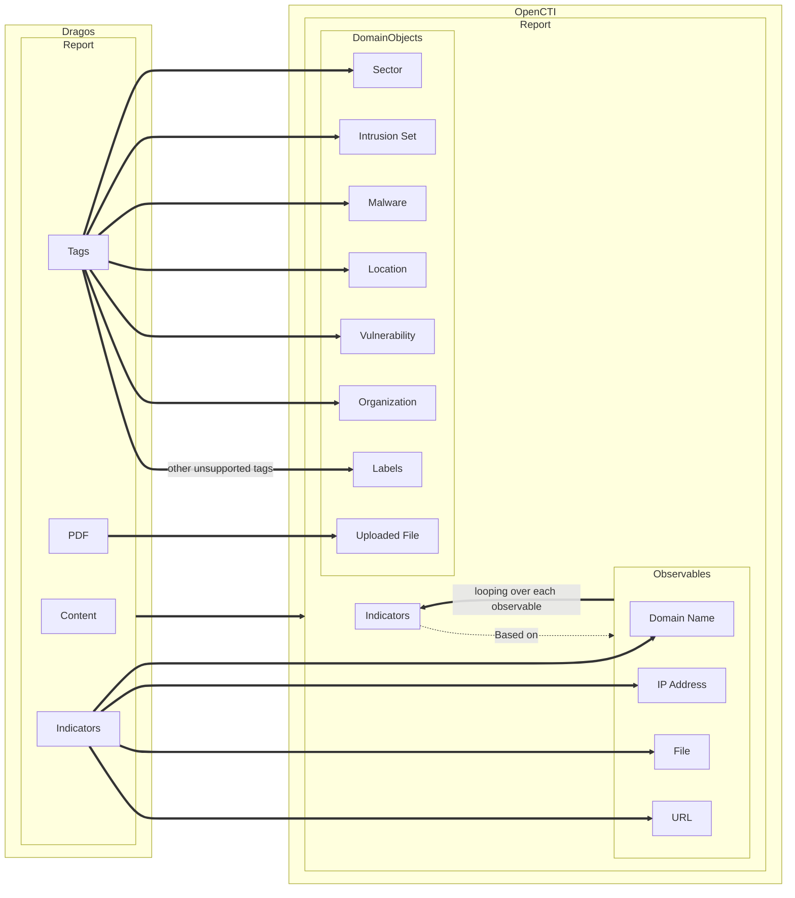

# Dragos OpenCTI Connector

| Status            | Date       | Comment |
| ----------------- |------------| ------- |
| Filigran Verified | 2025-04-22 |    -    |

## Table of Contents

- [Dragos OpenCTI Connector](#dragos-opencti-connector)
  - [Table of Contents](#table-of-contents)
  - [Introduction](#introduction)
  - [Quick Start](#quick-start)
  - [Behavior](#behavior)
  - [Installation](#installation)
    - [Requirements](#requirements)
  - [Configuration Variables](#configuration-variables)
    - [OpenCTI Environment Variables](#opencti-environment-variables)
    - [Base Connector Environment Variables](#base-connector-environment-variables)
    - [Connector Extra Parameters](#connector-extra-parameters)
  - [Additional Information](#additional-information)
    - [Architectural Decision Records (ADRs)](#architectural-decision-records-adrs)
    - [Fake Server](#fake-server)
    - [Geocoding](#geocoding)
      - [OpenCTI as a Geocoding Service](#opencti-as-a-geocoding-service)
        - [Supported Geolocation Types](#supported-geolocation-types)
    - [Unhandled Dragos tags](#unhandled-dragos-tags)
  - [Development](#development)
    - [Running the Connector Locally](#running-the-connector-locally)
    - [Commit](#commit)
    - [Linting and formatting](#linting-and-formatting)

## Introduction

The **Dragos OpenCTI Connector** is a plugin for the OpenCTI platform that enables ingestion of threat intelligence data from Dragos. It is designed to be straightforward to configure and supports a range of data types and formats.

**Dragos** is a cybersecurity company specializing in industrial control systems (ICS) and operational technology (OT) security. Their platform provides threat intelligence, incident response, and vulnerability management tailored to ICS/OT environments.

More information: [https://www.dragos.com/about/](https://www.dragos.com/about/)

> ⚠️ To use the connector, you'll need a valid Dragos API Token and Secret.  
> You can obtain them from your Dragos profile page:  
> [https://portal.dragos.com/#/profile](https://portal.dragos.com/#/profile)

## Quick Start

Here’s a high-level overview to get the connector up and running:

1. **Set environment variables**:
        - inside `docker-compose.yml`
2. **Pull and run the connector** using Docker:
        ```bash
        docker compose up -d
        ```

## Behavior



## Installation

### Requirements

- OpenCTI Platform version **6.6.6** or higher
- Docker & Docker Compose (for containerized deployment)
- Valid Dragos API credentials (token + secret)

## Configuration Variables

### OpenCTI Environment Variables

| Parameter       | config.yaml key | Docker Env Var  | Mandatory | Description                                |
| --------------- | --------------- | --------------- | --------- | ------------------------------------------ |
| OpenCTI URL     | `url`           | `OPENCTI_URL`   | ✅ Yes    | The URL of your OpenCTI instance.          |
| OpenCTI Token   | `token`         | `OPENCTI_TOKEN` | ✅ Yes    | The admin token from the OpenCTI platform. |

### Base Connector Environment Variables

| Parameter         | config.yaml key   | Docker Env Var              | Default                                | Mandatory | Description                                                              |
| ----------------- | ----------------- | --------------------------- | -------------------------------------- | --------- | ------------------------------------------------------------------------ |
| Connector ID      | `id`              | `CONNECTOR_ID`              | `5147f35a-4fe8-4f43-82c2-8158f0175000` | No        | A unique UUIDv4 for this connector instance.                             |
| Connector Name    | `name`            | `CONNECTOR_NAME`            | `Dragos`                               | No        | A human-readable name for this connector.                                |
| Connector Scope   | `scope`           | `CONNECTOR_SCOPE`           | `[dragos]`                             | No        | Defines what this connector imports (STIX type or MIME type).            |
| Log Level         | `log_level`       | `CONNECTOR_LOG_LEVEL`       | `error`                                 | No        | Logging verbosity: `debug`, `info`, `warn`, `error`.                     |
| Duration Period   | `duration_period` | `CONNECTOR_DURATION_PERIOD` | `PT1H`                                  | No        | Time interval between data pulls. ISO8601 format, e.g., `PT1H` or `P1D`. |

### Connector Extra Parameters

| Parameter         | config.yaml key     | Docker Env Var             | Default                     | Mandatory | Description                                                                                                                     |
| ----------------- | ------------------- | -------------------------- | --------------------------- | --------- | ------------------------------------------------------------------------------------------------------------------------------- |
| API Base URL      | `api_base_url`      | `DRAGOS_API_BASE_URL`      | `https://portal.dragos.com` | No        | The base URL for the Dragos API.                                                                                                |
| API Key           | `api_token`         | `DRAGOS_API_TOKEN`         | —                           | ✅ Yes    | The API key used to authenticate with the Dragos API.                                                                           |
| API Secret        | `api_secret`        | `DRAGOS_API_SECRET`        | —                           | ✅ Yes    | The API secret used alongside the API key.                                                                                      |
| Import Start Date | `import_start_date` | `DRAGOS_IMPORT_START_DATE` | `P30D`                      | No        | The start date for the first data pull (ISO8601 or duration format).                                                            |
| TLP Level         | `tlp_level`         | `DRAGOS_TLP_LEVEL`         | `amber+strict`              | No        | The TLP (Traffic Light Protocol) level for data being ingested. Valid values: `white`, `green`, `amber`, `amber+strict`, `red`. |

> 📅 The `import_start_date` can be formatted as a time zone aware datetime or as a duration (e.g., `1970-01-01T00:00:00+03:00` for January, 1st 1970 at 3AM in Timezon +3H or `P3D` for 3 days ago relative to NOW UTC).

## Additional Information

### Architectural Decision Records (ADRs)

see [doc/ADRs.md](doc/ADRs.md).

### Fake Server

The connector can be run against a fake server to simulate the Dragos API. This is useful for testing and development purposes.
See [client-api/README.md](client-api/README.md) for more information on how to set up and use the fake server.

### Geocoding

The Dragos platform uses specific tags to model geolocation data. These tags contain only the name of the geolocation, without specifying the type (e.g., "Country", "City"). To map this data into OpenCTI, a geocoding service is required to identify and relate geolocation names correctly.

#### OpenCTI as a Geocoding Service

We provide an adapter that allows the OpenCTI platform itself to be used as a geocoding service. This adapter searches for existing locations based on their names and aliases in the OpenCTI platform.

##### Supported Geolocation Types

- **Country**
- **City**
- **Region**
- **Position**

> ⚠️ Currently, the `Administrative-Area` geolocation type is **not supported** with this adapter.

### Unhandled Dragos tags

The connector currently does not handle the following Dragos tags:

- att&ck technique
- intel requirement
- temporary activity threat
- threattype
- technology
- protocol
- operating system
- vendor
- malware class

**They are not converted into OpenCTI entities.** As a fallback, they're currently stored as is as reports labels.

### Dragos indicators mapping

The connector maps the following indicator types to their OpenCTI observables counterparts:

- domain
- ip
- url

⚠️ The following indicator types are all mapped to OpenCTI _File_ observables:

- artifact
- md5
- sha1
- sha256

## Development

### Running the Connector Locally

The connector is designed to be run in a Docker container. However, if you want to run it locally for development purposes, you can do so by following these steps:

1/ Clone the connectors repository:
    ```bash
    git clone <repository-url>
    ```
2/ Navigate to the connector directory
    ```bash
    cd external-import/dragos
    ```
3/ Ensure you are using a Python 3.12 version
4/ Install the required dependencies:
    ```bash
    pip install -e .[dev,test]
    ```
    (for legacy purposes, you can also use `pip install -r requirements.txt` that is in editable mode.)
5/ Set the required variables:
    In your shell:
    ```bash
        export OPENCTI_URL=<your_opencti_url>
        ...
    ```
    OR sourcing a `.env` file:
    ```bash
        source .env
    ```
    OR creating a "config.yml" file at the root of the project:
    ```yaml
        opencti:
            url: <your_opencti_url>
        ...
    ```
6/ Run the connector:
    ```bash
        python main.py
    ```

### Commit

Note: Your commits must be signed using a GPG key. Otherwise, your Pull Request will be rejected.

### Linting and formatting

Added to the connectors linteing and formatting rules, this connector is developped and checked using ruff and mypy to ensure the code is type-checked and linted.
The dedicated configurations are set in the `pyproject.toml` file.
You can run the following commands to check the code:

```bash
    python -m ruff check .
    python -m mypy .
```
