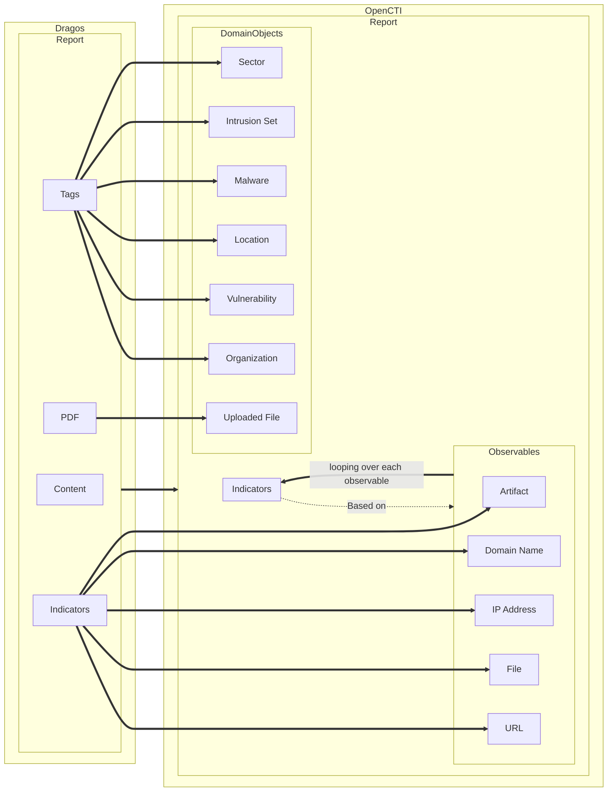

# Dragos OpenCTI Connector

## Table of Contents

- [Dragos OpenCTI Connector](#dragos-opencti-connector)
    - [Introduction](#introduction)
    - [Quick Start](#quick-start)
    - [Behavior](#behavior)
    - [Installation](#installation)
        - [Requirements](#requirements)
    - [Configuration Variables](#configuration-variables)
        - [OpenCTI Environment Variables](#opencti-environment-variables)
        - [Base Connector Environment Variables](#base-connector-environment-variables)
        - [Connector Extra Parameters](#connector-extra-parameters)
    - [Additional Information](#additional-information)
        - [Fake Server](#fake-server)
        - [Geocoding](#geocoding)

## Introduction

The **Dragos OpenCTI Connector** is a plugin for the OpenCTI platform that enables ingestion of threat intelligence data from Dragos. It is designed to be straightforward to configure and supports a range of data types and formats.

**Dragos** is a cybersecurity company specializing in industrial control systems (ICS) and operational technology (OT) security. Their platform provides threat intelligence, incident response, and vulnerability management tailored to ICS/OT environments.

More information: [https://www.dragos.com/about/](https://www.dragos.com/about/)

> ⚠️ To use the connector, you'll need a valid Dragos API Token and Secret.  
> You can obtain them from your Dragos profile page:  
> [https://portal.dragos.com/#/profile](https://portal.dragos.com/#/profile)

## Quick Start

Here’s a high-level overview to get the connector up and running:

1. **Set environment variables**:
        - In a `.env` file
        - Inside `docker-compose.yml`
2. **Pull and run the connector** using Docker:
        ```bash
        docker compose up -d
        ```

> 💡 You must align the `pycti` version in `requirements.txt` with your OpenCTI platform version (e.g., `pycti==6.6.6`).

## Behavior



## Installation

### Requirements

- OpenCTI Platform version **6.6.6** or higher
- Python == 3.12 (for local development)
- Docker & Docker Compose (for containerized deployment)
- Valid Dragos API credentials (token + secret)

## Configuration Variables

The connector can be configured using:

- Direct environment variables

```shell
export ENV_VAR_NAME="..."
```

- A `.env` file

```shell
export $(grep -v '^#' .env | xargs -d '\n')
```

- The `environment:` block in `docker-compose.yml`

You can also use a `config.yaml` file to set the configuration variables.

config.yaml should be composed of 2 levels keys/value such as
```yaml
connector: 
    id: "..."
```
you can then alter the `main.py` file to load the config.yaml using the dedicated adapter:

```python 
from dragos.adapters.config import ConfigLoaderYaml

config = ConfigLoaderYaml("path/to/config.yaml")
```

### OpenCTI Environment Variables

| Parameter     | config.yaml key | Docker Env Var     | Mandatory | Description                                      |
|---------------|------------------|---------------------|-----------|--------------------------------------------------|
| OpenCTI URL   | `url`            | `OPENCTI_URL`       | ✅ Yes    | The URL of your OpenCTI instance.               |
| OpenCTI Token | `token`          | `OPENCTI_TOKEN`     | ✅ Yes    | The admin token from the OpenCTI platform.      |

### Base Connector Environment Variables

| Parameter         | config.yaml key      | Docker Env Var               | Default         | Mandatory | Description                                                                 |
|------------------|----------------------|-------------------------------|-----------------|-----------|-----------------------------------------------------------------------------|
| Connector ID     | `id`                 | `CONNECTOR_ID`               | —               | ✅ Yes    | A unique UUIDv4 for this connector instance.                                 |
| Connector Name   | `name`               | `CONNECTOR_NAME`             | —               | ✅ Yes    | A human-readable name for this connector.                                  |
| Connector Scope  | `scope`              | `CONNECTOR_SCOPE`            | —               | ✅ Yes    | Defines what this connector imports (STIX type or MIME type).              |
| Log Level        | `log_level`          | `CONNECTOR_LOG_LEVEL`        | -               | ✅ Yes    | Logging verbosity: `debug`, `info`, `warn`, `error`.                       |
| Duration Period  | `duration_period`    | `CONNECTOR_DURATION_PERIOD`  | —               | ✅ Yes    | Time interval between data pulls. ISO8601 format, e.g., `PT1H` or `P1D`.   |

### Connector Extra Parameters

| Parameter             | config.yaml key       | Docker Env Var              | Default  | Mandatory | Description                                                                 |
|-----------------------|-----------------------|----------------------------|----------|-----------|-----------------------------------------------------------------------------|
| API Base URL          | `api_base_url`        | `DRAGOS_API_BASE_URL`      | —        | ✅ Yes    | The base URL for the Dragos API.                                            |
| API Key               | `api_token`           | `DRAGOS_API_TOKEN`         | —        | ✅ Yes    | The API key used to authenticate with the Dragos API.                       |
| API Secret            | `api_secret`          | `DRAGOS_API_SECRET`        | —        | ✅ Yes    | The API secret used alongside the API key.                                  |
| Import Start Date     | `import_start_date`   | `DRAGOS_IMPORT_START_DATE` | —        | ✅ Yes    | The start date for the first data pull (ISO8601 or duration format).        |
| TLP Level             | `tlp_level`           | `DRAGOS_TLP_LEVEL`         | —        | ✅ Yes    | The TLP (Traffic Light Protocol) level for data being ingested. Valid values: `white`, `green`, `amber`, `amber+strict`, `red`. |

> 📅 The `import_start_date` can be formatted as a date (ISO8601) or as a duration (e.g., `PT3D` for 3 days ago).


## Additional Information

### Fake Server
The connector can be run against a fake server to simulate the Dragos API. This is useful for testing and development purposes.
See [client-api/README.md](client-api/README.md) for more information on how to set up and use the fake server.

### Geocoding

The Dragos platform uses specific tags to model geolocation data. These tags contain only the name of the geolocation, without specifying the type (e.g., "Country", "City"). To map this data into OpenCTI, a geocoding service is required to identify and relate geolocation names correctly.

#### OpenCTI as a Geocoding Service

We provide an adapter that allows the OpenCTI platform itself to be used as a geocoding service. This adapter searches for existing locations based on their names and aliases in the OpenCTI platform.

##### Supported Geolocation Types:
- **Country**
- **City**
- **Region**
- **Position**

> ⚠️ Currently, the `Administrative-Area` geolocation type is **not supported** with this adapter.
