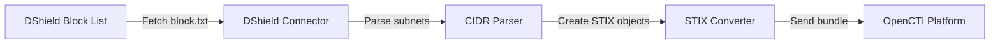

# OpenCTI DShield Connector

| Status | Date | Comment |
|--------|------|---------|
| Community | -    | -       |

## Introduction

The DShield connector imports threat intelligence from the [DShield.org](https://www.dshield.org/) Recommended Block List into OpenCTI. DShield is maintained by the Internet Storm Center (ISC) at SANS Institute and aggregates firewall logs from distributed sensors worldwide to identify the most aggressive attacking IP subnets.

### Key Features

- **Curated Block List**: Imports the top attacking Class C (/24) subnets observed over the past three days
- **Community-Sourced Intelligence**: Aggregates reports from thousands of distributed intrusion detection systems
- **Automatic STIX Conversion**: Converts subnet data into STIX 2.1 Indicators
- **Configurable TLP Marking**: Apply appropriate TLP level to imported data

### Useful Links

- DShield Feeds: https://feeds.dshield.org/block.txt
- DShield Information: https://www.dshield.org/howto.html
- Internet Storm Center: https://isc.sans.edu/

---

## Installation

### Requirements

| Requirement          | Description                           |
|----------------------|---------------------------------------|
| OpenCTI Platform     | Version 6.7.7 or higher              |
| Network Access       | Access to feeds.dshield.org          |

---

## Configuration variables

Below are the parameters you'll need to set for OpenCTI, the connector, and DShield-specific settings.

### OpenCTI API Connection

| Parameter      | config.yml | Docker Environment Variable | Mandatory | Description                          |
|----------------|------------|----------------------------|-----------|--------------------------------------|
| OpenCTI URL    | url        | `OPENCTI_URL`              | Yes       | URL of the OpenCTI platform         |
| OpenCTI Token  | token      | `OPENCTI_TOKEN`            | Yes       | API token for the OpenCTI platform  |

### Base Connector Configuration

| Parameter              | config.yml         | Docker Environment Variable     | Default | Mandatory | Description                                              |
|------------------------|--------------------|---------------------------------|---------|-----------|----------------------------------------------------------|
| Connector ID           | id                 | `CONNECTOR_ID`                  |         | Yes       | Unique identifier for this connector (UUIDv4)           |
| Connector Name         | name               | `CONNECTOR_NAME`                | dshield | Yes       | Name of the connector instance                           |
| Connector Scope        | scope              | `CONNECTOR_SCOPE`               | dshield | Yes       | Connector scope                                          |
| Log Level              | log_level          | `CONNECTOR_LOG_LEVEL`           | info    | No        | Log verbosity: `debug`, `info`, `warn`, `error`         |
| Duration Period        | duration_period    | `CONNECTOR_DURATION_PERIOD`     | P1D     | Yes       | Interval between runs in ISO 8601 format (e.g., `PT30M`) |
| Run and Terminate      | run_and_terminate  | `CONNECTOR_RUN_AND_TERMINATE`   | False   | No        | Run once and exit if set to `True`                       |

### DShield Connector Configuration

| Parameter        | config.yml | Docker Environment Variable | Default                              | Mandatory | Description                                                                         |
|------------------|------------|----------------------------|--------------------------------------|-----------|------------------------------------------------------------------------------------|
| DShield Base URL | base_url   | `DSHIELD_API_BASE_URL`     | https://feeds.dshield.org/block.txt | Yes       | URL of the DShield block list                                                      |
| TLP Level        | tlp_level  | `DSHIELD_TLP_LEVEL`        | clear                                | No        | TLP marking: `clear`, `white`, `green`, `amber`, `amber+strict`, `red`            |

---

## Deployment

### Docker Deployment

Build a Docker image using the provided Dockerfile:

```bash
docker build -t opencti/connector-dshield:latest .
```

Example `docker-compose.yml`:

```yaml
version: '3'
services:
  connector-dshield:
    image: opencti/connector-dshield:latest
    environment:
      - OPENCTI_URL=http://localhost:8080
      - OPENCTI_TOKEN=ChangeMe
      - CONNECTOR_ID=ChangeMe
      - CONNECTOR_NAME=DShield
      - CONNECTOR_SCOPE=dshield
      - CONNECTOR_LOG_LEVEL=info
      - CONNECTOR_DURATION_PERIOD=P1D
      - DSHIELD_API_BASE_URL=https://feeds.dshield.org/block.txt
      - DSHIELD_TLP_LEVEL=clear
    restart: always
```

Start the connector:

```bash
docker compose up -d
```

### Manual Deployment

1. Clone the connector repository
2. Navigate to the connector directory:

```bash
cd external-import/dshield
```

3. Create a virtual environment and install dependencies:

```bash
python3 -m venv venv
source venv/bin/activate
pip3 install -r requirements.txt
```

4. Create a `config.yml` from `config.yml.sample` and configure variables
5. Run the connector from the `src` directory:

```bash
python3 main.py
```

---

## Usage

After installation, the connector runs automatically at the interval specified by `CONNECTOR_DURATION_PERIOD`. To force an immediate sync:

1. Navigate to **Data management → Ingestion → Connectors** in OpenCTI
2. Find the **DShield** connector
3. Click the refresh button to reset state and trigger a new poll

---

## Behavior

### Data Flow



### Entity Mapping

| DShield Data          | OpenCTI Entity Type | Notes                                            |
|-----------------------|--------------------|--------------------------------------------------|
| Subnet Entry          | Indicator          | STIX pattern: `[ipv4-addr:value = 'x.x.x.x/24']` |
| DShield.org           | Identity           | Organization author for all indicators          |
| TLP Marking           | Marking Definition | Applied to all imported indicators              |

### Data Format

The DShield block list is a tab-separated text file with the following schema:

| Column  | Description                                    |
|---------|------------------------------------------------|
| IP      | Start IP address of the subnet                 |
| Attacks | Number of attacking targets                    |
| Netmask | CIDR prefix length (typically /24)             |

Example raw data:

```
# DShield.org Recommended Block List
# Site: https://feeds.dshield.org
# updated: 2025-01-05 00:00:00
#
# Start	Attacks	Netmask
1.2.3.0	100	24
5.6.7.0	95	24
```

### Processing Details

1. **Fetch Block List**:
   - Downloads the latest block list from DShield feed URL
   - Skips comment lines (starting with `#`) and empty lines

2. **Parse Subnet Entries**:
   - Extracts IP address and netmask from each line
   - Constructs CIDR notation (e.g., `1.2.3.0/24`)

3. **Create STIX Indicators**:
   - Generates Indicator with IPv4 pattern for each subnet
   - Sets `x_opencti_main_observable_type` to `IPv4-Addr`
   - Applies configured TLP marking

4. **Author Identity**:
   - Creates "DShield.org" organization identity
   - All indicators reference this author

### Indicator Properties

Each imported indicator contains:

| Property           | Value                                              |
|--------------------|----------------------------------------------------|
| Name               | `DShield Block List: {subnet}`                    |
| Pattern            | `[ipv4-addr:value = '{subnet}']`                  |
| Pattern Type       | `stix`                                             |
| Main Observable    | `IPv4-Addr`                                        |
| Created By         | DShield.org                                        |
| Object Marking     | Configured TLP level                              |

### State Management

The connector maintains state for operational tracking:

| State Key  | Description                           |
|------------|---------------------------------------|
| `last_run` | Timestamp of last successful run      |

> **Note**: The DShield block list is refreshed daily with the top attacking subnets from the past three days.

---

## Debugging

### Common Issues

| Issue                     | Solution                                            |
|---------------------------|-----------------------------------------------------|
| Connection refused        | Verify network access to feeds.dshield.org          |
| Empty data imported       | Check if the feed URL is accessible                 |
| Invalid TLP level         | Use valid values: `clear`, `green`, `amber`, `red` |

### Logging

To enable detailed logging, set `CONNECTOR_LOG_LEVEL=debug` in your configuration.

---

## Additional Information

### About DShield

The DShield Recommended Block List identifies the 20 most aggressive /24 subnets based on:

- Number of unique attacking sources
- Number of unique targets attacked
- Attack persistence over time

### Alternative Feed URL

You can use the alternative URL if the primary is unavailable:

```
https://isc.sans.edu/block.txt
```

### Resources

- [DShield Sensor Setup](https://www.dshield.org/howto.html)
- [Internet Storm Center Diary](https://isc.sans.edu/diary/)
- [SANS Technology Institute](https://www.sans.edu/)
