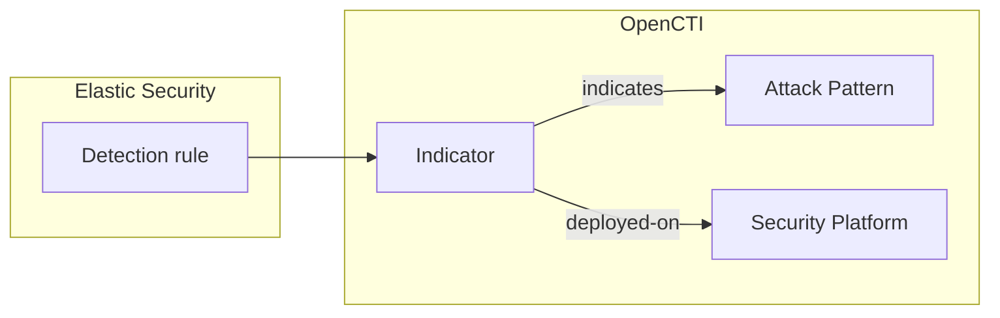

# OpenCTI Elastic Security Detection Rules Connector

| Status              | Date | Comment |
|---------------------|------|---------|
| Filigran Maintained | -    | -       |

Table of Contents

- [OpenCTI Elastic Security Detection Rules Connector](#opencti-elastic-security-detection-rules-connector)
  - [Introduction](#introduction)
  - [Installation](#installation)
    - [Requirements](#requirements)
    - [Permissions in Elastic Security](#permissions-in-elastic-security)
  - [Configuration variables](#configuration-variables)
  - [Deployment](#deployment)
    - [Docker Deployment](#docker-deployment)
    - [Manual Deployment](#manual-deployment)
  - [Usage](#usage)
  - [Behavior](#behavior)
    - [Entity mapping](#entity-mapping)
    - [Deployment status and reconciliation](#deployment-status-and-reconciliation)
    - [ATT&CK techniques](#attck-techniques)
    - [The deployed-on relationship](#the-deployed-on-relationship)
  - [Debugging](#debugging)
  - [Additional information](#additional-information)

## Introduction

This connector imports the detection rules deployed in [Elastic Security](https://www.elastic.co/security)
(the Kibana detection engine) into OpenCTI. Each rule becomes an Indicator whose pattern is the rule
query, linked to the MITRE ATT&CK techniques the rule detects and recorded as deployed on the Elastic
Security platform with its current status.

Together with the other deployed-rule importers (Microsoft Sentinel, Splunk, CrowdStrike Falcon, Google
SecOps), it feeds the detection layer of the OpenCTI Threat-Informed Defense Matrix: for each technique
used by the threats you track, which rules exist, where they run, and whether they are enabled.

The connector is read-only on the Elastic side: it only lists rules, and never creates, modifies,
enables or disables one.

## Installation

### Requirements

- OpenCTI Platform >= 7.261002.0 for the `deployed-on` relationship and the rule metadata properties.
  Older platforms are supported: deployments are then recorded as `related-to` relationships (see
  [The deployed-on relationship](#the-deployed-on-relationship)).
- `pycti==7.261002.0` and the connectors SDK (`src/requirements.txt`).
- Kibana 8.x or later (or Elastic Cloud Serverless) reachable from the connector.

### Permissions in Elastic Security

The connector authenticates with an Elasticsearch API key (`Authorization: ApiKey <key>`, the base64
encoded `id:api_key` value shown when the key is created). The key needs read access to Security
detection rules in the target Kibana space: the Kibana feature privilege
`Security > Rules and Exceptions: Read` (`Security: Read` on versions without sub-feature privileges).
No Elasticsearch index privilege and no write privilege are required.

## Configuration variables

Find all the configuration variables available here: [Connector Configurations](./__metadata__/CONNECTOR_CONFIG_DOC.md)

_The `opencti` and `connector` options in the `docker-compose.yml` and `config.yml` are the same as for any other connector.
For more information regarding variables, please refer to [OpenCTI's documentation on connectors](https://docs.opencti.io/latest/deployment/connectors/)._

Connector-specific variables:

| Docker environment variable | `config.yml` key | Required | Default | Description |
|---|---|---|---|---|
| `ELASTIC_DETECTION_RULES_KIBANA_URL` | `elastic_detection_rules.kibana_url` | Yes | | Base URL of Kibana, without the space prefix. |
| `ELASTIC_DETECTION_RULES_API_KEY` | `elastic_detection_rules.api_key` | Yes | | Encoded Elasticsearch API key. |
| `ELASTIC_DETECTION_RULES_SPACE_ID` | `elastic_detection_rules.space_id` | No | default space | Kibana space holding the rules. |
| `ELASTIC_DETECTION_RULES_RULE_FILTER` | `elastic_detection_rules.rule_filter` | No | | KQL filter on rule attributes passed to the `_find` API, e.g. `alert.attributes.tags:"Production"`. |
| `ELASTIC_DETECTION_RULES_IMPORT_DISABLED_RULES` | `elastic_detection_rules.import_disabled_rules` | No | `true` | Import disabled rules with the status `deployed`. When `false`, disabled rules are left out (and count as removed). |
| `ELASTIC_DETECTION_RULES_PAGE_SIZE` | `elastic_detection_rules.page_size` | No | `100` | Rules per page (1-1000). |
| `ELASTIC_DETECTION_RULES_REQUEST_TIMEOUT` | `elastic_detection_rules.request_timeout` | No | `60` | Timeout of each HTTP request, in seconds. |
| `ELASTIC_DETECTION_RULES_MAX_RETRIES` | `elastic_detection_rules.max_retries` | No | `5` | Retries on 429, 5xx and network errors, with exponential backoff honoring `Retry-After`. |
| `ELASTIC_DETECTION_RULES_VERIFY_SSL` | `elastic_detection_rules.verify_ssl` | No | `true` | Verify the TLS certificate of Kibana. |
| `ELASTIC_DETECTION_RULES_PLATFORM_NAME` | `elastic_detection_rules.platform_name` | No | `Elastic Security` | Name of the Security Platform in OpenCTI. Use one name per Elastic deployment. |
| `ELASTIC_DETECTION_RULES_PLATFORM_TYPE` | `elastic_detection_rules.platform_type` | No | `SIEM` | `security_platform_type` of that platform: `SIEM`, `EDR`, `XDR`, `SOAR`, `NDR` or `ISPM`. |
| `ELASTIC_DETECTION_RULES_TLP_LEVEL` | `elastic_detection_rules.tlp_level` | No | `amber` | TLP marking of every imported object. |

The connector runs every `CONNECTOR_DURATION_PERIOD` (default `PT6H`); every run reads the full rule set.

## Deployment

### Docker Deployment

Build a Docker Image using the provided `Dockerfile`:

```shell
docker build . -t opencti/connector-elastic-detection-rules:latest
```

Set the environment variables in `docker-compose.yml` (at least `OPENCTI_URL`, `OPENCTI_TOKEN`,
`CONNECTOR_ID`, `ELASTIC_DETECTION_RULES_KIBANA_URL` and `ELASTIC_DETECTION_RULES_API_KEY`), then:

```shell
docker compose up -d
```

### Manual Deployment

Create `config.yml` from `config.yml.sample` and fill in the `ChangeMe` values. Then, in a virtual
environment:

```shell
cd src
pip3 install -r requirements.txt
python3 main.py
```

`entrypoint.sh` starts the connector the same way from `/opt/opencti-connector-elastic-detection-rules`.

## Usage

The connector runs on its schedule. To trigger a run immediately, go to **Data management ->
Ingestion -> Connectors**, open the connector and reset its state: the next run happens right away and
re-reads every rule.

## Behavior



### Entity mapping

| Elastic Security rule | OpenCTI |
|---|---|
| `query` | Indicator `pattern` |
| `language` (`kuery`, `lucene`, `eql`, `esql`) | Indicator `pattern_type`: `kuery`, `lucene`, `eql`, `esql` |
| `name`, `description` | Indicator `name`, `description` |
| `created_at` (or `updated_at`) | Indicator `valid_from` |
| `severity` (`low`, `medium`, `high`, `critical`) | Indicator `x_opencti_rule_level` |
| `OS: Windows` / `OS: Linux` / `OS: macOS` tags | Indicator `x_mitre_platforms`; with a single OS, `x_opencti_rule_logsource.product` |
| `rule_id` | External reference `external_id`, `deployed-on` `external_id` |
| Rule page in Kibana | External reference `url` |
| `threat[]` (MITRE ATT&CK framework) techniques and sub-techniques | `indicates` relationships to Attack Patterns |
| `enabled` | `deployed-on` `deployment_status`: `active` (enabled) or `deployed` (disabled) |

Machine learning rules have no query and are not imported. Every object carries the `Elastic` author and
the configured TLP marking. The Security Platform identity (`identity_class: securityplatform`) is named
after `ELASTIC_DETECTION_RULES_PLATFORM_NAME`.

### Deployment status and reconciliation

Every run reads all the rules and sends, for each one, its Indicator and its deployment with
`last_sync_at` set to the time of the run and `deployed_at` to the rule creation time. The connector
state keeps the Indicator of every rule imported by the previous run, so that:

- a rule deleted since the previous run (or no longer selected by the filter) gets the status `removed`
  and a `removed_at` time;
- a rule whose query changed gets a new Indicator; the Indicator of the previous query gets the status
  `removed`.

A removed rule whose Indicator was deleted from OpenCTI in the meantime is skipped. If OpenCTI cannot be
asked whether the Indicator still exists, the removal is retried on the next run.

### ATT&CK techniques

Each technique and sub-technique of the rule's MITRE ATT&CK threat mapping gives an `indicates`
relationship from the rule Indicator to the Attack Pattern whose id is derived from the MITRE id
(`T1059`, `T1059.001`), which is the id of the technique imported by the MITRE ATT&CK connector. Once
per run, OpenCTI is asked which techniques it already holds: those are referenced as they are and never
renamed or re-attributed. A technique OpenCTI does not hold yet is created under the name Elastic gives
it.

### The deployed-on relationship

The `deployed-on` relationship (Indicator -> Security Platform) and its `deployment_status`,
`external_id`, `deployed_at`, `last_sync_at` and `removed_at` properties are defined by the OpenCTI
dissemination assurance feature
([OpenCTI-Platform/opencti#18680](https://github.com/OpenCTI-Platform/opencti/issues/18680)). Once per
run, the connector checks the relationship schema of the platform (`schemaRelationsTypesMapping`). When
`deployed-on` is not defined between an Indicator and a Security Platform, it records each deployment as
a `related-to` relationship described as `Deployed on <platform> (status: <status>, rule id: <rule_id>)`
instead, and logs one warning per run.

## Debugging

Set `CONNECTOR_LOG_LEVEL=debug` for verbose logs. Each run ends with a summary log: rules read, active,
disabled, removed, techniques linked, rules left out per reason (`machine_learning`, `no_query`,
`disabled`, `duplicate`, `invalid`) and the relationship used for deployments. Requests that fail with a
rate limit, a server error or a network error are logged with the delay before the next attempt.

## Additional information

- Kibana detection engine API: [Find detection rules](https://www.elastic.co/docs/api/doc/kibana/operation/operation-findrules).
- One connector instance reads one Kibana space; deploy one instance per space (with distinct
  `CONNECTOR_ID` and, when the spaces are distinct deployments, distinct `ELASTIC_DETECTION_RULES_PLATFORM_NAME`).
