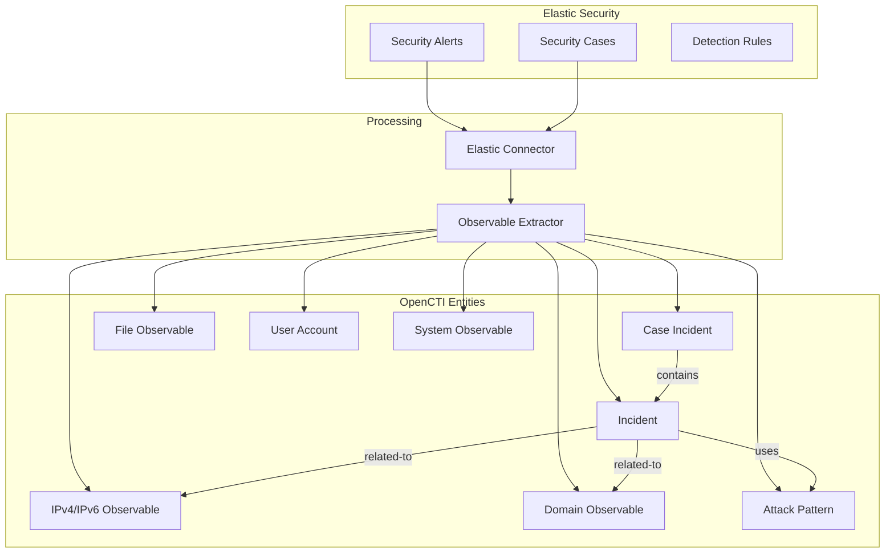

# OpenCTI Elastic Security Incidents Connector

| Status | Date | Comment |
|--------|------|---------|
| Filigran Verified | -    | -       |

## Table of Contents

- [Introduction](#introduction)
- [Installation](#installation)
  - [Requirements](#requirements)
- [Configuration](#configuration)
  - [Configuration Variables](#configuration-variables)
- [Deployment](#deployment)
  - [Docker Deployment](#docker-deployment)
  - [Manual Deployment](#manual-deployment)
- [Behavior](#behavior)
  - [Data Flow](#data-flow)
  - [Entity Mapping](#entity-mapping)
- [Debugging](#debugging)
- [Additional Information](#additional-information)

---

## Introduction

This connector imports security alerts and cases from Elastic Security into OpenCTI as incidents and case incidents. It enables bidirectional visibility between your SIEM and threat intelligence platform, automatically extracting and linking observables, attack patterns, and other entities from Elastic Security data.

### Features

- **Alert Import**: Imports Elastic Security alerts as OpenCTI Incidents
- **Case Import**: Imports Elastic Security cases as OpenCTI Case Incidents
- **Knowledge Graph**: Automatically extracts and links entities from alerts:
  - IP addresses, Domain names, URLs
  - File hashes, Process information
  - User accounts, Host systems
  - MITRE ATT&CK techniques
- **Incremental Import**: Tracks last run time to avoid duplicates
- **Flexible Filtering**: Configure which alert/case statuses to import

---

## Installation

### Requirements

- OpenCTI Platform >= 6.0.0
- Elasticsearch Cluster version 8.x or higher with Security features enabled
- API Key with permissions for:
  - Reading security alerts (`.alerts-security.alerts-*` index)
  - Reading cases via Kibana API
  - Reading detection rules (optional, for enrichment)
- Kibana Access (required for Cases API)

---

## Configuration

### Configuration Variables

#### OpenCTI Parameters

| Parameter | Docker envvar | Mandatory | Description |
|-----------|---------------|-----------|-------------|
| OpenCTI URL | `OPENCTI_URL` | Yes | The URL of the OpenCTI platform |
| OpenCTI Token | `OPENCTI_TOKEN` | Yes | The OpenCTI API token |

#### Base Connector Parameters

| Parameter | Docker envvar | Mandatory | Default | Description |
|-----------|---------------|-----------|---------|-------------|
| Connector ID | `CONNECTOR_ID` | Yes | - | A unique `UUIDv4` for this connector |
| Connector Name | `CONNECTOR_NAME` | No | `Elastic Security Incidents` | Name displayed in OpenCTI |
| Duration Period | `CONNECTOR_DURATION_PERIOD` | No | `PT30M` | Polling interval (ISO-8601 format) |

#### Connector Extra Parameters

| Parameter | Docker envvar | Mandatory | Default | Description |
|-----------|---------------|-----------|---------|-------------|
| Elastic URL | `ELASTIC_SECURITY_URL` | Yes | - | Elasticsearch cluster URL |
| API Key | `ELASTIC_SECURITY_API_KEY` | Yes | - | API key for Elasticsearch |
| Verify SSL | `ELASTIC_SECURITY_VERIFY_SSL` | No | `true` | Verify SSL certificates |
| CA Certificate | `ELASTIC_SECURITY_CA_CERT` | No | - | Path to CA certificate file |
| Import Start Date | `ELASTIC_SECURITY_IMPORT_START_DATE` | No | 7 days ago | Initial import start date |
| Import Alerts | `ELASTIC_SECURITY_IMPORT_ALERTS` | No | `true` | Import security alerts |
| Import Cases | `ELASTIC_SECURITY_IMPORT_CASES` | No | `true` | Import security cases |
| Alert Statuses | `ELASTIC_SECURITY_ALERT_STATUSES` | No | (all) | Comma-separated alert statuses to import |
| Alert Rule Tags | `ELASTIC_SECURITY_ALERT_RULE_TAGS` | No | (all) | Filter alerts by rule tags |
| Case Statuses | `ELASTIC_SECURITY_CASE_STATUSES` | No | (all) | Comma-separated case statuses to import |

---

## Deployment

### Docker Deployment

```yaml
services:
  connector-elastic-security:
    image: opencti/connector-elastic-security-incidents:latest
    environment:
      - OPENCTI_URL=http://opencti:8080
      - OPENCTI_TOKEN=${OPENCTI_ADMIN_TOKEN}
      - CONNECTOR_ID=${CONNECTOR_ELASTIC_ID}
      - CONNECTOR_NAME=Elastic Security Incidents
      - CONNECTOR_DURATION_PERIOD=PT30M
      - ELASTIC_SECURITY_URL=https://elasticsearch:9200
      - ELASTIC_SECURITY_API_KEY=${ELASTIC_API_KEY}
      - ELASTIC_SECURITY_VERIFY_SSL=true
      - ELASTIC_SECURITY_IMPORT_ALERTS=true
      - ELASTIC_SECURITY_IMPORT_CASES=true
    restart: always
    depends_on:
      - opencti
```

Run: `docker-compose up -d`

### Manual Deployment

1. Install dependencies:
```bash
pip install -r src/requirements.txt
```

2. Set environment variables or create `config.yml`

3. Run:
```bash
python src/main.py
```

---

## Behavior

### Data Flow



### Entity Mapping

#### Alerts → Incidents

| Elastic Field | OpenCTI Field | Notes |
|---------------|---------------|-------|
| Rule name | Incident.name | Rule that triggered the alert |
| Rule description | Incident.description | With risk score and status |
| Risk score (0-100) | Incident.severity | Mapped to low/medium/high/critical |
| Rule tags | Incident.labels | Preserved as labels |
| Alert URL | External Reference | Link back to Elastic |

#### Cases → Case Incidents

| Elastic Field | OpenCTI Field | Notes |
|---------------|---------------|-------|
| Case title | Case Incident.name | - |
| Case description | Case Incident.description | With status and comments |
| Severity | Case Incident.priority | critical→P1, high→P2, medium→P3, low→P4 |
| Related alerts | Related Objects | Linked incidents |
| Case tags | Case Incident.labels | Preserved as labels |

#### Observable Extraction (ECS Fields)

| ECS Field Category | OpenCTI Observable | Examples |
|--------------------|-------------------|----------|
| Network | IPv4-Addr, IPv6-Addr, Domain-Name, URL | `source.ip`, `destination.ip`, `dns.question.name` |
| File | File (with hashes) | `file.hash.md5`, `file.hash.sha256` |
| Host | System | `host.name`, `host.os.name` |
| User | User-Account | `user.name` |
| Process | Process | `process.name`, `process.executable` |

### Scheduling

ISO-8601 duration format for `CONNECTOR_DURATION_PERIOD`:

| Value | Description |
|-------|-------------|
| `PT5M` | Every 5 minutes |
| `PT30M` | Every 30 minutes (default) |
| `PT1H` | Every hour |
| `P1D` | Once per day |

---

## Debugging

### Connection Issues

- Verify API key has necessary permissions
- Check Elasticsearch and Kibana accessibility
- For self-signed certificates, use `ELASTIC_SECURITY_VERIFY_SSL=false` (testing only)

### Missing Data

- Check status filters: `ELASTIC_SECURITY_ALERT_STATUSES` and `ELASTIC_SECURITY_CASE_STATUSES`
- Valid alert statuses: `open`, `acknowledged`, `closed`
- Valid case statuses: `open`, `in-progress`, `closed`
- Verify index patterns exist (`.alerts-security.alerts-*`)

### Performance

- Adjust `CONNECTOR_DURATION_PERIOD` based on volume
- Filter by specific statuses to reduce volume:
  - `ELASTIC_SECURITY_ALERT_STATUSES=open,acknowledged`
  - `ELASTIC_SECURITY_CASE_STATUSES=open,in-progress`

---

## Additional Information

### Use Cases

| Use Case | Description |
|----------|-------------|
| SIEM Integration | Sync SIEM alerts to threat intel platform |
| Incident Correlation | Link alerts to known threats/campaigns |
| Observable Enrichment | Enrich Elastic observables with CTI |
| Case Management | Track cases with threat context |

### Index Requirements

- `.alerts-security.alerts-*` - Security alerts index
- Kibana API access for cases
