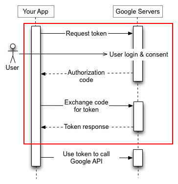

# Google workspace Email

* Last updated: May 7th, 2025
* See: <https://developers.google.com/identity/protocols/oauth2>

## Google Workspace Credentials Retrieval

1. Go to [Google Cloud Console](https://console.cloud.google.com/projectselector2/auth/clients).
2. Create a Project.
3. Create an OAuth Client ID:
   * Use **Application type**: Web Application.
   * Add a redirect URI: `http://localhost/`.
4. Download the `credentials.json` file.

> **Note**: If the project is not set as "internal," you need to set the application as "external" and add a test user:
>
> * Go to the [Audience section](https://console.cloud.google.com/auth/audience).
> * Add the user's email address under **Test Users**.

---

## Google Workspace Credentials Validation

You need to validate the `credentials.json` file manually to get a token. This must be done once. You can use the [pyioga](https://github.com/mbroton/pyioga/blob/main/README.md) tool for this:

```bash
python3 -m pip install pyioga
python3 -m pyioga init --client-secret-file {downloaded_credentials.json} --output-file {verified_token.json}
```

This will open your browser, prompt you to log in to your Google account, and request access for the application. Once completed, use the token present in the file `verified_token.json`.



> **Note**: This procedure may not work with the Firefox web browser. It works fine with Chrome and Microsoft Edge.

---

## Google Email IMAP Settings

Use the following configuration:

* **Host**: `imap.gmail.com`
* **Port**: `993`
* **Google Token JSON**: `{content of verified_token.json}`
