# 📬 Email Intel Microsoft Connector

| Status            | Date       | Comment |
|-------------------|------------|---------|
| Filigran Verified | 2025-05-09 | -       |

The **Email Intel Microsoft Connector** ingests cyber‑threat‑intelligence (CTI) reports received by **e‑mail** into
the OpenCTI platform.  
Using the Microsoft Graph API, it polls a dedicated Microsoft 365 / Exchange Online mailbox, transforms every message (
plus accepted attachments) into an OpenCTI **Report**, and tags it with the chosen TLP.

---

## 📖 Table of Contents

- [🧩 Introduction](#-introduction)
- [⚙️ Requirements](#-requirements)
- [🔧 Configuration](#-configuration)
    - [OpenCTI Configuration](#opencti-configuration)
    - [Base Connector Configuration](#base-connector-configuration)
    - [Email Intel Microsoft Configuration](#email-intel-microsoft-configuration)
- [🚀 Deployment](#-deployment)
    - [Docker Deployment](#docker-deployment)
    - [Manual Deployment](#manual-deployment)
    - [Dev Tools](#dev-tools)
- [📌 Usage](#-usage)
- [⚙️ Connector Behavior](#-connector-behavior)
- [🐞 Debugging](#-debugging)
- [📝 Additional Information](#-additional-information)

---

## 🧩 Introduction

This connector is designed for organisations that receive CTI intelligence via e‑mail.
It performs **read‑only** operations—messages stay untouched in the mailbox.

| Capability          | Notes                                                                                     |
|---------------------|-------------------------------------------------------------------------------------------|
| Microsoft Graph API | Client‑credential flow (`tenant_id`, `client_id`, `client_secret`).                       |
| Report creation     | `name` = subject, `type` = `threat‑report`, `published` = message date, `content` = body. |
| Attachment handling | Uploads files whose MIME type is in an allow‑list.                                        |
| TLP marking         | Applies configurable default (e.g. `amber+strict`).                                       |
| Stateful            | Persists `last_run`; supports relative look‑back for first import.                        |

---

## ⚙️ Requirements

- OpenCTI Platform ≥ 6.7 |
- Azure tenant - Microsoft 365 with Exchange Online |
- Azure AD app - Registered app with **`Mail.Read` (Application)** permission,
  *admin‑consented*                                                |
- Mailbox restriction [Application Access Policy](https://learn.microsoft.com/graph/auth-limit-mailbox-access) limiting
  access to the target mailbox |

---

## 🔧 Configuration

Configuration parameters can be provided in either **`.env`** file, **`config.yml`** file, or directly as **environment
variables**.

Priority: **YAML → .env → environment → defaults**.

### Microsoft Graph API

Microsoft Graph is the gateway to data and intelligence in Microsoft cloud services like Microsoft Entra and Microsoft

365. Use the wealth of data accessible through Microsoft Graph to build apps for organizations and consumers that
     interact with millions of users.

In order to fetch emails with the Graph API, we need to **set up** the environment as follows:

#### Register the Application & save `tenant_id`, `client_id` & `client_secret`

1. Open a browser and navigate to the [Azure Active Directory admin center](https://aad.portal.azure.com/) and log in
   with a **personal account** (Microsoft Account) or **Work or School Account**.
2. In the left-hand navigation choose **Applications**, then **App registrations** under **Manage**.  
   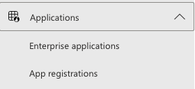
3. Click **New registration**.  
   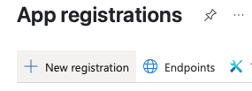
    1. Enter a name for your application, e.g. **`OpenCTI Email Intel`**.
    2. Set **Supported account types** to **Accounts in this organizational directory only**.
    3. Leave **Redirect URI** empty.
    4. Click **Register**.
4. On the application **Overview** page:  
   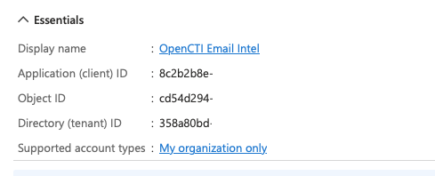
    1. Copy and save the **Application (client) ID** and **Directory (tenant) ID**.
5. Select **Certificates & secrets** under **Manage**.  
   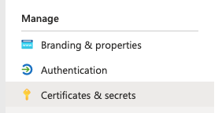
6. Click **New client secret**.  
   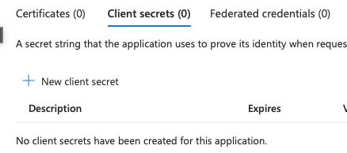
7. Fill in **Description**, pick an **Expires** value, and click **Add**.  
   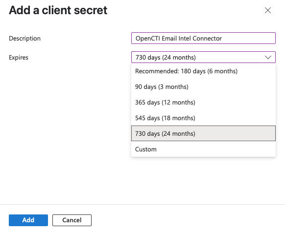
8. In **Certificates & secrets** copy and save the secret **Value**.  
   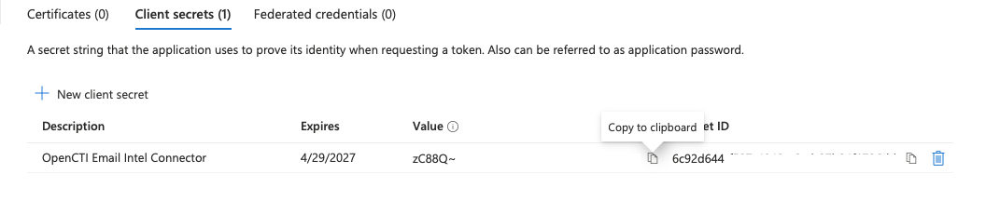

#### Set Up API Permission

1. Select **API permissions** under **Manage**.  
   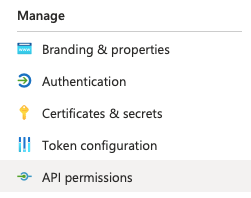
2. Remove the default **User.Read** permission under **Configured permissions** by clicking the ellipsis **…** and
   choosing **Remove permission**.  
   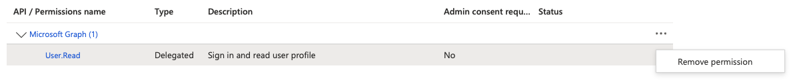
3. Click **Add a permission**.  
   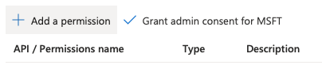
4. Choose **Microsoft Graph**.  
   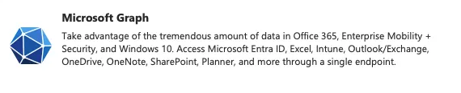
5. Select **Application permissions**.  
   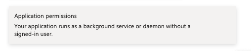
6. Search for and select **Mail.Read**, then click **Add permissions**.  
   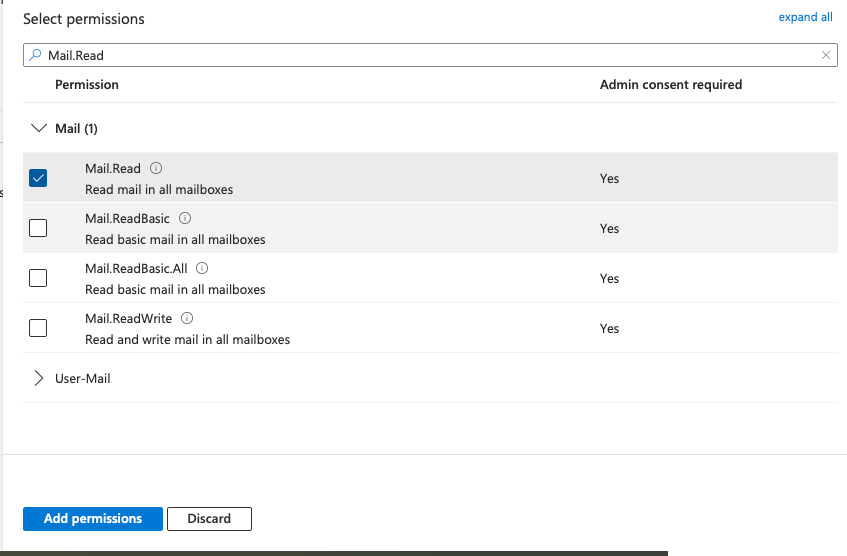
7. Click **Grant admin consent for `<organization>`** (or ask an admin to do it).  
   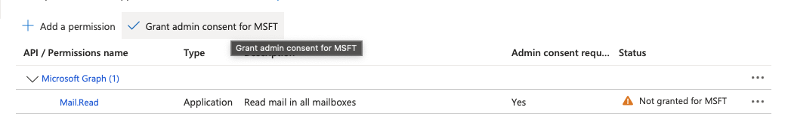
8. Confirm the consent by selecting **Yes**.  
   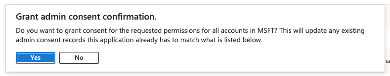
9. Ensure the status shows **Granted for `<organization>`**.  
   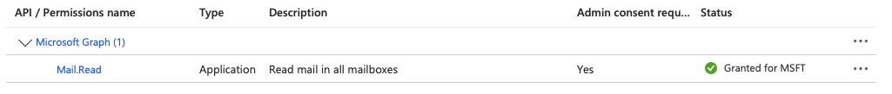

> ⚠️ **Warning**  
> Once application permissions are granted, the application has access to **all** mailboxes in the organization by
> default.  
> You must configure **application access policies** to restrict access to specific mailboxes.  
> 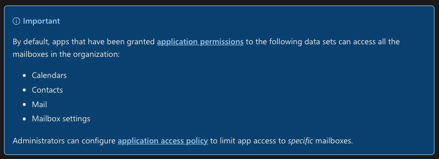

#### Limit mailbox access

*Source: <https://learn.microsoft.com/en-us/graph/auth-limit-mailbox-access>*

To restrict the app’s access to specific mailboxes, configure **Application Access Policies** using PowerShell.

1. **Install PowerShell 7+** and open a PowerShell window.  
   <https://learn.microsoft.com/en-us/powershell/scripting/install/installing-powershell?view=powershell-7.5>
2. **Connect to Exchange Online PowerShell**  
   <https://learn.microsoft.com/en-us/powershell/exchange/connect-to-exchange-online-powershell?view=exchange-ps&preserve-view=true>

    ```powershell
    Import-Module ExchangeOnlineManagement
    Connect-ExchangeOnline
    ```

3. **Create an ApplicationAccessPolicy (replace <client_id> and <email>):**

    ```powershell
    New-ApplicationAccessPolicy `
      -AppId <client_id> `
      -PolicyScopeGroupId <email> `
      -AccessRight RestrictAccess `
      -Description "Restrict this app to members of distribution group EvenUsers."
    ```

   Response:

   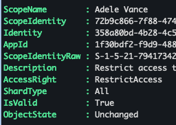

4. **Test the newly created application access policy**

   __Test with another email (replace placeholders):__:

   ```powershell
   Test-ApplicationAccessPolicy `
     -Identity <existing_email> `
     -AppId <client_id>
   ```
   

   __Test with the correct email:__

   ```powershell
   Test-ApplicationAccessPolicy `
     -Identity <email> `
     -AppId <client_id>
   ```
   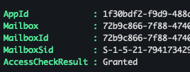

> ⚠️ **Warning**
>
> 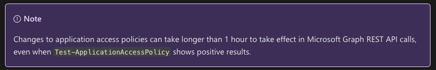

### OpenCTI Configuration

| Parameter     | `config.yml` key | Env var         | Required | Description                      |
|---------------|------------------|-----------------|----------|----------------------------------|
| OpenCTI URL   | `url`            | `OPENCTI_URL`   | ✅        | Base URL of the OpenCTI platform |
| OpenCTI Token | `token`          | `OPENCTI_TOKEN` | ✅        | API token (user or connector)    |

### Base Connector Configuration

| Parameter        | `config.yml` key  | Env var                     | Default               | Required | Description                                   |
|------------------|-------------------|-----------------------------|-----------------------|----------|-----------------------------------------------|
| Connector ID     | `id`              | `CONNECTOR_ID`              | —                     | ✅        | Unique **UUIDv4** for this connector instance |
| Connector Name   | `name`            | `CONNECTOR_NAME`            | Email Intel Microsoft | ❌        | Display name                                  |
| Connector Scope  | `scope`           | `CONNECTOR_SCOPE`           | email‑intel‑microsoft | ❌        | Import label shown in jobs                    |
| Log Level        | `log_level`       | `CONNECTOR_LOG_LEVEL`       | error                 | ❌        | `debug` \| `info` \| `warn` \| `error`        |
| Polling Interval | `duration_period` | `CONNECTOR_DURATION_PERIOD` | PT1H                  | ❌        | ISO‑8601 duration                             |

### Email Intel Microsoft Configuration

| Parameter          | `config.yml` key             | Env var                                            | Default                             | Required | Description                      |
|--------------------|------------------------------|----------------------------------------------------|-------------------------------------|----------|----------------------------------|
| Tenant ID          | `tenant_id`                  | `EMAIL_INTEL_MICROSOFT_TENANT_ID`                  | —                                   | ✅        | Azure AD **Directory ID**        |
| Client ID          | `client_id`                  | `EMAIL_INTEL_MICROSOFT_CLIENT_ID`                  | —                                   | ✅        | App **Application ID**           |
| Client Secret      | `client_secret`              | `EMAIL_INTEL_MICROSOFT_CLIENT_SECRET`              | —                                   | ✅        | App **Client Secret**            |
| Mailbox address    | `email`                      | `EMAIL_INTEL_MICROSOFT_EMAIL`                      | —                                   | ✅        | Email address                    |
| Folder             | `inbox`                      | `EMAIL_INTEL_MICROSOFT_INBOX`                      | Inbox                               | ❌        | Mail folder to poll              |
| TLP Level          | `tlp_level`                  | `EMAIL_INTEL_MICROSOFT_TLP_LEVEL`                  | amber+strict                        | ❌        | Default TLP marking              |
| Look‑back window   | `relative_import_start_date` | `EMAIL_INTEL_MICROSOFT_RELATIVE_IMPORT_START_DATE` | P30D                                | ❌        | How far back the first run looks |
| Allowed MIME types | `attachments_mime_types`     | `EMAIL_INTEL_MICROSOFT_ATTACHMENTS_MIME_TYPES`     | application/pdf,text/csv,text/plain | ❌        | Accepted attachment file type    |

---

## 🚀 Deployment

### Docker Deployment

1. Build the Docker image:

```bash
docker build -t opencti/connector-email-intel-microsoft:latest .
```

2. Run using Docker Compose:

Copy the `.env.sample` file to `.env` and set the required environment variables.

```bash
docker compose up -d
# -d for detached mode
```

### Manual Deployment

```bash
python3.12 -m venv venv && source venv/bin/activate
pip install -r src/requirements.txt   # or dev-requirements.txt
cp config.yml.sample config.yml       # edit values
# or .env.sample .env
python3 src/main.py
```

### Dev Tools

```bash
pylint .
mypy .
```

---

## 📌 Usage

After deployment, the connector:

- Polls the configured mailbox at the interval defined in `CONNECTOR_DURATION_PERIOD`
- On first run, fetches emails received within the period defined by `RELATIVE_IMPORT_START_DATE`
- Each fetched email is transformed into an OpenCTI report:
    - `name`: Email subject
        - If the subject is empty, a default name is generated as follow `<no subject> from <sender@email.com>` where
          `<sender@email.com>` is the email address of the sender.
    - `type`: `threat-report`
    - `published`: Email date
    - `x_opencti_content`: Full email body (unparsed)
    - `x_opencti_files` : List of attachments (if any) depending on the `attachments_mime_types` parameter.

---

## ⚙️ Connector Behavior

| Step | Action                                                                                                                                                                                                                                                                                             |
|------|----------------------------------------------------------------------------------------------------------------------------------------------------------------------------------------------------------------------------------------------------------------------------------------------------|
| 1    | **Authenticate** to Microsoft Graph with client credentials.                                                                                                                                                                                                                                       |
| 2    | **Fetch messages** newer than the stored cursor, or within the look‑back window on first run.                                                                                                                                                                                                      |
| 3    | **Transform** each e‑mail into an OpenCTI report:<br>• `name` = subject (or `"<no subject> from sender@domain"`)<br>• `type` = `threat‑report`<br>• `published` = `sentDateTime` (UTC)<br>• `x_opencti_content` = text body; HTML stripped<br>• Attachments matching MIME allow‑list are uploaded. |
| 4    | **Persist state** (`last_run`) so duplicates are prevented.                                                                                                                                                                                                                                        |

Design principles:

* **Read‑only** – messages are not marked as read, moved, or deleted.
* **One mailbox per instance** – spin up multiple containers for multiple inboxes.
* **IOC extraction** is left to downstream enrichment/parsing connectors.

---

## 📝 Additional Information

* **Graph Mail API docs:** <https://learn.microsoft.com/graph/api/resources/mail-api-overview>
* **Restricting mailbox scope:** <https://learn.microsoft.com/graph/auth-limit-mailbox-access>
* Contribution guide: <https://github.com/OpenCTI-Platform/connectors>

Released under the **Apache 2.0** license — contributions & issues welcome!
