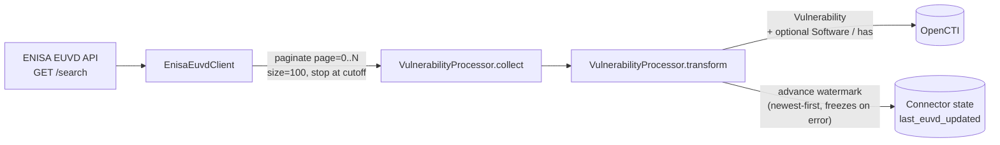

# OpenCTI ENISA EUVD Connector

Table of Contents

- [Introduction](#introduction)
- [Installation](#installation)
  - [Requirements](#requirements)
- [Configuration variables](#configuration-variables)
  - [OpenCTI environment variables](#opencti-environment-variables)
  - [Base connector environment variables](#base-connector-environment-variables)
  - [ENISA EUVD connector environment variables](#enisa-euvd-connector-environment-variables)
  - [In-code constants](#in-code-constants)
- [Deployment](#deployment)
  - [Docker Deployment](#docker-deployment)
  - [Manual Deployment](#manual-deployment)
- [Usage](#usage)
- [Behavior](#behavior)
  - [Data flow](#data-flow)
  - [STIX 2.1 mapping](#stix-21-mapping)
  - [Collection strategy and checkpointing](#collection-strategy-and-checkpointing)
- [Known caveats](#known-caveats)
- [Debugging](#debugging)
- [Additional information](#additional-information)

## Introduction

The ENISA EUVD connector imports vulnerability intelligence from the
[European Union Vulnerability Database](https://euvd.enisa.europa.eu/) (EUVD),
the official EU repository for cybersecurity vulnerability intelligence
published by ENISA (European Union Agency for Cybersecurity). See the
[API documentation](https://euvd.enisa.europa.eu/apidoc).

Each vulnerability is ingested as a STIX `Vulnerability` with its CVSS scores
(v2/v3/v4, whichever the source reports), EPSS score, and aliases (CVE,
GHSA...). Affected products can optionally be ingested as `Software`
observables linked to the vulnerability with a `has` relationship.

## Installation

### Requirements

- OpenCTI Platform >= 6.8.12
- No API key: the ENISA EUVD API is public and requires no authentication.

## Configuration variables

The exhaustive, generated list of every parameter is available in
[Connector Configurations](./__metadata__/CONNECTOR_CONFIG_DOC.md).

### OpenCTI environment variables

| Parameter     | config.yml | Docker environment variable | Mandatory | Description                       |
| ------------- | ---------- | ---------------------------- | --------- | ---------------------------------- |
| OpenCTI URL   | `url`      | `OPENCTI_URL`                | Yes       | The URL of the OpenCTI platform.   |
| OpenCTI Token | `token`    | `OPENCTI_TOKEN`               | Yes       | The API token for OpenCTI.         |

### Base connector environment variables

| Parameter        | config.yml         | Docker environment variable    | Default   | Mandatory | Description                                          |
| ---------------- | ------------------- | ------------------------------- | --------- | --------- | ----------------------------------------------------- |
| Connector ID      | `id`                | `CONNECTOR_ID`                  | `cd55d2d1-cdd9-4880-9e76-afa1f4c1d0cb` (placeholder) | No | A unique `UUIDv4` identifying this connector instance. **Replace the default with your own generated UUIDv4 before deploying more than one instance.** |
| Connector Name    | `name`              | `CONNECTOR_NAME`                | ENISA EUVD | No       | Display name of the connector.                        |
| Connector Scope   | `scope`             | `CONNECTOR_SCOPE`               | `vulnerability` | No | Entity types imported.                                 |
| Log Level         | `log_level`         | `CONNECTOR_LOG_LEVEL`           | `error`   | No        | One of `debug`, `info`, `warn`, `warning`, `error`.    |
| Duration Period   | `duration_period`   | `CONNECTOR_DURATION_PERIOD`     | `PT2H`    | No        | ISO 8601 duration between two runs.                    |

### ENISA EUVD connector environment variables

| Parameter          | config.yml            | Docker environment variable   | Default                                          | Mandatory | Description                                                                                          |
| ------------------- | ---------------------- | -------------------------------| ------------------------------------------------- | --------- | ------------------------------------------------------------------------------------------------------ |
| API base URL        | `api_base_url`         | `EUVD_API_BASE_URL`           | `https://euvdservices.enisa.europa.eu/api`         | No        | Base URL of the ENISA EUVD API.                                                                        |
| Import start date   | `import_start_date`    | `EUVD_IMPORT_START_DATE`      | `P30D`                                             | No        | First run only: how far back (by `dateUpdated`) to pull. Subsequent runs resume from persisted state.  |
| TLP level           | `tlp_level`            | `EUVD_TLP_LEVEL`              | `clear`                                            | No        | One of `clear`, `white`, `green`, `amber`, `amber+strict`, `red`.                                       |
| Ingest software     | `ingest_software`      | `EUVD_INGEST_SOFTWARE`        | `false`                                            | No        | Import affected products as `Software` observables + `has` relationships. Off by default (volume).    |

### In-code constants

The following are not configurable and are documented here for transparency
(see `src/enisa_euvd/client_api.py`):

| Constant      | Value  | Notes                                                              |
| ------------- | ------ | -------------------------------------------------------------------|
| Page size     | 100    | Maximum page size accepted by `/search` (larger values are capped by the API). |
| Rate limit    | 2/s    | Proactive throttle; ENISA documents no rate limit, so this is defensive. |
| Max retries   | 5      | On 408/429/5xx, with exponential backoff.                          |
| Backoff factor| 2.0    |                                                                      |
| Timeout       | 60s    |                                                                      |
| User-Agent    | `OpenCTI-ENISA-EUVD-Connector/1.0 (+https://github.com/OpenCTI-Platform/connectors)` | |

## Deployment

### Docker Deployment

Copy `docker-compose.yml` and adjust environment variables, then:

```shell
docker compose up -d
```

### Manual Deployment

Copy `config.yml.sample` to `config.yml`, adjust values, then:

```shell
pip install -r src/requirements.txt
python3 src/main.py
```

## Usage

No manual action is required after deployment. The connector runs
automatically according to `duration_period`.

## Behavior

### Data flow



### STIX 2.1 mapping

#### Vulnerability

| Source field | SDK property | Rule |
| --- | --- | --- |
| `id` (`EUVD-xxxx`) | `name` | never empty |
| `description` | `description` | full |
| `aliases` (CVE, GHSA...) | `aliases` | split by line, deduplicated |
| `baseScore` + `baseScoreVersion` | `cvss_v{2,3,4}_base_score` | routed by version (`2.0`→v2, `3.0`/`3.1`→v3, `4.0`→v4); unrecognized versions are logged and dropped |
| `baseScoreVector` | `cvss_v{2,3,4}_vector_string` | same routing |
| `epss` | `epss_score` | |
| `id` | `external_references[]` | `source_name="ENISA EUVD"`, `external_id`, `url=https://euvd.enisa.europa.eu/vulnerability/{id}` |
| `references` (URL lines) | `external_references[]` | one per URL; `source_name` inferred from the domain (NVD, GitHub Advisory...), else `"ENISA EUVD reference"` |

#### Software (opt-in `ingest_software`)

| Source field | SDK property |
| --- | --- |
| `enisaIdProduct[].product.name` | `name` |
| `enisaIdProduct[].product.vendor.name` | `vendor` |
| `enisaIdProduct[].product_version` | `version` |

#### Relationship

| Source | Target | Type | Condition |
| --- | --- | --- | --- |
| Software | Vulnerability | `has` | `ingest_software=true` |

#### Common

- `OrganizationAuthor(name="ENISA")` as `created_by_ref` on every object.
- `TLPMarking(level=tlp_level)` on every object.

#### Not mapped

| Source field | Reason |
| --- | --- |
| `enisaUuid` | Internal technical id, no OpenCTI use. |
| `assigner` | No dedicated SDK property; not structuring enough for a label. |
| `enisaIdVendor` | Redundant with `enisaIdProduct[].product.vendor`. |
| Detailed CVSS sub-metrics (AV/AC/PR...) | EUVD only exposes the raw vector string, not individual sub-metric fields. |
| CWE | Absent from the EUVD `/search` payload (verified live). |
| EPSS percentile | Absent from the EUVD payload (only a raw `epss` score is provided). |

### Collection strategy and checkpointing

`GET /search` supports only `page`/`size` pagination (max `size=100`), sorted
**descending by `dateUpdated`** (verified against the live API) — there is no
independent "updated since" filter.

- The connector keeps a single watermark, `last_euvd_updated`, in its
  persisted state.
- On each run, it walks `page=0, 1, 2...` and stops as soon as it sees an item
  older than the watermark (or `now - import_start_date` on the first run) —
  everything after that point is guaranteed older, since results are sorted
  descending.
- The watermark only advances through the newest-first, *contiguous prefix of
  successfully converted items*: if any item fails to convert, the watermark
  freezes at the last successfully converted item **before** the failure, so
  the failed item (and everything from that point on) is retried on the next
  run instead of being silently skipped forever.
- The comparison is inclusive (`>=`), so the item at the watermark itself is
  re-fetched and re-sent on the next run. This is a harmless duplicate:
  OpenCTI deduplicates by the deterministic STIX id (`Vulnerability.generate_id(name=<EUVD-id>)`).

## Known caveats

- **No true incremental cursor**: because pagination is by position only
  (no independent date filter), a crash mid-run does not resume from a
  partial page — the next run restarts the walk from `page=0` with the same
  watermark as the last fully-successful run. This is safe (thanks to
  deterministic STIX ids) but means a crash near the end of a large first-run
  catch-up (e.g. a 30-day backfill) re-fetches and re-sends everything from
  that run, rather than only the remainder.
- **CVSS v2 items have no `base_severity`**: EUVD does not provide a severity
  label (only a numeric score), so `cvss_v{2,3,4}_base_severity` is never set.
- **`Software` volume**: a single vulnerability can list many affected
  products; `ingest_software` is off by default to avoid an unbounded number
  of observables per run. Enable it only if you are prepared for the extra
  volume.
- **Unrecognized future CVSS versions**: if ENISA starts reporting a
  `baseScoreVersion` not in `{2.0, 3.0, 3.1, 4.0}`, the score/vector for that
  item is dropped (logged as a warning), not guessed.

## Debugging

Set `CONNECTOR_LOG_LEVEL=debug` to get verbose logs, including every HTTP
request made to the ENISA EUVD API.

## Additional information

Out of scope for this version:

- The `/exploitedvulnerabilities` and `/criticalvulnerabilities` endpoints
  (redundant subsets of `/search`, not separately ingested).
- Parsing individual CVSS sub-metrics (attack vector, privileges required...)
  from the vector string — only the raw score and vector string are stored.
- Unlimited history import — bounded by `import_start_date` on the first run.
