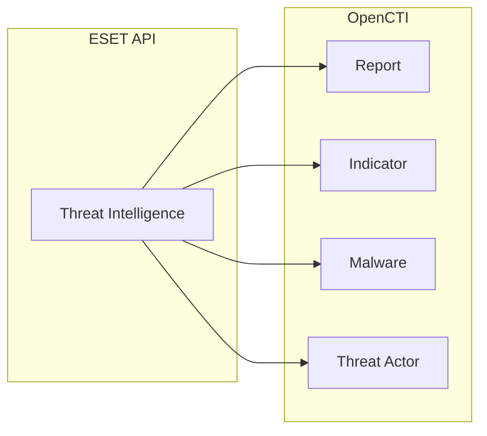

# OpenCTI ESET Connector

The ESET connector imports threat intelligence data from ESET Threat Intelligence into OpenCTI.

| Status           | Date | Comment |
|------------------|------|---------|
| Partner Verified | -    | -       |

## Table of Contents

- [OpenCTI ESET Connector](#opencti-eset-connector)
  - [Table of Contents](#table-of-contents)
  - [Introduction](#introduction)
  - [Installation](#installation)
    - [Requirements](#requirements)
  - [Configuration variables](#configuration-variables)
    - [OpenCTI environment variables](#opencti-environment-variables)
    - [Base connector environment variables](#base-connector-environment-variables)
    - [Connector extra parameters environment variables](#connector-extra-parameters-environment-variables)
  - [Deployment](#deployment)
    - [Docker Deployment](#docker-deployment)
    - [Manual Deployment](#manual-deployment)
  - [Usage](#usage)
  - [Behavior](#behavior)
  - [Debugging](#debugging)
  - [Additional information](#additional-information)

## Introduction

ESET Threat Intelligence provides advanced threat intelligence feeds including APT reports, malware analysis, and indicators of compromise. This connector gathers threat data from ESET and imports it into OpenCTI for correlation with other intelligence sources.

## Installation

### Requirements

- OpenCTI Platform >= 6.x
- ESET Threat Intelligence subscription
- ESET API credentials

## Configuration variables

There are a number of configuration options, which are set either in `docker-compose.yml` (for Docker) or in `config.yml` (for manual deployment).

### OpenCTI environment variables

| Parameter     | config.yml | Docker environment variable | Mandatory | Description                                          |
|---------------|------------|-----------------------------|-----------|------------------------------------------------------|
| OpenCTI URL   | url        | `OPENCTI_URL`               | Yes       | The URL of the OpenCTI platform.                     |
| OpenCTI Token | token      | `OPENCTI_TOKEN`             | Yes       | The default admin token set in the OpenCTI platform. |

### Base connector environment variables

| Parameter         | config.yml      | Docker environment variable   | Default | Mandatory | Description                                                                 |
|-------------------|-----------------|-------------------------------|---------|-----------|-----------------------------------------------------------------------------|
| Connector ID      | id              | `CONNECTOR_ID`                |         | Yes       | A unique `UUIDv4` identifier for this connector instance.                   |
| Connector Name    | name            | `CONNECTOR_NAME`              | ESET    | No        | Name of the connector.                                                      |
| Connector Scope   | scope           | `CONNECTOR_SCOPE`             | eset    | No        | The scope or type of data the connector is importing.                       |
| Log Level         | log_level       | `CONNECTOR_LOG_LEVEL`         | info    | No        | Determines the verbosity of the logs: `debug`, `info`, `warn`, or `error`.  |

### Connector extra parameters environment variables

| Parameter   | config.yml     | Docker environment variable | Default | Mandatory | Description                                      |
|-------------|----------------|----------------------------|---------|-----------|--------------------------------------------------|
| API Key     | eset.api_key   | `ESET_API_KEY`             |         | Yes       | ESET Threat Intelligence API key.                |
| Interval    | eset.interval  | `ESET_INTERVAL`            | 60      | Yes       | Interval in minutes between connector runs.      |

## Deployment

### Docker Deployment

Build the Docker image:

```bash
docker build -t opencti/connector-eset:latest .
```

Configure the connector in `docker-compose.yml`:

```yaml
  connector-eset:
    image: opencti/connector-eset:latest
    environment:
      - OPENCTI_URL=http://localhost
      - OPENCTI_TOKEN=ChangeMe
      - CONNECTOR_ID=ChangeMe
      - CONNECTOR_NAME=ESET
      - CONNECTOR_SCOPE=eset
      - CONNECTOR_LOG_LEVEL=info
      - ESET_API_KEY=ChangeMe
      - ESET_INTERVAL=60 # In minutes
    restart: always
```

Start the connector:

```bash
docker compose up -d
```

### Manual Deployment

1. Create `config.yml` based on `config.yml.sample`.

2. Install dependencies:

```bash
pip3 install -r requirements.txt
```

3. Start the connector:

```bash
python3 main.py
```

## Usage

The connector runs automatically at the interval defined by `ESET_INTERVAL`. To force an immediate run:

**Data Management → Ingestion → Connectors**

Find the connector and click the refresh button to reset the state and trigger a new sync.

## Behavior

The connector fetches threat intelligence from ESET's API and imports it as STIX 2.1 objects.

### Data Flow



### Entity Mapping

| ESET Data            | OpenCTI Entity      | Description                                      |
|----------------------|---------------------|--------------------------------------------------|
| APT Report           | Report              | APT analysis reports                             |
| Indicator            | Indicator           | IOCs with patterns                               |
| Malware Family       | Malware             | Malware families                                 |
| Threat Actor         | Threat Actor        | Threat actor profiles                            |

## Debugging

Enable verbose logging:

```env
CONNECTOR_LOG_LEVEL=debug
```

## Additional information

- **Subscription Required**: ESET Threat Intelligence access requires a paid subscription
- **Reference**: [ESET Threat Intelligence](https://www.eset.com/int/business/services/threat-intelligence/)
