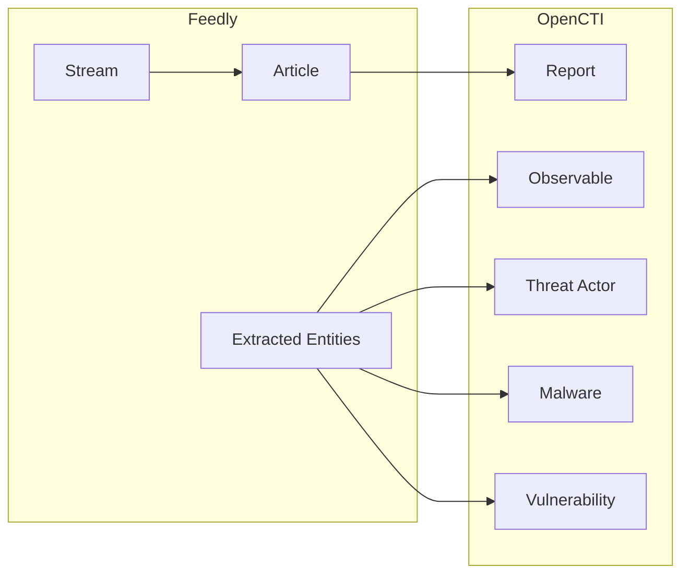

# OpenCTI Feedly Connector

The Feedly connector imports threat intelligence from Feedly AI-powered news feeds into OpenCTI.

| Status    | Date | Comment |
|-----------|------|---------|
| Community | -    | -       |

## Table of Contents

- [OpenCTI Feedly Connector](#opencti-feedly-connector)
  - [Table of Contents](#table-of-contents)
  - [Introduction](#introduction)
  - [Installation](#installation)
    - [Requirements](#requirements)
  - [Configuration variables](#configuration-variables)
    - [OpenCTI environment variables](#opencti-environment-variables)
    - [Base connector environment variables](#base-connector-environment-variables)
    - [Connector extra parameters environment variables](#connector-extra-parameters-environment-variables)
  - [Deployment](#deployment)
    - [Docker Deployment](#docker-deployment)
    - [Manual Deployment](#manual-deployment)
  - [Usage](#usage)
  - [Behavior](#behavior)
  - [Debugging](#debugging)
  - [Additional information](#additional-information)

## Introduction

Feedly is an AI-powered news aggregator that helps security teams track threat intelligence from various sources. This connector imports articles from configured Feedly streams, extracting threat intelligence entities and creating reports in OpenCTI.

## Installation

### Requirements

- OpenCTI Platform >= 6.x
- Feedly account with API access
- Feedly API key

## Configuration variables

There are a number of configuration options, which are set either in `docker-compose.yml` (for Docker) or in `config.yml` (for manual deployment).

### OpenCTI environment variables

| Parameter     | config.yml | Docker environment variable | Mandatory | Description                                          |
|---------------|------------|-----------------------------|-----------|------------------------------------------------------|
| OpenCTI URL   | url        | `OPENCTI_URL`               | Yes       | The URL of the OpenCTI platform.                     |
| OpenCTI Token | token      | `OPENCTI_TOKEN`             | Yes       | The default admin token set in the OpenCTI platform. |

### Base connector environment variables

| Parameter       | config.yml | Docker environment variable | Default | Mandatory | Description                                                                 |
|-----------------|------------|-----------------------------|---------|-----------| ----------------------------------------------------------------------------|
| Connector ID    | id         | `CONNECTOR_ID`              |         | Yes       | A unique `UUIDv4` identifier for this connector instance.                   |
| Connector Name  | name       | `CONNECTOR_NAME`            | Feedly  | No        | Name of the connector.                                                      |
| Connector Scope | scope      | `CONNECTOR_SCOPE`           | feedly  | No        | The scope or type of data the connector is importing.                       |
| Log Level       | log_level  | `CONNECTOR_LOG_LEVEL`       | error   | No        | Determines the verbosity of the logs: `debug`, `info`, `warn`, or `error`.  |

### Connector extra parameters environment variables

| Parameter          | config.yml               | Docker environment variable    | Default | Mandatory | Description                                                                 |
|--------------------|--------------------------|--------------------------------|---------|-----------|-----------------------------------------------------------------------------|
| Interval           | feedly.interval          | `FEEDLY_INTERVAL`              | 60      | No        | Polling interval in minutes.                                                |
| Stream IDs         | feedly.stream_ids        | `FEEDLY_STREAM_IDS`            |         | Yes       | Comma-separated list of Feedly stream IDs.                                  |
| Days to Back Fill  | feedly.days_to_back_fill | `FEEDLY_DAYS_TO_BACK_FILL`     | 7       | No        | Number of days to fetch historical data for new streams.                    |
| API Key            | feedly.api_key           | `FEEDLY_API_KEY`               |         | Yes       | Feedly API key.                                                             |

## Deployment

### Docker Deployment

Build the Docker image:

```bash
docker build -t opencti/connector-feedly:latest .
```

Configure the connector in `docker-compose.yml`:

```yaml
  connector-feedly:
    image: opencti/connector-feedly:latest
    environment:
      - OPENCTI_URL=http://localhost
      - OPENCTI_TOKEN=ChangeMe
      - CONNECTOR_ID=ChangeMe
      - CONNECTOR_NAME=Feedly
      - CONNECTOR_SCOPE=feedly
      - CONNECTOR_LOG_LEVEL=error
      - FEEDLY_INTERVAL=60
      - FEEDLY_STREAM_IDS=enterprise/your-org/category/threat-intel
      - FEEDLY_DAYS_TO_BACK_FILL=7
      - FEEDLY_API_KEY=ChangeMe
    restart: always
```

Start the connector:

```bash
docker compose up -d
```

### Manual Deployment

1. Create `config.yml` based on `config.yml.sample`.

2. Install dependencies:

```bash
pip3 install -r requirements.txt
```

3. Start the connector:

```bash
python3 main.py
```

## Usage

The connector runs automatically at the interval defined by `FEEDLY_INTERVAL`. To force an immediate run:

**Data Management → Ingestion → Connectors**

Find the connector and click the refresh button to reset the state and trigger a new sync.

## Behavior

The connector fetches articles from Feedly streams and extracts threat intelligence entities.

### Data Flow



### Entity Mapping

| Feedly Data          | OpenCTI Entity      | Description                                      |
|----------------------|---------------------|--------------------------------------------------|
| Article              | Report              | News article as report                           |
| CVE Entity           | Vulnerability       | Extracted CVE references                         |
| Threat Actor Entity  | Threat-Actor        | Mentioned threat actors                          |
| Malware Entity       | Malware             | Referenced malware                               |
| IOC Entity           | Observable          | Extracted indicators                             |

### Getting Stream IDs

Stream IDs can be found in Feedly:

1. Navigate to your feed or board
2. Click on the settings icon
3. Look for the "Stream ID" in the URL or settings

Example stream ID formats:
- `enterprise/your-org/category/threat-intel`
- `user/your-user-id/category/security`
- `feed/https://example.com/feed.xml`

## Debugging

Enable verbose logging:

```env
CONNECTOR_LOG_LEVEL=debug
```

## Additional information

- **API Key**: Generate at [Feedly API](https://feedly.com/i/team/api)
- **AI Entities**: Feedly's AI extracts entities from articles automatically
- **Multiple Streams**: Configure multiple streams separated by commas
- **Reference**: [Feedly for Threat Intel](https://feedly.com/threat-intelligence)
