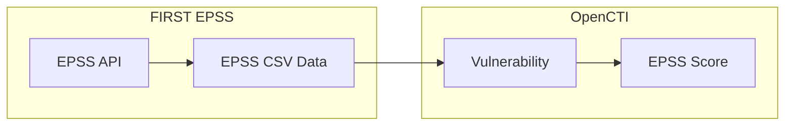

# OpenCTI FIRST EPSS Connector

| Status | Date | Comment |
|--------|------|---------|
| Filigran Verified | -    | -       |

> **Warning**: This connector is not the recommended way to enrich vulnerabilities with EPSS information. It is strongly advised to use the `internal/enrichment-connector` for FIRST EPSS instead, as it provides a more robust and integrated solution.

The FIRST EPSS connector imports EPSS (Exploit Prediction Scoring System) scores for CVE vulnerabilities into OpenCTI.

## Table of Contents

- [OpenCTI FIRST EPSS Connector](#opencti-first-epss-connector)
  - [Table of Contents](#table-of-contents)
  - [Introduction](#introduction)
  - [Installation](#installation)
    - [Requirements](#requirements)
  - [Configuration variables](#configuration-variables)
    - [OpenCTI environment variables](#opencti-environment-variables)
    - [Base connector environment variables](#base-connector-environment-variables)
    - [Connector extra parameters environment variables](#connector-extra-parameters-environment-variables)
  - [Deployment](#deployment)
    - [Docker Deployment](#docker-deployment)
    - [Manual Deployment](#manual-deployment)
  - [Usage](#usage)
  - [Behavior](#behavior)
  - [Debugging](#debugging)
  - [Additional information](#additional-information)

## Introduction

The FIRST EPSS connector enriches CVE vulnerabilities with EPSS (Exploit Prediction Scoring System) scores provided by [FIRST](https://www.first.org/epss/). EPSS is a data-driven effort for estimating the likelihood that a software vulnerability will be exploited in the wild.

The EPSS score ranges from 0 to 1, where higher scores indicate a higher probability of exploitation within the next 30 days.

## Installation

### Requirements

- OpenCTI Platform >= 6.5.2
- Internet access to EPSS API (epss.cyentia.com)

## Configuration variables

There are a number of configuration options, which are set either in `docker-compose.yml` (for Docker) or in `config.yml` (for manual deployment).

### OpenCTI environment variables

| Parameter     | config.yml | Docker environment variable | Mandatory | Description                                          |
|---------------|------------|-----------------------------|-----------|------------------------------------------------------|
| OpenCTI URL   | url        | `OPENCTI_URL`               | Yes       | The URL of the OpenCTI platform.                     |
| OpenCTI Token | token      | `OPENCTI_TOKEN`             | Yes       | The default admin token set in the OpenCTI platform. |

### Base connector environment variables

| Parameter       | config.yml      | Docker environment variable   | Default                                | Mandatory | Description                                                              |
|-----------------|-----------------|-------------------------------|----------------------------------------|-----------|--------------------------------------------------------------------------|
| Connector ID    | id              | `CONNECTOR_ID`                |                                        | Yes       | A unique `UUIDv4` identifier for this connector instance.                |
| Connector Name  | name            | `CONNECTOR_NAME`              | External Import First EPSS Connector   | No        | Name of the connector.                                                   |
| Connector Scope | scope           | `CONNECTOR_SCOPE`             | vulnerability                          | No        | The scope or type of data the connector is importing.                    |
| Duration Period | duration_period | `CONNECTOR_DURATION_PERIOD`   | PT24H                                  | No        | Time interval between runs in ISO 8601 format.                           |
| Queue Threshold | queue_threshold | `CONNECTOR_QUEUE_THRESHOLD`   | 500                                    | No        | RabbitMQ queue limit in MB before buffering mode.                        |
| Log Level       | log_level       | `CONNECTOR_LOG_LEVEL`         | info                                   | No        | Determines the verbosity of logs: `debug`, `info`, `warn`, or `error`.   |

### Connector extra parameters environment variables

| Parameter    | config.yml   | Docker environment variable | Default                    | Mandatory | Description                    |
|--------------|--------------|------------------------------|----------------------------|-----------|--------------------------------|
| API Base URL | api_base_url | `FIRST_EPSS_API_BASE_URL`    | https://epss.cyentia.com   | Yes       | FIRST EPSS API base URL.       |

## Deployment

### Docker Deployment

Build the Docker image:

```bash
docker build -t opencti/connector-first-epss-bulk:latest .
```

Configure the connector in `docker-compose.yml`:

```yaml
  connector-first-epss-bulk:
    image: opencti/connector-first-epss-bulk:latest
    environment:
      - OPENCTI_URL=http://localhost
      - OPENCTI_TOKEN=ChangeMe
      - CONNECTOR_ID=ChangeMe
      - CONNECTOR_NAME=FIRST EPSS
      - CONNECTOR_SCOPE=vulnerability
      - CONNECTOR_DURATION_PERIOD=PT24H
      - CONNECTOR_LOG_LEVEL=info
      - FIRST_EPSS_API_BASE_URL=https://epss.cyentia.com
    restart: always
```

Start the connector:

```bash
docker compose up -d
```

### Manual Deployment

1. Create `config.yml` based on `config.yml.sample`.

2. Install dependencies:

```bash
pip3 install -r requirements.txt
```

3. Start the connector:

```bash
python3 main.py
```

## Usage

The connector runs automatically at the interval defined by `CONNECTOR_DURATION_PERIOD` (daily by default). To force an immediate run:

**Data Management → Ingestion → Connectors**

Find the connector and click the refresh button to reset the state and trigger a new data fetch.

## Behavior

The connector fetches EPSS scores from FIRST and enriches CVE vulnerabilities in OpenCTI.

### Data Flow



### Entity Mapping

| EPSS Data        | OpenCTI Property    | Description                                      |
|------------------|---------------------|--------------------------------------------------|
| CVE ID           | Vulnerability       | CVE identifier for matching                      |
| EPSS Score       | x_opencti_epss_score| Exploitation probability (0-1)                   |
| Percentile       | x_opencti_epss_percentile | Percentile ranking                         |

### Processing Details

1. **Download CSV**: Fetches the complete EPSS CSV file from FIRST
2. **Parse Data**: Extracts CVE IDs, EPSS scores, and percentiles
3. **Match CVEs**: Matches against existing vulnerabilities in OpenCTI
4. **Update Scores**: Updates EPSS scores on matching vulnerabilities

### EPSS Score Interpretation

| Score Range  | Exploitation Probability | Priority      |
|--------------|-------------------------|---------------|
| 0.9 - 1.0    | Very High               | Critical      |
| 0.7 - 0.9    | High                    | High          |
| 0.4 - 0.7    | Medium                  | Medium        |
| 0.1 - 0.4    | Low                     | Low           |
| 0.0 - 0.1    | Very Low                | Informational |

## Debugging

Enable verbose logging:

```env
CONNECTOR_LOG_LEVEL=debug
```

## Additional information

- **Update Frequency**: EPSS scores are updated daily; daily polling is recommended
- **Public Data**: EPSS data is publicly available
- **Enrichment Alternative**: Consider using the internal enrichment connector for on-demand EPSS lookups
- **Reference**: [FIRST EPSS](https://www.first.org/epss/)
