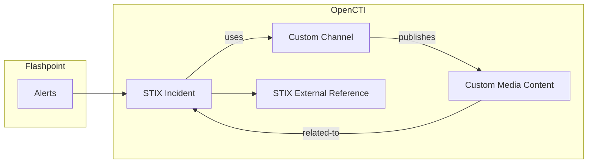
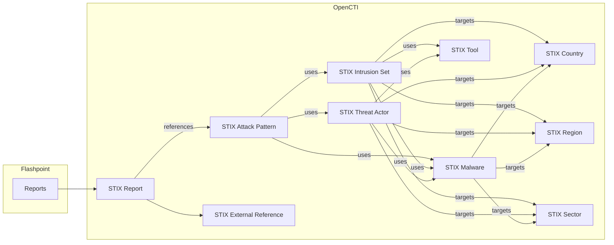
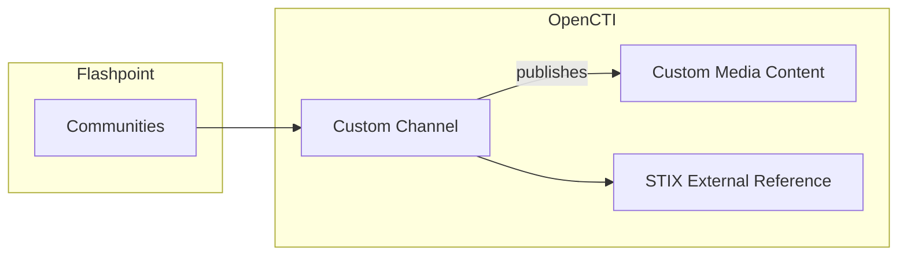
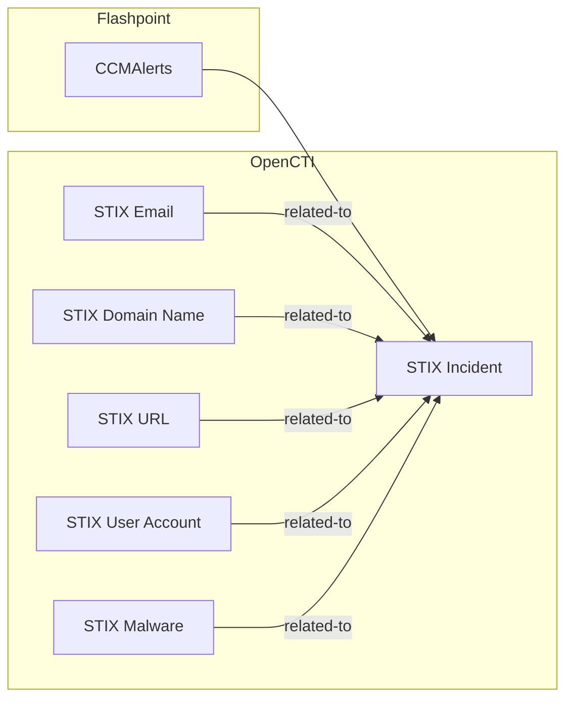

# OpenCTI Flashpoint Connector

This connector integrates Flashpoint with the OpenCTI platform.
It pulls various threat intelligence data from Flashpoint and imports it into OpenCTI, providing enhanced visibility into security threats.

See [Flashpoint API Documentation](https://flashpoint.io/resources/datasheets/ignite-platform-datasheet/) for more details.

## Table of Contents

- [Introduction](#introduction)
- [Installation](#installation)
  - [Requirements](#requirements)
- [Configuration variables](#configuration-variables)
  - [OpenCTI environment variables](#opencti-environment-variables)
  - [Base connector environment variables](#base-connector-environment-variables)
  - [Connector extra parameters environment variables](#connector-extra-parameters-environment-variables)
- [Deployment](#deployment)
  - [Docker Deployment](#docker-deployment)
  - [Manual Deployment](#manual-deployment)
- [Usage](#usage)
- [Behavior](#behavior)
- [Debugging](#debugging)
- [Additional information](#additional-information)

## Introduction

The Flashpoint Connector for OpenCTI imports threat intelligence data from Flashpoint and maps it to relevant entities in the OpenCTI ecosystem.
This includes alerts, indicators, malware reports, vulnerabilities, and other intelligence, enhancing threat detection and response capabilities.  
See [Behavior](#behavior) for more details.

## Installation

### Requirements

- OpenCTI Platform >= 6.x
- Flashpoint API access (API key required)

## Configuration variables

Configuration parameters can be provided in either **`config.yml`** file, **`.env`** file or directly as **environment variables** (e.g. from **`docker-compose.yml`** for Docker deployments).

Priority: **YAML > .env > environment > defaults**.

### OpenCTI environment variables

| Parameter     | config.yml | Docker environment variable | Mandatory | Description                                          |
| ------------- | ---------- | --------------------------- | --------- | ---------------------------------------------------- |
| OpenCTI URL   | url        | `OPENCTI_URL`               | Yes       | The URL of the OpenCTI platform.                     |
| OpenCTI Token | token      | `OPENCTI_TOKEN`             | Yes       | The default admin token set in the OpenCTI platform. |

### Base connector environment variables

| Parameter       | config.yml      | Docker environment variable | Default    | Mandatory | Description                                                                      |
| --------------- | --------------- | --------------------------- | ---------- | --------- | -------------------------------------------------------------------------------- |
| Connector ID    | id              | `CONNECTOR_ID`              | /          | Yes       | A unique `UUIDv4` identifier for this connector instance.                        |
| Connector Name  | name            | `CONNECTOR_NAME`            | /          | Yes       | Name of the connector.                                                           |
| Connector Scope | scope           | `CONNECTOR_SCOPE`           | flashpoint | No        | The scope or type of data the connector is importing (e.g., flashpoint).         |
| Log Level       | log_level       | `CONNECTOR_LOG_LEVEL`       | error      | No        | Determines the verbosity of the logs. Options: `debug`, `info`, `warn`, `error`. |
| Duration Period | duration_period | `CONNECTOR_DURATION_PERIOD` | "PT1H"     | No        | The period of time to wait between two connector's runs (in ISO-8601 format).    |

### Connector extra parameters environment variables

| Parameter                                                     | config.yml                       | Docker environment variable                | Default                     | Mandatory | Description                                                                                                                                            |
| ------------------------------------------------------------- | -------------------------------- | ------------------------------------------ | --------------------------- | --------- | ------------------------------------------------------------------------------------------------------------------------------------------------------ |
| API access key                                                | api_access_key                   | `FLASHPOINT_API_KEY`                       | /                           | Yes       | Flashpoint API access key.                                                                                                                             |
| Import interval (minutes) (Deprecated)                        | interval                         | `FLASHPOINT_INTERVAL`                      | 5                           | No        | Interval (in minutes) to import data from Flashpoint. This option option is deprecated. Please use 'duration_period' instead                           |
| Import start date                                             | import_start_date                | `FLASHPOINT_IMPORT_START_DATE`             | "P30D"                      | No        | An ISO 8601 string specifying either a period of time or a start date for data import, e.g. 'P30D' (last 30 days) or '2025-05-01' (since May 1, 2025). |
| Import reports                                                | import_reports                   | `FLASHPOINT_IMPORT_REPORTS`                | true                        | No        | Import reports from Flashpoint.                                                                                                                        |
| Indicators in reports                                         | indicators_in_reports            | `FLASHPOINT_INDICATORS_IN_REPORTS`         | false                       | No        | Include indicators in the reports imported from MispFeed.                                                                                              |
| Guess relationships                                           | guess_relationships_from_reports | `GUESS_RELATIONSHIPS_FROM_REPORTS`         | false                       | No        | Enable or disable the guessing of relationships between entities.                                                                                      |
| Import indicators                                             | import_indicators                | `FLASHPOINT_IMPORT_INDICATORS`             | true                        | No        | Import indicators of compromise (IoCs).                                                                                                                |
| Import alerts                                                 | import_alerts                    | `FLASHPOINT_IMPORT_ALERTS`                 | true                        | No        | Import alert data from Flashpoint.                                                                                                                     |
| Create alert related entities                                 | alert_create_related_entities    | `FLASHPOINT_ALERT_CREATE_RELATED_ENTITIES` | false                       | No        | Create alert related Channel entity and Media-Content observable                                                                                       |
| Import communities                                            | import_communities               | `FLASHPOINT_IMPORT_COMMUNITIES`            | false                       | No        | Import community data.                                                                                                                                 |
| Communities queries                                           | communities_queries              | `FLASHPOINT_COMMUNITIES_QUERIES`           | "cybersecurity,cyberattack" | No        | Comma-separated list of community queries to execute.                                                                                                  |
| Import Compromised Credentials Monitoring alerts              | import_ccm_alerts                | `FLASHPOINT_IMPORT_CCM_ALERTS`             | false                       | No        | Whether to import Compromised Credentials Monitoring alerts or not.                                                                                    |
| Import _fresh_ Compromised Credentials Monitoring alerts only | fresh_ccm_alerts_only            | `FLASHPOINT_FRESH_CCM_ALERTS_ONLY`         | true                        | No        | Import **only** new or never seen before Compromised Credentials Monitoring alerts.                                                                    |

⚠️ Please be aware that `CONNECTOR_DURATION_PERIOD` default value takes precedence over `FLASHPOINT_INTERVAL` default value if none of them are set.

## Deployment

### Docker Deployment

Before building the Docker container, ensure you have set the version of `pycti` in `requirements.txt` to match the version of OpenCTI you are running. For example, `pycti==6.3.8`. Failing to do so may result in initialization issues.

Build a Docker Image using the provided `Dockerfile`.

Example:

```shell
# Replace the IMAGE NAME with the appropriate value
docker build . -t [IMAGE NAME]:latest
```

Make sure to replace the environment variables in docker-compose.yml with the appropriate configurations for your environment. Then, start the docker container with the provided docker-compose.yml.

```shell
docker compose up -d
```

### Manual Deployment

Create a _config.yml_ file based on the provided _config.yml.sample_, **or** a _.env_ file based on _.env.sample_.

Replace the configuration variables (especially the "ChangeMe" variables) with the appropriate configurations for your environment.

Install the required Python dependencies (preferably in a virtual environment):

```shell
pip install -r requirements.txt
```

Then, start the connector from the /src directory:

```shell
python flashpoint.py
```

## Usage

After installation, the connector requires minimal interaction and should update automatically at a regular interval specified in your _docker-compose.yml_ or _config.yml/.env_ under `FLASHPOINT_DURATION_PERIOD`.

To force an immediate download of a new batch of entities, navigate to:

Data management -> Ingestion -> Connectors in the OpenCTI platform.

Find the connector and click on the refresh button to reset the connector's state and force a new download of data by re-running the connector.

## Behavior

This connector supports importing different categories of data from Flashpoint, each of which can be enabled and configured independently.

### Alert

Flashpoint Alerts encompass a wide range of security notifications delivered by Flashpoint, covering potential threats, vulnerabilities, and notable activity throughout various sources in threat intelligence.
These may include emerging malware campaigns, exploitation of specific CVEs, targeted attacks, or other critical issues relevant to your organization.

The import of Flashpoint Alerts can be individually enabled or disabled. You can fetch alerts from a specific start date and apply filters such as alert type, severity, or other properties according to your needs.

#### Mapping to OpenCTI entities:



#### Relevant documentation:

- https://docs.flashpoint.io/flashpoint/docs/setting-notifications
- https://docs.flashpoint.io/flashpoint/reference/alert-management-notifications-api-documentation

### Report

Flashpoint Reports provide in-depth intelligence analyses written by Flashpoint analysts.
These reports may cover threat actor profiles, malware deep-dives, sector-specific risks, investigations, or strategic overviews.

The connector allows you to selectively enable report import. You can retrieve reports from a specific date onward, and filter by topics, tags, target industries, or classification level where supported.

#### Mapping to OpenCTI entities:



#### Relevant documentation:

- https://docs.flashpoint.io/flashpoint/docs/intelligence-reports
- https://docs.flashpoint.io/flashpoint/reference/fireapireportssearch

### Communities

Flashpoint Communities Intelligence provides access to intelligence collected from a wide range of closed sources, including illicit communities, forums, chat services, and other underground platforms.
This module offers valuable insights into threat actor discussions, cybercriminal activities, and emerging trends within these communities.

The import of Communities Intelligence data can be enabled or disabled independently.
Data can be retrieved from a specific start date, and you can apply filters such as keyword, threat actor, or community type to tailor the collected intelligence to your organization’s needs.

#### Mapping to OpenCTI entities:



#### Relevant documentation:

- https://docs.flashpoint.io/flashpoint/reference/context_view_handler_v1_communities__id__context_get

### CCM Alerts

Flashpoint CCM is a specific module provided by Flashpoint that detect some employees credentials leakage.
For each credentials identified in dark web marketplaces or coming from information stealer, an alert is raised.

The import of CCM alerts can be enabled/disabled, retrieved from a specific date and filtered by "freshness".

#### Mapping to OpenCTI entities:



#### Relevant documentation:

- https://docs.flashpoint.io/flashpoint/docs/configure-enterprise-credentials-alerts
- https://docs.flashpoint.io/flashpoint/docs/analyzing-compromised-credentials
- https://docs.flashpoint.io/flashpoint/reference/common-use-cases-2#retrieve-compromised-credential-breaches-from-the-last-week

## Troubleshooting

- ### No Compromised Credential Monitoring Alerts ingested
  If the connector does not import any CCM Alerts (aka Compromised Credential Sightings),
  please double-check that `FLASHPOINT_IMPORT_CCM_ALERTS` is set to `true` (default is `false`).  
  If the import of the CCM Alerts is enabled, please try to get a fresh API token on [Flashpoint](https://app.flashpoint.io/tokens).
  Indeed, if the current API token has been created before the subscription to CCM Alerts has been activated,
  this token _might_ not authorize you to get any Compromised Credential Sightings from Flashpoint.

## Debugging

The connector can be debugged by setting the appropriate log level.
Note that logging messages can be added using `self.helper.connector_logger,{LOG_LEVEL}("Sample message")`, i.e., `self.helper.connector_logger.error("An error message")`.
