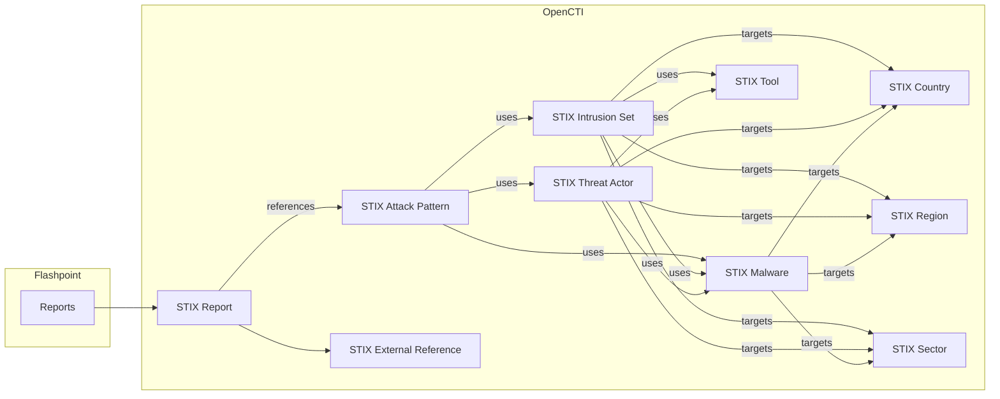
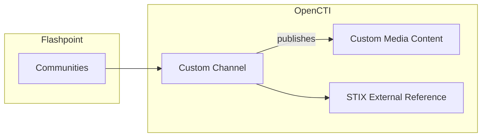
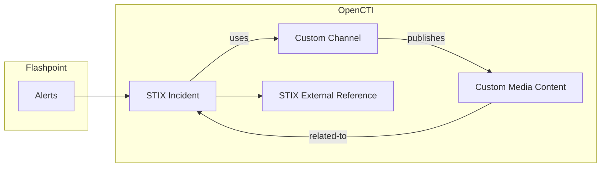

# OpenCTI Flashpoint Connector

This connector integrates Flashpoint with the OpenCTI platform. 
It pulls various threat intelligence data from Flashpoint and imports it into OpenCTI, providing enhanced visibility into security threats.

See [Flashpoint API Documentation](https://flashpoint.io/resources/datasheets/ignite-platform-datasheet/) for more details.

## Table of Contents

- [Introduction](#introduction)
- [Installation](#installation)
  - [Requirements](#requirements)
- [Configuration variables](#configuration-variables)
  - [OpenCTI environment variables](#opencti-environment-variables)
  - [Base connector environment variables](#base-connector-environment-variables)
  - [Connector extra parameters environment variables](#connector-extra-parameters-environment-variables)
- [Deployment](#deployment)
  - [Docker Deployment](#docker-deployment)
  - [Manual Deployment](#manual-deployment)
- [Usage](#usage)
- [Behavior](#behavior)
- [Debugging](#debugging)
- [Additional information](#additional-information)

## Introduction

The Flashpoint Connector for OpenCTI imports threat intelligence data from Flashpoint and maps it to relevant entities in the OpenCTI ecosystem. This includes alerts, indicators, malware reports, vulnerabilities, and other intelligence, enhancing threat detection and response capabilities.

## Installation

### Requirements

- OpenCTI Platform >= 6.x
- Flashpoint API access (API key required)

## Configuration variables

The configuration variables for the connector can be set in `docker-compose.yml` for Docker deployments or `config.yml` for manual deployments.

### OpenCTI environment variables

| Parameter     | config.yml | Docker environment variable | Mandatory | Description                                          |
|---------------|------------|-----------------------------|-----------|------------------------------------------------------|
| OpenCTI URL   | url        | `OPENCTI_URL`               | Yes       | The URL of the OpenCTI platform.                     |
| OpenCTI Token | token      | `OPENCTI_TOKEN`             | Yes       | The default admin token set in the OpenCTI platform. |

### Base connector environment variables

| Parameter       | config.yml      | Docker environment variable | Default         | Mandatory | Description                                                                      |
|-----------------|-----------------|-----------------------------|-----------------|-----------|----------------------------------------------------------------------------------|
| Connector ID    | id              | `CONNECTOR_ID`              | /               | Yes       | A unique `UUIDv4` identifier for this connector instance.                        |
| Connector Type  | type            | `CONNECTOR_TYPE`            | EXTERNAL_IMPORT | Yes       | Should always be set to `EXTERNAL_IMPORT` for this connector.                    |
| Connector Name  | name            | `CONNECTOR_NAME`            |                 | Yes       | Name of the connector.                                                           |
| Connector Scope | scope           | `CONNECTOR_SCOPE`           | flashpoint      | Yes       | The scope or type of data the connector is importing (e.g., flashpoint).        |
| Log Level       | log_level       | `CONNECTOR_LOG_LEVEL`       | info            | Yes       | Determines the verbosity of the logs. Options: `debug`, `info`, `warn`, `error`. |
| Duration Period | duration_period | `CONNECTOR_DURATION_PERIOD` | /               | Yes       | The period of time to wait between two connector's runs (in ISO-8601 format).            |

### Connector extra parameters environment variables

| Parameter                              | config.yml                       | Docker environment variable                | Default                     | Mandatory | Description                                                                                                                  |
|----------------------------------------|----------------------------------|--------------------------------------------|-----------------------------|-----------|------------------------------------------------------------------------------------------------------------------------------|
| API access key                         | api_access_key                   | `FLASHPOINT_API_KEY`                       | /                           | Yes       | Flashpoint API access key.                                                                                                   |
| Import interval (minutes) (Deprecated) | interval                         | `FLASHPOINT_INTERVAL`                      | 5                           | No        | Interval (in minutes) to import data from Flashpoint. This option option is deprecated. Please use 'duration_period' instead |
| Import start date                      | import_start_date                | `FLASHPOINT_IMPORT_START_DATE`             | /                           | No        | The date from which to start importing data.                                                                                 |
| Import reports                         | import_reports                   | `FLASHPOINT_IMPORT_REPORTS`                | true                        | No        | Import reports from Flashpoint.                                                                                              |
| Indicators in reports                  | indicators_in_reports            | `FLASHPOINT_INDICATORS_IN_REPORTS`         | false                       | No        | Include indicators in the reports imported from MispFeed.                                                                    |
| Import indicators                      | import_indicators                | `FLASHPOINT_IMPORT_INDICATORS`             | true                        | No        | Import indicators of compromise (IoCs).                                                                                      |
| Import alerts                          | import_alerts                    | `FLASHPOINT_IMPORT_ALERTS`                 | true                        | No        | Import alert data from Flashpoint.                                                                                           |
| Create alert related entities          | alert_create_related_entities    | `FLASHPOINT_ALERT_CREATE_RELATED_ENTITIES` | false                       | No        | Create alert related Channel entity and Media-Content observable                                                             |
| Import communities                     | import_communities               | `FLASHPOINT_IMPORT_COMMUNITIES`            | false                       | No        | Import community data.                                                                                                       |
| Communities queries                    | communities_queries              | `FLASHPOINT_COMMUNITIES_QUERIES`           | "cybersecurity,cyberattack" | No        | Comma-separated list of community queries to execute.                                                                        |

## Deployment

### Docker Deployment

Before building the Docker container, ensure you have set the version of `pycti` in `requirements.txt` to match the version of OpenCTI you are running. For example, `pycti==6.3.8`. Failing to do so may result in initialization issues.

Build a Docker Image using the provided `Dockerfile`.

Example:

```shell
# Replace the IMAGE NAME with the appropriate value
docker build . -t [IMAGE NAME]:latest
```

Make sure to replace the environment variables in docker-compose.yml with the appropriate configurations for your environment. Then, start the docker container with the provided docker-compose.yml.

```shell
docker compose up -d
```

### Manual Deployment
Create a file config.yml based on the provided config.yml.sample.

Replace the configuration variables (especially the "ChangeMe" variables) with the appropriate configurations for your environment.

Install the required Python dependencies (preferably in a virtual environment):

```shell
pip install -r requirements.txt
```

Then, start the connector from the /src directory:
```shell
python flashpoint.py
```

## Usage
After installation, the connector requires minimal interaction and should update automatically at a regular interval specified in your docker-compose.yml or config.yml under FLASHPOINT_INTERVAL.

To force an immediate download of a new batch of entities, navigate to:

Data management -> Ingestion -> Connectors in the OpenCTI platform.

Find the connector and click on the refresh button to reset the connector's state and force a new download of data by re-running the connector.

## Behavior

### Mapping details

Reports


Communities



Alerts


## Debugging

The connector can be debugged by setting the appropriate log level.
Note that logging messages can be added using `self.helper.connector_logger,{LOG_LEVEL}("Sample message")`, i.e., `self.helper.connector_logger.error("An error message")`.