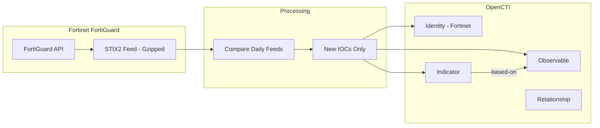

# OpenCTI Fortinet FortiGuard Threat Intelligence Connector

The Fortinet connector imports threat intelligence indicators from the Fortinet FortiGuard Threat Intelligence feed into OpenCTI.

| Status            | Date | Comment |
|-------------------|------|---------|
| Filigran Verified | -    | -       |

## Table of Contents

- [OpenCTI Fortinet FortiGuard Threat Intelligence Connector](#opencti-fortinet-fortiguard-threat-intelligence-connector)
  - [Table of Contents](#table-of-contents)
  - [Introduction](#introduction)
  - [Installation](#installation)
    - [Requirements](#requirements)
  - [Configuration variables](#configuration-variables)
    - [OpenCTI environment variables](#opencti-environment-variables)
    - [Base connector environment variables](#base-connector-environment-variables)
    - [Connector extra parameters environment variables](#connector-extra-parameters-environment-variables)
  - [Deployment](#deployment)
    - [Docker Deployment](#docker-deployment)
    - [Manual Deployment](#manual-deployment)
  - [Usage](#usage)
  - [Behavior](#behavior)
  - [Debugging](#debugging)
  - [Additional information](#additional-information)

## Introduction

Fortinet FortiGuard Threat Intelligence provides comprehensive threat data including malicious URLs, domains, and IP addresses. The feed is delivered in STIX 2 format and contains hundreds of thousands of indicators updated regularly.

This connector retrieves the FortiGuard threat feed and imports new indicators into OpenCTI as observables and indicators, comparing each day's data with the previous day to identify only new threats.

> **Important**: Due to the large volume of indicators without validity period information, the connector only imports new entities identified by comparing consecutive daily feeds. See [Processing Details](#processing-details) for implications.

## Installation

### Requirements

- OpenCTI Platform >= 6.2.0
- Fortinet FortiGuard API key (premium subscription required)

## Configuration variables

There are a number of configuration options, which are set either in `docker-compose.yml` (for Docker) or in `config.yml` (for manual deployment).

### OpenCTI environment variables

| Parameter     | config.yml | Docker environment variable | Mandatory | Description                                          |
|---------------|------------|-----------------------------|-----------|------------------------------------------------------|
| OpenCTI URL   | url        | `OPENCTI_URL`               | Yes       | The URL of the OpenCTI platform.                     |
| OpenCTI Token | token      | `OPENCTI_TOKEN`             | Yes       | The default admin token set in the OpenCTI platform. |

### Base connector environment variables

| Parameter        | config.yml | Docker environment variable | Default      | Mandatory | Description                                                              |
|------------------|------------|-----------------------------|--------------|-----------|--------------------------------------------------------------------------|
| Connector ID     | id         | `CONNECTOR_ID`              |              | Yes       | A unique `UUIDv4` identifier for this connector instance.                |
| Connector Name   | name       | `CONNECTOR_NAME`            | FORTINET-TI  | Yes       | Name of the connector.                                                   |
| Connector Scope  | scope      | `CONNECTOR_SCOPE`           |              | Yes       | The scope or type of data the connector is importing.                    |
| Log Level        | log_level  | `CONNECTOR_LOG_LEVEL`       | info         | No        | Determines the verbosity of logs: `debug`, `info`, `warn`, or `error`.   |

### Connector extra parameters environment variables

| Parameter          | config.yml                 | Docker environment variable | Default                                                      | Mandatory | Description                                                                 |
|--------------------|----------------------------|------------------------------|--------------------------------------------------------------|-----------|-----------------------------------------------------------------------------|
| API Key            | fortinet.api_key           | `FORTINET_API_KEY`           |                                                              | Yes       | Your Fortinet FortiGuard API key.                                           |
| URL                | fortinet.url               | `FORTINET_URL`               | https://premiumapi.fortinet.com/v1/cti/feed/stix2?cc=all     | No        | Fortinet FortiGuard threat feed URL.                                        |
| Interval           | fortinet.interval          | `FORTINET_INTERVAL`          | 24                                                           | No        | Polling interval in hours (recommended: 24).                                |
| IOC Score          | fortinet.ioc_score         | `FORTINET_IOC_SCORE`         | 50                                                           | No        | Score to assign to indicators and observables (0-100).                      |
| Marking Definition | fortinet.marking_definition| `FORTINET_MARKING`           | TLP:AMBER+STRICT                                             | No        | TLP marking for imported data (`TLP:CLEAR`, `TLP:GREEN`, `TLP:AMBER`, `TLP:AMBER+STRICT`, `TLP:RED`). |

## Deployment

### Docker Deployment

Build the Docker image:

```bash
docker build -t opencti/connector-fortinet-ti:latest .
```

Configure the connector in `docker-compose.yml`:

```yaml
  connector-fortinet-ti:
    image: opencti/connector-fortinet-ti:latest
    environment:
      - OPENCTI_URL=http://localhost
      - OPENCTI_TOKEN=ChangeMe
      - CONNECTOR_ID=ChangeMe
      - CONNECTOR_NAME=FORTINET-TI
      - CONNECTOR_SCOPE=fortinet
      - CONNECTOR_LOG_LEVEL=info
      - FORTINET_API_KEY=ChangeMe
      - FORTINET_URL=https://premiumapi.fortinet.com/v1/cti/feed/stix2?cc=all
      - FORTINET_INTERVAL=24
      - FORTINET_IOC_SCORE=50
      - FORTINET_MARKING=TLP:AMBER+STRICT
    restart: always
```

Start the connector:

```bash
docker compose up -d
```

### Manual Deployment

1. Create `config.yml` based on `config.yml.sample`.

2. Install dependencies:

```bash
pip3 install -r requirements.txt
```

3. Start the connector from the `src` directory:

```bash
python3 fortinet.py
```

## Usage

The connector runs automatically at the interval defined by `FORTINET_INTERVAL`. To force an immediate run:

**Data Management → Ingestion → Connectors**

Find the connector and click the refresh button to reset the state and trigger a new data fetch.

## Behavior

The connector fetches threat indicators from Fortinet FortiGuard and imports them as observables and indicators into OpenCTI.

### Data Flow



### Entity Mapping

| Fortinet Data   | OpenCTI Entity      | Description                                      |
|-----------------|---------------------|--------------------------------------------------|
| URL             | URL Observable      | Malicious URL observable                         |
| URL             | Indicator           | STIX pattern `[url:value = '...']`               |
| IPv4 Address    | IPv4-Addr Observable| Malicious IP address observable                  |
| IPv4 Address    | Indicator           | STIX pattern `[ipv4-addr:value = '...']`         |
| Domain          | Domain-Name Observable| Malicious domain observable                    |
| Domain          | Indicator           | STIX pattern `[domain-name:value = '...']`       |
| -               | Relationship        | `based-on` from Indicator to Observable          |

### Processing Details

The connector uses a unique differential processing approach:

1. **Daily Comparison**: Each day, the connector downloads the full feed and compares it with the previous day's feed
2. **New Entities Only**: Only indicators not present in the previous day's feed are imported
3. **State File Management**: The connector maintains a local file (`fortinet_ioc_old.json`) for comparison

#### Implications

- **First Run**: No entities are imported on the first run because there's no previous day's file to compare against
- **Second Run Onwards**: New indicators are imported starting from the second run (next day)
- **Container Restart**: If the connector restarts and loses the state file (unless on a persistent volume), one day's data may be skipped
- **Interval Setting**: Setting `FORTINET_INTERVAL` to anything other than 24 hours is not recommended

#### File Management

| File                        | Purpose                                          |
|-----------------------------|--------------------------------------------------|
| `fortinet_ioc.json.backup`  | Current day's downloaded feed                    |
| `fortinet_ioc_old.json`     | Previous day's feed (for comparison)             |

> **Tip**: Mount a persistent volume to preserve the state file across container restarts.

### IOC Type Detection

The connector automatically detects IOC types from STIX patterns:

| Pattern Match           | IOC Type    |
|-------------------------|-------------|
| Starts with `http://` or `https://` | URL |
| Matches IPv4 format     | IPv4-Addr   |
| Other                   | Domain-Name |

### Labels

Each indicator includes labels from the Fortinet feed:
- IOC name from Fortinet
- Watchlist name (category)

## Debugging

Enable verbose logging:

```env
CONNECTOR_LOG_LEVEL=debug
```

Log output includes:
- API synchronization status
- Last run timestamp
- Bundle sending status
- Error messages

## Additional information

- **Premium Subscription**: A Fortinet FortiGuard premium subscription is required for API access
- **Large Dataset**: Fortinet provides hundreds of thousands of IOCs; differential processing keeps imports manageable
- **No Historical Data**: The connector does not retrieve historical data, only new daily indicators
- **TLP Default**: Data is marked TLP:AMBER+STRICT by default due to the commercial nature of the feed
- **SSL Verification**: The initial API request disables SSL verification; subsequent requests enable it
- **Data Format**: Feed is delivered as gzipped STIX 2 JSON
- **Reference**: [Fortinet FortiGuard Documentation](https://docs.fortinet.com/document/fortisoar/3.1.3/fortinet-fortiguard-threat-intelligence/785/fortinet-fortiguard-threat-intelligence-v3-1-3)
