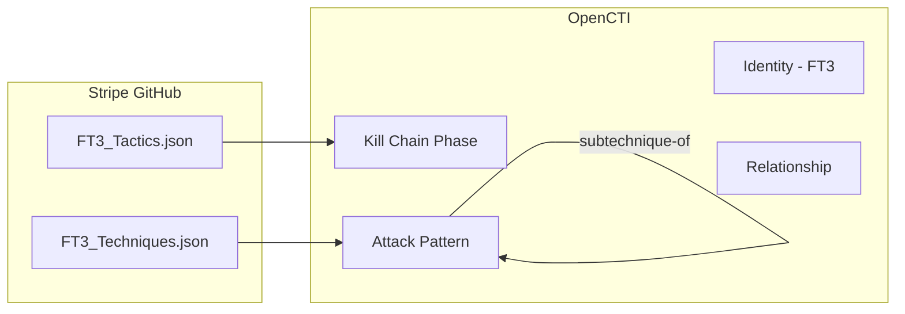

# OpenCTI FT3 Framework Connector

| Status | Date | Comment |
|--------|------|---------|
| Community | -    | -       |

The FT3 Framework connector imports the FT3 (Fraud Tactics, Techniques, and Procedures) framework from Stripe into OpenCTI.

## Table of Contents

- [OpenCTI FT3 Framework Connector](#opencti-ft3-framework-connector)
  - [Table of Contents](#table-of-contents)
  - [Introduction](#introduction)
  - [Installation](#installation)
    - [Requirements](#requirements)
  - [Configuration variables](#configuration-variables)
    - [OpenCTI environment variables](#opencti-environment-variables)
    - [Base connector environment variables](#base-connector-environment-variables)
    - [Connector extra parameters environment variables](#connector-extra-parameters-environment-variables)
  - [Deployment](#deployment)
    - [Docker Deployment](#docker-deployment)
    - [Manual Deployment](#manual-deployment)
  - [Usage](#usage)
  - [Behavior](#behavior)
  - [Debugging](#debugging)
  - [Additional information](#additional-information)

## Introduction

The [FT3 Framework](https://github.com/stripe/ft3) (Fraud Tactics, Techniques, and Procedures) is a structured approach to understanding and defending against fraud, similar to how MITRE ATT&CK works for cybersecurity. Developed by Stripe, it provides a comprehensive taxonomy of fraud tactics and techniques that organizations can use to improve their fraud detection and prevention strategies.

## Installation

### Requirements

- OpenCTI Platform >= 6.0.0
- Network access to GitHub (for FT3 JSON files)

## Configuration variables

There are a number of configuration options, which are set either in `docker-compose.yml` (for Docker) or in `config.yml` (for manual deployment).

### OpenCTI environment variables

| Parameter     | config.yml | Docker environment variable | Mandatory | Description                                          |
|---------------|------------|-----------------------------|-----------|------------------------------------------------------|
| OpenCTI URL   | url        | `OPENCTI_URL`               | Yes       | The URL of the OpenCTI platform.                     |
| OpenCTI Token | token      | `OPENCTI_TOKEN`             | Yes       | The default admin token set in the OpenCTI platform. |

### Base connector environment variables

| Parameter       | config.yml | Docker environment variable | Default       | Mandatory | Description                                                              |
|-----------------|------------|-----------------------------|---------------|-----------|--------------------------------------------------------------------------|
| Connector ID    | id         | `CONNECTOR_ID`              |               | Yes       | A unique `UUIDv4` identifier for this connector instance.                |
| Connector Name  | name       | `CONNECTOR_NAME`            | FT3 Framework | No        | Name of the connector.                                                   |
| Connector Scope | scope      | `CONNECTOR_SCOPE`           | attack-pattern| No        | The scope or type of data the connector is importing.                    |
| Log Level       | log_level  | `CONNECTOR_LOG_LEVEL`       | info          | No        | Determines the verbosity of logs: `debug`, `info`, `warn`, or `error`.   |

### Connector extra parameters environment variables

| Parameter       | config.yml        | Docker environment variable | Default                                                                              | Mandatory | Description                          |
|-----------------|-------------------|------------------------------|--------------------------------------------------------------------------------------|-----------|--------------------------------------|
| Interval        | ft3.interval      | `FT3_INTERVAL`               | 7                                                                                    | No        | Polling interval in days.            |
| Tactics URL     | ft3.tactics_url   | `FT3_TACTICS_URL`            | https://raw.githubusercontent.com/stripe/ft3/refs/heads/master/FT3_Tactics.json     | No        | URL to FT3 tactics JSON.             |
| Techniques URL  | ft3.techniques_url| `FT3_TECHNIQUES_URL`         | https://raw.githubusercontent.com/stripe/ft3/refs/heads/master/FT3_Techniques.json  | No        | URL to FT3 techniques JSON.          |

## Deployment

### Docker Deployment

Build the Docker image:

```bash
docker build -t opencti/connector-ft3:latest .
```

Configure the connector in `docker-compose.yml`:

```yaml
  connector-ft3:
    image: opencti/connector-ft3:latest
    environment:
      - OPENCTI_URL=http://localhost
      - OPENCTI_TOKEN=ChangeMe
      - CONNECTOR_ID=ChangeMe
      - CONNECTOR_NAME=FT3 Framework
      - CONNECTOR_SCOPE=attack-pattern
      - CONNECTOR_LOG_LEVEL=info
      - FT3_INTERVAL=7
    restart: always
```

Start the connector:

```bash
docker compose up -d
```

### Manual Deployment

1. Create `config.yml` based on `config.yml.sample`.

2. Install dependencies:

```bash
pip3 install -r requirements.txt
```

3. Start the connector:

```bash
cd src
python3 -m src
```

## Usage

The connector runs automatically at the interval defined by `FT3_INTERVAL`. To force an immediate run:

**Data Management → Ingestion → Connectors**

Find the connector and click the refresh button to reset the state and trigger a new data fetch.

## Behavior

The connector fetches the FT3 framework from GitHub and imports it into OpenCTI as attack patterns with kill chain phases.

### Data Flow



### Entity Mapping

| FT3 Data              | OpenCTI Entity      | Description                                          |
|-----------------------|---------------------|------------------------------------------------------|
| Tactic                | Kill Chain Phase    | Fraud tactic as `ft3` kill chain phase               |
| Technique             | Attack Pattern      | Fraud technique mapped as attack pattern             |
| Sub-technique         | Attack Pattern      | Child technique with relationship                    |
| -                     | Identity            | "FT3 Framework" as author                            |
| -                     | Relationship        | `subtechnique-of` between techniques                 |

### FT3 Framework Structure

The FT3 framework is organized into fraud-specific phases:

| Phase                    | Description                                   |
|--------------------------|-----------------------------------------------|
| Reconnaissance           | Gathering information about targets           |
| Resource Development     | Building attack infrastructure                |
| Initial Access           | Gaining entry to systems/accounts             |
| Execution                | Running fraudulent operations                 |
| Persistence              | Maintaining fraudulent access                 |
| Defense Evasion          | Avoiding detection                            |
| Collection               | Gathering valuable data                       |
| Exfiltration             | Extracting money or data                      |
| Impact                   | Achieving fraudulent objectives               |

### Processing Details

1. **Tactics Import**:
   - Downloads tactics JSON from GitHub
   - Creates kill chain phases with `kill_chain_name: ft3`
   - Maps each tactic to appropriate phase

2. **Techniques Import**:
   - Downloads techniques JSON from GitHub
   - Creates attack patterns for each technique
   - Links to corresponding kill chain phase
   - Creates `subtechnique-of` relationships

3. **Author Identity**:
   - All objects created reference "FT3 Framework" identity

## Debugging

Enable verbose logging:

```env
CONNECTOR_LOG_LEVEL=debug
```

Common issues:
- **Network errors**: Verify access to GitHub raw content
- **JSON format**: Ensure the FT3 JSON files are valid
- **Kill chain conflicts**: Check for naming conflicts with other frameworks

## Additional information

### About FT3

- **Website**: [stripe/ft3](https://github.com/stripe/ft3)
- **Developed by**: Stripe
- **Purpose**: Structured fraud analysis and defense

### Data Sources

The connector downloads two JSON files from the FT3 framework repository:
- **Tactics**: https://raw.githubusercontent.com/stripe/ft3/refs/heads/master/FT3_Tactics.json
- **Techniques**: https://raw.githubusercontent.com/stripe/ft3/refs/heads/master/FT3_Techniques.json

### Use Cases

| Use Case               | Description                                       |
|------------------------|---------------------------------------------------|
| Fraud Analysis         | Map observed fraud to known techniques            |
| Defense Planning       | Develop fraud countermeasures                     |
| Risk Assessment        | Evaluate exposure to fraud tactics                |
| Reporting              | Standardized language for fraud reports           |

### Related Frameworks

| Framework          | Focus                                |
|--------------------|--------------------------------------|
| MITRE ATT&CK       | Cyber attack techniques              |
| DISARM             | Disinformation operations            |
| FT3                | Fraud tactics and techniques         |
