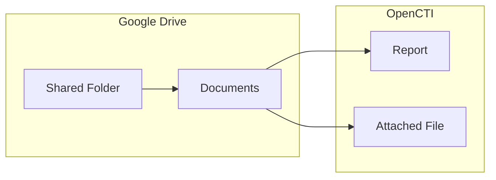

# OpenCTI Google Drive Connector

The Google Drive connector imports documents from a Google Drive folder and creates reports in OpenCTI.

| Status            | Date | Comment |
|-------------------|------|---------|
| Filigran Verified | -    | -       |

## Table of Contents

- [OpenCTI Google Drive Connector](#opencti-google-drive-connector)
  - [Table of Contents](#table-of-contents)
  - [Introduction](#introduction)
  - [Installation](#installation)
    - [Requirements](#requirements)
    - [Google Service Account Setup](#google-service-account-setup)
  - [Configuration variables](#configuration-variables)
    - [OpenCTI environment variables](#opencti-environment-variables)
    - [Base connector environment variables](#base-connector-environment-variables)
    - [Connector extra parameters environment variables](#connector-extra-parameters-environment-variables)
  - [Deployment](#deployment)
    - [Docker Deployment](#docker-deployment)
    - [Manual Deployment](#manual-deployment)
  - [Usage](#usage)
  - [Behavior](#behavior)
  - [Debugging](#debugging)
  - [Additional information](#additional-information)

## Introduction

This connector monitors a Google Drive folder and imports documents as reports into OpenCTI. It uses a Google Service Account for authentication and can process various document types including PDFs and text files.

## Installation

### Requirements

- OpenCTI Platform >= 6.x
- Google Cloud project with Drive API enabled
- Google Service Account with access to the target folder

### Google Service Account Setup

1. Create a new project in the [Google Cloud Console](https://console.cloud.google.com/)
2. Enable the Google Drive API for the project
3. Create Service Account credentials:
   - Go to **APIs & Services → Credentials**
   - Click **Create Credentials → Service Account**
   - Grant Editor access to the service account
4. Create and download JSON keys:
   - Select the service account
   - Go to **Keys → Add Key → Create new key**
   - Select JSON format and download
5. Share the Google Drive folder:
   - In Google Drive, right-click the target folder
   - Click **Share** and add the service account email address

## Configuration variables

There are a number of configuration options, which are set either in `docker-compose.yml` (for Docker) or in `config.yml` (for manual deployment).

### OpenCTI environment variables

| Parameter     | config.yml | Docker environment variable | Mandatory | Description                                          |
|---------------|------------|-----------------------------|-----------|------------------------------------------------------|
| OpenCTI URL   | url        | `OPENCTI_URL`               | Yes       | The URL of the OpenCTI platform.                     |
| OpenCTI Token | token      | `OPENCTI_TOKEN`             | Yes       | The default admin token set in the OpenCTI platform. |

### Base connector environment variables

| Parameter         | config.yml      | Docker environment variable   | Default        | Mandatory | Description                                                                 |
|-------------------|-----------------|-------------------------------|----------------|-----------|-----------------------------------------------------------------------------|
| Connector ID      | id              | `CONNECTOR_ID`                |                | Yes       | A unique `UUIDv4` identifier for this connector instance.                   |
| Connector Name    | name            | `CONNECTOR_NAME`              | Google Drive   | No        | Name of the connector.                                                      |
| Connector Scope   | scope           | `CONNECTOR_SCOPE`             | google-drive   | No        | The scope or type of data the connector is importing.                       |
| Log Level         | log_level       | `CONNECTOR_LOG_LEVEL`         | info           | No        | Determines the verbosity of the logs: `debug`, `info`, `warn`, or `error`.  |

### Connector extra parameters environment variables

| Parameter          | config.yml                  | Docker environment variable     | Default | Mandatory | Description                                      |
|--------------------|-----------------------------|---------------------------------|---------|-----------|--------------------------------------------------|
| Folder ID          | google_drive.folder_id      | `GOOGLE_DRIVE_FOLDER_ID`        |         | Yes       | Google Drive folder ID to monitor.               |
| Service Account    | google_drive.service_account| `GOOGLE_DRIVE_SERVICE_ACCOUNT`  |         | Yes       | Service account JSON (base64 encoded or path).   |
| Interval           | google_drive.interval       | `GOOGLE_DRIVE_INTERVAL`         | 5       | Yes       | Interval in minutes between connector runs.      |

## Deployment

### Docker Deployment

Build the Docker image:

```bash
docker build -t opencti/connector-google-drive:latest .
```

Configure the connector in `docker-compose.yml`:

```yaml
  connector-google-drive:
    image: opencti/connector-google-drive:latest
    environment:
      - OPENCTI_URL=http://localhost
      - OPENCTI_TOKEN=ChangeMe
      - CONNECTOR_ID=ChangeMe
      - CONNECTOR_NAME=Google Drive
      - CONNECTOR_SCOPE=google-drive
      - CONNECTOR_LOG_LEVEL=info
      - GOOGLE_DRIVE_FOLDER_ID=ChangeMe
      - GOOGLE_DRIVE_INTERVAL=5 # In minutes
      - GOOGLE_DRIVE_SERVICE_ACCOUNT=<base64-encoded-json>
    restart: always
```

Start the connector:

```bash
docker compose up -d
```

### Manual Deployment

1. Create `config.yml` based on the provided sample.

2. Install dependencies:

```bash
pip3 install -r requirements.txt
```

3. Start the connector:

```bash
python3 main.py
```

## Usage

The connector runs automatically at the interval defined by `GOOGLE_DRIVE_INTERVAL`. To force an immediate run:

**Data Management → Ingestion → Connectors**

Find the connector and click the refresh button to reset the state and trigger a new sync.

## Behavior

The connector monitors a Google Drive folder and imports new documents as reports.

### Data Flow



### Entity Mapping

| Google Drive Data  | OpenCTI Entity      | Description                                      |
|--------------------|---------------------|--------------------------------------------------|
| Document           | Report              | Report with document metadata                    |
| File Content       | Attached File       | Original file attached to report                 |

### Processing Details

1. **Folder Monitoring**: Scans the specified Google Drive folder for new files
2. **Document Import**: Downloads and imports documents as OpenCTI reports
3. **Incremental Sync**: Only processes new or modified files since last run

## Debugging

Enable verbose logging:

```env
CONNECTOR_LOG_LEVEL=debug
```

## Additional information

- **Folder ID**: Find the folder ID in the Google Drive URL after `/folders/`
- **Service Account**: Can be provided as base64-encoded JSON or file path
- **Permissions**: Service account needs at least Viewer access to the folder
- **Supported Formats**: PDF, text documents, and other standard file types
- **Reference**: [Google Drive API](https://developers.google.com/drive/api)
