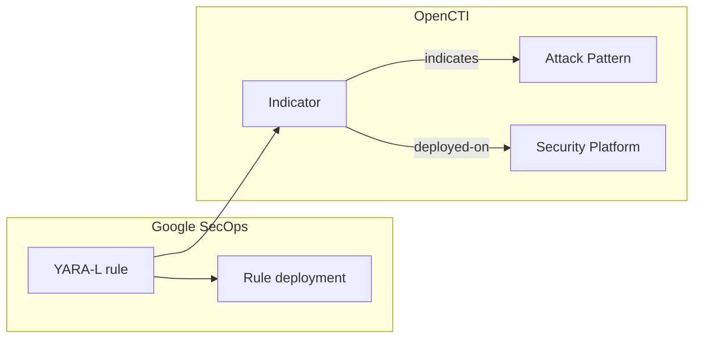

# OpenCTI Google SecOps Detection Rules Connector

| Status              | Date | Comment |
|---------------------|------|---------|
| Filigran Maintained | -    | -       |

Table of Contents

- [OpenCTI Google SecOps Detection Rules Connector](#opencti-google-secops-detection-rules-connector)
  - [Introduction](#introduction)
  - [Installation](#installation)
    - [Requirements](#requirements)
    - [Service account](#service-account)
  - [Configuration variables](#configuration-variables)
  - [Deployment](#deployment)
    - [Docker Deployment](#docker-deployment)
    - [Manual Deployment](#manual-deployment)
  - [Usage](#usage)
  - [Behavior](#behavior)
    - [Entity mapping](#entity-mapping)
    - [Deployment status and reconciliation](#deployment-status-and-reconciliation)
    - [ATT&CK techniques](#attck-techniques)
    - [Log source](#log-source)
    - [The deployed-on relationship](#the-deployed-on-relationship)
  - [Debugging](#debugging)
  - [Additional information](#additional-information)

## Introduction

This connector imports the YARA-L 2.0 detection rules of a
[Google Security Operations](https://cloud.google.com/security/products/security-operations) (Google
SecOps, formerly Chronicle) instance into OpenCTI. Each rule becomes an Indicator whose pattern is the rule
text, linked to the MITRE ATT&CK techniques the rule detects and recorded as deployed on the Google SecOps
platform with its current status.

Together with the other deployed-rule importers (Microsoft Sentinel, Splunk, Elastic Security,
CrowdStrike Falcon), it feeds the detection layer of the OpenCTI Threat-Informed Defense Matrix: for each
technique used by the threats you track, which rules exist, where they run, and whether they are live.

The connector is read-only on the Google side: it only lists rules and rule deployments through the
[Chronicle API](https://cloud.google.com/chronicle/docs/reference/rest), and never creates, modifies,
enables or archives a rule.

## Installation

### Requirements

- OpenCTI Platform >= 7.261002.0 for the `deployed-on` relationship and the rule metadata properties.
  Older platforms are supported: deployments are then recorded as `related-to` relationships (see
  [The deployed-on relationship](#the-deployed-on-relationship)).
- `pycti==7.261002.0`, the connectors SDK and `google-auth` (`src/requirements.txt`).
- A Google SecOps instance bound to a Google Cloud project (the Chronicle API is enabled on that project).
- Network access to `oauth2.googleapis.com` and to the regional Chronicle API endpoint
  (`<region>-chronicle.googleapis.com`).

### Service account

1. In the Google Cloud project bound to Google SecOps, create a service account and a JSON key for it.
2. Grant the service account the **Chronicle API Viewer** role (`roles/chronicle.viewer`) on the project.
   It includes `chronicle.rules.list` and `chronicle.ruleDeployments.list`. No write permission is
   required.
3. Copy `client_email`, `private_key` and `private_key_id` from the JSON key into the configuration.

The connector authenticates as the service account with the Google auth library (OAuth 2.0 JWT bearer
flow, scope `https://www.googleapis.com/auth/cloud-platform`).

## Configuration variables

Find all the configuration variables available here: [Connector Configurations](./__metadata__/CONNECTOR_CONFIG_DOC.md)

_The `opencti` and `connector` options in the `docker-compose.yml` and `config.yml` are the same as for any other connector.
For more information regarding variables, please refer to [OpenCTI's documentation on connectors](https://docs.opencti.io/latest/deployment/connectors/)._

Connector-specific variables:

| Docker environment variable | `config.yml` key | Required | Default | Description |
|---|---|---|---|---|
| `GOOGLE_SECOPS_RULES_PROJECT_ID` | `google_secops_rules.project_id` | Yes | | Google Cloud project bound to the Google SecOps instance (project id or number). |
| `GOOGLE_SECOPS_RULES_PROJECT_REGION` | `google_secops_rules.project_region` | Yes | | Region of the instance: `us`, `europe`, `europe-west2`, `asia-southeast1`, ... |
| `GOOGLE_SECOPS_RULES_PROJECT_INSTANCE` | `google_secops_rules.project_instance` | Yes | | Instance (customer) id, a UUID shown in **SIEM Settings -> Profile**. |
| `GOOGLE_SECOPS_RULES_CLIENT_EMAIL` | `google_secops_rules.client_email` | Yes | | Email of the service account. |
| `GOOGLE_SECOPS_RULES_PRIVATE_KEY` | `google_secops_rules.private_key` | Yes | | Private key of the service account (PEM). Literal `\n` sequences are turned into line breaks, so the key can be set on one line. |
| `GOOGLE_SECOPS_RULES_PRIVATE_KEY_ID` | `google_secops_rules.private_key_id` | No | | Id of that private key. |
| `GOOGLE_SECOPS_RULES_TOKEN_URI` | `google_secops_rules.token_uri` | No | `https://oauth2.googleapis.com/token` | OAuth 2.0 token endpoint of the service account. |
| `GOOGLE_SECOPS_RULES_BASE_URL` | `google_secops_rules.base_url` | No | `https://chronicle.googleapis.com` | Chronicle API endpoint; the region is prefixed to its host (`https://europe-chronicle.googleapis.com`). |
| `GOOGLE_SECOPS_RULES_API_VERSION` | `google_secops_rules.api_version` | No | `v1alpha` | Chronicle API version: `v1alpha`, `v1beta` or `v1`. |
| `GOOGLE_SECOPS_RULES_IMPORT_DISABLED_RULES` | `google_secops_rules.import_disabled_rules` | No | `true` | Import rules that are not live with the status `deployed`. When `false`, they are left out (and count as removed). |
| `GOOGLE_SECOPS_RULES_PAGE_SIZE` | `google_secops_rules.page_size` | No | `1000` | Rules and rule deployments requested per page (1 to 1000). |
| `GOOGLE_SECOPS_RULES_REQUEST_TIMEOUT` | `google_secops_rules.request_timeout` | No | `60` | Timeout of each HTTP request, in seconds. |
| `GOOGLE_SECOPS_RULES_MAX_RETRIES` | `google_secops_rules.max_retries` | No | `5` | Retries on 429, 5xx and network errors, with exponential backoff honoring `Retry-After`. |
| `GOOGLE_SECOPS_RULES_PLATFORM_NAME` | `google_secops_rules.platform_name` | No | `Google SecOps` | Name of the Security Platform in OpenCTI. Use one name per instance. |
| `GOOGLE_SECOPS_RULES_PLATFORM_ID` | `google_secops_rules.platform_id` | No | | Id (internal or STIX) of an existing Security Platform in OpenCTI, for example the one the Google SecOps stream connector of the same instance reports to. Takes precedence over the platform name and type: the rules are deployed on that platform, which the connector references and never rewrites. A run fails when the id is not a Security Platform. |
| `GOOGLE_SECOPS_RULES_PLATFORM_TYPE` | `google_secops_rules.platform_type` | No | `SIEM` | `security_platform_type` of that platform: `SIEM`, `EDR`, `XDR`, `SOAR`, `NDR` or `ISPM`. |
| `GOOGLE_SECOPS_RULES_TLP_LEVEL` | `google_secops_rules.tlp_level` | No | `amber` | TLP marking of every imported object. |

The connector runs every `CONNECTOR_DURATION_PERIOD` (default `PT6H`); every run reads the full rule set.

## Deployment

### Docker Deployment

Build a Docker Image using the provided `Dockerfile`:

```shell
docker build . -t opencti/connector-google-secops-rules:latest
```

Set the environment variables in `docker-compose.yml` (at least `OPENCTI_URL`, `OPENCTI_TOKEN`,
`CONNECTOR_ID` and the five required `GOOGLE_SECOPS_RULES_*` variables), then:

```shell
docker compose up -d
```

### Manual Deployment

Create `config.yml` from `config.yml.sample` and fill in the `ChangeMe` values. Then, in a virtual
environment:

```shell
cd src
pip3 install -r requirements.txt
python3 main.py
```

`entrypoint.sh` starts the connector the same way from `/opt/opencti-connector-google-secops-rules`.

## Usage

The connector runs on its schedule. To trigger a run immediately, go to **Data management ->
Ingestion -> Connectors**, open the connector and reset its state: the next run happens right away and
re-reads every rule.

## Behavior



Each run lists the rules of the instance (`GET .../rules?view=FULL`, which returns the YARA-L text and the
`meta` section) and the deployment of every rule (`GET .../rules/-/deployments`), both paginated.

### Entity mapping

| Google SecOps rule | OpenCTI |
|---|---|
| `text` (YARA-L 2.0) | Indicator `pattern`, `pattern_type: yara-l` |
| `displayName` (or `meta` `rule_name`), `meta` `description` | Indicator `name`, `description` |
| `createTime` (or `revisionCreateTime`) | Indicator `valid_from`, `deployed-on` `deployed_at` |
| `severity.displayName` (or `meta` `severity`) | Indicator `x_opencti_rule_level` (`informational`, `low`, `medium`, `high`, `critical`) |
| UDM `metadata.event_type` of the `events` section, `meta` `platform` | Indicator `x_opencti_rule_logsource` and `x_mitre_platforms` (see [Log source](#log-source)) |
| Rule id (`ru_<uuid>`, last segment of `name`) | External reference `external_id`, `deployed-on` `external_id` |
| ATT&CK ids of the `meta` section and of the rule name | `indicates` relationships to Attack Patterns |
| Deployment `enabled` | `deployed-on` `deployment_status`: `active` (live) or `deployed` (not live) |

Every object carries the `Google` author and the configured TLP marking. The Security Platform identity
(`identity_class: securityplatform`, `security_platform_type: SIEM` by default) is named after
`GOOGLE_SECOPS_RULES_PLATFORM_NAME`. When `GOOGLE_SECOPS_RULES_PLATFORM_ID` designates an existing Security Platform, the deployments target that platform instead, which the bundles reference without carrying its identity.

### Deployment status and reconciliation

A rule whose deployment is enabled (a live rule, whatever its run frequency) gets the status `active`,
whether alerting is on or off: a live rule without alerting still produces detections. A rule that is not
live, or has no deployment, gets `deployed`. Archived rules cannot run: they are left out and counted as
`archived` in the run summary.

Every run sends, for each rule, its Indicator and its deployment with `last_sync_at` set to the time of
the run. The connector state keeps the Indicator of every rule imported by the previous run, so that:

- a rule deleted or archived since the previous run gets the status `removed` and a `removed_at` time;
- a rule whose text changed (a new revision) gets a new Indicator; the Indicator of the previous text gets
  the status `removed`.

A removed rule whose Indicator was deleted from OpenCTI in the meantime is skipped. If OpenCTI cannot be
asked whether the Indicator still exists, the removal is retried on the next run.

### ATT&CK techniques

Techniques are read, in this order, from:

1. the `meta` keys naming techniques (any key containing `mitre`, `attack`, `att&ck`, `technique` or
   `ttp`, such as `technique`, `mitre_attack_technique_id` or `ttp`): every technique id they hold, in any
   case, separated by commas, semicolons, pipes or spaces (`technique = "T1059.001, T1027"`);
2. any `meta` value: standalone uppercase ids (`T1059`, `T1059.001`) and ATT&CK links
   (`reference = "https://attack.mitre.org/techniques/T1021/002/"`, `mitre_attack_url = ...`);
3. the rule name, where ids are written as identifiers (`mitre_attack_T1021_002_windows_admin_share`).

Tactics (`tactic = "TA0005"`, `mitre_attack_tactic = "Defense Evasion"`) and technique names create no
relationship. Each technique gives an `indicates` relationship from the rule Indicator to the Attack
Pattern whose id is derived from the MITRE id, which is the id of the technique imported by the MITRE
ATT&CK connector. Once per run, OpenCTI is asked which techniques it already holds: those are referenced
as they are and never renamed or re-attributed. A technique OpenCTI does not hold yet is created under its
MITRE id; the MITRE ATT&CK connector gives it its name when it imports it.

### Log source

The `x_opencti_rule_logsource` property describes the telemetry the rule needs, in Sigma terms:

- `category`: when every `metadata.event_type = "..."` condition of the rule names UDM event types of the
  same category: `PROCESS_LAUNCH` -> `process_creation`, `PROCESS_TERMINATION` -> `process_termination`,
  `PROCESS_MODULE_LOAD` -> `image_load`, `NETWORK_CONNECTION` -> `network_connection`, `NETWORK_DNS` ->
  `dns_query`, `NETWORK_HTTP` -> `proxy`, `FILE_CREATION` -> `file_event`, `FILE_MODIFICATION` ->
  `file_change`, `FILE_DELETION` -> `file_delete`, `FILE_OPEN` -> `file_access`, `REGISTRY_CREATION` ->
  `registry_add`, `REGISTRY_MODIFICATION` -> `registry_set`, `REGISTRY_DELETION` -> `registry_delete`;
- `product`: the `meta` `platform` value, lowercased (`Windows` -> `windows`, `AWS` -> `aws`,
  `Google Workspace` -> `google_workspace`). `windows`, `linux` and `macos` also fill `x_mitre_platforms`.

### The deployed-on relationship

The `deployed-on` relationship (Indicator -> Security Platform) and its `deployment_status`,
`external_id`, `deployed_at`, `last_sync_at` and `removed_at` properties are defined by the OpenCTI
dissemination assurance feature
([OpenCTI-Platform/opencti#18680](https://github.com/OpenCTI-Platform/opencti/issues/18680)). Once per
run, the connector checks the relationship schema of the platform (`schemaRelationsTypesMapping`). When
`deployed-on` is not defined between an Indicator and a Security Platform, it records each deployment as
a `related-to` relationship described as `Deployed on <platform> (status: <status>, rule id: <rule_id>)`
instead, and logs one warning per run.

## Debugging

Set `CONNECTOR_LOG_LEVEL=debug` for verbose logs. Each run logs the rules read and how many are live,
alerting and archived, then a summary: rules imported, active, not live, removed, techniques linked, rules
left out per reason (`archived`, `no_text`, `disabled`, ...) and the relationship used for deployments.
Throttled (429), failing (5xx) and unreachable requests are logged with the delay before the next attempt.
A rejected access token is renewed once; rejected service account credentials stop the run with the error
returned by Google.

## Additional information

- Chronicle API: [`rules.list`](https://cloud.google.com/chronicle/docs/reference/rest/v1alpha/projects.locations.instances.rules/list)
  and [`rules.deployments.list`](https://cloud.google.com/chronicle/docs/reference/rest/v1alpha/projects.locations.instances.rules.deployments/list).
- Curated detections managed by Google are not rules of the instance and are not imported.
- One connector instance reads one Google SecOps instance; deploy one connector per instance (with
  distinct `CONNECTOR_ID` and `GOOGLE_SECOPS_RULES_PLATFORM_NAME` or `GOOGLE_SECOPS_RULES_PLATFORM_ID`).
- Switching from the platform name to a platform id (or between ids) moves the deployments: the
  previous platform gets every deployment marked `removed` and the new one gets the current ones.
