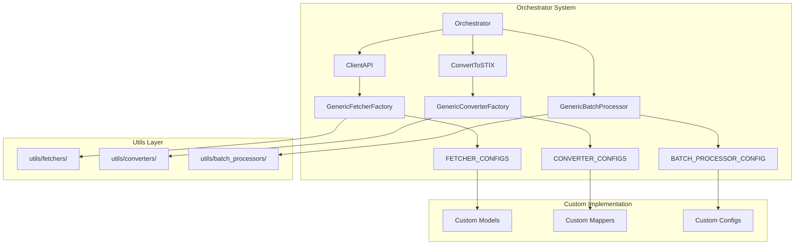

# Contributing to Google Threat Intelligence Feeds Connector

Thank you for your interest in contributing to the Google Threat Intelligence (GTI) Feeds connector for OpenCTI. This document provides guidelines and explains the project structure to help you contribute effectively.

## TL;DR: Contribution Checklist

Use this checklist to guide your journey through implementing a new feature or entity type:

- [ ] **Understand the Architecture**
  - [ ] Review the orchestrator system components
  - [ ] Understand the factory pattern implementation
  - [ ] Familiarize yourself with STIX 2.1 mapping concepts

- [ ] **Implement the Data Model**
  - [ ] Create a Pydantic model in `models/gti_reports/`
  - [ ] Define proper validation and field types
  - [ ] Add response models for API interactions

- [ ] **Set Up Exception Handling**
  - [ ] Create appropriate exception classes
  - [ ] Update `__init__.py` files to expose the exceptions
  - [ ] Follow the established exception hierarchy

- [ ] **Configure the System**
  - [ ] Register fetcher configuration in `FETCHER_CONFIGS`
  - [ ] Register converter configuration in `CONVERTER_CONFIGS`
  - [ ] Update ClientAPI entity extraction if needed

- [ ] **Create the STIX Mapper**
  - [ ] Implement a mapper class in `mappers/gti_reports/`
  - [ ] Extend `BaseMapper` and implement `to_stix()` method
  - [ ] Map all relevant fields to STIX objects

- [ ] **Testing**
  - [ ] Create mock API responses
  - [ ] Test fetching and processing logic
  - [ ] Verify STIX conversion accuracy
  - [ ] Check integration with other entity types

- [ ] **Documentation**
  - [ ] Update relevant documentation
  - [ ] Add examples if necessary

## Table of Contents
1. [System Architecture Overview](#system-architecture-overview)
2. [Core Workflow](#core-workflow)
3. [Quick Start Guide](#quick-start-guide)
4. [Code Organization](#code-organization)
5. [Key Components](#key-components)
6. [Adding New Features](#adding-new-features)
7. [Development Best Practices](#development-best-practices)
8. [Error Handling](#error-handling)
9. [Testing Strategy](#testing-strategy)
10. [Common Issues and Solutions](#common-issues-and-solutions)

## System Architecture Overview

The GTI Feeds connector is built on a modular orchestrator system with three core components: **Fetchers**, **Converters**, and **Batch Processors**. This architecture enables flexible data source integration and entity type support through factory patterns.



## Core Workflow

The system follows a standardized workflow for processing threat intelligence data:

1. **Fetch Reports** from the external API
2. **Extract Subentity IDs** from report relationships
3. **Fetch Subentity Details** using the fetcher factory system
4. **Convert to STIX** using the converter factory system
5. **Batch Process** using the batch processor system

## Quick Start Guide

### Adding a New Entity Type

- [ ] **Step 1**: Create the data model in `models/gti_reports/`
- [ ] **Step 2**: Create the mapper class in `mappers/gti_reports/`
- [ ] **Step 3**: Register fetcher configuration in `configs/fetcher_configs.py`
- [ ] **Step 4**: Register converter configuration in `configs/converter_configs.py`
- [ ] **Step 5**: Update ClientAPI entity extraction if needed
- [ ] **Step 6**: Test the integration

### Adding a New Data Source

- [ ] **Step 1**: Analyze the API structure
- [ ] **Step 2**: Create data models
- [ ] **Step 3**: Create mapper classes
- [ ] **Step 4**: Create new configs following GTI pattern
- [ ] **Step 5**: Update orchestrator class
- [ ] **Step 6**: Test end-to-end workflow

## Code Organization

The connector follows a clean architecture with clear separation of concerns:

```
connector/src/custom/
├── configs/                    # Configuration definitions
│   ├── gti_config.py          # Main GTI configuration
│   ├── fetcher_configs.py     # Fetcher configurations registry
│   ├── converter_configs.py   # Converter configurations registry
│   ├── batch_processor_config.py # Batch processor config
│   └── __init__.py           # Config exports
├── exceptions/                 # Exception hierarchy
│   ├── fetch_errors/          # Fetching-related exceptions
│   ├── convert_errors/        # Conversion-related exceptions
│   └── connector_errors/      # General connector exceptions
├── mappers/                   # STIX transformation logic
│   └── gti_reports/           # GTI-specific mappers
├── models/                    # Pydantic data models
│   └── gti_reports/           # GTI API response models
├── orchestrators/             # Workflow orchestration
│   └── orchestrator.py       # Main orchestrator
├── client_api.py              # GTI API client wrapper
└── convert_to_stix.py         # STIX conversion wrapper
```

## Key Components

### Factory Pattern Implementation

The system uses factory patterns to create configured instances:

```python
# Fetcher Factory
fetcher_factory = GenericFetcherFactory(
    api_client=api_client,
    base_headers=headers,
    logger=logger
)

# Register configurations
for entity_type, config in FETCHER_CONFIGS.items():
    factory.register_config(entity_type, config)

# Converter Factory
converter_factory = GenericConverterFactory(
    global_dependencies={"organization": org, "tlp_marking": tlp},
    logger=logger
)

# Register configurations
for entity_type, config in CONVERTER_CONFIGS.items():
    factory.register_config(entity_type, config)
```

### Configuration-Driven Architecture

All behavior is defined through configuration objects:

- **GenericFetcherConfig**: Defines how to fetch specific entity types
- **GenericConverterConfig**: Defines how to convert entities to STIX
- **GenericBatchProcessorConfig**: Defines how to batch process STIX objects

### Core Components

- **Orchestrator**: Coordinates the entire workflow
- **ClientAPI**: Handles external API interactions
- **ConvertToSTIX**: Manages STIX conversion process

## Adding New Features

### Adding New Entity Types

To add support for a new entity type, follow these steps:

#### Step 1: Create the Data Model

```python
# File: src/custom/models/gti_reports/gti_{entity_type}_model.py
from pydantic import BaseModel, Field
from typing import List, Optional, Dict, Union

class {EntityType}Model(BaseModel):
    """Model representing a GTI {entity_type}."""
    name: str = Field(..., description="{EntityType} name")
    creation_date: int = Field(..., description="Creation date (UTC timestamp)")
    last_modification_date: int = Field(..., description="Last modification date")
    # Add other fields based on GTI API response

class GTI{EntityType}Data(BaseModel):
    """Model representing data for a GTI {entity_type}."""
    id: str
    type: str = Field("{entity_type}")
    links: Optional[Dict[str, str]] = None
    attributes: Optional[{EntityType}Model] = None

class GTI{EntityType}Response(BaseModel):
    """Model representing a response containing GTI {entity_type} data."""
    data: Union[GTI{EntityType}Data, List[GTI{EntityType}Data]]
```

#### Step 2: Create the Mapper Class

```python
# File: src/custom/mappers/gti_reports/gti_{entity_type}_to_stix_{stix_type}.py
from stix2.v21 import {STIXObjectType}, Identity, MarkingDefinition
from connector.src.utils.converters.generic_converter_config import BaseMapper

class GTI{EntityType}ToSTIX{STIXObjectType}(BaseMapper):
    """Converts GTI {entity_type} to STIX {stix_type}."""

    def __init__(self, entity_data: GTI{EntityType}Data, organization: Identity, tlp_marking: MarkingDefinition):
        self.entity_data = entity_data
        self.organization = organization
        self.tlp_marking = tlp_marking

    def to_stix(self) -> {STIXObjectType}:
        """Convert GTI {entity_type} to STIX {stix_type}."""
        return {STIXObjectType}(
            name=self.entity_data.attributes.name,
            created_by_ref=self.organization.id,
            object_marking_refs=[self.tlp_marking.id],
            # Map other GTI fields to STIX properties
        )
```

#### Step 3: Register Fetcher Configuration

```python
# File: src/custom/configs/fetcher_configs.py
GTI_{ENTITY_TYPE}_FETCHER_CONFIG = GenericFetcherConfig(
    entity_type="{entity_type}",
    endpoint="/collections/{{entity_id}}",
    display_name="{entity_type}",
    exception_class=GTI{EntityType}FetchError,
    response_model=GTI{EntityType}Data,
    method="GET",
    headers={"accept": "application/json"},
    timeout=60.0,
    response_key="data",
)

# Add to registry
FETCHER_CONFIGS["{entity_type}"] = GTI_{ENTITY_TYPE}_FETCHER_CONFIG
```

#### Step 4: Register Converter Configuration

```python
# File: src/custom/configs/converter_configs.py
GTI_{ENTITY_TYPE}_CONVERTER_CONFIG = GenericConverterConfig(
    entity_type="{entity_type}",
    mapper_class=GTI{EntityType}ToSTIX{STIXObjectType},
    output_stix_type="{stix_type}",
    exception_class=GTI{EntityType}ConversionError,
    display_name="{entity_type}",
    input_model=GTI{EntityType}Data,
    display_name_singular="{entity_type_singular}",
    validate_input=True,
    postprocessing_function=create_report_linking_postprocessor(),
)

# Add to registry
CONVERTER_CONFIGS["{entity_type}"] = GTI_{ENTITY_TYPE}_CONVERTER_CONFIG
```

#### Step 5: Update ClientAPI Entity Extraction

```python
# File: src/custom/client_api.py
# Add to fetch_subentities_ids method
subentity_types = [
    "malware_families",
    "threat_actors",
    "attack_techniques",
    "vulnerabilities",
    "domains",
    "files",
    "urls",
    "ip_addresses",
    "{entity_type}",  # Add your new entity type
]
```

#### Step 6: Test the Integration

Create comprehensive tests to verify the implementation works correctly.

## Development Best Practices

### Code Organization

- **Factory Pattern**: Use factories for object creation
- **Configuration-Driven**: Define behavior through configuration objects
- **Separation of Concerns**: Keep fetching, conversion, and processing separate
- **Type Hints**: Always include comprehensive type hints

### Naming Conventions

- **Classes**: PascalCase (e.g., `Orchestrator`)
- **Functions**: snake_case (e.g., `fetch_entity_data`)
- **Constants**: UPPER_SNAKE_CASE (e.g., `FETCHER_CONFIGS`)
- **Files**: snake_case (e.g., `orchestrator.py`)

### Configuration Best Practices

- Use the existing configuration patterns
- Leverage dependency injection through factory global_dependencies
- Keep configurations centralized in config modules
- Use descriptive names and proper exception classes

### Error Handling

Follow the established exception hierarchy:

```python
# Base exceptions
GTIBaseError
├── GTIConfigurationError
├── GTIConvertingError
│   └── GTI{Entity}ConversionError
└── GTIFetchingError
    └── GTI{Entity}FetchError
```

### Testing Strategy

- **Unit Tests**: Test individual components in isolation
- **Integration Tests**: Test factory patterns and configurations
- **End-to-End Tests**: Test complete orchestrator workflows
- **Mock External APIs**: Use realistic mock responses

## Common Issues and Solutions

### Issue: Factory Registration Fails

**Symptoms**: Factory cannot create fetcher/converter instances
**Solutions**:
- Verify configuration is properly registered in the configs dictionary
- Check that all required configuration fields are provided
- Ensure exception classes and models are imported correctly

### Issue: Mapper Conversion Fails

**Symptoms**: STIX conversion throws exceptions
**Solutions**:
- Verify BaseMapper is properly extended
- Check that `to_stix()` returns actual STIX objects, not dictionaries
- Ensure all required STIX fields are populated
- Add proper null checks and default values

### Issue: Orchestrator Processing Fails

**Symptoms**: End-to-end processing fails or returns no data
**Solutions**:
- Check API client configuration and authentication
- Verify entity types are properly registered in orchestrator
- Review pagination and cursor handling
- Check batch processor configuration

### Issue: Configuration Dependencies Missing

**Symptoms**: Missing dependencies errors during factory creation
**Solutions**:
- Ensure global_dependencies are properly set in converter factory
- Check that organization and tlp_marking are available
- Verify all required imports are present

## Success Criteria

Before considering your implementation complete, ensure:

- [ ] **Functionality**: All new features work as expected with real GTI API
- [ ] **Integration**: Components integrate seamlessly with factory pattern
- [ ] **Configuration**: All behavior is properly configured, not hardcoded
- [ ] **Error Handling**: Comprehensive error handling follows established patterns
- [ ] **Testing**: All tests pass, including unit and integration tests
- [ ] **Documentation**: Code is well-documented with clear examples
- [ ] **Performance**: System performs efficiently under expected load
- [ ] **STIX Compliance**: Generated STIX objects are valid and complete

## Getting Help

- **Code Review**: Submit PRs for review by maintainers
- **Documentation**: Reference this guide and inline code documentation
- **Testing**: Run the full test suite before submitting changes
- **Issues**: Create GitHub issues for bugs or feature requests

## Implementation Checklist

### Before You Start
- [ ] Understand the current factory-based architecture
- [ ] Review existing GTI entity implementations as examples
- [ ] Set up development environment
- [ ] Plan your implementation approach

### During Implementation
- [ ] Follow the factory pattern consistently
- [ ] Use configuration objects instead of hardcoded values
- [ ] Write tests as you implement features
- [ ] Test with real GTI API responses
- [ ] Handle edge cases and error conditions
- [ ] Document your code thoroughly

### Before Production
- [ ] Run full test suite
- [ ] Test with production-like data volumes
- [ ] Verify STIX output validity
- [ ] Check performance metrics
- [ ] Update documentation
- [ ] Submit for code review

## Questions and Support

If you have questions or need help:

1. **Check Documentation**: Review this guide and inline documentation
2. **Review Examples**: Look at existing implementations in the codebase
3. **Search Issues**: Look for similar issues in the project repository
4. **Ask Questions**: Create a GitHub issue with detailed information
5. **Contribute Back**: Share your improvements with the community

Remember: Good contributions make the project better for everyone. Thank you for contributing!