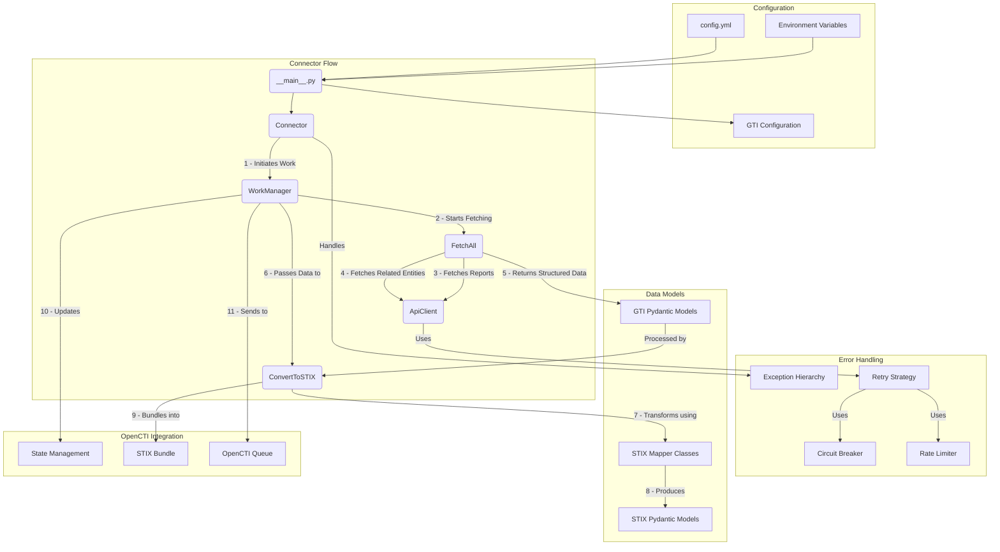

# Contributing to Google Threat Intelligence Feeds Connector

Thank you for your interest in contributing to the Google Threat Intelligence (GTI) Feeds connector for OpenCTI. This document provides guidelines and explains the project structure to help you contribute effectively.

## TL;DR: Contribution Checklist

Use this checklist to guide your journey through implementing a new feature or entity type:

- [ ] **Understand the Architecture**
  - [ ] Review the connector flow diagram
  - [ ] Understand the fetcher hierarchy and factory pattern
  - [ ] Familiarize yourself with STIX 2.1 mapping concepts

- [ ] **Implement the Data Model**
  - [ ] Create a Pydantic model in `models/gti_reports/`
  - [ ] Define proper validation and field types
  - [ ] Add response models for API interactions

- [ ] **Set Up Exception Handling**
  - [ ] Create appropriate exception classes
  - [ ] Update `__init__.py` files to expose the exceptions
  - [ ] Follow the established exception hierarchy

- [ ] **Configure the Fetcher**
  - [ ] Add an `EntityFetcherConfig` in `fetchers/entity_config.py`
  - [ ] Register the config in the `ENTITY_CONFIGS` dictionary
  - [ ] Ensure endpoint and relationship types are correct

- [ ] **Create the STIX Mapper**
  - [ ] Implement a mapper class in `mappers/gti_reports/`
  - [ ] Define the `to_stix()` method
  - [ ] Map all relevant fields to STIX objects

- [ ] **Update ConvertToSTIX**
  - [ ] Add a conversion method for your entity type
  - [ ] Update the main processing flow to include your entity
  - [ ] Ensure relationships are properly established

- [ ] **Testing**
  - [ ] Create mock API responses
  - [ ] Test fetching and processing logic
  - [ ] Verify STIX conversion accuracy
  - [ ] Check integration with other entity types

- [ ] **Documentation**
  - [ ] Update relevant documentation
  - [ ] Add examples if necessary

## Table of Contents
1. [Architecture Overview](#architecture-overview)
2. [Code Organization](#code-organization)
3. [Development Workflow](#development-workflow)
4. [Key Components](#key-components)
5. [Adding New Features](#adding-new-features)
6. [Best Practices](#best-practices)
7. [Error Handling](#error-handling)
8. [Testing](#testing)
9. [Complete Example: Adding Campaigns Support](#complete-example-adding-campaigns-support)

## Architecture Overview

The GTI Feeds connector follows a modular architecture designed to fetch, normalize, and ingest threat intelligence data from Google Threat Intelligence into OpenCTI. The connector uses asynchronous processing, handles pagination, implements comprehensive error handling, and converts data into STIX 2.1 format.



## Code Organization

The connector code is organized into several key directories:

```
connector/src/
├── custom/                  # GTI-specific implementation
│   ├── configs/             # Configuration classes
│   ├── exceptions/          # Specialized exception hierarchy
│   ├── fetchers/            # Data fetching components
│   ├── mappers/             # Data transformation to STIX
│   ├── models/              # Pydantic models for GTI data
│   ├── batch_processor.py   # Processes batches of data
│   ├── convert_to_stix.py   # Converts GTI data to STIX
│   └── fetch_all.py         # Orchestrates data fetching
├── octi/                    # OpenCTI integration
├── stix/                    # STIX models and utilities
└── utils/                   # Common utilities
```

## Development Workflow

1. **Environment Setup**: Configure your development environment with Python 3.11+
2. **Install Dependencies**: `pip install -e .[all]`
3. **Code Changes**: Make your changes following the project structure
4. **Testing**: Write and run tests for your changes
5. **Documentation**: Update relevant documentation
6. **Pull Request**: Submit a pull request with a clear description of changes

## Key Components

### Generic Fetcher Architecture

The connector uses a generic, configurable architecture for fetching data from the GTI API:

```
FetchAll (Orchestrator)
├── ReportFetcher (Reports + Pagination)
└── EntityFetcher (Coordinates all entity types via factory)
    └── FetcherFactory
        ├── GenericEntityFetcher(MalwareFamilyConfig)
        ├── GenericEntityFetcher(ThreatActorConfig)
        ├── GenericEntityFetcher(AttackTechniqueConfig)
        ├── GenericEntityFetcher(VulnerabilityConfig)
        └── RelationshipFetcher (Shared by all entity fetchers)
```

### BaseFetcher
- Base class providing common functionality
- Manages API client and headers
- Provides logging utilities and helper methods

### EntityFetcherConfig
- Configuration for entity-specific parameters
- Defines entity type names and relationship mappings
- Specifies API endpoint templates and response models
- Maps exception classes and display names

### GenericEntityFetcher
- Single implementation that handles all entity types
- Configures behavior based on EntityFetcherConfig
- Implements parallel fetching with asyncio
- Handles exceptions with graceful degradation

### FetcherFactory
- Creates configured GenericEntityFetcher instances
- Provides type-safe factory methods
- Supports bulk creation of all entity fetchers

### EntityFetcher
- Orchestrates fetching of all entity types for reports
- Implements parallel processing across entity types
- Provides flexible entity type selection

### ReportFetcher
- Handles report fetching with pagination
- Manages date filtering, sorting, and batch processing
- Supports report type and origin filtering

### ConvertToSTIX (Gonna be rework soon, working PoC legacy for now.)
- Transforms GTI data into STIX 2.1 format
- Uses specialized mapper classes for different entity types
- Maintains relationships between objects
- Creates properly formatted STIX bundles

## Adding New Features

### Adding New Entity Types

1. Define a new Pydantic model to map API response in `models/gti_reports/`
2. Create a new configuration in `fetchers/entity_config.py`:

```python
NEW_ENTITY_CONFIG = EntityFetcherConfig(
    entity_type="new_entities",
    relationship_type="new_entities",
    endpoint_template="/new_endpoint/{entity_id}",
    response_model=NewEntityResponse,
    exception_class=NewEntityFetchError,
    display_name="new entities",
    display_name_singular="new entity"
)

# Add to registry
ENTITY_CONFIGS["new_entities"] = NEW_ENTITY_CONFIG
```

3. Create a new STIX mapper in `mappers/gti_reports/`
4. Update `convert_to_stix.py` to include the new entity type

### Adding New STIX Mappings

1. Create a new mapper class in `mappers/gti_reports/`
2. Implement the `to_stix()` method to convert GTI data to STIX
3. Update `ConvertToSTIX` class to use your new mapper

## Best Practices

1. **Type Safety**: Use type hints and Pydantic models consistently
2. **Error Handling**: Follow the exception hierarchy pattern
3. **Asynchronous Code**:
   - Use `asyncio` for concurrent operations, if needed. Take care of race conditions
   - Handle task cancellation properly
   - Implement proper timeout handling
4. **Logging**:
   - Use structured logging with context
   - Log at appropriate levels
   - Include relevant identifiers in log messages
5. **Configuration**:
   - Use Pydantic for config validation
   - Implement proper defaults
   - Support both environment variables and config files

## Error Handling

The connector implements a specialized exception hierarchy:

```
GTIBaseError
├── GTIConfigurationError
├── GTIConvertingError
│   └── GTIEntityConversionError
│       ├── GTIReportConversionError
│       ├── GTIMalwareConversionError
│       ├── GTIActorConversionError
│       ├── GTITechniqueConversionError
│       └── GTIVulnerabilityConversionError
└── GTIFetchingError
    ├── GTIApiError
    │   ├── GTIReportFetchError
    │   ├── GTIMalwareFetchError
    │   ├── GTIActorFetchError
    │   ├── GTITechniqueFetchError
    │   ├── GTIVulnerabilityFetchError
    │   └── GTIRelationshipFetchError
    ├── GTIPaginationError
    └── GTIParsingError
```

When adding new features:
1. Use the appropriate exception class
2. Include context information in exceptions
3. Handle exceptions at appropriate levels
4. Implement graceful degradation when possible

## Testing

1. **Unit Tests**: Test individual components in isolation
2. **Integration Tests**: Test component interactions
3. **Mock API Responses**: Use mock data for API testing
4. **Error Scenarios**: Test failure conditions and recovery
5. **Performance Testing**: Test with realistic data volumes

### Testing New Entity Types

When adding a new entity type:
1. Create mock API responses in test fixtures
2. Test the fetching process with different scenarios
3. Test the STIX conversion with various inputs
4. Verify relationships (if any) are correctly established

## Complete Example: Adding Campaigns Support

This example walks through the complete process of adding support for GTI campaign entities to the connector.

### Step-by-Step Checklist

#### 1. Create Pydantic Models

First, create a new model file in `connector/src/custom/models/gti_reports/gti_campaign_model.py`:

```python
"""Model representing a Google Threat Intelligence Campaign."""

from typing import Dict, List, Optional, Union

from pydantic import BaseModel, Field


class CampaignModel(BaseModel):
    """Model representing a GTI campaign."""

    name: str = Field(..., description="Campaign's name.")
    creation_date: int = Field(..., description="Creation date of the campaign (UTC timestamp).")
    last_modification_date: int = Field(..., description="Date when the campaign was last updated.")
    description: Optional[str] = Field(None, description="Campaign's description.")
    objective: Optional[str] = Field(None, description="Campaign's objective.")
    first_seen: Optional[int] = Field(None, description="First observed timestamp.")
    last_seen: Optional[int] = Field(None, description="Last observed timestamp.")
    private: bool = Field(False, description="Whether the campaign object is private.")


class GTICampaignData(BaseModel):
    """Model representing data for a GTI campaign."""

    id: str
    type: str = Field("campaign")
    links: Optional[Dict[str, str]] = None
    attributes: Optional[CampaignModel] = None


class GTICampaignResponse(BaseModel):
    """Model representing a response containing GTI campaign data."""

    data: Union[GTICampaignData, List[GTICampaignData]]
```

#### 2. Create Exception Class

Add a new exception class in `connector/src/custom/exceptions/fetch_errors/gti_campaign_fetch_error.py`:

```python
"""Exception for errors when fetching campaigns from Google Threat Intelligence API."""

from typing import Any, Dict, Optional

from connector.src.custom.exceptions.fetch_errors.gti_api_error import GTIApiError


class GTICampaignFetchError(GTIApiError):
    """Exception raised when there's an error fetching campaigns from GTI API."""

    def __init__(
        self,
        message: str,
        campaign_id: Optional[str] = None,
        endpoint: Optional[str] = None,
        status_code: Optional[int] = None,
        details: Optional[Dict[str, Any]] = None,
    ):
        """Initialize the exception.

        Args:
            message: Error message
            campaign_id: ID of the campaign that failed to fetch, if applicable
            endpoint: API endpoint where the error occurred
            status_code: HTTP status code, if available
            details: Additional details about the error

        """
        error_msg = message
        if campaign_id:
            error_msg = f"Error fetching campaign {campaign_id}: {message}"
        else:
            error_msg = f"Error fetching campaigns: {message}"

        super().__init__(error_msg, status_code, endpoint, details)
        self.campaign_id = campaign_id
```

Don't forget to update the `__init__.py` in the fetch_errors directory to include your new exception.

#### 3. Add Entity Configuration

Update `connector/src/custom/fetchers/entity_config.py` to add your new entity:

```python
CAMPAIGN_CONFIG = EntityFetcherConfig(
    entity_type="campaigns",
    relationship_type="campaigns",
    endpoint_template="/collections/{entity_id}/campaigns", # Adjust based on actual GTI API
    response_model=GTICampaignResponse,
    exception_class=GTICampaignFetchError,
    display_name="campaigns",
    display_name_singular="campaign"
)

# Add to registry
ENTITY_CONFIGS["campaigns"] = CAMPAIGN_CONFIG
```

#### 4. Create STIX Mapper

Create a new mapper in `connector/src/custom/mappers/gti_reports/gti_campaign_to_stix_campaign.py`:

```python
"""Converts a GTI campaign to a STIX campaign object."""

from datetime import datetime
from typing import Dict, List, Optional

from connector.src.custom.models.gti_reports.gti_campaign_model import (
    GTICampaignData,
    CampaignModel,
)
from connector.src.stix.octi.models.campaign_model import OctiCampaignModel
from stix2.v21 import Campaign, Identity, MarkingDefinition  # type: ignore


class GTICampaignToSTIXCampaign:
    """Converts a GTI campaign to a STIX campaign object."""

    def __init__(
        self,
        campaign: GTICampaignData,
        organization: Identity,
        tlp_marking: MarkingDefinition,
    ) -> None:
        """Initialize the GTICampaignToSTIXCampaign object.

        Args:
            campaign: The GTI campaign data to convert.
            organization: The organization identity object.
            tlp_marking: The TLP marking definition.

        """
        self.campaign = campaign
        self.organization = organization
        self.tlp_marking = tlp_marking

    def to_stix(self) -> Campaign:
        """Convert the GTI campaign to a STIX campaign object.

        Returns:
            Campaign: The STIX campaign object.

        """
        if not self.campaign or not self.campaign.attributes:
            raise ValueError("Campaign attributes are missing")

        attributes = self.campaign.attributes

        created = datetime.fromtimestamp(attributes.creation_date)
        modified = datetime.fromtimestamp(attributes.last_modification_date)

        first_seen = None
        if attributes.first_seen:
            first_seen = datetime.fromtimestamp(attributes.first_seen)

        last_seen = None
        if attributes.last_seen:
            last_seen = datetime.fromtimestamp(attributes.last_seen)

        campaign_model = OctiCampaignModel.create(
            name=attributes.name,
            organization_id=self.organization.id,
            marking_ids=[self.tlp_marking.id],
            description=attributes.description,
            objective=attributes.objective,
            first_seen=first_seen,
            last_seen=last_seen,
            created=created,
            modified=modified,
        )

        return campaign_model.to_stix2_object()
```

#### 5. Update ConvertToSTIX Class

Modify `connector/src/custom/convert_to_stix.py` to add your new entity type:

1. Add a new import:
```python
from connector.src.custom.exceptions import GTICampaignConversionError
from connector.src.custom.mappers.gti_reports.gti_campaign_to_stix_campaign import GTICampaignToSTIXCampaign
from connector.src.custom.models.gti_reports.gti_campaign_model import GTICampaignData
```

2. Add a conversion method:
```python
def _convert_campaign(self, campaign: GTICampaignData) -> Optional[Campaign]:
    """Convert a GTI campaign to STIX format.

    Args:
        campaign: GTI campaign data

    Returns:
        STIX campaign object

    Raises:
        GTICampaignConversionError: If there's an error converting the campaign

    """
    try:
        self.logger.debug(f"Converting campaign {campaign.id} to STIX format")

        mapper = GTICampaignToSTIXCampaign(
            campaign, self.organization, self.tlp_marking
        )
        stix_campaign = mapper.to_stix()

        self.object_id_map[campaign.id] = stix_campaign.id

        return stix_campaign

    except Exception as e:
        self.logger.error(
            f"Error converting campaign {campaign.id}: {str(e)}",
            meta={"error": str(e)},
        )
        campaign_name = getattr(campaign.attributes, "name", None)
        raise GTICampaignConversionError(str(e), campaign.id, campaign_name) from e
```

3. Update the `convert_all_data` method to process campaigns:
```python
# Add to the section where other entities are processed
for campaign in related.get("campaigns", []):
    try:
        stix_campaign = self._convert_campaign(campaign)
        if stix_campaign is not None:
            self.stix_objects.append(stix_campaign)
            ids_to_add.append(stix_campaign.id)
    except GTICampaignConversionError as campaign_err:
        self.logger.error(
            f"Error processing campaign {campaign.id}: {str(campaign_err)}"
        )
        continue
```

#### 6. Testing Checklist

1. Create mock API responses for campaigns:
   - Create a JSON fixture with sample campaign data
   - Test parsing with the Pydantic model

2. Test the entity fetcher:
   - Verify campaigns are fetched correctly
   - Test error handling scenarios
   - Ensure pagination works as expected

3. Test the STIX conversion:
   - Verify all campaign fields are mapped correctly
   - Check edge cases (missing fields, unusual values)
   - Validate STIX schema compliance

4. Test integration with reports:
   - Verify relationships are correctly established
   - Check that campaigns appear in report object references

5. Run end-to-end tests with a mock server

#### 7. Documentation Updates

1. Update README with campaign support information
2. Document campaign fields and mapping logic
3. Add examples of campaign data to documentation

## Questions and Support

If you have questions or need help with your contribution, please:
1. Check existing issues on GitHub
2. Create a new issue with a clear description
3. Join the OpenCTI Slack community for direct support

Thank you for contributing to the Google Threat Intelligence Feeds connector!
