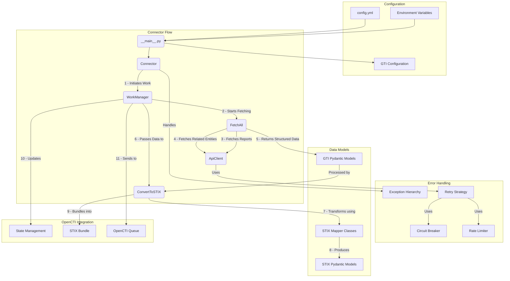

# Google Threat Intelligence Connector

---

## Introduction

Google Threat Intelligence Feeds Connector ingests threat intelligence from the Google Threat Intel API and feeds it into the OpenCTI solution, focusing -for now- on STIX entities tied to report objects.
It extracts and transforms relevant data types report, location, sector, malware, intrusion-set, attack-pattern, vulnerability, and raw IOCs delivering structured, and ingest that in an intelligible way into OpenCTI.

Most of the data is extracted from the reports, but some entities are extracted from the report's relationships.
More informations can be found in the [Google Threat Intel API documentation](https://gtidocs.virustotal.com/reference/reports).

> This connector requires a Google Threat Intel API key to function. You can obtain one by signing up for the Google Threat Intel service.5
> Reports Analysis are only available to users with the Google Threat Intelligence (Google TI) Enterprise or Enterprise Plus licenses.5

---

## Quick start

Here’s a high-level overview to get the connector up and running:

1. **Set environment variables**:
        - inside `docker-compose.yml`
2. **Pull and run the connector** using Docker:
        ```bash
        docker compose up -d
        ```
## Behavior
### **Operational Flow**



### **Execution Flow**

1. **Initialization**: The connector loads configurations and initializes components
2. **Scheduling**: The main process runs at configured intervals (via `CONNECTOR_DURATION_PERIOD`)
3. **Work Creation**: A new work object is created in OpenCTI for tracking
4. **Data Fetching**:
   - Reports are fetched from GTI API with pagination
   - For each report, related entities (malware, actors, techniques, etc.) are fetched
   - All data is structured into validated Pydantic models
5. **STIX Conversion**:
   - Each entity is converted to appropriate STIX format using specialized mappers
   - References between objects are established and maintained
   - A cohesive STIX bundle is created containing all objects
6. **State Management**:
   - The timestamp of the latest processed report is saved
   - This enables incremental processing in future runs
7. **Bundle Submission**:
   - The STIX bundle is submitted to OpenCTI's processing queue
   - The work object is marked as completed with appropriate status
8. **Error Handling**:
   - Errors are caught and classified at various levels
   - Partial processing results are returned when possible
   - Appropriate error status is reported to OpenCTI

---

##  Connector Architecture Overview

This connector is a robust pipeline designed to fetch, normalize, and ingest threat intelligence data from Google Threat Intel (GTI) into **OpenCTI**. The architecture follows a modular, type-safe approach with specialized components for each step of the process:

### **Configuration Management**

* The connector uses a **tiered configuration system** with support for:
  * Environment variables (Docker or local)
  * YAML configuration file (`config.yml`)
  * Default values when neither is provided
* **GlobalConfig** centralizes configuration using Pydantic models with validation
* **GTIConfig** provides specialized settings for the Google Threat Intel API

### **Core Components**

* **__main__.py** serves as the entrypoint, initializing the connector and its dependencies
* **Connector** class orchestrates the overall connector lifecycle and scheduling:
  * Initializes the API client and component dependencies
  * Manages periodic execution via OpenCTI scheduler
  * Handles work states and error conditions
* **WorkManager** handles OpenCTI work creation, state management, and bundle submission:
  * Creates and tracks work objects in OpenCTI
  * Maintains incremental processing state (last processed date)
  * Submits STIX bundles to the OpenCTI queue
* **FetchAll** performs asynchronous data retrieval from the GTI API:
  * Fetches reports and related entities (malware, threat actors, etc.)
  * Handles pagination and relationship traversal
  * Supports partial data processing on interruptions
* **ConvertToSTIX** transforms GTI data into STIX format using specialized mappers

### **Data Fetching Infrastructure**

* **ApiClient** provides a unified interface for API interactions:
  * Manages API request configuration and execution
  * Provides response validation and model mapping
  * Abstracts HTTP implementation details
* **RetryRequestStrategy** implements intelligent retry with exponential backoff:
  * Handles transient failures with progressive delays
  * Distinguishes between retryable and non-retryable errors
  * Preserves API context between retry attempts
* **CircuitBreaker** prevents overwhelming failing APIs:
  * Tracks consecutive failures and opens circuit when threshold is reached
  * Implements cooldown period before allowing new requests
  * Helps prevent cascading failures during API outages
* **RateLimiter** ensures compliance with API rate limits:
  * Implements token bucket algorithm for request throttling
  * Supports multiple limiter instances for different API endpoints
  * Prevents API quota exhaustion and 429 errors
* **AioHttpClient** performs the actual HTTP requests asynchronously:
  * Uses Python's asyncio for efficient concurrent requests
  * Handles connection pooling and timeouts
  * Provides specialized error handling for network conditions

### **Data Modeling & Transformation**

* **GTI Pydantic Models** provide validated structures for raw Google Threat Intel data:
  * Enforce type safety and data validation
  * Model GTI API responses with proper relationships
  * Support complex nested data structures
* **Mapper Classes** convert specific entity types with specialized handling:
  * `GTIReportToSTIXReport` for report conversion
  * `GTIMalwareFamilyToSTIXMalware` for malware conversion
  * `GTIThreatActorToSTIXIntrusionSet` for threat actors
  * `GTIAttackTechniqueToSTIXAttackPattern` for techniques
  * `GTIVulnerabilityToSTIXVulnerability` for vulnerabilities
* **STIX Models** define the standardized format for OpenCTI ingestion:
  * Implement STIX 2.1 specification objects
  * Include OpenCTI-specific extensions and properties
  * Support proper object references and relationships
* **STIX Bundle Generation** combines all objects into a standardized package:
  * Creates self-contained STIX bundles with all related objects
  * Handles reference resolution between objects
  * Ensures proper ordering of objects for ingestion

### **Error Handling**

* **Specialized Exception Hierarchy** with custom exception types:
  * `GTIBaseError` as the foundation for all connector exceptions
  * `GTIFetchingError` for data retrieval issues (API, network, parsing)
  * `GTIConvertingError` for STIX transformation problems
  * `GTIConfigurationError` for setup and configuration issues
  * Granular subtypes for specific error conditions
* **Graceful Partial Processing** to handle interruptions and API failures:
  * Tracks successfully processed entities
  * Returns partial results when possible rather than failing completely
  * Preserves state to avoid reprocessing already handled data
* **Comprehensive Logging** for operational visibility:
  * Structured logging with metadata and context
  * Progressive status updates during long-running operations
  * Clear error information for troubleshooting
* **Recovery Mechanisms**:
  * Automatic retries for transient errors
  * Circuit breaking to prevent cascading failures
  * State preservation across connector restarts

### **OpenCTI Integration**

* **State Management** to track processing progress:
  * Stores last processed modification date
  * Supports incremental processing across connector runs
  * Prevents duplicate data ingestion
* **Work-based Processing** for better integration with OpenCTI:
  * Creates and tracks OpenCTI work objects
  * Supports the OpenCTI processing model
  * Provides progress and error visibility in the OpenCTI UI
* **Standardized STIX Bundle Submission**:
  * Creates properly formatted STIX 2.1 bundles
  * Handles bundle size limits and pagination
  * Manages serialization and submission to OpenCTI queue
* **Runtime Integration**:
  * Respects OpenCTI connector settings (TLP, scope, etc.)
  * Honors queue thresholds to prevent overwhelming the system
  * Properly handles cancellation and shutdown scenarios

---

## Installation

### Requirements

- OpenCTI Platform version **6.6.10** or higher
- Docker & Docker Compose (for containerized deployment)
- Valid GTI API credentials (token)

---

## Configurations Variables

### OpenCTI Configuration

Below are the required parameters you'll need to set for OpenCTI:

| Parameter     | config.yml | Docker Environment Variable | Mandatory | Description                                    |
| ---           | ---        | ---                         | ---       | ---                                            |
| OpenCTI URL   | `url`      | `OPENCTI_URL`               | Yes       | The URL of the OpenCTI platform.               |
| OpenCTI Token | `token`    | `OPENCTI_TOKEN`             | Yes       | The API token for authenticating with OpenCTI. |

### Connector Configuration

Below are the required parameters you can set for running the connector:

| Parameter                 | config.yml        | Docker Environment Variable | Default                   | Mandatory | Description                                                                 |
| ---                       | ---               | ---                         | ---                       | ---       | ---                                                                         |
| Connector ID              | `id`              | `CONNECTOR_ID`              | /                         | Yes       | A unique `UUIDv4` identifier for this connector.                            |

Below are the optional parameters you can set for running the connector:

| Parameter                 | config.yml        | Docker Environment Variable | Default                   | Mandatory | Description                                                                 |
| ---                       | ---               | ---                         | ---                       | ---       | ---                                                                         |
| Connector Name            | `name`            | `CONNECTOR_NAME`            | Google Threat Intel Feeds | No        | The name of the connector as it will appear in OpenCTI.                     |
| Connector Scope           | `scope`           | `CONNECTOR_SCOPE`           | report,location,identity  | No        | The scope of data to import, a list of Stix Objects.                        |
| Connector Log Level       | `log_level`       | `CONNECTOR_LOG_LEVEL`       | info                      | No        | Sets the verbosity of logs. Options: `debug`, `info`, `warn`, `error`.      |
| Connector Duration Period | `duration_period` | `CONNECTOR_DURATION_PERIOD` | PT2H                      | No        | The duration period between two schedule for the connector.                 |
| Connector TLP Level       | `tlp_level`       | `CONNECTOR_TLP_LEVEL`       | AMBER+STRICT              | No        | The TLP level for the connector. Options: `WHITE`, `GREEN`, `AMBER`, `RED`. |
| Connector Queue Threshold | `queue_threshold` | `CONNECTOR_QUEUE_THRESHOLD` | 500                       | No        | The threshold for the queue size before processing.                         |

### GTI Configuration

Below are the required parameters you'll need to set for Google Threat Intel:

| Parameter                             | config.yml              | Docker Environment Variable | Default    | Mandatory | Description                                                 |
| ---                                   | ---                     | ---                         | ---        | ---       | ---                                                         |
| Google Threat Intel API Key           | `gti_api_key`           | `GTI_API_KEY`               |            | Yes       | The API key for Google Threat Intel.                        |

Below are the optional parameters you can set for Google Threat Intel:

| Parameter                                 | config.yml              | Docker Environment Variable | Default                           | Mandatory | Description                                                                                                                                                                                                                                                                                                                                                                                                                                                                                                                                               |
| ---                                       | ---                     | ---                         | ---                               | ---       | ---                                                                                                                                                                                                                                                                                                                                                                                                                                                                                                                                                       |
| Google Threat Intel Import Start Date     | `gti_import_start_date` | `GTI_IMPORT_START_DATE`     | P30D                              | No        | The start date for importing data from Google Threat Intel.                                                                                                                                                                                                                                                                                                                                                                                                                                                                                               |
| Google Threat Intel API URL               | `gti_api_url`           | `GTI_API_URL`               | https://www.virustotal.com/api/v3 | No        | The API URL for Google Threat Intel.                                                                                                                                                                                                                                                                                                                                                                                                                                                                                                                      |
| Google Threat Intel Toggle Import Reports | `gti_import_reports`    | `GTI_IMPORT_REPORTS`        | True                              | No        | If set to `True`, the connector will import reports from Google Threat Intel.                                                                                                                                                                                                                                                                                                                                                                                                                                                                             |
| Google Threat Intel Report Types          | `gti_report_types`      | `GTI_REPORT_TYPES`          | All                               | No        | The types of reports to import from Google Threat Intel. Can be a string separated by comma for multiple values. Valid values are: `All`, `Actor Profile`, `Country Profile`, `Cyber Physical Security Roundup`, `Event Coverage/Implication`, `Industry Reporting`, `Malware Profile`, `Net Assessment`, `Network Activity Reports`, `News Analysis`, `OSINT Article`, `Patch Report`, `Strategic Perspective`, `TTP Deep Dive`, `Threat Activity Alert`, `Threat Activity Report`, `Trends and Forecasting`, `Weekly Vulnerability Exploitation Report` |
| Google Threat Intel Report Origins        | `gti_origins`           | `GTI_ORIGINS`               | All                               | No        | The origin of the reports to import from Google Threat Intel. Can be a string separated by comma for multiple values. Valid values are: `All`, `partner`, `crowdsourced`, `google threat intelligence`.                                                                                                                                                                                                                                                                                                                                                   |

> 📅 The `import_start_date` can be formatted as a time zone aware datetime or as a duration (e.g., `1970-01-01T00:00:00+03:00` for January, 1st 1970 at 3AM in Timezon +3H or `P3D` for 3 days ago relative to NOW UTC).

---

## Development

## Contributing

Please refer to [CONTRIBUTING.md](CONTRIBUTING.md).

### Running the Connector Locally

The connector is designed to be run in a Docker container. However, if you want to run it locally for development purposes, you can do so by following these steps:

1/ Clone the connectors repository:
    ```bash
    git clone <repository-url>
    ```

2/ Navigate to the connector directory
    ```bash
    cd external-import/google-ti-feeds
    ```

3/ Ensure you are using a Python 3.12 version

4/ Install the required dependencies:
    ```bash
    pip install -e .[all]
    ```
    (for legacy purposes, you can also use `pip install -r requirements.txt` that is in editable mode.)

5a/ Set the required variables:
    In your shell:
    ```bash
        export OPENCTI_URL=<your_opencti_url>
        ...
    ```
    OR sourcing a `.env` file:
    ```bash
        source .env
    ```
    OR creating a "config.yml" file at the root of the project:
    ```yaml
        opencti:
            url: <your_opencti_url>
        ...
    ```

6/ Run the connector:
    ```bash
        GoogleTIFeeds
    ```
  or by launching the main.py:
    ```bash
        python connector/__main__.py
    ```
  or by launching the module:
    ```bash
        python -m connector
    ```

### Commit

Note: Your commits must be signed using a GPG key. Otherwise, your Pull Request will be rejected.

### Linting and formatting

Added to the connectors linteing and formatting rules, this connector is developped and checked using ruff and mypy to ensure the code is type-checked and linted.
The dedicated configurations are set in the `pyproject.toml` file.
You can run the following commands to check the code:

```bash
   python -m isort .
   python -m black . --check
   python -m ruff check .
   python -m mypy .
   python -m pip_audit .
```

### Testing

To run the tests, you can use the following command:
```bash
    python -m pytest -svv
```
