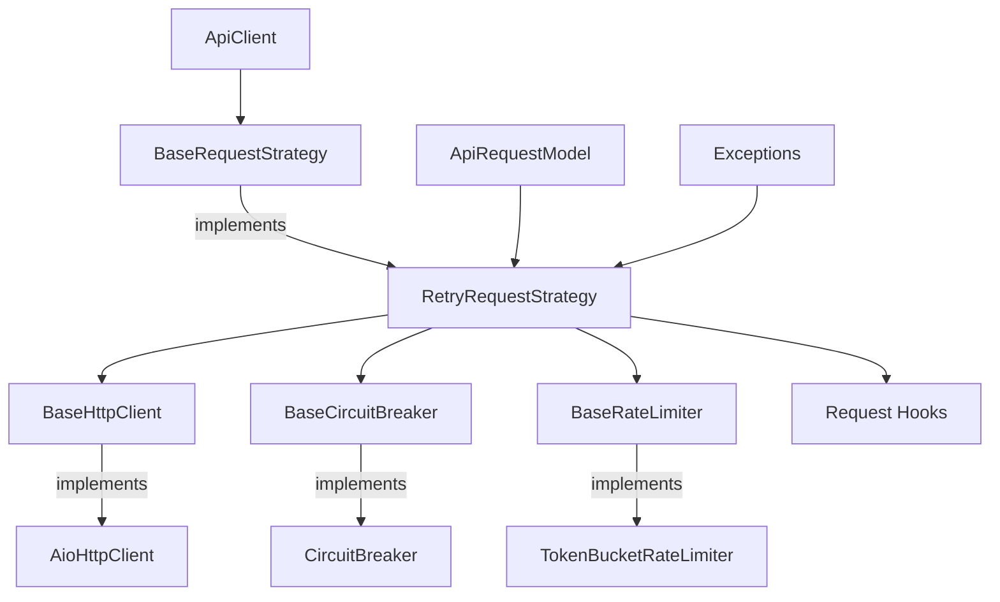
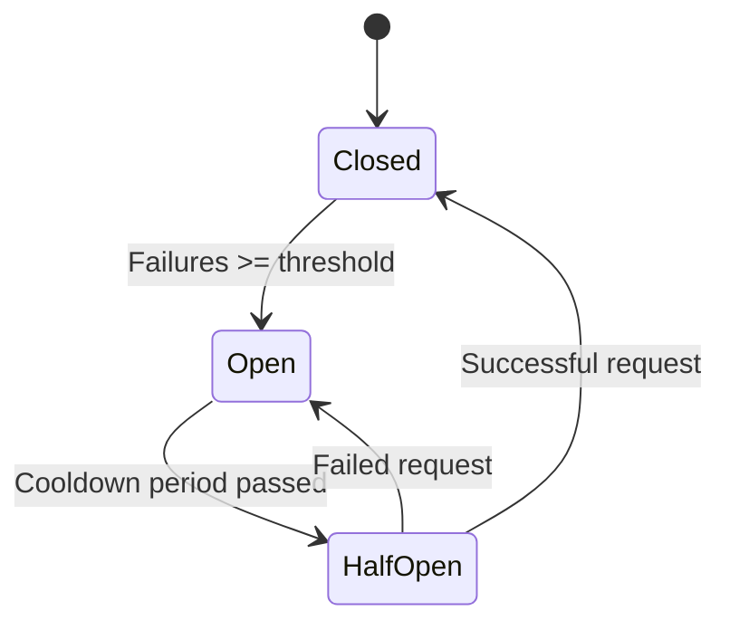
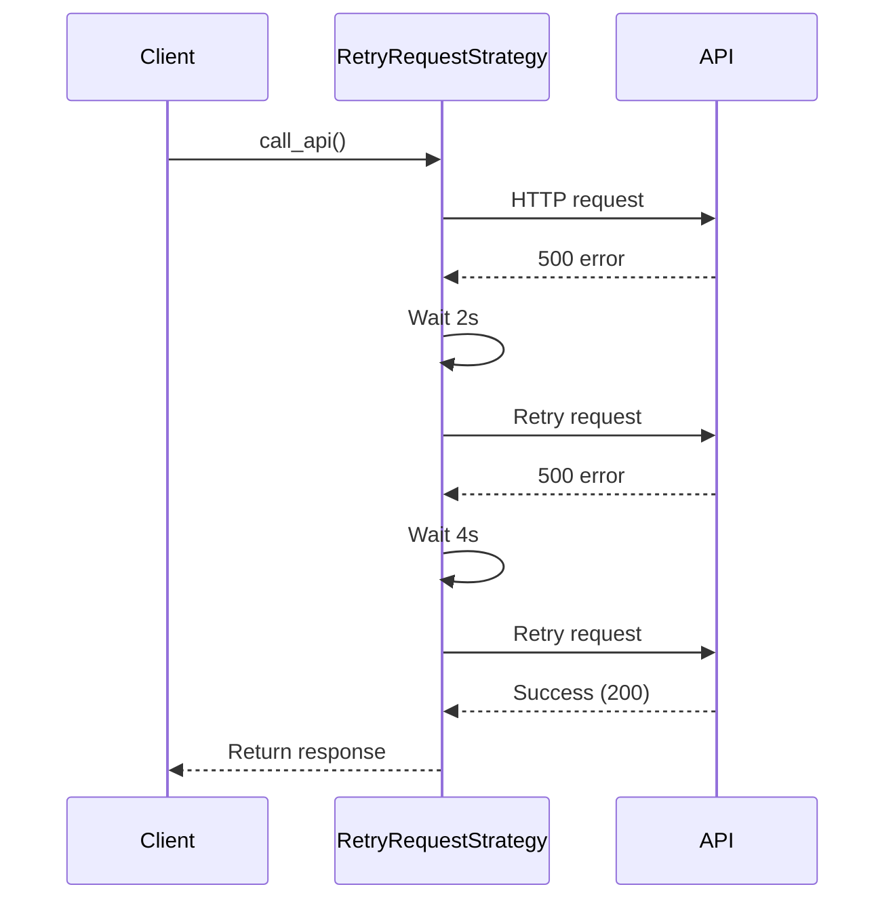
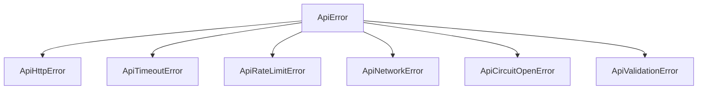

# API Engine

A robust, resilient API client library designed to handle the complexities of external API integrations with built-in reliability patterns.

## Overview

API Engine is a comprehensive solution for making resilient HTTP API calls in asyncio-based Python applications. It implements several reliability patterns to handle common API integration challenges like network failures, rate limiting, timeouts, and transient errors.

## Architecture

The API Engine follows a modular design with clear separation of concerns:



### Core Components

1. **ApiClient**: The main entry point for making API calls
2. **RetryRequestStrategy**: Implements intelligent retry logic with exponential backoff
3. **AioHttpClient**: HTTP client implementation using aiohttp
4. **CircuitBreaker**: Prevents cascading failures by stopping requests during high error rates
5. **TokenBucketRateLimiter**: Controls request rate to avoid API rate limits
6. **ApiRequestModel**: Structured representation of an API request

## Reliability Patterns

The API Engine implements the following reliability patterns:

### Circuit Breaker



Prevents sending requests to failing services, allowing them to recover. When failure count exceeds a threshold, the circuit opens and blocks requests for a cooldown period.

### Retry with Exponential Backoff



Automatically retries failed requests with increasing delays between attempts.

### Rate Limiting

Controls the rate at which requests are sent to an API to prevent hitting rate limits.

### Request/Response Hooks

Allows custom processing of requests before sending and responses after receiving.

## Pain Points Addressed

| Problem | Solution |
|---------|----------|
| Network instability | Intelligent retry with network error detection |
| API rate limits | Token bucket rate limiting |
| Cascading failures | Circuit breaker pattern |
| Non-standard API responses | Response key extraction and model validation |
| Complex error handling | Comprehensive exception hierarchy |
| Timeout handling | Configurable request timeouts |

## Usage Guide

### Basic Usage

```python
from utils.api_engine import (
    ApiClient, RetryRequestStrategy, AioHttpClient, CircuitBreaker
)

async def get_data():
    # Create components
    http_client = AioHttpClient(default_timeout=30)
    circuit_breaker = CircuitBreaker(max_failures=5, cooldown_time=60)
    
    # Create strategy with retry configuration
    strategy = RetryRequestStrategy(
        http=http_client,
        breaker=circuit_breaker,
        max_retries=3,
        backoff=2
    )
    
    # Create API client
    client = ApiClient(strategy=strategy)
    
    # Make API call
    response = await client.call_api(
        url="https://api.example.com/data",
        method="GET",
        headers={"Authorization": "Bearer token"},
        params={"limit": 10},
    )
    
    return response
```

### With Pydantic Model Validation

```python
from pydantic import BaseModel
from typing import List

class DataItem(BaseModel):
    id: int
    name: str
    active: bool

class DataResponse(BaseModel):
    items: List[DataItem]
    total: int

async def get_validated_data():
    # ... client setup as above ...
    
    # API call with model validation
    response = await client.call_api(
        url="https://api.example.com/data",
        method="GET",
        response_key="data",  # Extract the "data" key from response
        model=DataResponse,   # Validate against this model
    )
    
    # response is a DataResponse instance
    return response
```

### With Rate Limiting

```python
# Define rate limit configuration
rate_limit_config = {
    "key": "example_api",        # Unique identifier for this rate limit
    "max_requests": 100,         # Max 100 requests
    "period": 60                 # Per 60 seconds
}

# Create strategy with rate limiting
strategy = RetryRequestStrategy(
    http=http_client,
    breaker=circuit_breaker,
    limiter=rate_limit_config,
    max_retries=3,
    backoff=2
)
```

### With Request Hooks

```python
from utils.api_engine.interfaces.base_request_hook import BaseRequestHook
from utils.api_engine.interfaces.base_request_model import BaseRequestModel
from typing import Any

class AuthTokenHook(BaseRequestHook):
    def __init__(self, token_provider):
        self.token_provider = token_provider
    
    async def before(self, request: BaseRequestModel) -> None:
        # Add Authorization header before each request
        token = await self.token_provider.get_token()
        if not request.headers:
            request.headers = {}
        request.headers["Authorization"] = f"Bearer {token}"
    
    async def after(self, request: BaseRequestModel, response: Any) -> None:
        # Process response if needed
        pass

# Create strategy with hooks
strategy = RetryRequestStrategy(
    http=http_client,
    breaker=circuit_breaker,
    hooks=[AuthTokenHook(token_provider)]
)
```

## Error Handling

API Engine provides a comprehensive exception hierarchy:



Handle errors specifically:

```python
try:
    response = await client.call_api(...)
except ApiHttpError as e:
    print(f"HTTP error {e.status_code}: {e}")
except ApiTimeoutError:
    print("Request timed out")
except ApiNetworkError:
    print("Network connectivity issue")
except ApiError as e:
    print(f"API error: {e}")
```

## Best Practices

1. **Configure timeouts appropriately**: Set default_timeout in AioHttpClient constructor
2. **Set proper retry limits**: Adjust max_retries in RetryRequestStrategy based on API stability
3. **Use circuit breaker**: Always include CircuitBreaker to prevent cascading failures
4. **Implement rate limiting**: Use rate limiting for APIs with known rate limits
5. **Use model validation**: Define Pydantic models for responses to ensure data integrity
6. **Handle exceptions properly**: Catch specific exceptions for better error handling

## Advanced Configuration

### Custom HTTP Client

Implement BaseHttpClient interface to create custom HTTP clients:

```python
from utils.api_engine.interfaces.base_http_client import BaseHttpClient

class CustomHttpClient(BaseHttpClient):
    async def request(self, method, url, headers=None, params=None, 
                     data=None, json_payload=None, timeout=None):
        # Custom implementation
        ...
        return response_data
```

### Custom Rate Limiter

Implement BaseRateLimiter interface:

```python
from utils.api_engine.interfaces.base_rate_limiter import BaseRateLimiter

class CustomRateLimiter(BaseRateLimiter):
    async def acquire(self):
        # Custom rate limiting logic
        ...
```

### Custom Circuit Breaker

Implement BaseCircuitBreaker interface:

```python
from utils.api_engine.interfaces.base_circuit_breaker import BaseCircuitBreaker

class CustomCircuitBreaker(BaseCircuitBreaker):
    def is_open(self):
        # Custom implementation
        ...
    
    def record_failure(self):
        # Custom implementation
        ...
    
    def reset(self):
        # Custom implementation
        ...
```