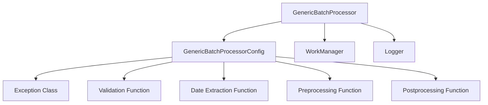

# Batch Processors

A flexible, configurable system for processing entities in batches with reliable state tracking, error handling, and automatic retries.

## Overview

The Batch Processors module provides a configurable batch processing framework that handles common batch processing patterns:

- Collecting entities until a batch size is reached
- Processing batches of entities with appropriate error handling
- Tracking batch processing state and progress
- Automatic retries on failure with exponential backoff
- Validation and preprocessing/postprocessing of items

## Architecture

The Batch Processors module follows a configuration-based architecture:



### Core Components

1. **GenericBatchProcessor**: Main class for batch processing
2. **GenericBatchProcessorConfig**: Configuration class defining all processing behavior
3. **WorkManager**: External integration point for processing batched entities

## Pain Points Addressed

| Problem | Solution |
|---------|----------|
| Manual batch management | Automatic batch size tracking and processing |
| Error recovery | Built-in retry mechanism with configurable parameters |
| State tracking | Automated cursor/state management |
| Entity validation | Customizable validation functions |
| Processing consistency | Pre/post processing hooks |
| Varying batch sizes | Flexible batch sizing with automatic triggering |
| Tracking processing history | Built-in statistics and metrics |

## Usage Guide

### Basic Usage

```python
from utils.batch_processors import GenericBatchProcessor, GenericBatchProcessorConfig

# Create configuration
config = GenericBatchProcessorConfig(
    batch_size=10,
    work_name_template="Import Batch #{batch_num}",
    state_key="import_cursor",
    entity_type="threat_indicators",
    display_name="threat indicators"
)

# Create processor (work_manager is your application-specific work management system)
processor = GenericBatchProcessor(
    config=config,
    work_manager=work_manager,
    logger=logger
)

# Add items individually
for item in data_items:
    processor.add_item(item)
    # When batch_size is reached, processing happens automatically

# Process any remaining items at the end
processor.flush()

# Update the state with the latest processed date
processor.update_final_state()

# Get statistics
stats = processor.get_statistics()
print(f"Processed {stats['total_items_processed']} items in {stats['total_batches_processed']} batches")
```

### With Validation

```python
# Create configuration with validation
def validate_item(item):
    """Validates that an item has required fields."""
    return hasattr(item, 'id') and hasattr(item, 'type')

config = GenericBatchProcessorConfig(
    batch_size=10,
    work_name_template="Validated Batch #{batch_num}",
    state_key="validated_cursor",
    entity_type="threat_indicators",
    display_name="threat indicators",
    validation_function=validate_item
)

processor = GenericBatchProcessor(config, work_manager, logger)

# Automatically validates items before adding
added = processor.add_item(item)  # Returns True if valid, False if invalid
```

### With Date Extraction for State Tracking

```python
# Create configuration with date extraction
def extract_date(item):
    """Extract the date from an item."""
    if hasattr(item, 'modified'):
        return item.modified
    return None

config = GenericBatchProcessorConfig(
    batch_size=10,
    work_name_template="Dated Batch #{batch_num}",
    state_key="dated_cursor",
    entity_type="threat_indicators",
    display_name="threat indicators",
    date_extraction_function=extract_date
)

processor = GenericBatchProcessor(config, work_manager, logger)

# Process items
for item in data_items:
    processor.add_item(item)

# Update state with the latest date encountered
processor.update_final_state()
```

### With Pre/Post Processing

```python
# Define preprocessing function
def preprocess_batch(items):
    """Preprocess a batch of items before sending."""
    for item in items:
        item.status = "processing"
    return items

# Define postprocessing function
def postprocess_batch(items, work_id):
    """Postprocess a batch of items after successful processing."""
    for item in items:
        item.work_id = work_id
        item.status = "processed"

config = GenericBatchProcessorConfig(
    batch_size=10,
    work_name_template="Process Batch #{batch_num}",
    state_key="process_cursor",
    entity_type="threat_indicators",
    display_name="threat indicators",
    preprocessing_function=preprocess_batch,
    postprocessing_function=postprocess_batch
)

processor = GenericBatchProcessor(config, work_manager, logger)
```

### With Custom Error Handling and Retries

```python
# Define custom exception
class BatchProcessingError(Exception):
    def __init__(self, message, batch_number=None, work_id=None):
        super().__init__(message)
        self.batch_number = batch_number
        self.work_id = work_id

config = GenericBatchProcessorConfig(
    batch_size=10,
    work_name_template="Retry Batch #{batch_num}",
    state_key="retry_cursor",
    entity_type="threat_indicators",
    display_name="threat indicators",
    exception_class=BatchProcessingError,
    max_retries=3,
    retry_delay=2.0  # Initial delay, doubles after each retry
)

processor = GenericBatchProcessor(config, work_manager, logger)

# Process with automatic retries
try:
    processor.process_current_batch()
except BatchProcessingError as e:
    # This error would only be raised after all retries are exhausted
    print(f"Processing failed after {config.max_retries} retries: {e}")
    # Access failed items
    failed_items = processor.get_failed_items()
```

### Manual Processing Control

```python
# Disable auto-processing to control when batches are processed
config = GenericBatchProcessorConfig(
    batch_size=10,
    work_name_template="Manual Batch #{batch_num}",
    state_key="manual_cursor",
    entity_type="threat_indicators",
    display_name="threat indicators",
    auto_process=False
)

processor = GenericBatchProcessor(config, work_manager, logger)

# Add items without triggering processing
for item in data_items:
    processor.add_item(item)

# Manually process batch
work_id = processor.process_current_batch()

# Check current batch size
if processor.get_current_batch_size() > 0:
    processor.process_current_batch()
```

### Batch Processing STIX Objects

```python
# The processor automatically handles different item types:
# 1. STIX objects directly
# 2. Mapper objects with to_stix() method 
# 3. Dict objects with stix-like structure

config = GenericBatchProcessorConfig(
    batch_size=10,
    work_name_template="STIX Batch #{batch_num}",
    state_key="stix_cursor",
    entity_type="stix_objects",
    display_name="STIX objects"
)

processor = GenericBatchProcessor(config, work_manager, logger)

# Add different types of objects
processor.add_item(stix_object)  # Direct STIX object
processor.add_item(mapper_object)  # Object with to_stix() method
processor.add_item(stix_dict)  # Dict with id and type fields
```

## Configuration Options

| Option | Description | Default |
|--------|-------------|---------|
| `batch_size` | Number of items to collect before processing | Required |
| `work_name_template` | Template for work names (supports formatting) | Required |
| `state_key` | Key for state/cursor tracking | Required |
| `entity_type` | Type identifier for entities being processed | Required |
| `display_name` | Human-readable name for entities (plural) | Required |
| `exception_class` | Exception class to use for errors | `Exception` |
| `display_name_singular` | Human-readable name (singular) | Auto-generated |
| `auto_process` | Whether to automatically process when batch_size is reached | `True` |
| `date_extraction_function` | Function to extract dates from items | `None` |
| `preprocessing_function` | Function to preprocess items before sending | `None` |
| `postprocessing_function` | Function to postprocess items after sending | `None` |
| `validation_function` | Function to validate items before adding | `None` |
| `empty_batch_behavior` | How to handle empty batches: `skip` or `update_state` | `update_state` |
| `max_retries` | Maximum retry attempts on failure | `0` |
| `retry_delay` | Initial delay between retries (seconds) | `1.0` |
| `work_timeout` | Timeout for work processing (seconds) | `None` |

## Statistics and Metrics

The batch processor maintains statistics that can be retrieved using `get_statistics()`:

```python
stats = processor.get_statistics()
```

Available statistics:

- `total_items_processed`: Total number of items processed
- `total_batches_processed`: Total number of batches processed
- `total_items_sent`: Total number of items sent to the work manager
- `current_batch_size`: Current number of items in the batch
- `failed_items_count`: Number of failed items
- `latest_date`: Latest date encountered (if date_extraction_function is used)

## WorkManager Interface

Your `work_manager` implementation should provide:

```python
class WorkManager:
    def initiate_work(self, work_name: str, entity_type: str) -> str:
        """Create a new work and return its ID"""
        
    def send_bundle(self, work_id: str, objects: list) -> None:
        """Send a bundle of objects to a work"""
        
    def work_to_process(self, work_id: str) -> None:
        """Mark work as ready for processing"""
        
    def update_state(self, state_key: str, date_str: str) -> None:
        """Update state with the latest processed date"""
```

## Best Practices

1. **Set appropriate batch sizes**: Too small = too many API calls; too large = memory issues
2. **Implement validation**: Prevents processing invalid data
3. **Handle failed items**: Use `get_failed_items()` to track and handle failed items
4. **Track state**: Always call `update_final_state()` to update processing cursor
5. **Clear failed items**: Use `clear_failed_items()` after handling failures
6. **Use appropriate retries**: Set `max_retries` based on API reliability