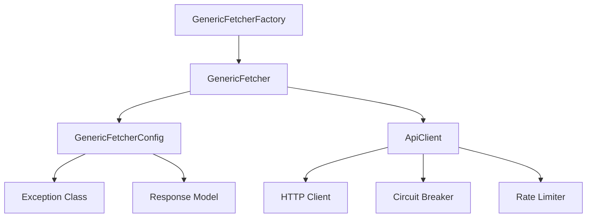

# Fetchers

A flexible, configurable system for fetching data from external APIs with consistent error handling, response parsing, and endpoint management.

## Overview

The Fetchers module provides a standardized approach to making API requests with:

- Configurable endpoints and URL templates
- Consistent error handling and reporting
- Response validation and parsing with Pydantic models
- Factory system for creating and managing multiple fetchers

## Architecture

The Fetchers module follows a clean, modular design pattern:



### Core Components

1. **GenericFetcher**: Main class for making API requests
2. **GenericFetcherConfig**: Configuration defining endpoint and response handling
3. **ApiClient**: Client from API Engine for making actual HTTP requests
4. **GenericFetcherFactory**: Factory for creating and managing fetchers

## Pain Points Addressed

| Problem | Solution |
|---------|----------|
| Complex endpoint configuration | URL template system |
| Response parsing | Pydantic model integration |
| Error handling complexity | Consistent exception handling |
| Managing multiple endpoints | Factory pattern with registry |
| Code duplication | Reusable fetcher patterns |
| Header management | Hierarchical header merging |
| API rate limits | Built-in rate limiting through API Engine |

## Usage Guide

### Basic Usage

```python
from utils.fetchers import GenericFetcher, GenericFetcherConfig
from utils.api_engine import ApiClient, RetryRequestStrategy, AioHttpClient, CircuitBreaker

# Set up API client
http_client = AioHttpClient()
circuit_breaker = CircuitBreaker()
strategy = RetryRequestStrategy(http=http_client, breaker=circuit_breaker)
api_client = ApiClient(strategy=strategy)

# Create fetcher configuration
config = GenericFetcherConfig(
    entity_type="users",
    endpoint="https://api.example.com/users/{id}",
    display_name="users",
    exception_class=Exception
)

# Create fetcher
fetcher = GenericFetcher(
    config=config,
    api_client=api_client,
    base_headers={"Authorization": "Bearer token123"}
)

# Fetch a single entity
user = await fetcher.fetch_single(id="123")

# Fetch multiple entities
users = await fetcher.fetch_multiple(["123", "456", "789"])

# Fetch a list of entities
all_users = await fetcher.fetch_list()
```

### Using Response Models

```python
from pydantic import BaseModel
from typing import List, Optional

# Define response models
class User(BaseModel):
    id: str
    name: str
    email: Optional[str] = None

class UserResponse(BaseModel):
    data: User
    meta: dict

# Create configuration with response model
config = GenericFetcherConfig(
    entity_type="users",
    endpoint="https://api.example.com/users/{id}",
    display_name="users",
    exception_class=Exception,
    response_model=UserResponse,
    response_key="data"  # Extract just the data field from response
)

# Use the fetcher - responses will be parsed into User objects
fetcher = GenericFetcher(config=config, api_client=api_client)
user = await fetcher.fetch_single(id="123")  # Returns User object
response = await fetcher.fetch_fetch_full_response(id="123") # Returns UserResponse object
```

### Using the Factory Pattern

```python
from utils.fetchers import GenericFetcherFactory

# Create a factory
factory = GenericFetcherFactory(
    api_client=api_client,
    base_headers={"Authorization": "Bearer token123"},
    logger=logger
)

# Register fetcher configurations
factory.register_config(
    "users",
    GenericFetcherConfig(
        entity_type="users",
        endpoint="https://api.example.com/users/{id}",
        display_name="users",
        exception_class=UserFetchError
    )
)

factory.register_config(
    "products",
    GenericFetcherConfig(
        entity_type="products",
        endpoint="https://api.example.com/products/{product_id}",
        display_name="products",
        exception_class=ProductFetchError,
        method="GET",
        timeout=30.0
    )
)

# Create fetchers as needed
user_fetcher = factory.create_fetcher_by_name("users")
product_fetcher = factory.create_fetcher_by_name("products")

# Fetch entities
user = await user_fetcher.fetch_single(id="123")
product = await product_fetcher.fetch_single(product_id="456")
```

### With Custom Headers

```python
# Create fetcher with base headers
fetcher = GenericFetcher(
    config=config,
    api_client=api_client,
    base_headers={"User-Agent": "MyApp/1.0"}
)

# Create fetcher with additional headers from factory
fetcher = factory.create_fetcher_by_name(
    "users",
    additional_headers={"X-API-Version": "2.0"}
)
```

### Fetching Lists of Entities

```python
# Configure for list endpoint
config = GenericFetcherConfig(
    entity_type="products",
    endpoint="https://api.example.com/products",
    display_name="products",
    exception_class=Exception
)

# Create fetcher
fetcher = GenericFetcher(config=config, api_client=api_client)

# Fetch all products
products = await fetcher.fetch_list()

# Fetch with query parameters
filtered_products = await fetcher.fetch_list(
    params={"category": "electronics", "limit": 20}
)
```

### Handling Different Response Structures

```python
# Response with data wrapper
config_wrapped = GenericFetcherConfig(
    entity_type="users",
    endpoint="https://api.example.com/users/{id}",
    display_name="users",
    exception_class=Exception,
    response_key="data"  # Extract from {"data": {...}}
)

# Response with direct structure
config_direct = GenericFetcherConfig(
    entity_type="products",
    endpoint="https://api.example.com/products/{id}",
    display_name="products",
    exception_class=Exception
    # No response_key - use response directly
)
```

### Creating Multiple Fetchers

```python
# Create multiple fetchers from registered configurations
fetchers = factory.create_multiple_fetchers(["users", "products", "orders"])

# Or create all registered fetchers
all_fetchers = factory.create_all_registered_fetchers()

# Use fetchers
user = await fetchers["users"].fetch_single(id="123")
product = await fetchers["products"].fetch_single(id="456")
```

### Debug Response Saving

For debugging and testing purposes, you can save raw API responses to files:

```python
# Enable response saving for debugging
config = GenericFetcherConfig(
    entity_type="users",
    endpoint="https://api.example.com/users/{id}",
    display_name="users",
    exception_class=Exception,
    save_to_file=True  # Enable debug response saving
)

fetcher = GenericFetcher(config=config, api_client=api_client)

# All fetch operations will now save responses to debug_responses/ directory
user = await fetcher.fetch_single(id="123")  # Saves to debug_responses/users_<hash>.json
users = await fetcher.fetch_list()           # Saves to debug_responses/users_<hash>.json
```

**Debug File Format:**
```json
{
  "request_info": {
    "endpoint": "https://api.example.com/users/123",
    "query_params": {},
    "entity_type": "users",
    "method": "GET"
  },
  "response": {
    "id": "123",
    "name": "John Doe",
    "email": "john@example.com"
  }
}
```

**Key Features:**
- Files are named using SHA256 hash to prevent duplicates
- Files are saved to `debug_responses/` directory (created automatically)
- Filename format: `{entity_type}_{hash_prefix}.json`
- Works with all fetch methods: `fetch_single`, `fetch_multiple`, `fetch_list`, `fetch_full_response`
- Saves raw response regardless of response models or response keys
- Errors in file saving won't affect the main fetch operation

## Configuration Options

| Option | Description | Default |
|--------|-------------|---------|
| `entity_type` | Type of entity being fetched | Required |
| `endpoint` | API endpoint URL or template | Required |
| `display_name` | Human-readable name (plural) | Required |
| `exception_class` | Exception class for errors | Required |
| `response_model` | Pydantic model for parsing | `None` |
| `display_name_singular` | Human-readable singular name | Auto-generated |
| `method` | HTTP method (GET, POST, etc.) | `"GET"` |
| `headers` | Additional request headers | `{}` |
| `timeout` | Request timeout in seconds | `60.0` |
| `response_key` | Key to extract from response | `None` |
| `save_to_file` | Save raw response to debug file | `False` |

## Error Handling

The fetcher works with the API Engine's error hierarchy:

```python
try:
    entity = await fetcher.fetch_single(id="123")
except ApiNetworkError as e:
    print(f"Network connectivity issue: {e}")
except ApiHttpError as e:
    print(f"HTTP error {e.status_code}: {e}")
except ApiTimeoutError as e:
    print(f"Request timed out: {e}")
except Exception as e:
    print(f"Other error: {e}")
```

## Best Practices

1. **Use URL templates**: Define endpoints with format placeholders for consistency
2. **Implement response models**: Use Pydantic models for type-safe response handling
3. **Set appropriate timeouts**: Configure timeouts based on endpoint characteristics
4. **Register fetchers**: Use the factory pattern to organize multiple fetchers
5. **Handle specific errors**: Catch specific exception types for better error handling
6. **Use response keys**: Extract specific parts of responses when needed
7. **Reuse API clients**: Share ApiClient instances when appropriate for connection pooling
8. **Use debug saving**: Enable `save_to_file` during development to capture real API responses for testing
