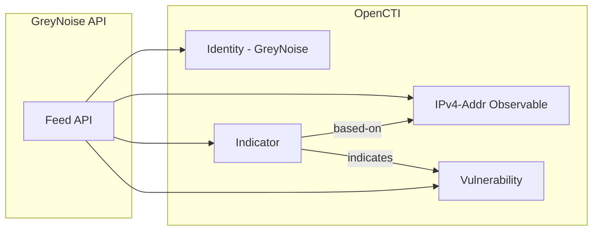

# OpenCTI GreyNoise Feed Connector

| Status | Date | Comment |
|--------|------|---------|
| Partner Verified | -    | -       |

The GreyNoise Feed connector imports internet scanner IP addresses from GreyNoise Intelligence into OpenCTI as indicators and observables.

**NOTE** This connector only imports the base indicator and observerable, and flags the indicator with a classification.  For the full enrichment details available from GreyNoise, use this connector along with the GreyNoise IP Enrichment connector.  It is recommended that the enrichment connector be set to auto-enrich so that the full enrichment is added to each indicator while the feed ingests it.  Indicators that are pulled by the feed connector prior to having the enrichment connector in place will need to be enriched manually or via workflow.

## Table of Contents

- [OpenCTI GreyNoise Feed Connector](#opencti-greynoise-feed-connector)
  - [Table of Contents](#table-of-contents)
  - [Introduction](#introduction)
  - [Installation](#installation)
    - [Requirements](#requirements)
  - [Configuration variables](#configuration-variables)
    - [OpenCTI environment variables](#opencti-environment-variables)
    - [Base connector environment variables](#base-connector-environment-variables)
    - [Connector extra parameters environment variables](#connector-extra-parameters-environment-variables)
  - [Deployment](#deployment)
    - [Docker Deployment](#docker-deployment)
    - [Manual Deployment](#manual-deployment)
  - [Usage](#usage)
  - [Behavior](#behavior)
  - [Debugging](#debugging)
  - [Additional information](#additional-information)

## Introduction

GreyNoise provides intelligence on internet-wide scanners, botnets, and other sources of internet background noise. This connector uses the GreyNoise Feed API to import IP addresses observed scanning the internet, including contextual information about their behavior, associated vulnerabilities, and classifications.

## Installation

### Requirements

- OpenCTI Platform >= 6.x
- GreyNoise subscription with Feed access
- GreyNoise API key

## Configuration variables

There are a number of configuration options, which are set either in `docker-compose.yml` (for Docker) or in `config.yml` (for manual deployment).

### OpenCTI environment variables

| Parameter     | config.yml | Docker environment variable | Mandatory | Description                                          |
|---------------|------------|-----------------------------|-----------|------------------------------------------------------|
| OpenCTI URL   | url        | `OPENCTI_URL`               | Yes       | The URL of the OpenCTI platform.                     |
| OpenCTI Token | token      | `OPENCTI_TOKEN`             | Yes       | The default admin token set in the OpenCTI platform. |

### Base connector environment variables

| Parameter         | config.yml      | Docker environment variable   | Default        | Mandatory | Description                                                                 |
|-------------------|-----------------|-------------------------------|----------------|-----------|-----------------------------------------------------------------------------|
| Connector ID      | id              | `CONNECTOR_ID`                |                | Yes       | A unique `UUIDv4` identifier for this connector instance.                   |
| Connector Name    | name            | `CONNECTOR_NAME`              | GreyNoise Feed | No        | Name of the connector.                                                      |
| Connector Scope   | scope           | `CONNECTOR_SCOPE`             | greynoisefeed  | No        | The scope or type of data the connector is importing.                       |
| Log Level         | log_level       | `CONNECTOR_LOG_LEVEL`         | info           | No        | Determines the verbosity of the logs: `debug`, `info`, `warn`, or `error`.  |
| Duration Period   | duration_period | `CONNECTOR_DURATION_PERIOD`   | PT6H           | No        | Time interval between connector runs in ISO 8601 format.                    |

### Connector extra parameters environment variables

| Parameter        | config.yml                           | Docker environment variable            | Default | Mandatory | Description                                              |
|------------------|--------------------------------------|----------------------------------------|---------|-----------|----------------------------------------------------------|
| API Key          | greynoise.api_key                    | `GREYNOISE_API_KEY`                    |         | Yes       | GreyNoise API key.                                       |
| Feed Type        | greynoise.feed_type                  | `GREYNOISE_FEED_TYPE`                  |         | Yes       | Type of GreyNoise feed to import.                        |
| Limit            | greynoise.limit                      | `GREYNOISE_LIMIT`                      | 10,000  | No        | The max number of indicators to import.                  |
| Malicious Score  | greynoise.indicator_score_malicious  | `GREYNOISE_INDICATOR_SCORE_MALICIOUS`  | 75      | No        | The indicator score for GreyNoise Malicious Indicators.  |
| Suspicious Score | greynoise.indicator_score_suspicious | `GREYNOISE_INDICATOR_SCORE_SUSPICIOUS` | 50      | No        | The indicator score for GreyNoise Suspicious Indicators. |
| Benign Score     | greynoise.indicator_score_benign     | `GREYNOISE_INDICATOR_SCORE_BENIGN`     | 20      | No        | The indicator score for GreyNoise Benign Indicators.     |

## Deployment

### Docker Deployment

Build the Docker image:

```bash
docker build -t opencti/connector-greynoise-feed:latest .
```

Configure the connector in `docker-compose.yml`:

```yaml
  connector-greynoise-feed:
    image: opencti/connector-greynoise-feed:latest
    environment:
      - OPENCTI_URL=http://localhost
      - OPENCTI_TOKEN=ChangeMe
      - CONNECTOR_ID=ChangeMe
      - CONNECTOR_NAME=GreyNoise Feed
      - CONNECTOR_SCOPE=greynoisefeed
      - CONNECTOR_LOG_LEVEL=error
      - CONNECTOR_DURATION_PERIOD=PT6H
      - GREYNOISE_API_KEY=ChangeMe
      - GREYNOISE_FEED_TYPE=malicious
      - GREYNOISE_LIMIT=10000
      - GREYNOISE_INDICATOR_SCORE_MALICIOUS=75
      - GREYNOISE_INDICATOR_SCORE_SUSPICIOUS=50
      - GREYNOISE_INDICATOR_SCORE_BENIGN=20
    restart: always
```

Start the connector:

```bash
docker compose up -d
```

### Manual Deployment

1. Create `config.yml` based on `config.yml.sample`.

2. Install dependencies:

```bash
pip3 install -r requirements.txt
```

3. Start the connector:

```bash
python3 main.py
```

## Usage

The connector runs automatically at the interval defined by `CONNECTOR_DURATION_PERIOD`. To force an immediate run:

**Data Management → Ingestion → Connectors**

Find the connector and click the refresh button to reset the state and trigger a new sync.

## Behavior

The connector fetches IP addresses from the GreyNoise Feed API and imports them as indicators and observables.

### Data Flow



### Entity Mapping

| GreyNoise Data       | OpenCTI Entity      | Description                                      |
|----------------------|---------------------|--------------------------------------------------|
| IP Address           | IPv4-Addr           | IP observable with GreyNoise metadata            |
| IP Address           | Indicator           | STIX pattern `[ipv4-addr:value = '...']`         |
| Classification       | Labels              | benign, malicious, unknown                       |

### Processing Details

For each IP in the GreyNoise feed:

1. **Observable**: IPv4-Addr with GreyNoise context
2. **Indicator**: Created with STIX pattern
3. **Relationship**: Indicator → `indicates` → Vulnerability

## Debugging

Enable verbose logging:

```env
CONNECTOR_LOG_LEVEL=debug
```

Ensure the GreyNoise API is reachable from your OpenCTI system. For API issues, contact [support@greynoise.io](mailto:support@greynoise.io).

## Additional information

- **Subscription Required**: GreyNoise Feed access requires a paid subscription
- **IMPORTANT NOTE** This connector only imports the base indicator and observerable, and flags the indicator with a classification.  For the full enrichment details available from GreyNoise, use this connector along with the GreyNoise IP Enrichment connector.  It is recommended that the enrichment connector be set to auto-enrich so that the full enrichment is added to each indicator while the feed ingests it.  Indicators that are pulled by the feed connector prior to having the enrichment connector in place will need to be enriched manually or via workflow.
- **Enrichment**: Use with GreyNoise enrichment connector for detailed IP context
- **Classifications**: IPs are classified as benign, malicious, suspicious, or unknown
- **Reference**: [GreyNoise](https://www.greynoise.io/)
