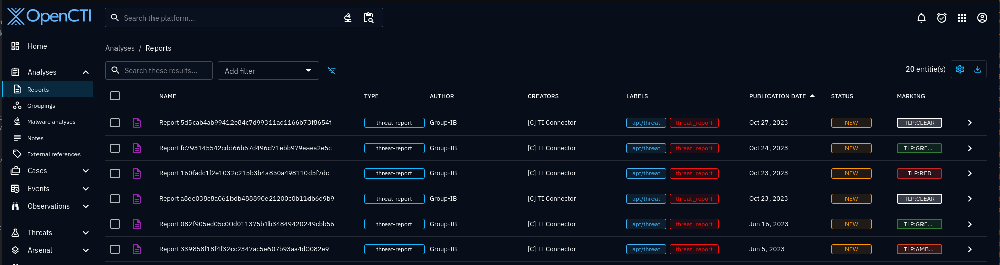
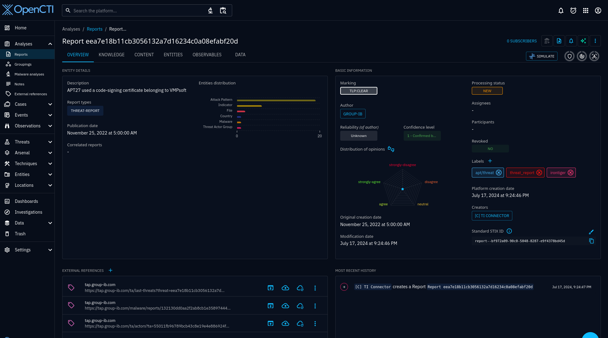
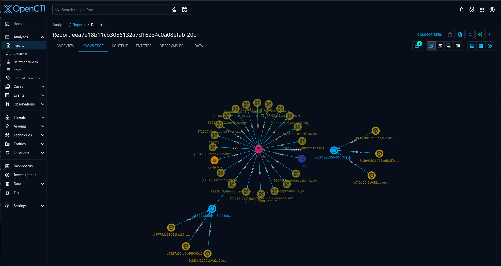
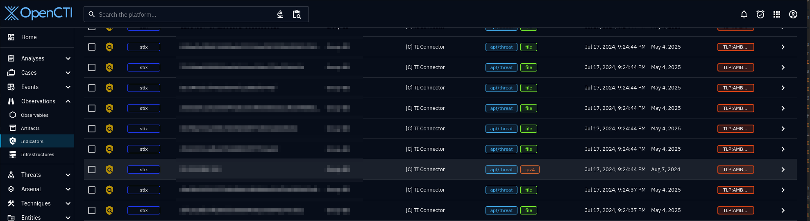
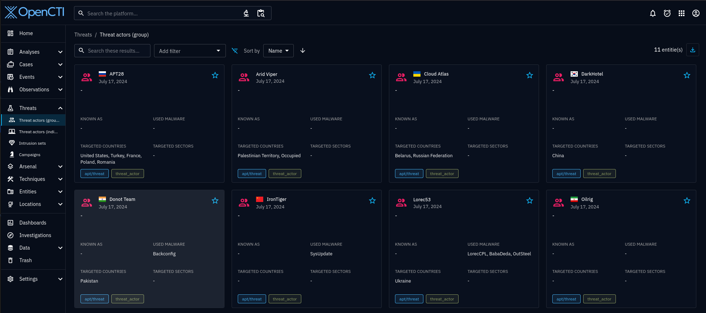
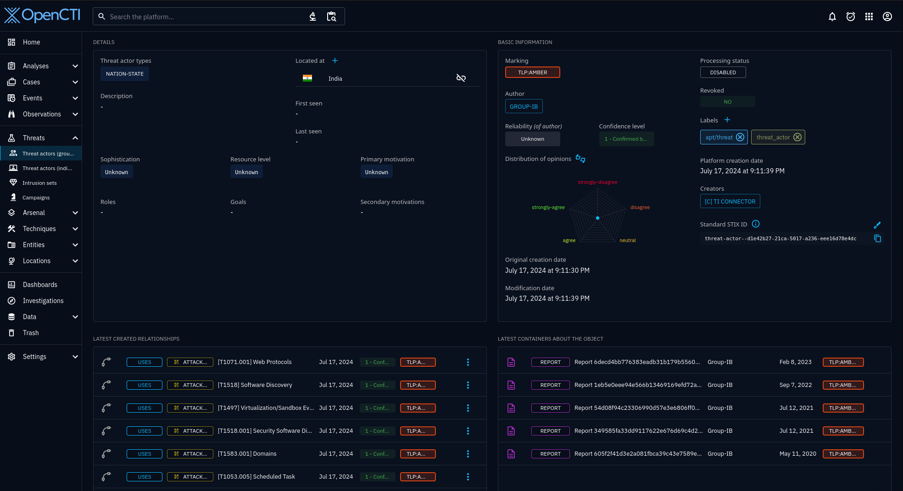
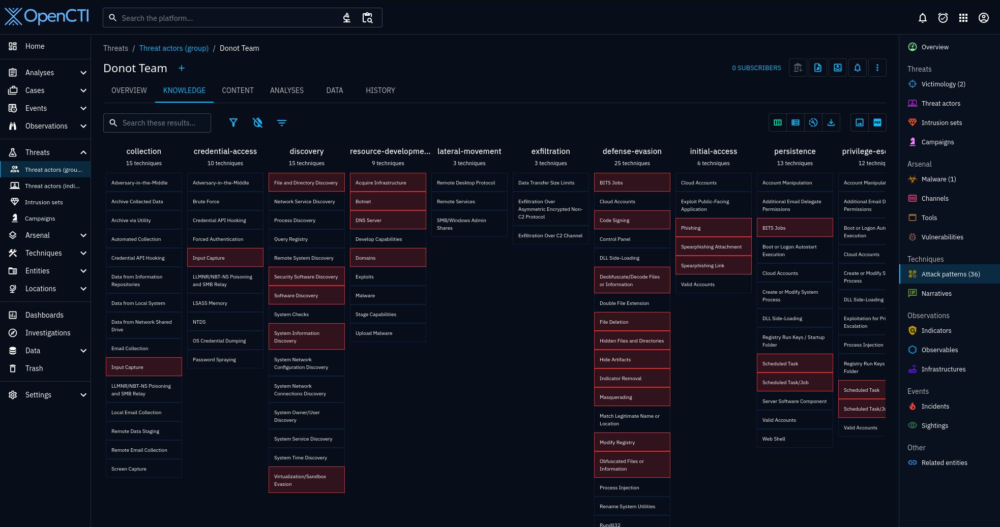
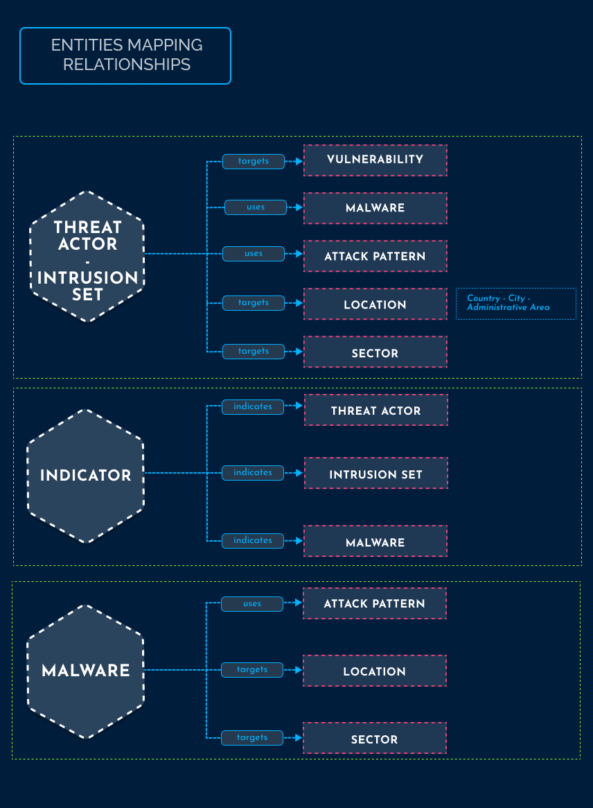

# OpenCTI Group-IB Connector


[](https://python.org/downloads/release/python-368/)
[](https://github.com/cyberintegrations/releases/tag/0.6.6/)
[](https://github.com/OpenCTI-Platform/opencti/releases/tag/6.3.1)


<!--
General description of the connector
* What it does
* How it works
* Special requirements
* Use case description
* ...
-->

The OpenCTI Group-IB Connector is a standalone Python process that collect data from Threat Intelligence via API calls
and push it as STIX objects to OpenCTI server.

It  is a system for cyber-attack analysis and attribution, threat hunting, and network infrastructure protection 
based on data about adversary tactics, tools, and activities. TI combines unique data sources and experience in 
investigating high-tech crimes and responding to complex, multi-stage attacks worldwide. The system stores data 
on threat actors, domains, IPs, and infrastructure collected over the past 22 years, including those that criminals 
have attempted to take down.

To use the integration, please make sure that you have an active Threat Intelligence license to 
access the interface.


## **Content**

* [Content](#content)
* [Installation](#installation)
  * [Common environment variables](#common-environment-variables)
  * [OpenCTI environment variables](#opencti-environment-variables)
  * [Threat Intelligence API environment variables](#threat-intelligence-api-environment-variables)
  * [Docker Deployment](#docker-deployment)
  * [Manual Deployment](#manual-deployment)
* [Configuration](#configuration)
  * [Enable required collections](#enable-required-collections)
  * [Date format](#date-format)
  * [Notes](#notes)
* [Extra settings](#extra-settings)
  * [Tags](#tags-in-development)
  * [Options](#options)
* [Examples](#examples)
* [Task scheduling automation](#task-scheduling-automation)
  * [Cron](#cron)
  * [Task Scheduler](#task-scheduler)
* [Troubleshooting](#troubleshooting)
* [FAQ](#faq)
  * [Debugging](#debugging)
  * [Additional information](#additional-information)


<br/>


## **Installation**

### Requirements

- Active Threat Intelligence license
- OpenCTI Platform >= 6.3.1


### Common environment variables

Configuration parameters are provided using environment variables as described below.
Some of them are placed directly in the `docker-compose.yml` since they are not expected to be modified by final
users once that they have been defined by the developer of the connector.

Note that the values that follow can be grabbed within Python code using `self.helper.{PARAMETER}`, i. e., `self.helper.connector_name`.

Expected environment variables to be set in the  `docker-compose.yml` that describe the connector itself.
Most of the time, these values are NOT expected to be changed.

| Parameter                | Docker envvar         | Mandatory | Description                                                       |
|--------------------------|-----------------------|-----------|-------------------------------------------------------------------|
| `connector_name`         | `CONNECTOR_NAME`      | Yes       | A connector name to be shown in OpenCTI.                          |
| `connector_scope`        | `CONNECTOR_SCOPE`     | Yes       | Supported scope. E. g., `text/html`.                              |
| `connector_id`           | `CONNECTOR_ID`        | Yes       | A valid arbitrary `UUIDv4` that must be unique for this connector. |

However, there are other values which are expected to be configured by end users.
The following values are expected to be defined in the `.env` file.
This file is included in the `.gitignore` (to avoid leaking sensitive data). 
Note that the `.env.sample` file can be used as a reference.

The ones that follow are connector's generic execution parameters expected to be added for export connectors.

| Parameter                    | Docker envvar                    | Mandatory | Description                                                                                                                                                                   |
|------------------------------|----------------------------------|-----------|-------------------------------------------------------------------------------------------------------------------------------------------------------------------------------|
| `connector_confidence_level` | `CONNECTOR_CONFIDENCE_LEVEL`     | Yes       | The default confidence level for created sightings (a number between 1 and 4).                                                                                                |
| `connector_log_level`        | `CONNECTOR_LOG_LEVEL`            | Yes       | The log level for this connector, could be `debug`, `info`, `warn` or `error` (less verbose).                                                                                 |
| `interval`                   | `CONNECTOR__DURATION_PERIOD`            | Yes       | The time unit is represented by a single character at the end of the string: d for days, h for hours, m for minutes, and s for seconds. e.g., 30s is 30 seconds. 1d is 1 day. |
| `update_existing_data`       | `CONNECTOR_UPDATE_EXISTING_DATA` | Yes       | Whether to update known existing data.                                                                                                                                        |


### OpenCTI environment variables

Below are the parameters you'll need to set for OpenCTI:

| Parameter               | Docker envvar         | Mandatory | Description                                                                                                      |
|-------------------------|-----------------------|-----------|------------------------------------------------------------------------------------------------------------------|
| `opencti_url`           | `OPENCTI_URL`         | Yes       | The URL of the OpenCTI platform. Note that final `/` should be avoided. Example value: `http://opencti:8080`     |
| `opencti_token`         | `OPENCTI_TOKEN`       | Yes       | The default admin token configured in the OpenCTI platform parameters file.                                      |


### Threat Intelligence API environment variables

Below are the parameters you'll need to set for Threat Intelligence API:

| Parameter            | Docker envvar             | Mandatory | Description                                    |
|----------------------|---------------------------|-----------|------------------------------------------------|
| `ti_api_url`         | `TI_API_URL`              | Yes       | Threat Intelligence API URL.                   |
| `ti_api_username`    | `TI_API_USERNAME`         | Yes       | Threat Intelligence Portal profile email.      |
| `ti_api_token`       | `TI_API_TOKEN`            | Yes       | Threat Intelligence API Token.                 |


### Threat Intelligence API environment variables

Below are the parameters you'll need to set if you have proxy server (if necessary):

| Parameter                | Docker envvar      | Mandatory | Description     |
|--------------------------|--------------------|-----------|-----------------|
| `proxy_ip`               | `PROXY_IP`         | No        | Proxy IP.       |
| `proxy_port`             | `PROXY_PORT`       | No        | Proxy port.     |
| `proxy_protocol`         | `PROXY_PROTOCOL`   | No        | Proxy protocol. |
| `proxy_username`         | `PROXY_USERNAME`   | No        | Proxy username. |
| `proxy_password`         | `PROXY_PASSWORD`   | No        | Proxy password. |


### Environment variables sample

Environment variables explained above may be not that obvious. So we recommend you to start with the next steps:

Copy `.env.sample` to `.env`

```bash
cp .env.sample .env
```

Open file in any editor. Add unfilled mandatory variables (OPENCTI_TOKEN, TI_API_USERNAME, TI_API_TOKEN) and save changes

```bash
nano .env
```


### Docker Deployment

Before building the Docker container, you need to set the version of pycti in `requirements.txt` 
equal to whatever version of OpenCTI you're running. Example, `pycti==6.2.0`. If you don't, it will take 
the latest version, but sometimes the OpenCTI SDK fails to initialize.

Build a Docker Image using the provided `Dockerfile`.

```bash
docker compose up -d
# -d for detached
```


### Manual Deployment

Install the required python dependencies (preferably in a virtual environment):

```bash
pip3 install -r requirements.txt
```

Then, start the connector from `src`:

```bash
python3 main.py
```


<br/>


## Configuration

Open ```docs/configs/endpoints_config.yaml``` file and fill in missing fields. 
Before proceed, please check the [Starting Guide](https://tap.group-ib.com/hc/api?scope=integrations&q=en%2FIntegrations%2FStarting%20Guide%2FStarting%20Guide) 
at our TI portal.


### Enable required collections

The parameter ```default_date``` is used for initial start only. 
After the download process begins it will not be used anymore.
Instead of ```default_date``` we will use ```seqUpdate``` parameter to iterate over the next portion. 
It is technical field.
If you need fresh initial start based on the ```default_date```, please set ```seqUpdate``` parameter to ```null```.

To start download process for any collection, you need to enable it first. 
Set ```enable``` parameter to ```true```.
Set ```default_date``` parameter in single quotes, if needed or leave it as ```null```.
By default, it is set to 3 days back to the present time. 

```yaml

collections:
    attacks/ddos:
        default_date: '2021-08-01'
        enable: true
        seqUpdate: null
    attacks/phishing_group:
        default_date: '2021-08-01'
        enable: true
        seqUpdate: null
    ioc/common:
        default_date: '2021-08-01'
        enable: true
        seqUpdate: 16747401659568
...
```

### Date format

Default date format.

```'YYYY-MM-DD'```

### Notes

*Note*: To use only IOCs (for example - Firewall rules), enable next collection: ```ioc/common```.

*Note*: The ```ioc/common``` collection contains IoC only and based on ```malware/cnc```, 
```hi/threat```, ```apt/threat```, ```hi/threat_actor```, ```apt/threat_actor``` collections. 

*Note*: ```attacks/deface```, ```attacks/ddos```, ```attacks/phishing_group```, ```suspicious_ip/open_proxy```, 
```suspicious_ip/socks_proxy```, ```suspicious_ip/open_proxy```, ```suspicious_ip/tor_node```, 
```suspicious_ip/vpn```, ```suspicious_ip/scanner``` - are very large collections,
and it is recommended to specify in the default_date field: 1-3 days ago. 
Learn more about each collection 
[here](https://tap.group-ib.com/hc/api?scope=integrations&q=en%2FIntegrations%2FDetailed%20collections%20info%2FDetailed%20collections%20info).


<br/>


## Extra settings


### Tags (in development)

To mark events with custom tags for each collection you can use `local_custom_tag` 
parameter in `endpoints_config.yaml` file.

```yaml

collections:
    attacks/ddos:
        default_date: '2021-08-01'
        enable: true
        seqUpdate: null
        local_custom_tag: 'my_ddos_tag'
    attacks/phishing_group:
        default_date: '2021-08-01'
        enable: true
        seqUpdate: null
        local_custom_tag: 'my_phishing_tag'
...
```

### Options

An Intrusion Set can be created above a Threat Actor. 
All related objects will be linked to this Intrusion Set along with Threat Actor. 
If you need such reorganisation of all relations, set 
`intrusion_set_instead_of_threat_actor` parameter to `true` in `endpoints_config.yaml` file for that purpose. 
We recommend clearing the data before this and start the download process again for the clear view.

```yaml

extra_settings:
  intrusion_set_instead_of_threat_actor: true
...
```

To ignore DDoS events without malware payload set `ignore_non_malware_ddos` parameter to `true`
in `endpoints_config.yaml` file.

```yaml

extra_settings:
  ignore_non_malware_ddos: true
...
```

To ignore Threat events without indicators set `ignore_non_indicator_threats` parameter to `true`
in `endpoints_config.yaml` file.

```yaml

extra_settings:
  ignore_non_indicator_threats: true
...
```


<br/>


## Examples

Threat Reports



Threat Report with TI direct links 



Threat Report `Knowledge` tab graph



Indicators based on Observables



Threat Report Actors



Threat Report Actor with related objects



Threat Report Actor TTP



The way how relations names organized




<br/>


## **Task scheduling automation**

Use operating system (cron or task scheduler) opportunities to automate daily 
```main.py``` script execution.
You can use [Cron](https://crontab.guru/every-midnight) (for Unix-based systems) or Task Scheduler (for Windows). 
The User must have appropriate rights.

### Cron:

-   Open file **/etc/crontab**
-   Set the following job:

```

0 0 * * * cd %<Path_to_script_directory>% && %<Path_to_python>%/python %<Path_to_script>%/main.py  
```

-   This job will start polling daily at midnight

### Task Scheduler:

-   Create a new file **poller.bat** with the following content:  

```

“%<Path_to_python.exe>%” “%<Path_to_python_script>%\main.py”  
pause
```

-   Go to **Control Panel** → Administrative Tools → Task Scheduler  
-   Choose the **Create Task** option. 
-   Fill in the task name and description. 
-   In the **Triggers** tab create a new daily trigger and set it to be repeated each 12 hours for an infinite amount of days. 
-   In the **Actions** tab add a new action and select the .bat file created on the first step. 
-   Click the **Ok** button.


<br/>


## Troubleshooting

1. If you encounter any problems, please retrieve logs from the **log** folder and attach them to 
[Email](mailto:integration@group-ib.com) 
or 
[Service Desk](https://tap.group-ib.com/service_desk) 
ticket. Also, please provide your TI portal email address and public IP address of integration app instance 
(docker container IP / virtual machine IP).
If the **log** folder doesn't exist, please collect logs from console output or app container output.
    
    - Console output (run app with redirecting output to file `app_logs.log`)
        ```bash
        python3 main.py > app_logs.log
        ```
    - App container output (retrieve container id and use `docker logs` command with output redirect to `app_logs.log` file, for last hour)
        ```bash
        docker ps -a
        docker logs --since=1h <container_id> > app_logs.log
        # example
        docker ps -a
        # CONTAINER ID   IMAGE       COMMAND    CREATED   STATUS  PORTS                                                                  NAMES
        # b78e4ebf809d   ...         ...        ...       ...     ...
        docker logs --since=3h b78e4ebf809d > app_logs.log
        ```
	
2. If you have problems with proxy configuration, attach the proxy environment by executing this command: 
```printenv | grep proxy```


<br/>


## FAQ

1. Where I can find reports from last threats?

     They are separated similarly to TI interface. 
     **hi/threat** stands for Cybercriminals and **apt/threat** stands for Nation-State.

2. What tags we are using for our events?

    Besides tags, that you can set in the configuration, we are using:
    - collection name (but with spaces instead of "_" or "/")
    - admiralty codes and TLP, where applicable
    - for **osi/vulnerability** we add affected products as tags
    - for **hi/threat** and **apt/threat** we add "Tailored" tag, similar to the TI portal

3. Why app raise an access deni error in logs?

    Please check that OpenCTI user has correct rights and access. 
    Also, please check if you install integration app separate from the OpenCTI server virtual machine/docker container.
    OpenCTI server is a separate app which control its folders rights.


### Debugging

The connector can be debugged by setting the appropriate log level.
Note that logging messages can be added using `self.helper.log_{LOG_LEVEL}("Sample message")`, i. e., `self.helper.log_error("An error message")`.

<!-- Any additional information to help future users debug and report detailed issues concerning this connector -->

### Additional information

<!--
Any additional information about this connector
* What information is ingested/updated/changed
* What should the user take into account when using this connector
* ...
-->

If you face any errors with OpenCTI server images, remove existing docker images. 
Warning, all your docker images will be deleted:

```bash
rm -rf /var/lib/docker/*
```