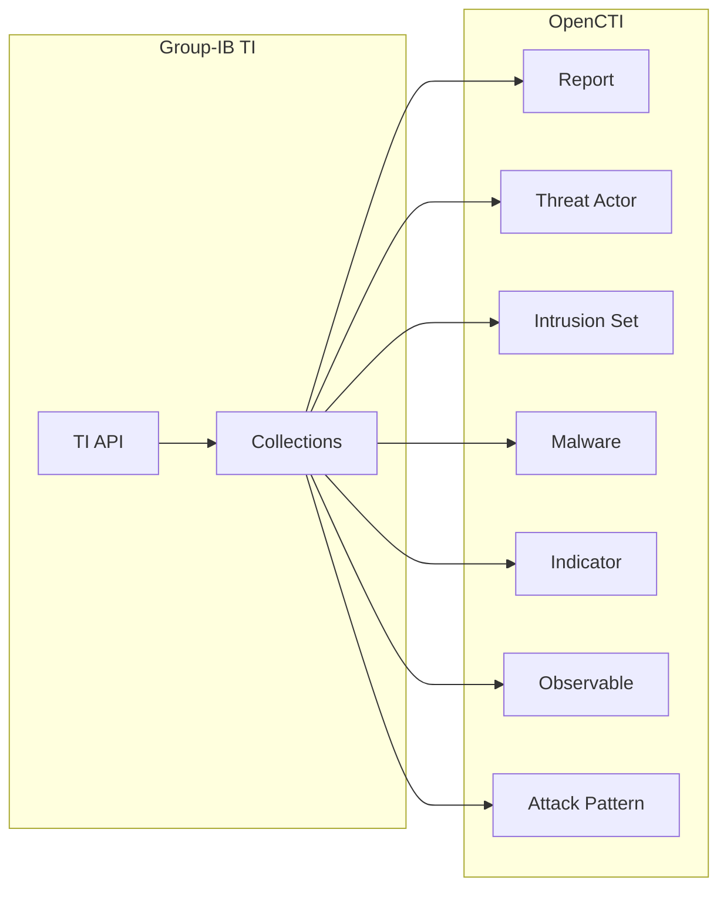

# OpenCTI Group-IB Connector

The Group-IB connector imports threat intelligence from Group-IB's Threat Intelligence platform into OpenCTI.

| Status            | Date       | Comment |
|-------------------|------------|---------|
| Filigran Verified | 2025-03-10 | -       |

## Table of Contents

- [OpenCTI Group-IB Connector](#opencti-group-ib-connector)
  - [Table of Contents](#table-of-contents)
  - [Introduction](#introduction)
  - [Installation](#installation)
    - [Requirements](#requirements)
  - [Configuration variables](#configuration-variables)
    - [OpenCTI environment variables](#opencti-environment-variables)
    - [Base connector environment variables](#base-connector-environment-variables)
    - [Connector extra parameters environment variables](#connector-extra-parameters-environment-variables)
  - [Deployment](#deployment)
    - [Docker Deployment](#docker-deployment)
    - [Manual Deployment](#manual-deployment)
  - [Usage](#usage)
  - [Behavior](#behavior)
  - [Debugging](#debugging)
  - [Additional information](#additional-information)

## Introduction

The OpenCTI Group-IB Connector is a standalone Python process that collects data from Group-IB Threat Intelligence via API calls and pushes it as STIX objects to OpenCTI server.

Group-IB Threat Intelligence is a system for cyber-attack analysis and attribution, threat hunting, and network infrastructure protection based on data about adversary tactics, tools, and activities. TI combines unique data sources and experience in investigating high-tech crimes and responding to complex, multi-stage attacks worldwide. The system stores data on threat actors, domains, IPs, and infrastructure collected over the past 22 years, including those that criminals have attempted to take down.

To use the integration, please ensure that you have an active Threat Intelligence license to access the interface and that it covers the API endpoints you wish to reach.

## Installation

### Requirements

- OpenCTI Platform >= 6.3.1
- Active Group-IB Threat Intelligence license
- Group-IB API credentials (username and token)

## Configuration variables

There are a number of configuration options, which are set either in `docker-compose.yml` (for Docker) or in `.env` file (for manual deployment).

> **Note**: Currently the connector cannot run with `config.yml` file, only with `.env` file because of ConnectorHelper instantiation and proxy settings code.

### OpenCTI environment variables

| Parameter     | config.yml | Docker environment variable | Mandatory | Description                                          |
|---------------|------------|-----------------------------|-----------|------------------------------------------------------|
| OpenCTI URL   | url        | `OPENCTI_URL`               | Yes       | The URL of the OpenCTI platform.                     |
| OpenCTI Token | token      | `OPENCTI_TOKEN`             | Yes       | The default admin token set in the OpenCTI platform. |

### Base connector environment variables

| Parameter       | config.yml      | Docker environment variable   | Default | Mandatory | Description                                                              |
|-----------------|-----------------|-------------------------------|---------|-----------|--------------------------------------------------------------------------|
| Connector ID    | id              | `CONNECTOR_ID`                |         | Yes       | A unique `UUIDv4` identifier for this connector instance.                |
| Connector Name  | name            | `CONNECTOR_NAME`              |         | Yes       | Name of the connector.                                                   |
| Connector Scope | scope           | `CONNECTOR_SCOPE`             |         | Yes       | The scope or type of data the connector is importing.                    |
| Log Level       | log_level       | `CONNECTOR_LOG_LEVEL`         | info    | No        | Determines the verbosity of logs: `debug`, `info`, `warn`, or `error`.   |
| Duration Period | duration_period | `CONNECTOR_DURATION_PERIOD`   |         | Yes       | Time interval between runs in ISO 8601 format (e.g., `PT3M`, `P1D`).     |

### Connector extra parameters environment variables

| Parameter        | config.yml         | Docker environment variable | Default | Mandatory | Description                                      |
|------------------|--------------------|-----------------------------|---------|-----------|--------------------------------------------------|
| TI API URL       | ti_api.url         | `TI_API__URL`               |         | Yes       | Group-IB Threat Intelligence API URL.            |
| TI API Username  | ti_api.username    | `TI_API__USERNAME`          |         | Yes       | Threat Intelligence Portal profile email.        |
| TI API Token     | ti_api.token       | `TI_API__TOKEN`             |         | Yes       | Threat Intelligence API Token.                   |
| Proxy IP         | proxy.ip           | `PROXY_IP`                  |         | No        | Proxy server IP address.                         |
| Proxy Port       | proxy.port         | `PROXY_PORT`                |         | No        | Proxy server port.                               |
| Proxy Protocol   | proxy.protocol     | `PROXY_PROTOCOL`            |         | No        | Proxy protocol (http/https).                     |
| Proxy Username   | proxy.username     | `PROXY_USERNAME`            |         | No        | Proxy authentication username.                   |
| Proxy Password   | proxy.password     | `PROXY_PASSWORD`            |         | No        | Proxy authentication password.                   |

## Deployment

### Docker Deployment

Build the Docker image:

```bash
docker build -t opencti/connector-group-ib:latest .
```

Configure environment variables and start:

```bash
docker compose up -d
```

### Manual Deployment

1. Copy `.env.sample` to `.env` and configure variables:

```bash
cp .env.sample .env
nano .env
```

2. Install dependencies:

```bash
pip3 install -r requirements.txt
```

3. Start the connector:

```bash
python3 main.py
```

## Usage

The connector runs automatically at the interval defined by `CONNECTOR_DURATION_PERIOD`. To force an immediate run:

**Data Management → Ingestion → Connectors**

Find the connector and click the refresh button to reset the state and trigger a new data fetch.

### Enabling Collections

To start download process for any collection:

1. Set `enable` parameter to `true`
2. Set `default_date` parameter (format: `YYYY-MM-DD`)

Example `.env` configuration:

```
TI_API__COLLECTIONS__APT_THREAT__DEFAULT_DATE='2021-08-01'
TI_API__COLLECTIONS__APT_THREAT__ENABLE=true
TI_API__COLLECTIONS__APT_THREAT__TTL=90
```

> **Note**: The `default_date` parameter is used for initial start only. After the first run, the connector tracks state in OpenCTI.

## Behavior

The connector fetches threat intelligence from Group-IB TI API and imports it as STIX objects into OpenCTI.

### Data Flow



### Entity Mapping

| Group-IB Collection      | OpenCTI Entity      | Description                                      |
|--------------------------|---------------------|--------------------------------------------------|
| apt/threat               | Report              | Nation-state threat reports                      |
| hi/threat                | Report              | Cybercriminal threat reports                     |
| apt/threat_actor         | Threat Actor        | Nation-state threat actors                       |
| hi/threat_actor          | Threat Actor        | Cybercriminal threat actors                      |
| malware/cnc              | Malware, Indicator  | Malware C&C infrastructure                       |
| ioc/common               | Indicator, Observable| IOCs from multiple collections                  |
| attacks/ddos             | Indicator           | DDoS attack indicators                           |
| attacks/phishing_group   | Indicator           | Phishing campaign indicators                     |
| suspicious_ip/*          | Indicator           | Suspicious IP addresses                          |

### Available Collections

| Collection               | Description                                      | Data Volume |
|--------------------------|--------------------------------------------------|-------------|
| apt/threat               | Nation-state threat reports                      | Medium      |
| hi/threat                | Cybercriminal threat reports                     | Medium      |
| apt/threat_actor         | Nation-state actors                              | Small       |
| hi/threat_actor          | Cybercriminal actors                             | Small       |
| malware/cnc              | Malware C&C servers                              | Large       |
| ioc/common               | Combined IOCs                                    | Large       |
| attacks/ddos             | DDoS attacks                                     | Very Large  |
| attacks/phishing_group   | Phishing campaigns                               | Very Large  |
| attacks/deface           | Website defacements                              | Very Large  |
| suspicious_ip/tor_node   | Tor exit nodes                                   | Large       |
| suspicious_ip/vpn        | VPN endpoints                                    | Large       |
| suspicious_ip/scanner    | Scanner IPs                                      | Very Large  |

> **Tip**: For very large collections, set `default_date` to 1-3 days ago to avoid overwhelming initial imports.

### Extra Settings

Configure in `endpoints_config.yaml`:

| Setting                              | Description                                      |
|--------------------------------------|--------------------------------------------------|
| `intrusion_set_instead_of_threat_actor` | Create Intrusion Set above Threat Actor       |
| `ignore_non_malware_ddos`            | Skip DDoS events without malware payload         |
| `ignore_non_indicator_threats`       | Skip threat events without indicators            |
| `enable_statement_marking`           | Add "Group-IB" statement marking to objects      |

## Debugging

Enable verbose logging:

```env
CONNECTOR_LOG_LEVEL=debug
```

### Common Issues

| Issue                     | Solution                                            |
|---------------------------|-----------------------------------------------------|
| 403 Status Response       | Verify IP is in API access list and API key is valid |
| Access denied             | Check OpenCTI user permissions                      |
| No data imported          | Ensure collections are enabled with valid dates     |

### Support

For assistance:
- Email: integration@group-ib.com
- Service Desk: https://tap.group-ib.com/service_desk

## Additional information

### FAQ

1. **Where can I find reports from last threats?**
   - `hi/threat` for Cybercriminals
   - `apt/threat` for Nation-State actors

2. **What tags are used?**
   - Collection name (spaces instead of `_` or `/`)
   - Admiralty codes and TLP where applicable
   - Affected products for `osi/vulnerability`
   - "Tailored" tag for `hi/threat` and `apt/threat`

### Documentation

- API Documentation: https://tap.group-ib.com/hc/api?scope=integrations
- Collection Details: https://tap.group-ib.com/hc/api?scope=integrations&q=en%2FIntegrations%2FDetailed%20collections%20info
