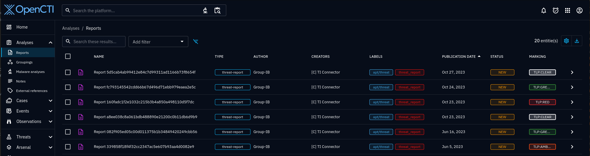
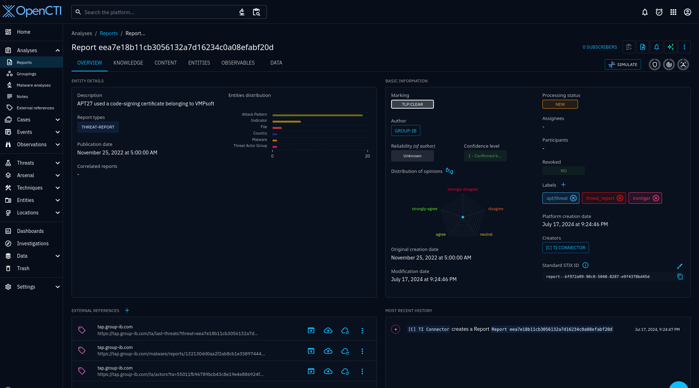
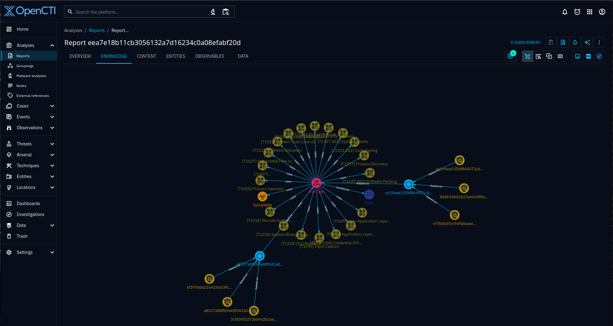
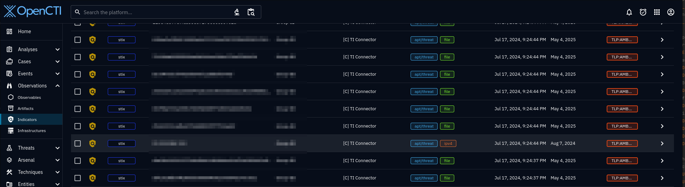
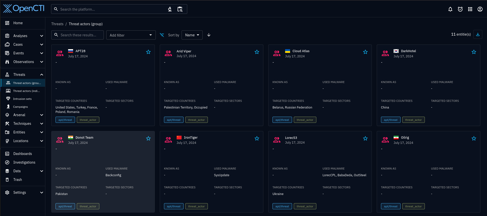
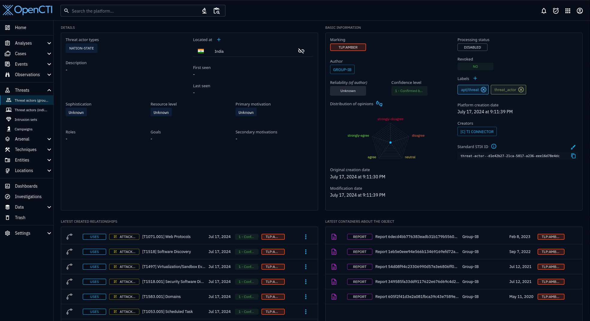
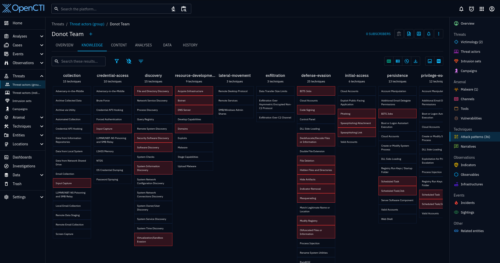
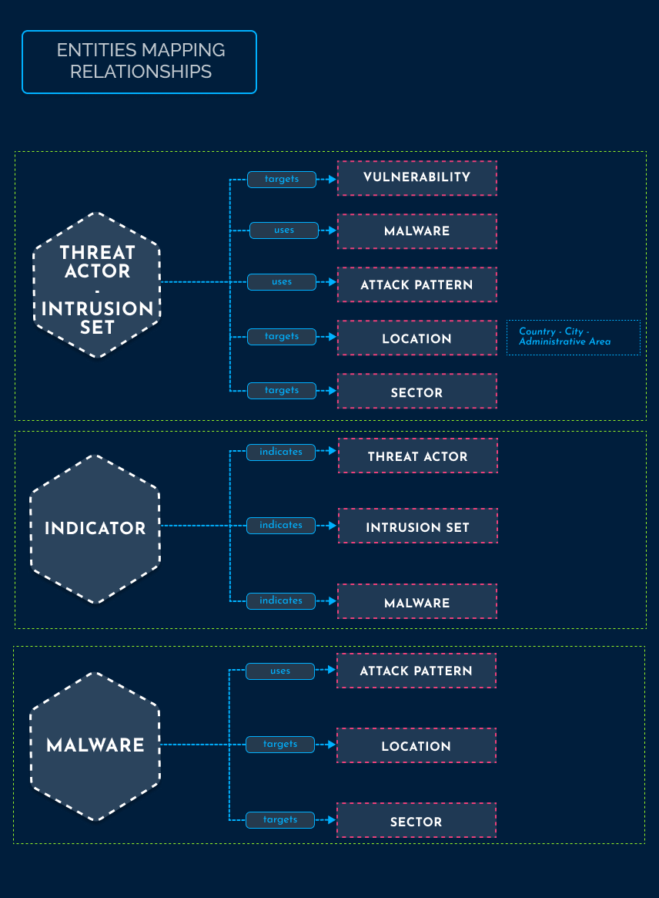

# OpenCTI Group-IB Connector

| Status            | Date       | Comment |
| ----------------- |------------| ------- |
| Filigran Verified | 2025-03-10 |    -    |

[](https://www.python.org/downloads/release/python-3110/)
[](https://github.com/OpenCTI-Platform/opencti/releases/tag/6.8.12)


The OpenCTI Group-IB Connector is a standalone Python process that collects data from Threat Intelligence via API calls
and pushes it as STIX objects to OpenCTI server.

It is a system for cyber-attack analysis and attribution, threat hunting, and network infrastructure protection
based on data about adversary tactics, tools, and activities. TI combines unique data sources and experience in
investigating high-tech crimes and responding to complex, multi-stage attacks worldwide. The system stores data
on threat actors, domains, IPs, and infrastructure collected over the past 22 years, including those that criminals
have attempted to take down.

To use the integration, please ensure that you have an active Threat Intelligence license to access the
interface and that it covers the API endpoints you wish to reach. Documentation can be found here - https://tap.group-ib.com/hc/api?scope=integrations&q=en%2FIntegrations%2FStarting%20Guide%2FInitial%20Steps%2FInitial%20Steps


## **Content**

- [OpenCTI Group-IB Connector](#opencti-group-ib-connector)
  - [**Content**](#content)
  - [**Installation**](#installation)
    - [Requirements](#requirements)
  - [**Quick start**](#quick-start)
    - [Common environment variables](#common-environment-variables)
    - [OpenCTI environment variables](#opencti-environment-variables)
    - [Threat Intelligence API environment variables](#threat-intelligence-api-environment-variables)
    - [Threat Intelligence API Proxy environment variables](#threat-intelligence-api-proxy-environment-variables)
    - [Single-container vs multi-instance](#single-container-vs-multi-instance)
    - [Docker Deployment](#docker-deployment)
    - [Enable required collections](#enable-required-collections)
    - [Date format](#date-format)
    - [Recommended DEFAULT\_DATE per collection](#recommended-default_date-per-collection)
    - [Notes](#notes)
  - [Collection → OpenCTI mapping](#collection--opencti-mapping)
    - [Overview](#overview)
    - [TLP, severity \& labels reference](#tlp-severity--labels-reference)
    - [Collection display labels (`COLLECTION_DISPLAY_LABEL`)](#collection-display-labels-collection_display_label)
    - [Per-collection detail](#per-collection-detail)
      - [`apt/threat` — Nation-state APT reports](#aptthreat--nation-state-apt-reports)
      - [`apt/threat_actor` — Nation-state APT actor profile](#aptthreat_actor--nation-state-apt-actor-profile)
      - [`hi/threat` — Cybercrime threat reports](#hithreat--cybercrime-threat-reports)
      - [`hi/threat_actor` — Cybercrime actor profile](#hithreat_actor--cybercrime-actor-profile)
      - [`hi/open_threats` — Consolidated public reports](#hiopen_threats--consolidated-public-reports)
      - [`ioc/primary` — Primary IOC stream](#iocprimary--primary-ioc-stream)
      - [`malware/malware` — Malware family profiles](#malwaremalware--malware-family-profiles)
      - [`malware/cnc` — Command-and-control infrastructure](#malwarecnc--command-and-control-infrastructure)
      - [`malware/config` — Decoded malware configurations](#malwareconfig--decoded-malware-configurations)
      - [`malware/signature` — Antivirus signatures](#malwaresignature--antivirus-signatures)
      - [`malware/yara` — Group-IB YARA rules](#malwareyara--group-ib-yara-rules)
      - [`attacks/ddos` — DDoS attacks](#attacksddos--ddos-attacks)
      - [`attacks/deface` — Defacement attacks](#attacksdeface--defacement-attacks)
      - [`attacks/phishing_group` — Phishing campaigns](#attacksphishing_group--phishing-campaigns)
      - [`attacks/phishing_kit` — Phishing kit metadata](#attacksphishing_kit--phishing-kit-metadata)
      - [`compromised/access` — Initial-access broker listings](#compromisedaccess--initial-access-broker-listings)
      - [`compromised/account_group` — Stealer-log credential groups](#compromisedaccount_group--stealer-log-credential-groups)
      - [`compromised/bank_card_group` — Compromised bank cards](#compromisedbank_card_group--compromised-bank-cards)
      - [`compromised/masked_card` — Compromised masked cards](#compromisedmasked_card--compromised-masked-cards)
      - [`compromised/spd` — Suspicious payment details](#compromisedspd--suspicious-payment-details)
      - [`compromised/discord` — Discord channel data](#compromiseddiscord--discord-channel-data)
      - [`compromised/messenger` — Telegram chat data](#compromisedmessenger--telegram-chat-data)
      - [`darkweb/forums` — Darkweb forum posts](#darkwebforums--darkweb-forum-posts)
      - [`osi/git_repository` — Git leaks (GitHub, GitLab)](#osigit_repository--git-leaks-github-gitlab)
      - [`osi/public_leak` — Public paste leaks (Pastebin, etc.)](#osipublic_leak--public-paste-leaks-pastebin-etc)
      - [`osi/vulnerability` — Newly disclosed CVEs](#osivulnerability--newly-disclosed-cves)
      - [`suspicious_ip/{open_proxy, scanner, socks_proxy, tor_node, vpn}` — Suspicious IP feeds](#suspicious_ipopen_proxy-scanner-socks_proxy-tor_node-vpn--suspicious-ip-feeds)
    - [Cross-cutting](#cross-cutting)
  - [Parameter reference](#parameter-reference)
    - [Incremental feeds (`seqUpdate`) and connector state](#incremental-feeds-sequpdate-and-connector-state)
    - [Threat reports (`apt/threat`, `hi/threat`) and observables](#threat-reports-aptthreat-hithreat-and-observables)
    - [Global extra settings](#global-extra-settings)
    - [Per-collection — common settings](#per-collection--common-settings)
    - [Collection-specific parameter matrix](#collection-specific-parameter-matrix)
    - [Per-collection — APT / HI threat reports (`apt/threat`, `hi/threat`)](#per-collection--apt--hi-threat-reports-aptthreat-hithreat)
    - [Per-collection — Threat actors (`apt/threat_actor`, `hi/threat_actor`)](#per-collection--threat-actors-aptthreat_actor-hithreat_actor)
    - [Per-collection — Compromised data](#per-collection--compromised-data)
    - [Per-collection — Open-source intelligence (`osi/*`) and `hi/open_threats`](#per-collection--open-source-intelligence-osi-and-hiopen_threats)
    - [Per-collection — Malware infrastructure](#per-collection--malware-infrastructure)
    - [Per-collection — Attacks (`attacks/*`)](#per-collection--attacks-attacks)
    - [General execution parameters](#general-execution-parameters)
    - [TI API and proxy](#ti-api-and-proxy)
    - [OpenCTI platform](#opencti-platform)
  - [Extra settings](#extra-settings)
    - [Tags (`local_custom_tag`)](#tags-local_custom_tag)
    - [Options](#options)
    - [Hunting rules (per-collection)](#hunting-rules-per-collection)
    - [Preserve manual labels](#preserve-manual-labels)
  - [Examples](#examples)
  - [Troubleshooting](#troubleshooting)
  - [FAQ](#faq)
    - [Debugging](#debugging)


<br/>


## **Installation**

### Requirements

- **Python >= 3.12**
- Active Threat Intelligence license
- OpenCTI Platform >= 6.8.12


## **Quick start**

Three steps to a running connector. Run all commands from the connector directory — the directory that contains `Dockerfile` and `docker-compose.yml`.

1. **Configure `.env`.** Copy the template and fill in the required values:

   ```bash
   cp .env.sample .env
   $EDITOR .env
   ```

   At minimum set `OPENCTI_URL`, `OPENCTI_TOKEN`, `CONNECTOR_ID`, `TI_API__USERNAME`, `TI_API__TOKEN`, and enable at least one collection (`TI_API__COLLECTIONS__<NAME>__ENABLE=true` + `…__DEFAULT_DATE=YYYY-MM-DD`). See [Common environment variables](#common-environment-variables), [Recommended `DEFAULT_DATE` per collection](#recommended-default_date-per-collection), and the `.env.sample` file itself for the full list.

2. **Make sure the connector joins the same Docker network as your OpenCTI containers.** The shipped `docker-compose.yml` attaches the connector to an **external** network:

   ```yaml
   networks:
     default:
       external: true
       name: docker_default
   ```

   The `name:` value must match the network where OpenCTI's `opencti`, `redis`, `rabbitmq`, `elasticsearch`, etc. run — otherwise the connector cannot reach the platform or RabbitMQ. Inspect your OpenCTI stack with `docker network ls` and update `name:` to the actual network if it differs (common variants: `docker_default`, `opencti_default`, `<project>_default`).

3. **Start the connector** from the directory that holds the `Dockerfile` and `docker-compose.yml`:

   ```bash
   docker compose up -d
   docker compose logs -f
   ```

   The container builds from the local `Dockerfile` on first start. After a few seconds you should see the connector register with OpenCTI and begin consuming the enabled collections.

For build internals, multi-instance deployments, and non-Docker setups, see the rest of this README and [`README_dev.md`](./README_dev.md).


### Common environment variables

Configuration parameters are set either in `.env` or in `config.yml`:

- `.env` is the recommended source for both Docker and manual runs.
- `config.yml` is supported as an alternative for local manual runs. When present, it takes precedence and `.env` is ignored at parse time.

Both files carry the same logical settings; `.env.sample` and `src/config.yml.sample` are kept in sync.

> **Important — choose one source per deployment.**
> Do not mix `.env` and `config.yml`. If both are present, `config.yml` wins and `.env` is silently ignored. Use whichever fits your operations team; we recommend `.env` because Docker Compose, secret managers, and `docker-instances/` all integrate with it cleanly.

Expected environment variables to be set in the `docker-compose.yml` that describe the connector itself. Most of the time, these values are NOT expected to be changed.

| Parameter                  | Mandatory  | Description                                                        |
|----------------------------|------------|--------------------------------------------------------------------|
| `CONNECTOR_NAME`           | Yes        | A connector name to be shown in OpenCTI.                           |
| `CONNECTOR_SCOPE`          | Yes        | STIX types the connector may create (must include objects produced by enabled collections). Default in `.env.sample`: `stix2,report,threat-actor,intrusion-set,malware,attack-pattern,vulnerability,indicator,location,identity,incident,note,relationship,ipv4-addr,ipv6-addr,domain,url,StixFile,email-addr,user-account,payment-card,bank-account`. |
| `CONNECTOR_ID`             | Yes        | A valid arbitrary `UUIDv4` that must be unique for this connector. |

However, there are other values which are expected to be configured by end users.
The following values are expected to be defined in the `.env` file.
Note that the `.env.sample` file can be used as a reference.

The ones that follow are connector's generic execution parameters expected to be added for export connectors.

| Parameter                      | Mandatory | Description                                                                                                                                                                   |
|--------------------------------|-----------|-------------------------------------------------------------------------------------------------------------------------------------------------------------------------------|
| `CONNECTOR_LOG_LEVEL`          | Yes       | The log level for this connector: `debug`, `info`, `warning`, or `error`.                                                                                                   |
| `CONNECTOR_DURATION_PERIOD`    | Yes       | Scheduled run interval in **ISO 8601 duration** form (e.g. `PT4H`, `PT30M`). The OpenCTI connector helper (`schedule_iso`) invokes each enabled collection on this cadence; it is not a tight poll loop. |


### OpenCTI environment variables

Below are the parameters you'll need to set for OpenCTI:

| Parameter               | Mandatory | Description                                                                                                      |
|-------------------------|-----------|------------------------------------------------------------------------------------------------------------------|
| `OPENCTI_URL`           | Yes       | The URL of the OpenCTI platform. Note that final `/` should be avoided. Example value: `http://opencti:8080`     |
| `OPENCTI_TOKEN`         | Yes       | The default admin token configured in the OpenCTI platform parameters file.                                      |


### Threat Intelligence API environment variables

Below are the parameters you'll need to set for Threat Intelligence API:

| Parameter            |  Mandatory | Description                                    |
|----------------------|------------|-------------------------------------------------|
| `TI_API__URL`        |  Yes       | Threat Intelligence API URL.                   |
| `TI_API__USERNAME`   |  Yes       | Threat Intelligence Portal profile email.      |
| `TI_API__TOKEN`      |  Yes       | Threat Intelligence API Token.                 |


### Threat Intelligence API Proxy environment variables

Below are the parameters you'll need to set if you have proxy server (if necessary):

| Parameter                    | Mandatory | Description     |
|------------------------------|-----------|-----------------|
| `TI_API__PROXY__IP`          | No        | Proxy host or IP. |
| `TI_API__PROXY__PORT`       | No        | Proxy port.     |
| `TI_API__PROXY__PROTOCOL`   | No        | Proxy protocol. |
| `TI_API__PROXY__USERNAME`   | No        | Proxy username. |
| `TI_API__PROXY__PASSWORD`   | No        | Proxy password. |


### Single-container vs multi-instance

The top-level [Quick start](#quick-start) covers a single-container deployment. A single container processes its enabled collections **sequentially** (one at a time per scheduler tick); this is fine for most installations. The multi-instance layout in [`docker-instances/`](./docker-instances/README.md) is needed **only** when you want to run several connector containers **in parallel**, each ingesting its own convenient group of collections (e.g. one container for IOC feeds, another for compromised data) — that is the only reason to prefer it over one container with all collections enabled.

For build internals (pinning `pycti` to your OpenCTI version, manual non-Docker setup, dispatch architecture) see [`README_dev.md`](./README_dev.md).


### Docker Deployment

Build the Docker image:

```bash
docker build -t opencti/connector-group-ib:latest .
```

Configure environment variables and start:

```bash
docker compose up -d
```


<br/>


### Enable required collections

`DEFAULT_DATE` is used only on the **first** run of a collection: the connector treats it as the lookback anchor and pulls every record from that date forward. After the first run, the upstream cursor (`sequpdate`) is stored in OpenCTI's connector state and used for all subsequent runs — `DEFAULT_DATE` is ignored.

If an enabled collection has an empty `DEFAULT_DATE`, the underlying Group-IB API adapter falls back to **today minus 3 days** before requesting the initial `seqUpdate`. For predictable backfills and reproducible deployments, always set an explicit `YYYY-MM-DD` value.

To re-seed a collection from scratch:

1. Stop the connector.
2. Clear the state entry for that collection in OpenCTI (or wipe the whole connector state).
3. Set a new `DEFAULT_DATE`.
4. Start the connector.

To start ingesting a collection:

1. Set `TI_API__COLLECTIONS__<NAME>__ENABLE=true`.
2. Set `TI_API__COLLECTIONS__<NAME>__DEFAULT_DATE='YYYY-MM-DD'`. **Always specify an explicit date**. See the recommended lookback windows in the next subsection.

Example in `.env`:

```bash
TI_API__COLLECTIONS__APT_THREAT__ENABLE=true
TI_API__COLLECTIONS__APT_THREAT__DEFAULT_DATE='2022-01-01'

TI_API__COLLECTIONS__ATTACKS_PHISHING_GROUP__ENABLE=true
TI_API__COLLECTIONS__ATTACKS_PHISHING_GROUP__DEFAULT_DATE='2026-05-12'

TI_API__COLLECTIONS__IOC_PRIMARY__ENABLE=true
TI_API__COLLECTIONS__IOC_PRIMARY__DEFAULT_DATE='2026-02-12'
```

Equivalent in `config.yml`:

```yaml
ti_api:
  collections:
    apt/threat:
      enable: true
      default_date: '2022-01-01'
    attacks/phishing_group:
      enable: true
      default_date: '2026-05-12'
    ioc/primary:
      enable: true
      default_date: '2026-02-12'
```

### Date format

Default date format.

```'YYYY-MM-DD'```

### Recommended DEFAULT_DATE per collection

Use the following lookback windows to set a specific DEFAULT_DATE for the initial run. Convert each window into a calendar date in 'YYYY-MM-DD' (e.g., "5 days ago" → "2026-01-18" if today is 2026-01-23).

- TI_API__COLLECTIONS__APT_THREAT__DEFAULT_DATE: 2–4 years ago
- TI_API__COLLECTIONS__APT_THREAT_ACTOR__DEFAULT_DATE: 2–4 years ago
- TI_API__COLLECTIONS__ATTACKS_DDOS__DEFAULT_DATE: 5–10 days ago
- TI_API__COLLECTIONS__ATTACKS_DEFACE__DEFAULT_DATE: 5–10 days ago
- TI_API__COLLECTIONS__ATTACKS_PHISHING_GROUP__DEFAULT_DATE: 3–5 days ago
- TI_API__COLLECTIONS__ATTACKS_PHISHING_KIT__DEFAULT_DATE: 30 days ago
- TI_API__COLLECTIONS__COMPROMISED_ACCESS__DEFAULT_DATE: 90 days ago
- TI_API__COLLECTIONS__COMPROMISED_ACCOUNT_GROUP__DEFAULT_DATE: 2–4 years ago
- TI_API__COLLECTIONS__COMPROMISED_BANK_CARD_GROUP__DEFAULT_DATE: 2 years ago
- TI_API__COLLECTIONS__COMPROMISED_DISCORD__DEFAULT_DATE: 30 days ago
- TI_API__COLLECTIONS__COMPROMISED_MASKED_CARD__DEFAULT_DATE: 90 days ago
- TI_API__COLLECTIONS__COMPROMISED_MESSENGER__DEFAULT_DATE: 30 days ago
- TI_API__COLLECTIONS__COMPROMISED_SPD__DEFAULT_DATE: 90 days ago
- TI_API__COLLECTIONS__HI_OPEN_THREATS__DEFAULT_DATE: 30 days ago
- TI_API__COLLECTIONS__HI_THREAT__DEFAULT_DATE: 2–4 years ago
- TI_API__COLLECTIONS__HI_THREAT_ACTOR__DEFAULT_DATE: 2–4 years ago
- TI_API__COLLECTIONS__MALWARE_CNC__DEFAULT_DATE: 90 days ago
- TI_API__COLLECTIONS__MALWARE_MALWARE__DEFAULT_DATE: 2–4 years ago
- TI_API__COLLECTIONS__MALWARE_CONFIG__DEFAULT_DATE: 30 days ago
- TI_API__COLLECTIONS__MALWARE_SIGNATURE__DEFAULT_DATE: 30 days ago
- TI_API__COLLECTIONS__MALWARE_YARA__DEFAULT_DATE: 30 days ago
- TI_API__COLLECTIONS__IOC_PRIMARY__DEFAULT_DATE: 90 days ago
- TI_API__COLLECTIONS__DARKWEB_FORUMS__DEFAULT_DATE: 90 days ago
- TI_API__COLLECTIONS__OSI_GIT_REPOSITORY__DEFAULT_DATE: 30 days ago
- TI_API__COLLECTIONS__OSI_PUBLIC_LEAK__DEFAULT_DATE: 30 days ago
- TI_API__COLLECTIONS__OSI_VULNERABILITY__DEFAULT_DATE: 90 days ago
- TI_API__COLLECTIONS__SUSPICIOUS_IP_OPEN_PROXY__DEFAULT_DATE: 5 days ago
- TI_API__COLLECTIONS__SUSPICIOUS_IP_SCANNER__DEFAULT_DATE: 5 days ago
- TI_API__COLLECTIONS__SUSPICIOUS_IP_SOCKS_PROXY__DEFAULT_DATE: 5 days ago
- TI_API__COLLECTIONS__SUSPICIOUS_IP_TOR_NODE__DEFAULT_DATE: 5 days ago
- TI_API__COLLECTIONS__SUSPICIOUS_IP_VPN__DEFAULT_DATE: 5 days ago

### Notes

*Note*: For IOC-only ingestion, enable `ioc/primary` — it carries per-IoC `riskScore` scoring out of the box.
The `ioc/primary` collection contains IoCs derived from `malware/cnc`, `hi/threat`, and `apt/threat` upstream sources.


*Note*: ```attacks/deface```, ```attacks/ddos```, ```attacks/phishing_group```, ```suspicious_ip/open_proxy```,
```suspicious_ip/socks_proxy```, ```suspicious_ip/tor_node```,
```suspicious_ip/vpn```, ```suspicious_ip/scanner``` - are very large collections,
and it is recommended to keep the initial `DEFAULT_DATE` short. Use the per-collection recommendations above as the source of truth.
Learn more about each collection
[here](https://tap.group-ib.com/hc/api?scope=integrations&q=en%2FIntegrations%2FCollections%20Overview%2FCollections%20Overview).


<br/>


## Collection → OpenCTI mapping

The TI connector consumes **31 Group-IB collections** and maps each one to a specific set of STIX 2.1 SDOs / SCOs / SROs in OpenCTI. Two sections below: a compact one-row-per-collection **overview** for quick scanning, and a per-collection **detail** breakdown showing which entities, relationships, source fields and TLP each handler emits. 

Each collection is routed to one of two dispatch paths inside the connector — `default` or `special`. The mechanics are described in [`README_dev.md`](./README_dev.md) (*Dispatch architecture*); when reading the overview table you only need to know that the column tells you whether the bundle has the standard report-centric shape (`default`) or a collection-specific shape (`special`).

### Overview

| Collection | Dispatch | OpenCTI entities |
|------------|----------|------------------|
| `apt/threat` | default | `Report` + `Threat-Actor`/`Intrusion-Set` + `Malware` + `Attack-Pattern` + `Vulnerability` + `Domain/Url/IPv4/IPv6` (IOC) + `StixFile` (IOC) + `Indicator` (STIX pattern, one per network/file IOC) + `Location` + victimology `Identity` (Sector/Organization) and `Location` (Region) with `<actor> —[targets]→` (gated by `TARGETED_ENTITIES_AS_SDO`) (+ optional labels-Note when `STORE_REPORT_LABELS_IN_NOTE=true`) |
| `apt/threat_actor` | default | `Threat-Actor`/`Intrusion-Set` + `Malware` × N from `stat.malware[]` (with `—[uses]→`) + `Vulnerability` × N from `stat.cve[]` (with `—[targets]→`) + base/target `Location`. Typically no `Report`. |
| `hi/threat` | default | Same shape as `apt/threat`; global label `cybercriminal` instead of `nation_state` |
| `hi/threat_actor` | default | Same shape as `apt/threat_actor` (Threat-Actor + arsenal `Malware` + `Vulnerability` from `stat.*` + Locations) with cybercriminal labels |
| `malware/malware` | default | Enriched `Malware` profile + related `Threat-Actor` + linked `Malware` families + `Attack-Pattern` + source `Location` + profile `Note`; IOC observables only if mapped IOC fields are present |
| `malware/signature` | default | `Indicator` (pattern_type=suricata in the current mapping) + `Malware` |
| `malware/yara` | default | `Indicator` (pattern_type=yara) + `Malware` |
| `attacks/ddos` | special | `Incident` (incident_type=`ddos`, gated by `CREATE_INCIDENT`) + non-IOC target `Domain/Url/IPv4/IPv6` + CnC `Domain/Url/IPv4/IPv6` as **Indicators** (gated by `CNC_AS_INDICATOR`) + `Malware` + `Threat-Actor` + `Location` + `Note` ("DDoS attack: …") |
| `attacks/deface` | special | `Incident` (incident_type=`defacement`, gated by `CREATE_INCIDENT`) + non-IOC `Domain-Name/Url/IPv4/IPv6` (victim) + `Threat-Actor` + `Location` + `Note` ("Website defacement: …") |
| `attacks/phishing_group` | special | `Domain-Name`/`Url` (IOC) + `IPv4/IPv6` (non-IOC, hosting) + brand `Identity` (Organization, gated by `BRAND_AS_IDENTITY`) + `Threat-Actor` + `Location` + `Note` ("Phishing group: …") |
| `attacks/phishing_kit` | special | `StixFile`/`Email-Addr`/`Domain-Name`/`Url` (all IOC) + brand `Identity` × N (Organization, gated by `BRAND_AS_IDENTITY`) + `Note` ("Phishing kit: …") |
| `osi/vulnerability` | special | `Vulnerability` (advisory, primary) + `Vulnerability` × N (CVE, linked) + `Note` ("Vulnerability details: …") |
| `suspicious_ip/{open_proxy,scanner,socks_proxy,tor_node,vpn}` | default (non-IOC) | `IPv4-Addr` (non-IOC, background context) — no Report in the current mapping |
| `compromised/access` | special | `Incident` (data-leak, objective=unauthorized-access) + CnC `Domain/Url/IPv4` as **Indicators** (gated by `CNC_AS_INDICATOR`) + target `Domain/IPv4` (non-IOC, gated by `TARGET_OBSERVABLES`) + `Malware` (at most 1) + `Note` ("Compromised access details") |
| `compromised/account_group` | special | `Incident` (data-leak, objective=credential-theft) + `User-Account` + `Domain/Url/IPv4` + `Malware` + `Threat-Actor` + `Note` ("Compromised account group details") |
| `compromised/bank_card_group` | special | `Incident` (data-leak, objective=financial-theft) + `Payment-Card` (full card number) + CnC `Domain/Url/IPv4/IPv6` (non-IOC, from `cnc_ipv4_ip` when value is IPv6) + `Malware` × N + `Threat-Actor` × N + `Note` |
| `compromised/masked_card` | special | `Incident` (data-leak, objective=financial-theft) + `Payment-Card` (card number) + CnC `Domain/Url/IPv4/IPv6` + client `IPv4` + `Malware` + `Threat-Actor` + `Location` × 2 + `Note` |
| `compromised/spd` | special | `Incident` (data-leak, objective=credential-theft) + `Email-Addr` (non-IOC) + `Payment-Card` (bank card) + `Bank-Account` (IBAN) + `User-Account` (core SPD value) + `Location` + `Note` ("Suspicious payment details") |
| `compromised/discord` | special | `User-Account` + per-message `Note` (stable id `discord-message:<id>`). The Note carries all channel metadata (server, channel id, title, first/last message dates). No `Identity` SDO is emitted for the channel itself. |
| `compromised/messenger` | special | `User-Account` + per-message `Note` (stable id `telegram-message:<id>`). The Note carries all channel/chat metadata. No `Identity` SDO is emitted for the channel/chat itself. |
| `darkweb/forums` | special | `User-Account` (author, `account_type=forum`) + `Note` ("Darkweb post: …") — no Incident, no IOC observables |
| `malware/cnc` | special | All CnC values (`Domain/Url/IPv4/IPv6/File`) as **Indicators** by default (`ALL_OBSERVABLES_AS_INDICATORS`; `false` → primary-only Indicator) + `Malware` + `Threat-Actor`/`Intrusion-Set` + `Note` ("Malware CnC: …") — no Incident |
| `malware/config` | special | `Incident` (compromise, objective=credential-theft) + `Malware` + `StixFile` (IOC) + `Domain/IPv4/IPv6` (non-IOC) + `Note` ("Malware config details") |
| `hi/open_threats` | special | `Report` (threat_report) + `Note` ("Open Threat: …") + `Threat-Actor` × N + `Malware` × N + `Vulnerability` × N + `Domain/Url/IPv4/IPv6/StixFile` as **Indicators** (gated by `OBSERVABLES_AS_INDICATORS`) + `Location` × N |
| `ioc/primary` | special | `Indicator` (pattern_type=stix) + `Malware` + `Threat-Actor` + per-IOC `Note`, plus **per-IoC `riskScore` → `x_opencti_score`** on each emitted Indicator — no Incident, no Report, no standalone Observable in the bundle. Consolidates indicators from `apt/threat` + `hi/threat` + `malware/cnc`. |
| `osi/git_repository` | special | `Incident` (data-leak, credential-theft) + `Url` × N + `Email-Addr` × N (commit authors, gated by `AUTHOR_EMAIL_OBSERVABLES`) + `StixFile` × N (file hashes, non-IOC) + `Note` ("Git repository leak details") |
| `osi/public_leak` | special | `Incident` (data-leak, credential-theft) + `Url` × N (paste links, non-IOC) + `StixFile` (paste hash, when valid MD5/SHA-1/SHA-256) + `Note` ("Public leak details") |

### TLP, severity & labels reference

A consolidated view of the cross-cutting attributes the connector attaches to every collection's objects. The per-collection [detail](#per-collection-detail) below expands each row.

**Label scheme.** Every primary entity carries exactly one prefixed label — `collection:<Display Name>` (e.g. `collection:Attacks DDoS`, `collection:Nation-State Threat Report`) — sourced from `config.COLLECTION_DISPLAY_LABEL`. **All other labels are bare scalar values, with no `key:` prefix:** threat-category labels (`nation_state`, `cybercriminal`), malware-family names, threat-actor names, impersonated-brand names, `expertise` values, native Group-IB `raw_labels` (e.g. `ddos`), `source_type` values, forum names, SPD `tags`, and the boolean flags `tailored` / `autogen`. Each bare-label group is gated by its collection's `INCLUDE_*` flag (see the [parameter reference](#per-collection--common-settings)).

**TLP.** Markings come from `evaluation.tlp`, with two override kinds declared in `pipeline/collection_dispatch.py` (full lists in [Cross-cutting](#cross-cutting)): `tlp_strict` always replaces the event value; `tlp_fallback` applies only when the event omits a TLP. Threat-actor / malware / intrusion-set / incident SDOs additionally default to `amber+strict` via `config.DEFAULT_TLP_BY_SDO` when no marking is resolved.

**Severity.** Incident-style handlers map `evaluation.severity` (a TLP-like colour) to `Incident.severity` through `config.SEVERITY_COLOR_MAP`: `red → critical`, `orange → high`, `amber → high`, `yellow → medium`, `green → low`. The connector **never synthesizes** a severity — when `evaluation.severity` is absent or null the field is simply omitted from the STIX `Incident`. Collections that do not emit an `Incident` (e.g. `apt/threat`, `osi/vulnerability`, the `suspicious_ip/*` feeds) have no severity at all.

**Score.** `x_opencti_score` is set from `malware/malware` `threatLevel` (`config.THREAT_LEVEL_TO_SCORE`: `low → 25`, `medium → 50`, `medium-high → 65`, `high → 75`, `critical → 90`) and from `ioc/primary` per-IoC `riskScore`. `evaluation.reliability` becomes `x_opencti_reliability` where the source provides it.

| Collection | Effective TLP | Incident severity | Bare labels (besides `collection:<Name>`) |
|---|---|---|---|
| `apt/threat` | per event; actor SDOs → `amber+strict` | — | `nation_state`; `raw_labels`; `tailored`; `autogen`; expertise values; actor name on observables (`ADD_THREAT_ACTOR_LABEL_TO_OBSERVABLES`) |
| `apt/threat_actor` | `amber+strict` (strict) | — | `nation_state` |
| `hi/threat` | per event; actor SDOs → `amber+strict` | — | `cybercriminal`; `raw_labels`; `tailored`; `autogen`; expertise values; actor name on observables |
| `hi/threat_actor` | `amber+strict` (strict) | — | `cybercriminal` |
| `hi/open_threats` | per event; fallback `amber` | — | malware names; threat-actor names (on indicators) |
| `malware/malware` | per event; fallback `amber` | — | — (taxonomy in the Note; `x_opencti_score` from `threatLevel`) |
| `malware/cnc` | per event; fallback `amber` | — | malware names; threat-actor names |
| `malware/config` | per event; object default `amber+strict` | `evaluation.severity` → level | malware names |
| `malware/signature` | per event | — | — |
| `malware/yara` | per event | — | — |
| `attacks/ddos` | per event; fallback `amber` | `evaluation.severity` → level | — |
| `attacks/deface` | per event; fallback `amber` | `evaluation.severity` → level | — |
| `attacks/phishing_group` | per event; fallback `amber` | — | brand name |
| `attacks/phishing_kit` | per event; fallback `amber` | — | target brand names |
| `compromised/access` | per event; fallback `amber` | `evaluation.severity` → level | — |
| `compromised/account_group` | `red` (strict) | `evaluation.severity` → level | `source_type` value; malware names; threat-actor names |
| `compromised/bank_card_group` | per event; fallback `red` | `evaluation.severity` → level | — |
| `compromised/masked_card` | per event; fallback `red` | `evaluation.severity` → level | malware names; threat-actor names; `source_type` value |
| `compromised/spd` | per event; fallback `amber` | `evaluation.severity` → level | `tags` (hashtag-style scalars) |
| `compromised/discord` | per event; fallback `red` | — | — (channel metadata in the Note) |
| `compromised/messenger` | per event; fallback `red` | — | — (channel metadata in the Note) |
| `darkweb/forums` | per event; fallback `amber` | — | forum name |
| `ioc/primary` | `amber` (strict) | — | up to 5 malware names; up to 5 threat-actor names; event `tags` |
| `osi/git_repository` | per event; fallback `amber` | `evaluation.severity` → level | — |
| `osi/public_leak` | per event; fallback `amber` | `evaluation.severity` → level | — |
| `osi/vulnerability` | per event; fallback `amber` | — | — |
| `suspicious_ip/{open_proxy,scanner,socks_proxy,tor_node,vpn}` | per event | — | — |

### Collection display labels (`COLLECTION_DISPLAY_LABEL`)

Every primary entity emitted by the connector carries exactly one `collection:<Display Name>` label. The slug → label mapping is centralized in `src/connector/settings.py` as `COLLECTION_DISPLAY_LABEL` and is the single source of truth — changing a value here is the supported way to rename a collection label across the whole bundle.

| Collection slug | Emitted label |
|---|---|
| `apt/threat` | `collection:Nation-State Threat Report` |
| `apt/threat_actor` | `collection:Nation-State Threat Actor` |
| `hi/threat` | `collection:Cybercriminals Threat Report` |
| `hi/threat_actor` | `collection:Cybercriminals Threat Actor` |
| `hi/open_threats` | `collection:Open Threats` |
| `malware/malware` | `collection:Malware Report` |
| `malware/cnc` | `collection:Malware C&C` |
| `malware/config` | `collection:Malware Config` |
| `malware/signature` | `collection:Malware Signature` |
| `malware/yara` | `collection:Malware YARA` |
| `attacks/ddos` | `collection:Attacks DDoS` |
| `attacks/deface` | `collection:Attacks Deface` |
| `attacks/phishing_group` | `collection:Attacks Phishing Group` |
| `attacks/phishing_kit` | `collection:Attacks Phishing Kit` |
| `compromised/access` | `collection:Compromised Shops` |
| `compromised/account_group` | `collection:Compromised Account` |
| `compromised/bank_card_group` | `collection:Compromised Group Card` |
| `compromised/masked_card` | `collection:Compromised Masked Card` |
| `compromised/spd` | `collection:Compromised SPD` |
| `compromised/discord` | `collection:Compromised Discord` |
| `compromised/messenger` | `collection:Compromised Telegram` |
| `darkweb/forums` | `collection:Compromised Darkweb` |
| `ioc/primary` | `collection:IOC Primary` |
| `osi/git_repository` | `collection:OSI Git repository` |
| `osi/public_leak` | `collection:OSI Public Leak` |
| `osi/vulnerability` | `collection:OSI Vulnerability` |
| `suspicious_ip/open_proxy` | `collection:Suspicious IP Open Proxy` |
| `suspicious_ip/scanner` | `collection:Suspicious IP Scanner` |
| `suspicious_ip/socks_proxy` | `collection:Suspicious IP Socks Proxy` |
| `suspicious_ip/tor_node` | `collection:Suspicious IP Tor Node` |
| `suspicious_ip/vpn` | `collection:Suspicious IP VPN` |

### Per-collection detail

How each collection's payload is translated into OpenCTI entities, relationships and TLP. Source field is the JSON path inside the upstream event from which the connector draws the value.

#### `apt/threat` — Nation-state APT reports

Routed via **default flow**.

| OpenCTI entity | When | Source field |
|---|---|---|
| `Report` (`report_types=["Threat-Report"]`) | When at least one related STIX object exists (`Report.object_refs` is required by STIX 2.1) | `threat_report.title` + `description` |
| `Threat-Actor` (default) or `Intrusion-Set` (with `INTRUSION_SET_INSTEAD_OF_THREAT_ACTOR=true`) | When actor present | `threat_actor` payload |
| `Malware` × N | Per malware family | `malware_report_list[].name` |
| `Attack-Pattern` × N (MITRE ATT&CK) | Per pattern | `mitre_matrix[]` |
| `Vulnerability` × N (CVE) | Per CVE | `cve_list[]` |
| `Domain-Name`, `Url`, `IPv4-Addr`, `IPv6-Addr` (all `x_opencti_create_indicator=true`) | Per network IOC | `network_list[]` — IPv6 picked from `indicators[].params.ipv6`. `Url` observables never carry their own value as an `external_reference` (that would render as a clickable link to the malicious URL in OpenCTI). Instead, when the entry ships a Group-IB TI `portal_link`, it is attached as the observable's external reference so analysts can pivot into the source system. |
| `StixFile` with hash properties | Per file IOC | `file_list[]` |
| `Indicator` (pattern_type=`stix`) | One per network / file IOC observable | derived from `network_list[]` / `file_list[]`. The `apt/threat` mapping has **no** `yara_report` / `suricata_report` block, so YARA / Suricata `Indicator`s are never emitted for this collection (only `malware/yara` and `malware/signature` produce those). |
| `Location` (Country / City) | Per actor location | `threat_actor.country`, `countries` |
| `Identity` (Sector) × N | Per targeted sector (gated by `TARGETED_ENTITIES_AS_SDO`, default `true`) | `sectors[]` |
| `Identity` (Organization) × N | Per targeted company / partner (same gate) | `targetedCompany[]`, `targetedPartnersAndClients[]` |
| `Location` (Region) × N | Per targeted region (same gate) | `regions[]` (e.g. `europe:european_union` → "European Union") |
| `Note` ("Threat report details: …") | When a Report is created | Structured taxonomy (report number, expertise, sectors, regions, targeted companies/partners, related actors, sources, dates, flags). Travels with the Report's `stix_objects`. |
| `Identity` (Group-IB author) | Always | constant |
| `MarkingDefinition` (TLP) | Always | `evaluation.tlp` |

**`threat_report` payload field mapping — where the enriched fields land on the `Report` SDO**

| Upstream field | Destination | Notes |
|---|---|---|
| `threat_report.title` | `Report.name` | Used as `Report.description` fallback when `description` is empty. |
| `threat_report.description` | `Report.description` (default) **or** `external_references[source_name="Report description"].description` (when `DESCRIPTION_IN_EXTERNAL_REFERENCES=true`) | HTML body. Prefixed with `Report <id>:` when an event id is present. |
| `threat_report.short_description` | `external_references[source_name="Short description"].description` | Always in external references (independent of the flag). |
| `threat_report.report_number` (e.g. `CP-2809-2320`) | `external_references[source_name="Group-IB Report Number"].external_id` | Group-IB internal report identifier. |
| `threat_report.sources[]` (URL list) | `external_references[source_name="Upstream source"].url` × N | Each URL becomes a separate external reference; malformed URLs are silently skipped with a warning log. |
| `threat_report.portal_link` / `id` | `external_references[source_name="Group-IB TI portal: <entity_name>"].url` (or bare `"Group-IB TI portal"` when the entity has no usable name) | Link back to the TI Portal entity. The entity name is appended after `": "` so operators can distinguish portal-link references by target when browsing external-reference lists. |
| `threat_report.sectors[]` / `targeted_companies[]` / `targeted_partners[]` / `regions[]` | Searchable SDOs: `Identity` (Sector / Organization) and `Location` (Region), included in `Report.object_refs` and linked `<actor> —[targets]→ <entity>` when the report carries an actor | Gated by `TARGETED_ENTITIES_AS_SDO` (default `true`). Enables queries like "threats against my sector / region". |
| `threat_report.expertise[]` | `Report.labels` as bare values | Gated by `INCLUDE_EXPERTISE_LABELS` (default `true`) + the `INCLUDE_CONTEXT_LABEL` gate. Enables filtering by expertise type (e.g. `Leak`, `Hacktivism`). |
| `threat_report.related_threat_actors[]` | **Not emitted as labels** | In the Note only. |
| `threat_report.raw_labels[]` (Group-IB native labels e.g. `hacker`, `spy`) | `Report.labels` (as-is) | Gated by `INCLUDE_CONTEXT_LABEL`. |
| `threat_report.is_tailored` (bool) | `Report.labels` as `tailored` (when true) | Gated by `INCLUDE_CONTEXT_LABEL`. |
| `threat_report.is_autogen` (bool) | `Report.labels` as `autogen` (when true) | Gated by `INCLUDE_CONTEXT_LABEL`. |
| `threat_report.has_iocs` (bool) | Diagnostic only (no SDO field) | Used internally for log lines. |

When `STORE_REPORT_LABELS_IN_NOTE=true` the remaining labels (instead of being attached directly to the `Report` SDO) are written to a single `Note` linked to the report; the `Report.labels` field is then left empty. The external-reference and description fields are not affected by that flag.

Relationships:
- `Indicator —[based-on]→ Observable`
- `Indicator —[indicates]→ Threat-Actor / Intrusion-Set` (the network/file IOC indicators are linked to the report's actor anchor; there is no `Indicator —[indicates]→ Malware` here because the `apt/threat` mapping emits no YARA/Suricata indicators)
- `Domain-Name —[resolves-to]→ IPv4-Addr / IPv6-Addr` when a `network_list[]` entry carries both a domain and an IP (STIX 2.1 canonical direction — source is the domain, target is the IP)
- `Threat-Actor —[uses]→ Malware`, `—[uses]→ Attack-Pattern`, `—[targets]→ Vulnerability`
- `Threat-Actor —[located-at]→ Location` (base), `—[targets]→ Location` (target)
- `Threat-Actor —[targets]→ Identity (Sector / Organization)` and `—[targets]→ Location (Region)` for the promoted victimology entities (when the report carries an actor)
- `Report.object_refs` includes every SDO/SCO/SRO in the bundle.

TLP: derived from `event.evaluation.tlp` (`amber+strict` default for actors).

#### `apt/threat_actor` — Nation-state APT actor profile

Routed via **default flow**. The `Threat-Actor` (or `Intrusion-Set` with `INTRUSION_SET_INSTEAD_OF_THREAT_ACTOR=true`) is the centerpiece — typically no `Report` is emitted. The actor's arsenal (malware families and CVE list) is materialized as separate STIX SDOs with relationships pointing back to the actor.

| OpenCTI entity | When | Source field |
|---|---|---|
| `Threat-Actor` or `Intrusion-Set` | Always | `name`, `aliases`, `description`, `goals`, `roles` (Threat-Actor only — STIX 2.1 does not define `roles` on `Intrusion-Set`, so it is dropped for that variant); `stat.dateFirstSeen` → `first_seen`, `stat.dateLastSeen` → `last_seen`. Labels: collection display label + `nation_state` (gated by `INCLUDE_NATION_STATE_LABEL`). Taxonomy fields (expertise, sectors, regions, targeting, languages, `isAPT`) are in the profile **Note** rather than labels. |
| `Malware` × N | Per malware family in the actor's arsenal | `stat.malware[]` (each item is a malware family name string) |
| `Vulnerability` × N (CVE) | Per CVE the actor is known to exploit | `stat.cve[]` (each item is a CVE identifier string) |
| `Location` (base — actor's country of origin) | When `country` present | `country` |
| `Location` × N (targets) | Per country the actor targets | `stat.countries[]` |
| `Note` ("Threat actor profile: …") | Always | Structured statistics rendered as markdown: targeting (sectors / regions / targeted companies / targeted countries), expertise, activity counts (`stat.allIndicatorsCount`, `stat.allReportsCount`, `stat.relatedThreatActorsCount`), languages, aliases, `isAPT`. Surfaces analytic detail that would otherwise only exist as labels. References the actor SDO. |
| `Identity` (Group-IB author) | Always | constant |
| `MarkingDefinition` (TLP) | Always | `amber+strict` default for actors |

Relationships:
- `Threat-Actor —[uses]→ Malware` for each entry in `stat.malware[]`
- `Threat-Actor —[targets]→ Vulnerability` for each entry in `stat.cve[]`
- `Threat-Actor —[located-at]→ Location` (base country)
- `Threat-Actor —[targets]→ Location` (each targeted country)

These appear in OpenCTI on the actor's page under **Knowledge → Arsenal → Malwares** (the malware families) and **Knowledge → Vulnerabilities** (the CVEs).

> The mapping for `stat.malware[]` and `stat.cve[]` is enabled out of the box (in `src/docs/configs/mapping.json`). Previously these two fields were sourced through a `__nested_dot_path_to_list: "stat"` workaround that happened to produce the same SDO graph but in a non-obvious way; the direct-path mapping is the canonical form going forward.

**`description` field handling.** By default the upstream `description` is written verbatim to `Threat-Actor.description` (or `Intrusion-Set.description` when `INTRUSION_SET_INSTEAD_OF_THREAT_ACTOR=true`). When `TI_API__COLLECTIONS__APT_THREAT_ACTOR__DESCRIPTION_IN_EXTERNAL_REFERENCES=true`, the SDO's `description` field is cleared and the body is mirrored into an external reference with `source_name="Threat actor description"` (or `"Intrusion set description"` for the intrusion-set variant). The TI-portal link continues to be added as a separate external reference regardless of this flag.

#### `hi/threat` — Cybercrime threat reports

Routed via **default flow**. Identical schema to `apt/threat`, including all of the `threat_report` payload field mappings documented in the `apt/threat` section (description / short_description / report_number / sources → external references; raw_labels + is_tailored + is_autogen → labels; bare expertise labels gated by `INCLUDE_EXPERTISE_LABELS`; sectors / targeted companies / partners / regions promoted into searchable `Identity` / `Location (Region)` SDOs gated by `TARGETED_ENTITIES_AS_SDO`; IPv6 picked from `indicators[].params.ipv6`). Global labels differ: `cybercriminal` instead of `nation_state`, and `INCLUDE_CYBERCRIMINAL_LABEL` replaces `INCLUDE_NATION_STATE_LABEL`. The `DESCRIPTION_IN_EXTERNAL_REFERENCES` flag works the same way.

#### `hi/threat_actor` — Cybercrime actor profile

Routed via **default flow**. Same emission set as `apt/threat_actor` (Threat-Actor / Intrusion-Set + `Malware` × N from `stat.malware[]` + `Vulnerability` × N from `stat.cve[]` + base/targeted Locations + the `Note` ("Threat actor profile: …") with the structured targeting / expertise / activity statistics) with `cybercriminal` labels instead of `nation_state`. The `Threat-Actor —[uses]→ Malware` and `Threat-Actor —[targets]→ Vulnerability` relationships are built the same way, so the actor's arsenal shows up on the OpenCTI actor page (**Knowledge → Arsenal**, **Knowledge → Vulnerabilities**).

`description` handling is identical to `apt/threat_actor`: `TI_API__COLLECTIONS__HI_THREAT_ACTOR__DESCRIPTION_IN_EXTERNAL_REFERENCES=true` moves the body from `Threat-Actor.description` / `Intrusion-Set.description` to an external reference (`source_name="Threat actor description"` or `"Intrusion set description"` respectively).

#### `hi/open_threats` — Consolidated public reports

Routed via **special** handler `generate_hi_open_threats`.

| OpenCTI entity | Notes |
|---|---|
| `Report` (`report_types=["Threat-Report"]`) | One per open-threat record. `published` derived from event. |
| `Note` ("Open Threat: …") | Markdown body with full text / original payload (toggleable via `INCLUDE_TEXT_IN_NOTE`, `INCLUDE_ORIGINAL_IN_NOTE`, `DATA_PREVIEW_MAX_LEN`, `FULL_DATA`). |
| `Threat-Actor` × N | When `threatActorList[]` present (always `Threat-Actor` — the `INTRUSION_SET_INSTEAD_OF_THREAT_ACTOR` toggle is **not** honored here, since open-source mentions are not Group-IB-attributed) |
| `Malware` × N | When `malware[]` present |
| `Vulnerability` × N (CVE) | When `cve[]` present |
| `Domain-Name` / `Url` / `IPv4-Addr` / `IPv6-Addr` | IOCs mentioned in the report. **Indicators by default** (`OBSERVABLES_AS_INDICATORS=true`, `valid_from` = report date, `valid_until` = + collection TTL); set the flag to `false` to revert to plain non-IOC observables. The `evaluation` admiralty code / reliability on the author conveys how much to trust the (second-hand, public) source. |
| `StixFile` | When `files[]` / `hashes[]` present (all valid hashes grouped into a single SCO; Indicators per hash under the same flag) |
| `Indicator` (pattern_type=`stix`) × N | One per domain / URL / IP / file hash when `OBSERVABLES_AS_INDICATORS=true` (default) |
| `Location` × N | Per `countries[].countryCode` |
| `Identity` + TLP marking | Always |

Relationships: the Report acts as a container — every emitted SDO/SCO/Indicator id is added to `Report.object_refs`. With `OBSERVABLES_AS_INDICATORS=true` (default) the handler also emits `Indicator —[based-on]→ Observable` and `Indicator —[indicates]→ Threat-Actor / Malware` (when the report mentions them). With the flag off, no SROs are emitted (nothing to link via `indicates`).

Default TLP when the event omits one: `amber`.

#### `ioc/primary` — Primary IOC stream

Routed via **special** handler `generate_ioc_primary`. Indicator-first feed — consolidates indicators from `apt/threat` + `hi/threat` + `malware/cnc` and exposes a **per-IoC `riskScore`**. Designed for firewall rules and security filtering: no extra context required, just deduplicated scored indicators. No Incidents, no Reports.

**Payload shape per `type`:**

| `type` | Field shape |
|---|---|
| `network` | `domain` / `url` / `ip` are lists of dicts `{"<field>": "<value>", "riskScore": <int>}`. Each IoC carries its own score, propagated to `x_opencti_score` on the emitted Indicator SDO. |
| `file` | `hash` is a flat list of strings (mixed MD5 / SHA-1 / SHA-256) and a single top-level `riskScore` applies to the whole bundle. |

| OpenCTI entity | When | Source field |
|---|---|---|
| `Indicator` (pattern_type=`stix`) | One per IoC value | Network: each `{value, riskScore}` entry; File: one per valid hash, grouped under one `FileHash` indicator |
| Backing `Observable` (`Domain-Name` / `Url` / `IPv4-Addr` / `IPv6-Addr` / `StixFile`) | Per IoC | Built internally to derive the STIX indicator pattern, then removed from the emitted bundle. No standalone observable or `based-on` SRO is emitted by `ioc/primary`. |
| `Malware` × N | When `malwareList` is populated | `Indicator —[indicates]→ Malware` |
| `Threat-Actor` × N | When `threatList` is populated | `Indicator —[indicates]→ Threat-Actor` |
| `Note` ("IOC: …") | Always | Attribution context (malware / threat) + first/last seen + the IoC `riskScore` |

Each emitted Indicator also carries up to **5** malware-family names and up to **5** threat-actor names as bare labels, plus any free-form strings from the event-level `tags[]` array — all filterable in the OpenCTI UI without traversing `indicates` relations.

**TTL:** 90 days. Configure via `TI_API__COLLECTIONS__IOC_PRIMARY__TTL`.

**TLP:** **strict `amber`** (overrides per-event TLP).

#### `malware/malware` — Malware family profiles

Routed via **default flow**. The `Malware` SDO is the centerpiece — typically no `Report` is emitted. Fully enriched with metadata, taxonomies, and a companion graph of related Threat-Actors, sibling Malware families, MITRE techniques, and source-country Locations.

| OpenCTI entity | When | Source field |
|---|---|---|
| `Malware` | Always | `name`, `category` (→ `malware_types`), `aliases`, `description`, `shortDescription`, `platform`, `langs`, `threatLevel`, `updatedAt` (→ `last_seen`) |
| `Threat-Actor` × N | Per attributed operator | `taList[]` + `threatActorList[]` (each `{id, name}` → `Malware —[authored-by]→ Threat-Actor`) |
| `Malware` × N (linked families) | Per variant / sibling family | `linkedMalware[]` (each `{id, name}` → `Malware —[related-to]→ Malware`) |
| `Attack-Pattern` × N | Per MITRE technique | `mitreMatrix[]` (requires a `T####` identifier; the SDO uses `pycti.AttackPattern.generate_id(name, mitre_id)`) → `Malware —[uses]→ Attack-Pattern` |
| `Location` × N | Per source country (ISO-3166) | `sourceCountry[]` → `Malware —[originates-from]→ Location` |
| `Note` ("Malware profile: …") | Always | platform, languages, threat level, aliases, category, threat actors, linked malware, source countries/regions, summary + description. Holds the metadata no longer flattened into labels. |
| External references | When source values are present | Group-IB TI Portal link (`portalLink` / `id`) + optional `Short description` |

**Enriched fields on the `Malware` SDO:**

| STIX field / property | Source | Notes |
|---|---|---|
| `description` | `description`, fallback to `shortDescription` | Normalized via `normalize_description` (HTML stripped, paragraphs preserved, no literal `\n`). When `description` is missing or equals the upstream placeholder `Sorry, no description yet.`, the connector substitutes `shortDescription`; if that one is also missing or carries the same placeholder, the original `description` (placeholder or `None`) is kept. The placeholder check is exact (case-sensitive, trimmed). |
| `last_seen` | `updatedAt` | parsed ISO-8601 UTC |
| `x_opencti_score` | `threatLevel` | derived: `low→25`, `medium→50`, `medium-high→65`, `high→75`, `critical→90` |
| Labels | — | Only the collection label. `severity` / `platform` / `lang` / `unpublished` are **not** labels — that data is in the profile Note. |

> `mitreMatrix[]` entries without a `T####` MITRE identifier are skipped silently — Attack-Pattern SDOs need a stable MITRE id or they would collide on dedup with similarly-named entries from other reports.

Default TLP: `amber`.

#### `malware/cnc` — Command-and-control infrastructure

Routed via **special** handler `generate_malware_cnc`. IOC-graph + a context Note (no Incident).

| OpenCTI entity | Notes |
|---|---|
| `Domain-Name` / `Url` / `IPv4-Addr` / `IPv6-Addr` / `StixFile` (primary, IOC) | The primary CnC observable (priority: file hash > domain > URL > IPv4 > IPv6). Carries the TI-portal link. |
| `Domain-Name` / `Url` / `IPv4-Addr` / `IPv6-Addr` / `StixFile` (secondaries) | All remaining CnC values of the event. **Indicators by default** (`ALL_OBSERVABLES_AS_INDICATORS=true`) — every domain, URL, IPv4, IPv6 and file hash of the cnc item gets its own Indicator; set the flag to `false` to revert to a single primary Indicator with non-IOC context observables. |
| `Indicator` (pattern_type=`stix`) × N | One per CnC value (default) or one for the primary only (flag off) |
| `Malware` × N | Families that use the CnC |
| `Threat-Actor` × N (or `Intrusion-Set` when toggled) | Operators (when attributed) |
| `Note` ("Malware CnC: …") | CnC, domain/URL, platform, dates, malware, threat actors, resolved-IPs table, associated file. Carries the TI-portal link; references every emitted SDO/SCO. |

Relationships: `Indicator —[based-on]→` its observable (for every Indicator emitted); each Indicator `—[indicates]→ Malware / Threat-Actor`; `Domain-Name —[resolves-to]→ IPv4/IPv6-Addr` (STIX 2.1 canonical direction — emitted whether the domain is the CnC primary or a secondary alongside a file-hash primary, for every CnC IP in the event); `Threat-Actor —[uses]→ Malware`.

Default TLP: `amber`.

#### `malware/config` — Decoded malware configurations

Routed via **special** handler `generate_malware_config`.

| OpenCTI entity | Notes |
|---|---|
| `Incident` (incident_type=`compromise`, objective=`credential-theft`) | One per malware-config record. Name `"Malware config: <family> [<config_id>]"`. |
| `Malware` | Configured family |
| `StixFile` (IOC, with hashes) | The configured sample(s) — emitted with `is_ioc=True` |
| `Domain-Name` / `IPv4-Addr` / `IPv6-Addr` (non-IOC) | Endpoints from the config (CnC, panels, etc.) |
| `Note` ("Malware config details") | Markdown rendering of the config block. Carries the TI-portal link. |

Relationships: `Incident —[uses]→ Malware`, `Incident —[related-to]→ File / observable`.

TLP: from `evaluation.tlp` when present. This collection has no special `tlp_strict` / `tlp_fallback` override in `collection_dispatch.py`; when the event omits TLP, object-type defaults still apply (for example `Incident` / `Malware` default to `amber+strict`).

#### `malware/signature` — Antivirus signatures

Routed via **default flow**. The current mapping populates `suricata_report`, so the emitted detection object is a Suricata `Indicator` with backing `Malware`.

#### `malware/yara` — Group-IB YARA rules

Routed via **default flow**. Same as `malware/signature` but always YARA.

#### `attacks/ddos` — DDoS attacks

Routed via **special** handler `generate_attacks_ddos`. Target (victim) infrastructure stays a plain observable; CnC (attacker) infrastructure becomes Indicators; an `Incident` SDO ties the attack together (both behaviors toggleable).

| OpenCTI entity | Notes |
|---|---|
| `Incident` (incident_type=`ddos`) | One per attack — `"DDoS attack: <target> [<id>]"` with severity / reliability / admiralty code from `evaluation`, `first_seen` = `dateBegin`, `last_seen` = `dateEnd`. Gated by `CREATE_INCIDENT` (default `true`). |
| `Domain-Name` / `Url` / `IPv4-Addr` / `IPv6-Addr` (target, non-IOC) | Victim endpoints (`target.ipv4.ip` / `target.domain` / `target.url`) — never Indicators. |
| `Domain-Name` / `Url` / `IPv4-Addr` / `IPv6-Addr` (CnC, IOC) | Attacker endpoints (`cnc.domain` / `cnc.url` / `cnc.ipv4.ip`) — Indicators by default (`CNC_AS_INDICATOR`, `valid_from` = `dateBegin`, `valid_until` = `dateEnd` or + TTL). |
| `Indicator` × N | One per CnC value when `CNC_AS_INDICATOR=true` (default) |
| `Malware` | DDoS bot/toolkit (when `malware.name` present) |
| `Threat-Actor` / `Intrusion-Set` | When attributed (`threatActor.name`) |
| `Location` | Target + CnC country |
| `Note` ("DDoS attack: …") | Markdown with `id`, source, type, protocol, duration, timing, target geo/ASN/provider/port, CnC, attribution, `messageLink`. Carries the TI-portal external reference (`attacks/ddos?id=`). References the Incident and all observables/SDOs. |
| `Identity` (Group-IB author) | Always |

Relationships: `Incident —[related-to]→` observables/Location, `—[uses]→ Malware`, `—[attributed-to]→ Threat-Actor/Intrusion-Set`; `Threat-Actor —[uses]→ Malware` when both present; CnC `Indicator —[based-on]→` its observable and `—[indicates]→ Malware / Threat-Actor`; target observables —[related-to]→ `Malware` and the actor, so the attribution SDOs stay connected to the attack infrastructure (OpenCTI permits `communicates-with` only from Malware to an observable, so observable-first edges use the generic type). When both a domain and an IP are present within the same side (target or CnC), the connector also emits `Domain-Name —[resolves-to]→ IPv4-Addr/IPv6-Addr` on that side — STIX 2.1 canonical direction, so target/victim DNS and CnC DNS are modelled independently.

DDoS events are matched against active threat-hunting rules upstream, so an `Incident` per event is the intended analytic unit; disable with `CREATE_INCIDENT=false` if you only want the IOC graph.

When `IGNORE_NON_MALWARE_DDOS=true` (the value in both sample configs), events without a malware payload are filtered out before bundle build.

Default TLP: `amber` (fallback when the event omits one — attack observations are generally public).

#### `attacks/deface` — Defacement attacks

Routed via **special** handler `generate_attacks_deface`. An `Incident` SDO is created per defacement (toggleable); the defaced site's observables stay non-IOC (victim infrastructure).

| OpenCTI entity | Notes |
|---|---|
| `Incident` (incident_type=`defacement`) | One per defacement — `"Website defacement: <domain> [<id>]"` with severity / reliability / admiralty code from `evaluation`. Gated by `CREATE_INCIDENT` (default `true`). |
| `Domain-Name` / `Url` / `IPv4-Addr` / `IPv6-Addr` | Defaced site — target domain, defaced URL, target IP (non-IOC; victim infrastructure) |
| `Threat-Actor` / `Intrusion-Set` | When attributed (`threatActor.name`) |
| `Location` | Target-IP country |
| `Note` ("Website defacement: …") | id, source, target domain/URL, mirror, source URL, provider, target host geo/ASN/provider, attribution. References the Incident and all observables/SDOs. |
| `Identity` (author) | Always |

Relationships: `Incident —[related-to]→` observables/Location, `—[attributed-to]→ Threat-Actor/Intrusion-Set`. When attributed, each defaced-site observable is additionally linked to the `Threat-Actor`/`Intrusion-Set` (`related-to`) so the actor is connected to the infrastructure (deface payloads carry no malware, so there is no `uses` relation). When the payload contains both a defaced-site domain and a hosting IP, `Domain-Name —[resolves-to]→ IPv4-Addr` is emitted (STIX 2.1 canonical direction). The edge is suppressed when `target_domain` actually carries an IP literal and is reclassified into an IP observable, since no domain remains to resolve. The portal link is taken from the API `portalLink` field and attached to the Note and every observable. Default TLP: `amber`.

#### `attacks/phishing_group` — Phishing campaigns

Routed via **special** handler `generate_attacks_phishing_group`.

| OpenCTI entity | Notes |
|---|---|
| `Domain-Name` / `Url` (IOC, `x_opencti_create_indicator=true`) | Primary phishing domain + each `phishing[].url` / `phishing[].domain.domain` |
| `IPv4-Addr` / `IPv6-Addr` (non-IOC) | Hosting IPs (`ip[].ip`, `phishing[].ip.ip`) |
| `Identity` (Organization) | The impersonated brand (`brand`) — searchable "which of my monitored brands are being impersonated". Gated by `BRAND_AS_IDENTITY` (default `true`). |
| `Threat-Actor` / `Intrusion-Set` | When attributed |
| `Location` | Per hosting-IP country |
| `Note` ("Phishing group: …") | brand, primary domain, page title, objective, source, dates, **Hosting IPs** table, **Phishing pages** table |
| `Identity` (author) | Always |

Relationships: each phishing observable `—[related-to]→ Identity (brand)`; `Threat-Actor —[targets]→ Identity (brand)` when attributed. For every `phishing_list[]` row that carries both a domain and an IP, `Domain-Name —[resolves-to]→ IPv4-Addr` is emitted (STIX 2.1 canonical direction) so hosting resolution is preserved per row. All emitted entities also carry the brand name as a bare label (gated by `INCLUDE_BRAND_LABELS`, default `true`), so brand filtering works on labels as well.

Portal link (`attacks/phishing?scope=all&q=id:<id>`) on the Note and observables. Default TLP: `amber`.

#### `attacks/phishing_kit` — Phishing kit metadata

Routed via **special** handler `generate_attacks_phishing_kit`.

| OpenCTI entity | Notes |
|---|---|
| `StixFile` (IOC) | The kit file hash |
| `Email-Addr` (IOC) | Drop emails (`emails[]`) |
| `Domain-Name` / `Url` (IOC) | Kit hosting (`downloadedFrom[]`) |
| `Identity` (Organization) × N | Brands targeted by the kit (`targetBrand[]`) — searchable per brand. Gated by `BRAND_AS_IDENTITY` (default `true`). |
| `Note` ("Phishing kit: …") | id, hash, uploader login, source, target brand, dates, **Downloaded from** table, **Kit variables** table (credential values omitted) |
| `Identity` (author) | Always |

Relationships: each kit observable `—[related-to]→ Identity (brand)`. All emitted entities also carry the target brand names as bare labels (gated by `INCLUDE_BRAND_LABELS`, default `true`).

Portal link (`malware/phishing-kit?p=1&q=<hash>`) on the Note and observables. Default TLP: `amber`.

#### `compromised/access` — Initial-access broker listings

Routed via **special** handler `generate_compromised_access`.

| OpenCTI entity | Notes |
|---|---|
| `Incident` (incident_type=`data-leak`, objective=`unauthorized-access`) | One per listing |
| `Domain-Name` / `Url` / `IPv4-Addr` (CnC, IOC) | CnC / darkweb-marketplace endpoints (`cnc.domain`, `cnc.url`, `cnc.ip`) — **Indicators by default** (`CNC_AS_INDICATOR`, `valid_from` = compromise date, `valid_until` = + collection TTL); set to `false` for plain observables. |
| `Indicator` × N | One per CnC value when `CNC_AS_INDICATOR=true` (default) |
| `Domain-Name` / `IPv4-Addr` (target, non-IOC) | The compromised asset: `target.host` / `target.domain` / `target.ip` — plain observables so customers can search listings touching their domains/hosts. Gated by `TARGET_OBSERVABLES` (default `true`). |
| `Malware` | Attributed stealer family (`malware.name`), when present — at most one |
| `Note` ("Compromised access details") | Markdown with type, target (host/domain/provider/country/device), C2, malware, source, price, and the raw access description |

Relationships: `Incident —[related-to]→` every observable, `Incident —[uses]→ Malware`; CnC `Indicator —[based-on]→` its observable and `—[indicates]→ Malware` when a stealer is attributed; `Domain-Name —[resolves-to]→ IPv4-Addr` for each CnC IP when the darkweb-marketplace CnC domain is present (STIX 2.1 canonical direction — source is the CnC domain, target is the IP).

Default TLP: `amber`.

#### `compromised/account_group` — Stealer-log credential groups

Routed via **special** handler `generate_compromised_account_group`.

| OpenCTI entity | Notes |
|---|---|
| `Incident` (incident_type=`data-leak`, objective=`credential-theft`) | One per account group |
| `User-Account` | The compromised login (account_login + display_name) |
| `Domain-Name` / `Url` / `IPv4-Addr` | Service endpoints |
| `Malware` × N | Stealer families |
| `Threat-Actor` × N | When attributed |
| `Note` ("Compromised account group details") | Markdown with service info, parsed_login, dates, events table. Password redacted unless `INCLUDE_PASSWORDS=true`. |

Server-side API knobs: `UNIQUE=1`, `COMBOLIST=1`, `PROBABLE_CORPORATE_ACCESS=1` toggle which subset of the group endpoint is consumed.

Labels include the `source_type` value, malware names and threat-actor names — all bare values, per the `INCLUDE_*_LABELS` flags.

TLP: **strict `red`**.

#### `compromised/bank_card_group` — Compromised bank cards

Routed via **special** handler `generate_compromised_bank_card_group`.

| OpenCTI entity | Notes |
|---|---|
| `Incident` (incident_type=`data-leak`, objective=`financial-theft`) | Per card group record |
| `Payment-Card` | The full card number (`cardInfo.number`) as a native OpenCTI `Payment-Card` cyber observable; deterministic STIX id derived from the card number. |
| `Domain-Name` / `Url` / `IPv4-Addr` / `IPv6-Addr` | CnC endpoints from events (`cnc_domain`, `cnc_url`, `cnc_ipv4_ip` per event row) — non-IOC. The handler does not read a separate `cnc_ipv6_ip` field, but if `cnc_ipv4_ip` contains an IPv6 literal it is emitted as `IPv6-Addr`. |
| `Malware` × N | Stealer families from `malware_list` and `events_table.malware_name` |
| `Threat-Actor` × N | When attributed (from `threat_actor_list` and `events_table.threatActor_name`) |
| `Note` ("Compromised bank card group details") | Markdown card details, source, BINs, and a **Compromise events table** (Detected / Compromised / Malware / Threat actor / CnC / CnC IPv4 / Client IP / Price / Source) |

The full card number is emitted as a `Payment-Card` observable; BIN-level analytics and per-event sensitive fields (CVV / PIN / dump) remain in the Note only. Entity names shorter than 2 characters (e.g. a stray `0` in `events_table.threatActor_name`) are filtered out before SDO creation. Relationships: `Incident —[related-to]→ Payment-Card / Domain / Url / IPv4 / IPv6`, `Incident —[uses]→ Malware`, `Incident —[attributed-to]→ Threat-Actor`.

Default TLP: `red`.

#### `compromised/masked_card` — Compromised masked cards

Routed via **special** handler `generate_compromised_masked_card`.

| OpenCTI entity | Notes |
|---|---|
| `Incident` (incident_type=`data-leak`, objective=`financial-theft`) | Per card |
| `Payment-Card` | The card number (`cardInfo.number`) as a native OpenCTI `Payment-Card` cyber observable; carries `expiration_date` (`validThruDate`/`validThru`), `cvv`, and `holder_name` (owner) when present. |
| `Domain-Name` / `Url` / `IPv4-Addr` / `IPv6-Addr` | CnC endpoints (IOC when `evaluation.tlp == "red"`, else non-IOC); `client_ipv4_ip` is also emitted as a non-IOC IPv4 observable when present |
| `Malware` | Stealer family |
| `Threat-Actor` / `Intrusion-Set` | When attributed |
| `Location` × 2 | Card-issuer country + CnC country |
| `Note` ("Compromised masked card details") | Markdown with card metadata, BINs, owner, source |

BIN values are shown in the Note body (no longer emitted as `bin:<value>` labels).

Default TLP: `red`.

#### `compromised/spd` — Suspicious payment details

Routed via **special** handler `generate_compromised_spd`.

| OpenCTI entity | Notes |
|---|---|
| `Incident` (incident_type=`data-leak`, objective=`credential-theft`) | Per SPD record |
| `Email-Addr` (non-IOC) | When `value.email` present |
| `Payment-Card` | When `value.bankCard` present — native OpenCTI `Payment-Card` observable. |
| `Bank-Account` | When `value.iban` present — native OpenCTI `Bank-Account` observable. |
| `User-Account` (`account_type=<slug(type)>`) | The core SPD value (`value.value`) — phone number, crypto wallet, etc. Previously never materialized; now a queryable observable carrying the TI-portal external reference. |
| `Location` × N | Per `country[]` code |
| `Note` ("Suspicious payment details") | Markdown: type, service type, owner, illegal score, countries, tags, value, an **Events** table (compromisedAt / detectedAt / source name+type / tags / illegalScore) and a **Sources** table (name / type) |

`tags[]` (e.g. `Casino`, `Mobile Number`) are emitted as labels (short hashtag-style scalars). Default TLP: `amber`.

#### `compromised/discord` — Discord channel data

Routed via **special** handler `generate_compromised_discord` (via `_build_chat_message_bundle`).

| OpenCTI entity | Notes |
|---|---|
| `User-Account` (message author) | When known. `account_type="discord"`. The `account_login` is the Discord user id (or username when no id is present), `display_name` combines `username`, `first_name`, `last_name`, `#discriminator`. Carries the message TI-portal link as an external reference. |
| `Note` ("discord-message:`<id>`") | The message body (or metadata only when `REDACT_MESSAGE_TEXT=true`) plus optional translation when `INCLUDE_TRANSLATION_IN_NOTE=true`. Channel metadata (server, channel id, title, first/last message dates, message count, user count) and any hunting rules are rendered as KV in the Note body. |
| Author Identity (Group-IB) + TLP marking | Always |

> **No `Identity` SDO is emitted for the Discord channel itself** (it used to be `identity_class="group"`, which surfaced one Identity per channel in **Entities → Organizations** and produced a lot of low-signal noise). All channel metadata now lives inside the per-message Note. The Note's `object_refs` points at the message author User-Account (or, when the author is unknown, at the Group-IB connector Identity) so the Note remains a valid STIX object. No `chat_type` / `author_type` / `hunting_rule` labels are emitted — that data is in the Note body.

Default TLP: `red`. Note ID is stable per message.

#### `compromised/messenger` — Telegram chat data

Routed via **special** handler `generate_compromised_messenger` (same `_build_chat_message_bundle` path as Discord).

| OpenCTI entity | Notes |
|---|---|
| `User-Account` (author) | When known. `account_type="telegram"`. `account_login` is the Telegram user id (fallback: `username`). Carries the message TI-portal link as an external reference. |
| `Note` ("telegram-message:`<id>`") | Message body, optional translation. Channel/chat metadata (chat id, title, type, first/last message dates, message count, user count) and any hunting rules are rendered as KV in the Note body. |
| Author Identity + TLP marking | Always |

> **No `Identity` SDO is emitted for the Telegram channel/chat** — same rationale as for `compromised/discord` above. Channel metadata lives in the Note body and `external_references`. No `chat_type` / `author_type` / `hunting_rule` labels are emitted.

Default TLP: `red`.

#### `darkweb/forums` — Darkweb forum posts

Routed via **special** handler `generate_darkweb_forums`. Source: closed darkweb forums where threat actors plan and coordinate attacks. Modeled like the chat-message collections (discord / messenger): the post author becomes a `User-Account` SCO and the post body/metadata go into a `Note`. The forum itself is **not** emitted as an `Organization`/`Identity` (one low-signal entity per forum is avoided).

After mapping.json normalization the handler reads `title` (topic), `message` (body), `categories`, `forum`, `nickname`, `langs`, the date fields, and `sources` (the original forum post URL). This collection does **not** carry an `indicators.params` block — no network/file IOCs are extracted.

| OpenCTI entity | When | Source field |
|---|---|---|
| `User-Account` (author) | When `nickname` present | `nickname` (`account_type=forum`, `display_name="<nickname> @ <forum>"`) |
| `Note` ("Darkweb post: …") | Always | Markdown with `id`, topic, forum, author, categories, languages, message length, dates, and the post body. References the author User-Account. |
| `Identity` (Group-IB author) | Always | constant |
| `MarkingDefinition` (TLP) | Always | `evaluation.tlp` (fallback `amber`) |

External references on the Note: the TI-portal link (`ta/darkweb?id=`) plus the original forum post URL (from the `sources` field, labeled "Original forum post"). The forum name is added as a bare context label when `include_context_label` is enabled (defaults to `true`; this collection has no dedicated `INCLUDE_CONTEXT_LABEL` key in `.env.sample`). Post categories go into the Note body only.

TLP: `evaluation.tlp` per-event (fallback `amber`).

#### `osi/git_repository` — Git leaks (GitHub, GitLab)

Routed via **special** handler `generate_osi_git_repository`.

| OpenCTI entity | Notes |
|---|---|
| `Incident` (incident_type=`data-leak`, objective=`credential-theft`) | Per leaked repository |
| `Url` × N | Per `files[].url` (non-IOC, deduplicated) — searchable per repository/file URL |
| `Email-Addr` × N | Commit author emails (`files[].revisions[].info.authorEmail`, deduplicated, validated) — searchable per author. Gated by `AUTHOR_EMAIL_OBSERVABLES` (default `true`). |
| `StixFile` × N | Per valid `files[].hash` entry (MD5 / SHA-1 / SHA-256, non-IOC) |
| `Note` ("Git repository leak details") | Markdown with repo id / name / source, detection dates, and a per-file table (file name, hash, author name/email, URL, dataFound) |
| `Identity` (Group-IB author) | Always |

Relationships: `Incident —[related-to]→ Url / Email-Addr / StixFile`. Default TLP: `amber`.

#### `osi/public_leak` — Public paste leaks (Pastebin, etc.)

Routed via **special** handler `generate_osi_public_leak`.

| OpenCTI entity | Notes |
|---|---|
| `Incident` (incident_type=`data-leak`, objective=`credential-theft`) | Per paste |
| `Url` × N | Paste URLs from `linkList[].link` (non-IOC) |
| `StixFile` | Paste hash (`hash` or `name`) — emitted only when the value is a valid MD5 / SHA-1 / SHA-256 (non-IOC) |
| `Note` ("Public leak details") | Markdown with paste content preview (limited via `DATA_PREVIEW_MAX_LEN`) and matches |
| `Identity` (Group-IB author) | Always |

Relationships: `Incident —[related-to]→ Url / StixFile`. Default TLP: `amber`.

#### `osi/vulnerability` — Newly disclosed CVEs

Routed via **special** handler `generate_osi_vulnerability`. Emits the advisory `Vulnerability` + a `Vulnerability` per CVE + a `Note`.

| OpenCTI entity | Notes |
|---|---|
| `Vulnerability` (advisory) | Primary entity named by the record `id` (often a scanner/advisory id, not a CVE — kept to preserve source semantics). `description` = title + description; CVSS from `mergedCvss` / `cvss.score`. External references: TI-portal link (`malware/vulnerabilities?…&q=<id>`), upstream advisory (`href`), and each URL from `references[]`. |
| `Vulnerability` × N (CVE) | One per `cveList` entry, named by the CVE id (deduplicates across sources). Linked `advisory —[related-to]→ CVE`. |
| `Note` ("Vulnerability details: …") | Advisory id, title, CVSS, EPSS (`epss.*`), exploit status, reporter/provider, bulletin family, related CVEs, References, full description, and the deduplicated affected-software **CPE table**. |
| `Identity` (Group-IB author) | Always |

> The record `id` is often a scanner/advisory id, not a CVE — the advisory is kept as the primary Vulnerability and each `cveList` entry becomes a linked CVE Vulnerability. CVSS reads `mergedCvss` / `cvss.score` (the old `cvss.*`-only path matched nothing).

Default TLP: `amber` (fallback; advisory data is public), overridden by `evaluation.tlp` when present.

#### `suspicious_ip/{open_proxy, scanner, socks_proxy, tor_node, vpn}` — Suspicious IP feeds

All five routed via **default flow** with `_NETWORK_NON_IOC_PRESET`.

| OpenCTI entity | Notes |
|---|---|
| `IPv4-Addr` | Non-IOC observable sourced from `ipv4.ip` |
| `Identity` + TLP marking | Always when at least one observable is emitted |

These feeds are non-IOC by policy — they are background context, not detection feeds. The current mapping does **not** include a `threat_report` block, so the default flow does not create a `Report` for these collections.

### Cross-cutting

- **Author Identity** — every bundle includes a single shared `Identity` SDO (`name=Group-IB`, `identity_class=organization`) with a deterministic STIX ID for cross-bundle deduplication.
- **TLP markings** — derived from `event.evaluation.tlp`, with two kinds of per-collection override declared in `pipeline/collection_dispatch.py`:
  - **`tlp_strict`** (always overrides `event.evaluation.tlp`): `compromised/account_group` → `red`; `ioc/primary` → `amber`. Actors (`apt/threat_actor`, `hi/threat_actor`) emit `amber+strict` as a hard-coded handler default.
  - **`tlp_fallback`** (used only when the event omits a TLP): `compromised/masked_card`, `compromised/bank_card_group`, `compromised/discord`, `compromised/messenger` → `red`; `osi/public_leak`, `osi/git_repository`, `compromised/access`, `compromised/spd`, `malware/cnc`, `hi/open_threats`, `darkweb/forums`, `attacks/deface`, `attacks/phishing_group`, `attacks/phishing_kit`, `osi/vulnerability`, `attacks/ddos` → `amber`.
  - All other collections derive TLP straight from `event.evaluation.tlp`. The custom `amber+strict` marking object is generated at config load (the `stix2` library does not ship it by default).
- **Statement marking** — when `ENABLE_STATEMENT_MARKING=true` an extra custom `MarkingDefinition` (`definition_type=statement`, `definition={"statement": "Group-IB"}`) is attached to every bundle.
- **Indicators** — default-flow IOC collections (e.g. `apt/threat`, `hi/threat`, `malware/malware`) emit the observable with `is_ioc=True` and an explicit `Indicator` SDO plus `based-on` / `indicates` relations. Special handlers are collection-specific: `malware/cnc`, `attacks/phishing_group`, and `attacks/phishing_kit` emit IOC observables with the corresponding Indicator semantics, while `ioc/primary` emits Indicator SDOs only and does not include standalone backing observables in the bundle. The per-collection default-flow IOC flags live in `pipeline/collection_dispatch.py:IOC_OBSERVABLE_FLAGS`.
- **IOC vs context-only observables** — not every observable is an IOC, and the distinction is intentional. The same `Domain-Name` / `Url` / `IPv4-Addr` / `IPv6-Addr` / `StixFile` SCO can be emitted with either `x_opencti_score`/`is_ioc=True` (and a paired `Indicator` SDO) or as a plain attribution observable without those properties.
- **Observable-backed IOCs** (`is_ioc=True`, emits an Indicator plus the backing observable): `apt/threat`, `hi/threat`, and `malware/malware` for network/file observables mapped from `indicators[].params`; `malware/cnc`; `attacks/phishing_group` (phishing domains/URLs); `attacks/phishing_kit` (file hash, drop emails, kit hosting); `malware/signature`, `malware/yara` (YARA/Suricata signatures). `apt/threat_actor` and `hi/threat_actor` have IOC flags in `IOC_OBSERVABLE_FLAGS`, but the current actor-profile mapping does not provide `network` / `file` blocks, so they normally emit actor arsenal objects rather than IOC observables. `ioc/primary` is an Indicator-only feed: it emits Indicator SDOs and attribution relationships, but not standalone backing observables. Use these to build hunting queries, push to EDR/firewalls, and drive `Indicator`-based correlations.
  - **Context-only observables** (`is_ioc=False`, no `Indicator`): `attacks/ddos`, `attacks/deface`, `darkweb/forums` (author User-Account), and the entire `suspicious_ip/*` family (`open_proxy`, `scanner`, `socks_proxy`, `tor_node`, `vpn`). `osi/vulnerability` emits no observables (Vulnerability SDO + Note). These observables are still indexed in OpenCTI and link to the parent object, but they describe *infrastructure context* rather than a defender-actionable IoC — e.g. a Tor exit node IP is not, on its own, evidence of compromise. Filter dashboards on `Indicator` rather than `Observable` when this matters.
  - To verify the exact flag set for a collection at runtime, check `IOC_OBSERVABLE_FLAGS` in `src/pipeline/collection_dispatch.py` (per-observable-type granularity) or the `is_ioc` field on the `SpecialCollection` entry for special-flow handlers.
- **Reliability / score / severity** — `evaluation.severity` is mapped to `Incident.severity` for incident-style handlers. `x_opencti_score` is populated only where the code passes a `risk_score` into the model, for example malware `threatLevel` mappings and `ioc/primary` `riskScore` values. `evaluation.reliability` is emitted as `x_opencti_reliability` on supported author/entity objects. When the source omits these fields, the corresponding custom property is omitted.
- **Note ID stability** — connector-created Notes use content-independent IDs. `_finalize_stix_note()` derives `pycti.Note.generate_id(TI_NOTE_ID_ANCHOR, f"{name}:{first_object_ref}")`; report-label Notes use `report-labels:<report_id>`. Re-ingestion of the same event therefore updates the same Note instead of creating content-change duplicates.

A single container ingests its enabled collections sequentially; the `docker-instances/` layout is required **only** if you want several connector containers running **in parallel**, each collecting its own group of collections. See [`docker-instances/README.md`](./docker-instances/README.md) and [`docker-instances/env/README.md`](./docker-instances/env/README.md) for the recommended 16-profile layout.


<br/>


## Parameter reference

Full list of supported settings, grouped by what they affect. Each row gives the **environment-variable name** as it appears in `.env`; the equivalent dotted path inside `config.yml` is the same key lower-cased (e.g. `TI_API__EXTRA_SETTINGS__ENABLE_STATEMENT_MARKING` → `ti_api.extra_settings.enable_statement_marking`).

### Incremental feeds (`seqUpdate`) and connector state

The Group-IB TI `/…/updated` endpoints are incremental: each response includes a cursor `seqUpdate` for the next request. The connector persists that cursor in the OpenCTI **connector state** — a JSON dict where each Group-IB collection path is the key and the value is `{"sequpdate": "<cursor>"}`. The same dict also holds the overall `last_run` timestamp.

Example state layout:

```json
{
  "last_run": 1747320000,
  "apt/threat":           {"sequpdate": "175123456789"},
  "hi/threat":            {"sequpdate": "175111234567"},
  "ioc/primary":          {"sequpdate": "175199887766"}
}
```

- **First run:** If there is no entry for a collection, the feed client uses that collection's `DEFAULT_DATE` as the lookback anchor; after data is ingested, the latest `sequpdate` returned by the API is written to state.
- **Later runs:** The stored `sequpdate` is passed back so only new or updated records are fetched.
- **Failure safety:** After each processed API portion the connector calls `set_state` with the updated `sequpdate` (see `connector.connector.ExternalImportConnector._process_portion`), so a crash mid-run does not skip as much data as losing the whole run.


### Threat reports (`apt/threat`, `hi/threat`) and observables

For these collections the connector uses the default STIX pipeline (`pipeline/collect_intelligence.py`):

- Indicators carried on the event's top-level `indicators` field are mapped to **observables** (file, domain, URL, IPv4/IPv6) with **OpenCTI IOC semantics** (`collection_dispatch.IOC_OBSERVABLE_FLAGS`: file, domain, url, and ip are IOC-grade for both `apt/threat` and `hi/threat`).
- Each IOC observable gets a linked **Indicator** SDO emitted by the connector with two SROs: `Indicator —[based-on]→ Observable` and `Indicator —[indicates]→ Threat-Actor / Malware / Intrusion-Set` (when the report attributes the IOC to one of those SDOs).
- Optional filter: `IGNORE_NON_INDICATOR_THREATS=true` drops `apt/threat` / `hi/threat` events whose top-level `indicators` field is empty, *before* the bundle is built.

So indicator data from threat reports is ingested as observables (and indicators), not only as report narrative.

### Global extra settings

These are connector-wide settings under `ti_api.extra_settings`. Some label-related keys can also be used as fallbacks by `ConfigConnector.get_setting()`, but the documented sample values are global runtime options.

| Environment variable / *YAML path* | Default | Description and behavior if unset |
|---|---|---|
| `TI_API__EXTRA_SETTINGS__INTRUSION_SET_INSTEAD_OF_THREAT_ACTOR` *(ti_api.extra_settings.intrusion_set_instead_of_threat_actor)* | `false` | When `true`, every `Threat-Actor` SDO is replaced by an `Intrusion-Set` SDO (STIX 2.1 alternative actor representation). All `uses`/`targets` relationships re-target the new SDO. **Unset → defaults to `false`**; `Threat-Actor` SDOs are emitted. Switching mid-run creates duplicate actor records in OpenCTI — flip only on a clean workspace or with a hard reset of connector state. Note: STIX 2.1 `Intrusion-Set` has no `roles` field, so the payload's `roles[]` (e.g. `["agent","infrastructure-operator"]`) is dropped in this mode. |
| `TI_API__EXTRA_SETTINGS__IGNORE_NON_MALWARE_DDOS` *(ti_api.extra_settings.ignore_non_malware_ddos)* | `true` | Drop `attacks/ddos` events that have no attributed malware family. **Unset → defaults to `false` in code**, but both sample configs set `true`; keep the sample value if you want the documented default filtering behavior. Disable only if you want raw DDoS observation noise. |
| `TI_API__EXTRA_SETTINGS__IGNORE_NON_INDICATOR_THREATS` *(ti_api.extra_settings.ignore_non_indicator_threats)* | `false` | Drop `apt/threat` and `hi/threat` events whose `indicators[]` field is empty (analyst-prose-only reports). **Unset → defaults to `false`**; all threat reports flow through, even those without IoCs. |
| `TI_API__EXTRA_SETTINGS__IGNORE_NON_INDICATOR_THREAT_REPORTS` *(ti_api.extra_settings.ignore_non_indicator_threat_reports)* | `false` | Reserved alias kept for backward compatibility with legacy v1.0 configs. Treats input similarly to `IGNORE_NON_INDICATOR_THREATS`, but uses an explicit parsed-list check internally. **Unset → defaults to `false`**. |
| `TI_API__EXTRA_SETTINGS__ENABLE_STATEMENT_MARKING` *(ti_api.extra_settings.enable_statement_marking)* | `false` | When `true`, attaches a custom `Group-IB` statement-marking SDO to every emitted bundle (for downstream attribution). **Unset → defaults to `false`**; no statement marking is added. |
| `TI_API__EXTRA_SETTINGS__PRESERVE_MANUAL_LABELS` *(ti_api.extra_settings.preserve_manual_labels)* | `false` | When `true`, omits `x_opencti_labels` custom properties from emitted SDO/SCO objects so the OpenCTI worker's update path cannot overwrite labels added manually by analysts. **Trade-off**: connector-supplied entity labels also stop being (re)applied on update. Native STIX `Note.labels` may still be present on connector-created Notes. **Unset → defaults to `false`**; connector controls entity labels. |
| `TI_API__EXTRA_SETTINGS__TIME_OUTPUT_FORMAT` *(ti_api.extra_settings.time_output_format)* | `'%Y-%m-%d %H:%M:%S'` | Timestamp format used in connector log lines and work-entry titles (Python `strftime` syntax). **Unset → defaults to the value above**. |
| `TI_API__EXTRA_SETTINGS__ENABLE_FILE_LOGGING` *(ti_api.extra_settings.enable_file_logging)* | `false` | Development only — when `true`, mirrors connector logs to a rotating file. **Unset → defaults to `false`**; logs only go to stdout. |
| `TI_API__EXTRA_SETTINGS__LOG_FILE_DIR` *(ti_api.extra_settings.log_file_dir)* | `/opt/connector/logs` | Directory where rotating log files are written when `ENABLE_FILE_LOGGING=true`. **Unset → defaults to the value above**. Must be a Docker-mounted volume in production. |
| `TI_API__EXTRA_SETTINGS__LOG_FILE_MAX_BYTES` *(ti_api.extra_settings.log_file_max_bytes)* | `10485760` (10 MiB) | Rotation threshold in bytes. **Unset → defaults to 10 MiB**. |
| `TI_API__EXTRA_SETTINGS__LOG_FILE_BACKUP_COUNT` *(ti_api.extra_settings.log_file_backup_count)* | `5` | Number of rotated backups to keep. **Unset → defaults to `5`**. |

> File-logging settings (`ENABLE_FILE_LOGGING`, `LOG_FILE_DIR`, `LOG_FILE_MAX_BYTES`, `LOG_FILE_BACKUP_COUNT`) are intended for development. See [`README_dev.md`](./README_dev.md) → *File logging*.

### Per-collection — common settings

These keys are accepted on every collection. Replace `<NAME>` with the upper-case collection name, e.g. `APT_THREAT`, `HI_OPEN_THREATS`, `MALWARE_CNC`. The YAML form lives under `ti_api.collections` and uses the slashed slug, e.g. `ti_api.collections.apt/threat`.

For each key the table below documents three things: what it controls, the default value, and what actually happens when you omit it from `.env`. "Omitted" means the variable is missing from `.env` entirely, **not** set to an empty string.

| Environment variable | Default | Description and behavior if unset |
|---|---|---|
| `TI_API__COLLECTIONS__<NAME>__ENABLE` | `false` | Toggles ingestion for the collection. **Unset → collection is NOT ingested.** The connector loop skips it; no API calls, no state cursor, no work entries. Must be explicitly `true` to enable. |
| `TI_API__COLLECTIONS__<NAME>__DEFAULT_DATE` | **strongly recommended when ENABLE=true** | Lookback start date for the **first** run only, format `YYYY-MM-DD`. After the first run the upstream `sequpdate` cursor stored in OpenCTI connector state takes over and this value is ignored. **Unset / empty on an enabled collection → the Group-IB API adapter uses today minus 3 days as the initial lookback.** Set an explicit date to make initial ingestion deterministic. |
| `TI_API__COLLECTIONS__<NAME>__TTL` | per-collection default (see `.env.sample`; typical: 30/90/1460 days) | Validity period for emitted `Indicator` SDOs in days. The connector computes `valid_until = valid_from + TTL` when a handler creates Indicators and has a base timestamp. **Unset → default-flow helpers fall back to `DEFAULT_TTL_DAYS = 365`; several special handlers have their own code defaults (`malware/cnc` 90, `compromised/masked_card` 90, `attacks/phishing_group` 30, `attacks/phishing_kit` 30).** Keep the sample TTLs explicit if you need deterministic indicator expiry. |
| `TI_API__COLLECTIONS__<NAME>__LOCAL_CUSTOM_TAG` | `null` | Optional extra label appended to every emitted entity from this collection. Useful for tenant-tagging (e.g. `tenant:acme`) or pipeline-stage tagging. **Unset / set to `null` → no extra label is appended.** |
| `TI_API__COLLECTIONS__<NAME>__DESCRIPTION_IN_EXTERNAL_REFERENCES` | `false` | When `true`, supported handlers clear the entity's `description` field and move the description body into an `external_references` entry. Honored by: `apt/threat`, `hi/threat` (Report SDO); `apt/threat_actor`, `hi/threat_actor` (Threat-Actor / Intrusion-Set SDO); `malware/malware` (Malware SDO); `hi/open_threats` (Report SDO); and incident-style handlers that call `_apply_incident_description` (`compromised/access`, `compromised/account_group`, `compromised/bank_card_group`, `compromised/masked_card`, `compromised/spd`, `malware/config`, `osi/git_repository`, `osi/public_leak`). **Unset → defaults to `false`**; descriptions stay on the SDO. |
| `TI_API__COLLECTIONS__<NAME>__USE_HUNTING_RULES` | `false` | When `true` and the upstream endpoint supports `apply_hunting_rules`, the connector asks the API to apply the tenant's portal-configured hunting rules **server-side**. Drastically reduces ingested volume for noisy collections (`osi/public_leak`, `compromised/messenger`, `darkweb/forums`, …). **Unset → defaults to `false`**; full feed is ingested. |

### Collection-specific parameter matrix

Every collection supports `ENABLE`, `DEFAULT_DATE`, `TTL`, and `LOCAL_CUSTOM_TAG`. The table below lists only the additional collection-specific parameters that are present in `.env.sample`; YAML uses the same lower-case key names under `ti_api.collections.<collection>`.

| Collection env prefix | Collection path | Default TTL | Additional parameters |
|---|---|---:|---|
| `TI_API__COLLECTIONS__APT_THREAT` | `apt/threat` | `1460` | `USE_HUNTING_RULES`, `STORE_REPORT_LABELS_IN_NOTE`, `ADD_THREAT_ACTOR_LABEL_TO_OBSERVABLES`, `INCLUDE_THREAT_ACTOR_LABELS`, `INCLUDE_NATION_STATE_LABEL`, `INCLUDE_CONTEXT_LABEL`, `DESCRIPTION_IN_EXTERNAL_REFERENCES`, `TARGETED_ENTITIES_AS_SDO`, `INCLUDE_EXPERTISE_LABELS` |
| `TI_API__COLLECTIONS__APT_THREAT_ACTOR` | `apt/threat_actor` | `1460` | `USE_HUNTING_RULES`, `INCLUDE_NATION_STATE_LABEL`, `DESCRIPTION_IN_EXTERNAL_REFERENCES` |
| `TI_API__COLLECTIONS__ATTACKS_DDOS` | `attacks/ddos` | `10` | `USE_HUNTING_RULES`, `CNC_AS_INDICATOR`, `CREATE_INCIDENT` |
| `TI_API__COLLECTIONS__ATTACKS_DEFACE` | `attacks/deface` | `10` | `CREATE_INCIDENT` |
| `TI_API__COLLECTIONS__ATTACKS_PHISHING_GROUP` | `attacks/phishing_group` | `5` | `USE_HUNTING_RULES`, `BRAND_AS_IDENTITY`, `INCLUDE_BRAND_LABELS` |
| `TI_API__COLLECTIONS__ATTACKS_PHISHING_KIT` | `attacks/phishing_kit` | `30` | `USE_HUNTING_RULES`, `BRAND_AS_IDENTITY`, `INCLUDE_BRAND_LABELS` |
| `TI_API__COLLECTIONS__COMPROMISED_ACCESS` | `compromised/access` | `1460` | `DATA_PREVIEW_MAX_LEN`, `FULL_DATA`, `DESCRIPTION_IN_EXTERNAL_REFERENCES`, `CNC_AS_INDICATOR`, `TARGET_OBSERVABLES` |
| `TI_API__COLLECTIONS__COMPROMISED_ACCOUNT_GROUP` | `compromised/account_group` | `1460` | `USE_HUNTING_RULES`, `INCLUDE_PASSWORDS`, `INCLUDE_MALWARE_LABELS`, `INCLUDE_MALWARE_THREAT_ACTOR_LABELS`, `INCLUDE_SOURCE_TYPE_LABELS`, `DESCRIPTION_IN_EXTERNAL_REFERENCES`, `UNIQUE`, `COMBOLIST`, `PROBABLE_CORPORATE_ACCESS` |
| `TI_API__COLLECTIONS__COMPROMISED_BANK_CARD_GROUP` | `compromised/bank_card_group` | `730` | `DESCRIPTION_IN_EXTERNAL_REFERENCES` |
| `TI_API__COLLECTIONS__COMPROMISED_DISCORD` | `compromised/discord` | `30` | `USE_HUNTING_RULES`, `REDACT_MESSAGE_TEXT`, `INCLUDE_TRANSLATION_IN_NOTE`, `FULL_DATA`, `DATA_PREVIEW_MAX_LEN` |
| `TI_API__COLLECTIONS__COMPROMISED_MASKED_CARD` | `compromised/masked_card` | `90` | `DESCRIPTION_IN_EXTERNAL_REFERENCES`, `INCLUDE_MALWARE_LABELS`, `INCLUDE_THREAT_ACTOR_LABELS`, `INCLUDE_SOURCE_TYPE_LABELS` |
| `TI_API__COLLECTIONS__COMPROMISED_MESSENGER` | `compromised/messenger` | `30` | `USE_HUNTING_RULES`, `REDACT_MESSAGE_TEXT`, `INCLUDE_TRANSLATION_IN_NOTE`, `FULL_DATA`, `DATA_PREVIEW_MAX_LEN` |
| `TI_API__COLLECTIONS__COMPROMISED_SPD` | `compromised/spd` | `90` | `DESCRIPTION_IN_EXTERNAL_REFERENCES` |
| `TI_API__COLLECTIONS__DARKWEB_FORUMS` | `darkweb/forums` | `90` | `USE_HUNTING_RULES` |
| `TI_API__COLLECTIONS__HI_OPEN_THREATS` | `hi/open_threats` | `30` | `USE_HUNTING_RULES`, `DATA_PREVIEW_MAX_LEN`, `FULL_DATA`, `INCLUDE_TEXT_IN_NOTE`, `INCLUDE_ORIGINAL_IN_NOTE`, `OBSERVABLES_AS_INDICATORS` |
| `TI_API__COLLECTIONS__HI_THREAT` | `hi/threat` | `1460` | `USE_HUNTING_RULES`, `STORE_REPORT_LABELS_IN_NOTE`, `ADD_THREAT_ACTOR_LABEL_TO_OBSERVABLES`, `INCLUDE_THREAT_ACTOR_LABELS`, `INCLUDE_CYBERCRIMINAL_LABEL`, `INCLUDE_CONTEXT_LABEL`, `DESCRIPTION_IN_EXTERNAL_REFERENCES`, `TARGETED_ENTITIES_AS_SDO`, `INCLUDE_EXPERTISE_LABELS` |
| `TI_API__COLLECTIONS__HI_THREAT_ACTOR` | `hi/threat_actor` | `1460` | `USE_HUNTING_RULES`, `INCLUDE_CYBERCRIMINAL_LABEL`, `DESCRIPTION_IN_EXTERNAL_REFERENCES` |
| `TI_API__COLLECTIONS__IOC_PRIMARY` | `ioc/primary` | `90` | None |
| `TI_API__COLLECTIONS__MALWARE_CNC` | `malware/cnc` | `90` | `INCLUDE_MALWARE_LABELS`, `INCLUDE_THREAT_ACTOR_LABELS`, `ALL_OBSERVABLES_AS_INDICATORS` |
| `TI_API__COLLECTIONS__MALWARE_CONFIG` | `malware/config` | `90` | `USE_HUNTING_RULES`, `DESCRIPTION_IN_EXTERNAL_REFERENCES`, `INCLUDE_MALWARE_LABELS` |
| `TI_API__COLLECTIONS__MALWARE_MALWARE` | `malware/malware` | `1460` | None |
| `TI_API__COLLECTIONS__MALWARE_SIGNATURE` | `malware/signature` | `30` | None |
| `TI_API__COLLECTIONS__MALWARE_YARA` | `malware/yara` | `30` | None |
| `TI_API__COLLECTIONS__OSI_GIT_REPOSITORY` | `osi/git_repository` | `30` | `USE_HUNTING_RULES`, `DESCRIPTION_IN_EXTERNAL_REFERENCES`, `AUTHOR_EMAIL_OBSERVABLES` |
| `TI_API__COLLECTIONS__OSI_PUBLIC_LEAK` | `osi/public_leak` | `15` | `USE_HUNTING_RULES`, `DATA_PREVIEW_MAX_LEN`, `FULL_DATA`, `DESCRIPTION_IN_EXTERNAL_REFERENCES` |
| `TI_API__COLLECTIONS__OSI_VULNERABILITY` | `osi/vulnerability` | `90` | `USE_HUNTING_RULES` |
| `TI_API__COLLECTIONS__SUSPICIOUS_IP_OPEN_PROXY` | `suspicious_ip/open_proxy` | `5` | `USE_HUNTING_RULES` |
| `TI_API__COLLECTIONS__SUSPICIOUS_IP_SCANNER` | `suspicious_ip/scanner` | `5` | `USE_HUNTING_RULES` |
| `TI_API__COLLECTIONS__SUSPICIOUS_IP_SOCKS_PROXY` | `suspicious_ip/socks_proxy` | `5` | `USE_HUNTING_RULES` |
| `TI_API__COLLECTIONS__SUSPICIOUS_IP_TOR_NODE` | `suspicious_ip/tor_node` | `5` | `USE_HUNTING_RULES` |
| `TI_API__COLLECTIONS__SUSPICIOUS_IP_VPN` | `suspicious_ip/vpn` | `5` | `USE_HUNTING_RULES` |

### Per-collection — APT / HI threat reports (`apt/threat`, `hi/threat`)

| Environment-variable suffix | Full variables | Default | Description and behavior if unset |
|---|---|---|---|
| `STORE_REPORT_LABELS_IN_NOTE` | `TI_API__COLLECTIONS__APT_THREAT__STORE_REPORT_LABELS_IN_NOTE`, `TI_API__COLLECTIONS__HI_THREAT__STORE_REPORT_LABELS_IN_NOTE` | `false` | When `true`, the report's labels are moved into a `Note` attached to the report instead of populating `Report.labels` directly. Use this when the label list is too large to manage in the UI label index. **Unset → defaults to `false`**, labels go directly on the Report SDO. |
| `ADD_THREAT_ACTOR_LABEL_TO_OBSERVABLES` | `TI_API__COLLECTIONS__APT_THREAT__ADD_THREAT_ACTOR_LABEL_TO_OBSERVABLES`, `TI_API__COLLECTIONS__HI_THREAT__ADD_THREAT_ACTOR_LABEL_TO_OBSERVABLES` | `true` in `.env.sample` | Tag every observable extracted from the report with the actor name (bare label) so pivots from an IoC back to the actor work. **Unset → defaults to `false` in code**; keep the sample value `true` if you want observables tagged. |
| `INCLUDE_THREAT_ACTOR_LABELS` | `TI_API__COLLECTIONS__APT_THREAT__INCLUDE_THREAT_ACTOR_LABELS`, `TI_API__COLLECTIONS__HI_THREAT__INCLUDE_THREAT_ACTOR_LABELS` | `true` | Add labels naming the linked threat actor(s) on the Report SDO. **Unset → defaults to `true`**. Disable only when you want anonymized reports. |
| `INCLUDE_NATION_STATE_LABEL` | `TI_API__COLLECTIONS__APT_THREAT__INCLUDE_NATION_STATE_LABEL` | `true` | Add the global `nation_state` label. **Unset → defaults to `true`**. |
| `INCLUDE_CYBERCRIMINAL_LABEL` | `TI_API__COLLECTIONS__HI_THREAT__INCLUDE_CYBERCRIMINAL_LABEL` | `true` | Add the global `cybercriminal` label. **Unset → defaults to `true`**. |
| `INCLUDE_CONTEXT_LABEL` | `TI_API__COLLECTIONS__APT_THREAT__INCLUDE_CONTEXT_LABEL`, `TI_API__COLLECTIONS__HI_THREAT__INCLUDE_CONTEXT_LABEL` | `true` | Gate the labels derived from the payload: `tailored` (when `is_tailored`), `autogen` (when `is_autogen`), native `raw_labels[]` (e.g. `hacker`, `spy`), and the bare expertise labels (which additionally require `INCLUDE_EXPERTISE_LABELS=true`). Sectors / regions / targeting are promoted into SDOs via `TARGETED_ENTITIES_AS_SDO`, not labels. **Unset → defaults to `true`**. |
| `DESCRIPTION_IN_EXTERNAL_REFERENCES` | `TI_API__COLLECTIONS__APT_THREAT__DESCRIPTION_IN_EXTERNAL_REFERENCES`, `TI_API__COLLECTIONS__HI_THREAT__DESCRIPTION_IN_EXTERNAL_REFERENCES` | `false` | When `true`, clears `Report.description` and moves the full HTML body into an external reference (`source_name="Report description"`). Useful when long HTML bodies break the OpenCTI description panel layout. The `short_description` and report `sources` are always emitted as external references regardless of this flag. **Unset → defaults to `false`**; description stays on the Report SDO. |
| `TARGETED_ENTITIES_AS_SDO` | `TI_API__COLLECTIONS__APT_THREAT__TARGETED_ENTITIES_AS_SDO`, `TI_API__COLLECTIONS__HI_THREAT__TARGETED_ENTITIES_AS_SDO` | `true` | Promote the report's victimology into searchable SDOs: `sectors[]` → `Identity` (Sector), `targetedCompany[]` / `targetedPartnersAndClients[]` → `Identity` (Organization), `regions[]` → `Location` (Region). Each entity is added to `Report.object_refs` and linked `<actor> —[targets]→ <entity>` when the report carries a threat actor. Enables queries like "threats against my sector / region / company". **Unset → defaults to `true`**; set `false` to keep this data in the Note only. |
| `INCLUDE_EXPERTISE_LABELS` | `TI_API__COLLECTIONS__APT_THREAT__INCLUDE_EXPERTISE_LABELS`, `TI_API__COLLECTIONS__HI_THREAT__INCLUDE_EXPERTISE_LABELS` | `true` | Add bare expertise labels (e.g. `Leak`, `Hacktivism`) from the report's `expertise[]` field, so reports can be filtered by expertise type. Also gated by `INCLUDE_CONTEXT_LABEL`. **Unset → defaults to `true`**. |

### Per-collection — Threat actors (`apt/threat_actor`, `hi/threat_actor`)

| Environment variable | Default | Description and behavior if unset |
|---|---|---|
| `INCLUDE_NATION_STATE_LABEL` (`apt/threat_actor`) | `true` | Add the `nation_state` label to emitted Threat-Actor or Intrusion-Set SDOs. **Unset → defaults to `true`**. |
| `INCLUDE_CYBERCRIMINAL_LABEL` (`hi/threat_actor`) | `true` | Add the `cybercriminal` label to emitted Threat-Actor or Intrusion-Set SDOs. **Unset → defaults to `true`**. |
| `DESCRIPTION_IN_EXTERNAL_REFERENCES` | `false` | When `true`, clears the actor SDO's `description` and moves the full body into an external reference (`source_name="Threat actor description"` or `"Intrusion set description"` depending on `INTRUSION_SET_INSTEAD_OF_THREAT_ACTOR`). **Unset → defaults to `false`**; description stays on the actor SDO. |

### Per-collection — Compromised data

`compromised/access`, `compromised/account_group`, `compromised/bank_card_group`, `compromised/discord`, `compromised/masked_card`, `compromised/messenger`, `compromised/spd`.

| Environment variable | Default | Description and behavior if unset |
|---|---|---|
| `DATA_PREVIEW_MAX_LEN` (`compromised/access`, `compromised/discord`, `compromised/messenger`) | `2000` (`4000` for chats) | Maximum characters retained in the Note preview when `FULL_DATA=false`. **Unset → uses the per-collection default**; raw record is truncated. |
| `FULL_DATA` (`compromised/access`, `compromised/discord`, `compromised/messenger`) | `false` | When `true`, disables preview truncation; the entire raw record is stored in the Note. **Unset → defaults to `false`**; preview is truncated to `DATA_PREVIEW_MAX_LEN`. Enable only for low-volume compromised feeds to avoid bloating the OpenCTI store. |
| `INCLUDE_PASSWORDS` (`compromised/account_group`) | `false` | When `true`, includes cleartext passwords in the account-group Note body. The `User-Account` observable still contains only login/display metadata, not a password field. Off by default for **GDPR / compliance** reasons. **Unset → passwords stay redacted in the Note.** Enable only with legal review. |
| `INCLUDE_MALWARE_LABELS` (`compromised/account_group`, `compromised/masked_card`) | `true` | Tag entities with the originating malware family name (bare label). **Unset → defaults to `true`**. |
| `INCLUDE_MALWARE_THREAT_ACTOR_LABELS` (`compromised/account_group`) | `true` | Add labels naming the threat actor(s) attributed to the malware family. **Unset → defaults to `true`**. |
| `INCLUDE_THREAT_ACTOR_LABELS` (`compromised/masked_card`) | `true` | Tag entities with the responsible threat actor. **Unset → defaults to `true`**. |
| `INCLUDE_SOURCE_TYPE_LABELS` (`compromised/account_group`, `compromised/masked_card`) | `true` | Add bare labels from the API field `source_type`. **Unset → defaults to `true`**. |
| `REDACT_MESSAGE_TEXT` (`compromised/discord`, `compromised/messenger`) | `false` | When `true`, omits the raw message body from the Note. Only metadata (channel, author, timestamp) is retained. Use for jurisdictions that bar storing certain content. **Unset → defaults to `false`**; message body is stored. |
| `INCLUDE_TRANSLATION_IN_NOTE` (`compromised/discord`, `compromised/messenger`) | `true` | Append the message translation (if present in the API payload) to the Note. **Unset → defaults to `true`**. |
| `CNC_AS_INDICATOR` (`compromised/access`) | `true` | Emit the CnC / darkweb-marketplace endpoints (`cnc.domain`, `cnc.url`, `cnc.ip`) as **Indicators** (`valid_from` = compromise date, `valid_until` = + collection TTL) with `Indicator —[based-on]→ Observable` and `—[indicates]→ Malware` relations. **Unset → defaults to `true`**; set `false` for plain non-IOC observables (pre-review behavior). |
| `TARGET_OBSERVABLES` (`compromised/access`) | `true` | Emit the compromised asset (`target.host` / `target.domain` / `target.ip`) as plain observables linked to the Incident, so customers can search listings touching their domains/hosts. **Unset → defaults to `true`**; set `false` to keep target data in the Note only. |
| `UNIQUE` (`compromised/account_group`) | `0` | Upstream API parameter: deduplicate by credential pair. **Unset → defaults to `0`** (no dedup; lower load, possible duplicates). Set to `1` to enable dedup. |
| `COMBOLIST` (`compromised/account_group`) | `0` | Upstream API parameter: include records sourced from combolists (vs. only stealer logs). **Unset → defaults to `0`**; combolists excluded. Set to `1` to include. |
| `PROBABLE_CORPORATE_ACCESS` (`compromised/account_group`) | `0` | Upstream API parameter: prioritize records that look like corporate access (matches business-email patterns). **Unset → defaults to `0`**. Set to `1` to filter to corporate-likely records. |

### Per-collection — Open-source intelligence (`osi/*`) and `hi/open_threats`

| Environment variable | Default | Description and behavior if unset |
|---|---|---|
| `DATA_PREVIEW_MAX_LEN` (`osi/public_leak`, `hi/open_threats`) | `2000` | Maximum characters retained in the Note preview when `FULL_DATA=false`. **Unset → defaults to `2000`**. |
| `FULL_DATA` (`osi/public_leak`, `hi/open_threats`) | `false` | When `true`, disables preview truncation; the full leak text is stored in the Note. **Unset → defaults to `false`**; preview is truncated. |
| `INCLUDE_TEXT_IN_NOTE` (`hi/open_threats`) | `true` | Include the parsed text body in the Note. **Unset → defaults to `true`**. |
| `INCLUDE_ORIGINAL_IN_NOTE` (`hi/open_threats`) | `false` | Include the raw original payload (HTML / source content) in the Note. Off by default to keep OpenCTI store size manageable. **Unset → defaults to `false`**. |
| `OBSERVABLES_AS_INDICATORS` (`hi/open_threats`) | `true` | Emit the report's domains / URLs / IPs / file hashes as **Indicators** (`valid_from` = report date, `valid_until` = + collection TTL) with `based-on` and `indicates` relations to the mentioned Threat-Actors/Malware. Open threats are second-hand public reporting — use the evaluation admiralty code / reliability to judge source trust. **Unset → defaults to `true`**; set `false` for plain non-IOC observables. |
| `AUTHOR_EMAIL_OBSERVABLES` (`osi/git_repository`) | `true` | Emit commit author emails (`files[].revisions[].info.authorEmail`) as `Email-Addr` observables linked to the leak Incident, so git leaks can be searched by author email. **Unset → defaults to `true`**; set `false` to keep emails in the Note only. |

### Per-collection — Malware infrastructure

| Environment variable | Default | Description and behavior if unset |
|---|---|---|
| `INCLUDE_MALWARE_LABELS` (`malware/cnc`, `malware/config`) | `true` | Add bare malware-family labels for the family linked to the CnC/config record. **Unset → defaults to `true`**. |
| `INCLUDE_THREAT_ACTOR_LABELS` (`malware/cnc`) | `true` | Add bare threat-actor labels for attributed operators. **Unset → defaults to `true`**. |
| `ALL_OBSERVABLES_AS_INDICATORS` (`malware/cnc`) | `true` | Every CnC value of the record (domain, URL, each IPv4/IPv6, file hashes) becomes its own **Indicator** with `based-on` / `indicates` relations. **Unset → defaults to `true`**; set `false` to revert to a single primary Indicator (priority: file > domain > URL > IPv4 > IPv6) with non-IOC context observables. |

### Per-collection — Attacks (`attacks/*`)

| Environment variable | Default | Description and behavior if unset |
|---|---|---|
| `CNC_AS_INDICATOR` (`attacks/ddos`) | `true` | CnC (attacker) `cnc.domain` / `cnc.url` / `cnc.ipv4.ip` become **Indicators** (`valid_from` = `dateBegin`, `valid_until` = `dateEnd` or + TTL). Target (victim) values always stay plain observables. **Unset → defaults to `true`**. |
| `CREATE_INCIDENT` (`attacks/ddos`, `attacks/deface`) | `true` | Create an `Incident` SDO per attack (`incident_type=ddos` / `defacement`) carrying severity / reliability / admiralty code, linked to all observables, malware, actor and locations of the event. **Unset → defaults to `true`**; set `false` for the old observables-plus-Note layout. |
| `BRAND_AS_IDENTITY` (`attacks/phishing_group`, `attacks/phishing_kit`) | `true` | Promote the impersonated/targeted brand (`brand` / `targetBrand[]`) into an `Identity` (Organization) linked to the event observables (`related-to`) and targeted by the actor when attributed (`targets`). Answers "which of my monitored brands are being impersonated". **Unset → defaults to `true`**. |
| `INCLUDE_BRAND_LABELS` (`attacks/phishing_group`, `attacks/phishing_kit`) | `true` | Add bare brand-name labels to every emitted entity of the event. **Unset → defaults to `true`**. |

### General execution parameters

These mirror the OpenCTI connector framework and are NOT TI-specific.

| Environment variable | Description |
|---|---|
| `CONNECTOR_ID` | Unique UUIDv4 identifying this connector instance. |
| `CONNECTOR_NAME` | Display name in the OpenCTI UI. |
| `CONNECTOR_TYPE` | Always `EXTERNAL_IMPORT`. |
| `CONNECTOR_SCOPE` | Comma-separated whitelist of STIX types the connector may emit. The default `stix2,report,threat-actor,intrusion-set,malware,attack-pattern,vulnerability,indicator,location,identity,incident,note,relationship,ipv4-addr,ipv6-addr,domain,url,StixFile,email-addr,user-account,payment-card,bank-account` covers all currently supported collections (including the native `Payment-Card` / `Bank-Account` financial observables). |
| `CONNECTOR_LOG_LEVEL` | One of `debug`, `info`, `warning`, `error`. |
| `CONNECTOR_DURATION_PERIOD` | Scheduled run interval as an ISO-8601 duration (e.g. `PT4H`, `PT30M`); used by the OpenCTI helper’s ISO scheduler. |
| `CONNECTOR_UPDATE_EXISTING_DATA` | `true` to let the OpenCTI worker overwrite existing entities on re-ingestion. See `PRESERVE_MANUAL_LABELS` for the analyst-label trade-off. |
| `CONNECTOR_DOCKER_CONTAINER_NAME` | Docker container name (used by `docker-compose.yml`). |
| `CONNECTOR_MQ_HOST`, `_PORT`, `_VHOST`, `_USE_SSL`, `_USER`, `_PASS` | RabbitMQ broker for direct manual runs (only needed if you bypass the OpenCTI helper). |

### TI API and proxy

| Environment variable | Description |
|---|---|
| `TI_API__URL` | Base URL of the Group-IB TI API (default `https://tap.group-ib.com/api/v2/`). |
| `TI_API__USERNAME` | TI portal account email. |
| `TI_API__TOKEN` | API token generated in the TI portal profile settings. |
| `TI_API__PROXY__IP`, `_PORT`, `_PROTOCOL`, `_USERNAME`, `_PASSWORD` | Optional outbound proxy. Leave empty to connect directly. |

### OpenCTI platform

| Environment variable | Description |
|---|---|
| `OPENCTI_URL` | OpenCTI base URL (no trailing slash). |
| `OPENCTI_TOKEN` | OpenCTI admin API token. |


<br/>


## Extra settings


### Tags (`local_custom_tag`)

To append an extra label on entities from a collection, set `local_custom_tag` on that collection.

`.env`:

```bash
TI_API__COLLECTIONS__ATTACKS_DDOS__LOCAL_CUSTOM_TAG=my_ddos_tag
TI_API__COLLECTIONS__ATTACKS_PHISHING_GROUP__LOCAL_CUSTOM_TAG=my_phishing_tag
```

`config.yml`:

```yaml
ti_api:
  collections:
    attacks/ddos:
      enable: true
      default_date: '2026-04-01'
      local_custom_tag: my_ddos_tag
    attacks/phishing_group:
      enable: true
      default_date: '2026-04-01'
      local_custom_tag: my_phishing_tag
```

### Options

**Intrusion Set instead of Threat Actor.** Promote each Threat Actor to an `intrusion-set` SDO and link all related objects through it. Use a clean workspace or plan a re-import — changing this mid-flight reshapes existing relationships.

`.env`:

```bash
TI_API__EXTRA_SETTINGS__INTRUSION_SET_INSTEAD_OF_THREAT_ACTOR=true
```

`config.yml`:

```yaml
ti_api:
  extra_settings:
    intrusion_set_instead_of_threat_actor: true
```

**Ignore DDoS events without malware payload.**

`.env`:

```bash
TI_API__EXTRA_SETTINGS__IGNORE_NON_MALWARE_DDOS=true
```

`config.yml`:

```yaml
ti_api:
  extra_settings:
    ignore_non_malware_ddos: true
```

**Ignore threat-report events without indicators.**

`.env`:

```bash
TI_API__EXTRA_SETTINGS__IGNORE_NON_INDICATOR_THREATS=true
```

`config.yml`:

```yaml
ti_api:
  extra_settings:
    ignore_non_indicator_threats: true
```

**Statement marking.** Attach a custom `Group-IB` statement marking to every emitted bundle.

`.env`:

```bash
TI_API__EXTRA_SETTINGS__ENABLE_STATEMENT_MARKING=true
```

`config.yml`:

```yaml
ti_api:
  extra_settings:
    enable_statement_marking: true
```


### Hunting rules (per-collection)

The Group-IB Threat Intelligence API supports server-side filtering by client hunting rules (the `apply_hunting_rules` query parameter). When enabled, only events that match the hunting rules configured in your TI portal are returned for that collection.

Hunting rules are configured per collection via the `use_hunting_rules` setting. Default is `false` (no filtering — full feed). Set to `true` to receive only events matching your configured hunting rules.

```yaml

ti_api:
  collections:
    osi/public_leak:
      enable: true
      use_hunting_rules: true
    malware/config:
      enable: true
      use_hunting_rules: true
...
```

Environment variable form:

```bash
TI_API__COLLECTIONS__OSI_PUBLIC_LEAK__USE_HUNTING_RULES=true
TI_API__COLLECTIONS__MALWARE_CONFIG__USE_HUNTING_RULES=true
```

When the key is present, the connector passes it to the Group-IB API as `apply_hunting_rules`. Supported collections:

- `apt/threat`, `apt/threat_actor`
- `hi/threat`, `hi/threat_actor`
- `attacks/ddos`, `attacks/phishing_group`, `attacks/phishing_kit`
- `compromised/account_group`
- `compromised/discord`, `compromised/messenger`
- `darkweb/forums`
- `hi/open_threats`
- `malware/config`
- `osi/git_repository`, `osi/public_leak`, `osi/vulnerability`
- `suspicious_ip/open_proxy`, `suspicious_ip/scanner`, `suspicious_ip/socks_proxy`, `suspicious_ip/tor_node`, `suspicious_ip/vpn`

For collections that do **not** support hunting rules upstream (e.g. `malware/yara`, `attacks/deface`, `ioc/primary`, `malware/malware`, `malware/signature`), do not add `use_hunting_rules`; unsupported endpoints may ignore it or reject the request depending on the API version.


### Preserve manual labels

By default the connector emits `x_opencti_labels` custom properties on entities it ingests. With `CONNECTOR_UPDATE_EXISTING_DATA=true`, the OpenCTI worker replaces an entity's labels with the connector's set on each re-ingestion — labels added manually by analysts in the OpenCTI UI are overwritten the next time the connector touches that entity.

Set `preserve_manual_labels` to `true` to omit `x_opencti_labels` from emitted SDO/SCO custom properties. The OpenCTI worker then leaves the entity's labels untouched on update, preserving anything analysts have added manually. Connector-created Notes can still carry native STIX `labels` because those are separate from `x_opencti_labels`.

`.env`:

```bash
TI_API__EXTRA_SETTINGS__PRESERVE_MANUAL_LABELS=true
```

`config.yml`:

```yaml
ti_api:
  extra_settings:
    preserve_manual_labels: true
```

**Trade-off.** When this flag is enabled the connector also stops (re)applying its own entity labels. On first ingestion of a new entity, connector-supplied labels (collection name, threat actor, malware family, etc.) are not attached through `x_opencti_labels`. On subsequent ingestions, any new connector entity labels (e.g. a newly-detected malware family) are not propagated either. Use this flag when manual analyst curation must take precedence over connector-supplied taxonomy.

Default `false` preserves the prior behavior. For implementation scope (which code paths the flag actually short-circuits, what it does *not* touch), see [`README_dev.md`](./README_dev.md) → *Preserve manual labels — implementation scope*.


<br/>


## Examples

Threat Reports



Threat Report with TI direct links



Threat Report `Knowledge` tab graph



Indicators based on Observables



Threat Report Actors



Threat Report Actor with related objects



Threat Report Actor TTP



How relationship types are organized




<br/>


## Troubleshooting

1. If you encounter any problems, collect connector logs and attach them to
[Email](mailto:integration@group-ib.com)
or
[Service Desk](https://tap.group-ib.com/service_desk)
ticket. Also, please provide your TI portal email address and public IP address of integration app instance
(docker container IP / virtual machine IP).
By default the connector logs to stdout. If `TI_API__EXTRA_SETTINGS__ENABLE_FILE_LOGGING=true`, rotating file logs are written to `/opt/connector/logs/connector.log` inside the container; `docker-compose.yml` mounts that directory to `./logs/` on the host.

    - Console output (run app from `src/` with redirecting output to file `app_logs.log`)
        ```bash
        cd src
        python3 main.py > app_logs.log
        ```
    - App container output (retrieve container id and use `docker logs` command with output redirect to `app_logs.log` file, for last hour)
        ```bash
        docker ps -a
        docker logs --since=1h <container_id> > app_logs.log
        # example
        docker ps -a
        # CONTAINER ID   IMAGE       COMMAND    CREATED   STATUS  PORTS                                                                  NAMES
        # b78e4ebf809d   ...         ...        ...       ...     ...
        docker logs --since=3h b78e4ebf809d > app_logs.log
        ```

2. If you have problems with proxy configuration, attach the proxy environment by executing this command:
```printenv | grep proxy```

3. If you encounter any problem when activate a collection and 403 status response is raised:
```ConnectionException: Status code: 403. Message: Something is wrong with your account, please, contact us. The issue can be related to Access list, Wrong API key or Wrong username.", "taskName": null}```

Please ensure that:
- **IP is in Access List**: Provide your public IP addresses, for GroupIB to add them to the API access list.
- **Generate API Key if expired**: Log in to your account, navigate to your profile, and generate an API_KEY. Be sure to save this key, as it will be required for API access. For API authorization, use your email and the generated API key instead of your portal password.

## FAQ

1. Where I can find reports from last threats?

     They are separated similarly to TI interface.
     **hi/threat** stands for Cybercriminals and **apt/threat** stands for Nation-State.

2. What labels does the connector add?

    Besides the optional `LOCAL_CUSTOM_TAG`, the connector adds labels only where the relevant handler and include flags do so:
    - a collection label, based on `COLLECTION_DISPLAY_LABEL`;
    - threat-category labels such as `nation_state` / `cybercriminal` when their include flags are enabled;
    - bare context labels such as `tailored`, `autogen`, native `raw_labels[]`, `source_type` values, malware names, threat-actor names, forum names, or SPD tags, depending on the collection-specific include flags.

    TLP is emitted as STIX marking definitions, not as labels. Admiralty / credibility values are emitted as custom properties where supported (for example on `Incident` SDOs), not as labels. For `osi/vulnerability`, affected products / CPE values are rendered in the vulnerability Note, not added as labels.


### Debugging

The connector can be debugged by setting the appropriate log level (`CONNECTOR_LOG_LEVEL`).
In code, use `self.helper.connector_logger` (e.g. `info`, `warning`, `error`, `debug`).
