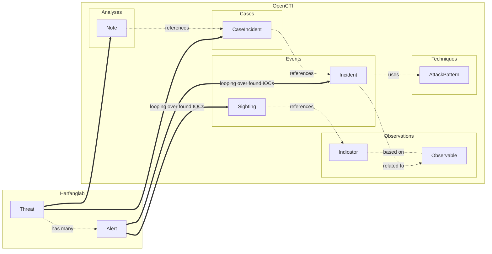
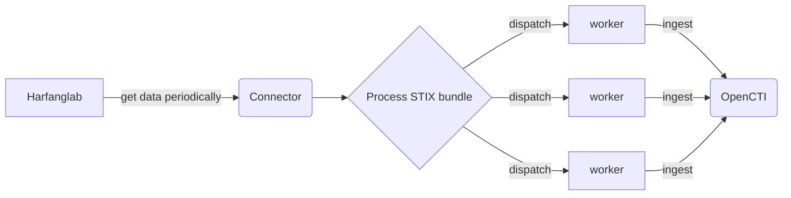

# OpenCTI Harfanglab Incidents External Import Connector

Table of Contents

- [OpenCTI External Ingestion Harfanglab Incidents Connector](#opencti-external-ingestion-harfanglab-incidents)
    - [Introduction](#introduction)
    - [Installation](#installation)
        - [Requirements](#requirements)
    - [Configuration variables](#configuration-variables)
        - [OpenCTI environment variables](#opencti-environment-variables)
        - [Base connector environment variables](#base-connector-environment-variables)
        - [Connector extra parameters environment variables](#connector-extra-parameters-environment-variables)
    - [Deployment](#deployment)
        - [Docker Deployment](#docker-deployment)
        - [Manual Deployment](#manual-deployment)
    - [Usage](#usage)
    - [Debugging](#debugging)
    - [Additional information](#additional-information)

## Introduction

This connector allows organizations to feed OpenCTI using **Harfanglab EDR** knowledge.

The graph below describes all the different entities that can be created and/or updated by the connector in OpenCTI from
Harfanglab's alert and threats.



This connector leverages OpenCTI connector *scheduler*, so it imports Harfanglab alerts and/or threats and create
corresponding entities
in OpenCTI at a defined periodicity.



## Installation

### Requirements

- OpenCTI Platform >= 6.4
- HarfangLab Threat Response >= 2.X.X
- pycti >= 6.4.X

## Configuration variables

There are a number of configuration options, which are set either in `docker-compose.yml` (for Docker) or
in `config.yml` (for manual deployment).

### OpenCTI environment variables

Below are the parameters you'll need to set for OpenCTI:

| Parameter     | config.yml `opencti` | Docker environment variable | Default | Mandatory | Description                                          |
|---------------|----------------------|-----------------------------|---------|-----------|------------------------------------------------------|
| OpenCTI URL   | url                  | `OPENCTI_URL`               | /       | Yes       | The URL of the OpenCTI platform.                     |
| OpenCTI Token | token                | `OPENCTI_TOKEN`             | /       | Yes       | The default admin token set in the OpenCTI platform. |

### Base connector environment variables

Below are the parameters you'll need to set for running the connector properly:

| Parameter       | config.yml `connector` | Docker environment variable | Default         | Mandatory | Description                                                                              |
|-----------------|------------------------|-----------------------------|-----------------|-----------|------------------------------------------------------------------------------------------|
| Connector ID    | id                     | `CONNECTOR_ID`              | /               | Yes       | A unique `UUIDv4` identifier for this connector instance.                                |
| Connector Type  | type                   | `CONNECTOR_TYPE`            | EXTERNAL_IMPORT | Yes       | Should always be set to `EXTERNAL_IMPORT` for this connector.                            |
| Connector Name  | name                   | `CONNECTOR_NAME`            |                 | Yes       | Name of the connector.                                                                   |
| Connector Scope | scope                  | `CONNECTOR_SCOPE`           | harfanglab      | Yes       | The scope or type of data the connector is importing, either a MIME type or Stix Object. |
| Log Level       | log_level              | `CONNECTOR_LOG_LEVEL`       | info            | Yes       | Determines the verbosity of the logs. Options are `debug`, `info`, `warn`, or `error`.   |
| Duration Period | duration_period        | `CONNECTOR_DURATION_PERIOD` | /               | Yes       | The period of time to wait between two connector's runs (in ISO-8601 format).            |

### Connector extra parameters environment variables

Below are the parameters you'll need to set for the connector:

| Parameter                                    | config.yml `harfanglab_incidents`         | Docker environment variable                 | Default      | Mandatory | Description                                                                                                                        |
|----------------------------------------------|-------------------------------------------|---------------------------------------------|--------------|-----------|------------------------------------------------------------------------------------------------------------------------------------|
| HarfangLab URL                               | `url`                                     | `HARFANGLAB_INCIDENTS_URL`                  | /            | Yes       | The HarfangLab instance URL                                                                                                        |
| HarfangLab SSL Verify                        | `ssl_verify`                              | `HARFANGLAB_INCIDENTS_SSL_VERIFY`           | /            | Yes       | Enable the SSL certificate check                                                                                                   |
| HarfangLab Token                             | `token`                                   | `HARFANGLAB_INCIDENTS_TOKEN`                | /            | Yes       | The token of the HarfangLab user                                                                                                   |
| HarfangLab Import Threats as Case Incidents  | `import_threats`                          | `HARFANGLAB_INCIDENTS_IMPORT_THREATS`       | False        | No        | Import threats as case incidents, from HarfangLab to OpenCTI.                                                                      |
| HarfangLab Security Events Filters by Status | `alert_statuses`                          | `HARFANGLAB_INCIDENTS_ALERT_STATUSES`       | /            | Yes       | Filters available: `new`, `investigating`, `false_positive`, `closed` - example: `new, investigating`                              |
| HarfangLab Import Filters by Alert Type      | `alert_types`                             | `HARFANGLAB_INCIDENTS_ALERT_TYPES`          | /            | Yes       | Filters available: `yara`, `sigma`, `ioc` - example: `sigma, ioc`                                                                  |
| HarfangLab Default Marking                   | `default_marking`                         | `HARFANGLAB_INCIDENTS_DEFAULT_MARKING`      | TLP:CLEAR    | No        | Choose one marking by default. Markings available: `TLP:CLEAR`, `TLP:GREEN`, `TLP:AMBER`, `TLP:RED`                                |
| HarfangLab Default Score                     | `default_score`                           | `HARFANGLAB_INCIDENTS_DEFAULT_SCORE`        | /            | No        | Default score allows you to add a default score for an indicator and its observable (a number between 1 and 100).                  |
| HarfangLab Import Start Date                 | `import_start_date`                       | `HARFANGLAB_INCIDENTS_IMPORT_START_DATE`    | 1970-01-01   | No        | Date to start import from (in ISO-8601 format) if connector's state doesn't contain last imported incident/case incident datetime. |


## Deployment

### Docker Deployment

Before building the Docker container, you need to set the version of pycti in `requirements.txt` equal to whatever
version of OpenCTI you're running. Example, `pycti==6.6.17`. If you don't, it will take the latest version, but
sometimes the OpenCTI SDK fails to initialize.

Build a Docker Image using the provided `Dockerfile`.

Example:

```shell
# Replace the IMAGE NAME with the appropriate value
docker build . -t [IMAGE NAME]:latest
```

Make sure to replace the environment variables in `docker-compose.yml` with the appropriate configurations for your
environment. Then, start the docker container with the provided docker-compose.yml

```shell
docker compose up -d
# -d for detached
```

### Manual Deployment

Create a file `config.yml` based on the provided `config.yml.sample`.

Replace the configuration variables (especially the "**ChangeMe**" variables) with the appropriate configurations for
you environment.

Install the required python dependencies (preferably in a virtual environment):

```shell
pip3 install -r requirements.txt
```

Then, start the connector from recorded-future/src:

```shell
python3 main.py
```

## Usage

After Installation, the connector should require minimal interaction to use, and should update automatically at a
regular interval specified in your `docker-compose.yml` or `config.yml` in `duration_period`.

However, if you would like to force an immediate download of a new batch of entities, navigate to:

`Data management` -> `Ingestion` -> `Connectors` in the OpenCTI platform.

Find the connector, and click on the refresh button to reset the connector's state and force a new
download of data by re-running the connector.

## Debugging

The connector can be debugged by setting the appropiate log level.
Note that logging messages can be added using `self.helper.connector_logger,{LOG_LEVEL}("Sample message")`, i.
e., `self.helper.connector_logger.error("An error message")`.

