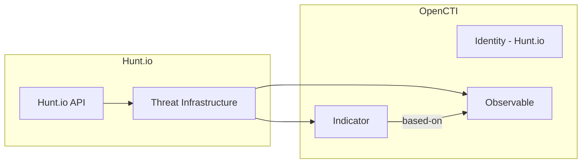

# OpenCTI Hunt.io Connector

| Status | Date | Comment |
|--------|------|---------|
| Partner | -    | -       |

The Hunt.io connector imports threat intelligence from Hunt.io's threat intelligence platform into OpenCTI.

## Table of Contents

- [OpenCTI Hunt.io Connector](#opencti-huntio-connector)
  - [Table of Contents](#table-of-contents)
  - [Introduction](#introduction)
  - [Installation](#installation)
    - [Requirements](#requirements)
  - [Configuration variables](#configuration-variables)
    - [OpenCTI environment variables](#opencti-environment-variables)
    - [Base connector environment variables](#base-connector-environment-variables)
    - [Connector extra parameters environment variables](#connector-extra-parameters-environment-variables)
  - [Deployment](#deployment)
    - [Docker Deployment](#docker-deployment)
    - [Manual Deployment](#manual-deployment)
  - [Usage](#usage)
  - [Behavior](#behavior)
  - [Debugging](#debugging)
  - [Additional information](#additional-information)

## Introduction

[Hunt.io](https://hunt.io/) provides threat intelligence focused on attacker infrastructure, including C2 servers, malware hosting, and other malicious infrastructure. This connector fetches threat data from the Hunt.io API and imports it into OpenCTI.

## Installation

### Requirements

- OpenCTI Platform >= 6.x
- Hunt.io API access (API key required)

## Configuration variables

There are a number of configuration options, which are set either in `docker-compose.yml` (for Docker) or in `config.yml` (for manual deployment).

### OpenCTI environment variables

| Parameter     | config.yml | Docker environment variable | Mandatory | Description                                          |
|---------------|------------|-----------------------------|-----------|------------------------------------------------------|
| OpenCTI URL   | url        | `OPENCTI_URL`               | Yes       | The URL of the OpenCTI platform.                     |
| OpenCTI Token | token      | `OPENCTI_TOKEN`             | Yes       | The default admin token set in the OpenCTI platform. |

### Base connector environment variables

| Parameter       | config.yml | Docker environment variable | Default | Mandatory | Description                                                              |
|-----------------|------------|-----------------------------|---------|-----------|--------------------------------------------------------------------------|
| Connector ID    | id         | `CONNECTOR_ID`              |         | Yes       | A unique `UUIDv4` identifier for this connector instance.                |
| Connector Name  | name       | `CONNECTOR_NAME`            | Hunt.io | No        | Name of the connector.                                                   |
| Connector Scope | scope      | `CONNECTOR_SCOPE`           |         | Yes       | The scope or type of data the connector is importing.                    |
| Log Level       | log_level  | `CONNECTOR_LOG_LEVEL`       | info    | No        | Determines the verbosity of logs: `debug`, `info`, `warn`, or `error`.   |

### Connector extra parameters environment variables

Below are the parameters you'll need to set for the connector:

| Parameter    | config.yml   | Docker environment variable | Default | Mandatory | Description                                                                                                               |
|--------------|--------------|-----------------------------|---------|-----------|---------------------------------------------------------------------------------------------------------------------------|
| API base URL | api_base_url | `HUNT_IO_API_BASE_URL`      |         | Yes       |                                                                                                                           |
| API key      | api_key      | `HUNT_IO_API_KEY`           |         | Yes       |                                                                                                                           |
| TLP level    | tlp_level    | `HUNT_IO_TLP_LEVEL`         | amber   | No        | The Traffic Light Protocol level for data being ingested. Valid values: `white`, `green`, `amber`, `amber+strict`, `red`. |

## Deployment

### Docker Deployment

Build the Docker image:

```bash
docker build -t opencti/connector-hunt-io:latest .
```

Configure the connector in `docker-compose.yml`:

```yaml
  connector-hunt-io:
    image: opencti/connector-hunt-io:latest
    environment:
      - OPENCTI_URL=http://localhost
      - OPENCTI_TOKEN=ChangeMe
      - CONNECTOR_ID=ChangeMe
      - CONNECTOR_NAME=Hunt.io
      - CONNECTOR_SCOPE=hunt-io
      - CONNECTOR_LOG_LEVEL=info
      - HUNT_IO_API_BASE_URL=ChangeMe
      - HUNT_IO_API_KEY=ChangeMe
    restart: always
```

Start the connector:

```bash
docker compose up -d
```

### Manual Deployment

1. Create `config.yml` based on `config.yml.sample`.

2. Install dependencies:

```bash
pip3 install -r requirements.txt
```

3. Start the connector:

```bash
python3 main.py
```

## Usage

The connector runs automatically at the configured interval. To force an immediate run:

**Data Management → Ingestion → Connectors**

Find the connector and click the refresh button to reset the state and trigger a new data fetch.

## Behavior

The connector fetches threat intelligence from Hunt.io API and imports it into OpenCTI.

### Data Flow



### Entity Mapping

| Hunt.io Data       | OpenCTI Entity      | Description                                      |
|--------------------|---------------------|--------------------------------------------------|
| IP Address         | IPv4-Addr           | Malicious IP observable                          |
| Domain             | Domain-Name         | Malicious domain observable                      |
| URL                | URL                 | Malicious URL observable                         |
| -                  | Indicator           | STIX indicator with pattern                      |

## Debugging

Enable verbose logging:

```env
CONNECTOR_LOG_LEVEL=debug
```

## Additional information

- **API Access**: Hunt.io API requires authentication
- **Reference**: [Hunt.io](https://hunt.io/)
