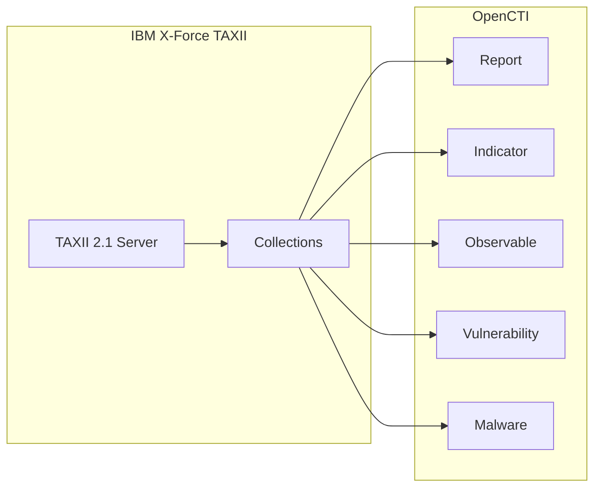

# OpenCTI IBM X-Force Threat Intelligence Connector

| Status | Date | Comment |
|--------|------|---------|
| Partner Verified | -    | -       |

The IBM X-Force connector imports threat intelligence from IBM X-Force Premium Threat Intelligence (XTI) via TAXII 2.1 into OpenCTI.

## Table of Contents

- [OpenCTI IBM X-Force Threat Intelligence Connector](#opencti-ibm-x-force-threat-intelligence-connector)
  - [Table of Contents](#table-of-contents)
  - [Introduction](#introduction)
  - [Installation](#installation)
    - [Requirements](#requirements)
  - [Configuration variables](#configuration-variables)
    - [OpenCTI environment variables](#opencti-environment-variables)
    - [Base connector environment variables](#base-connector-environment-variables)
    - [Connector extra parameters environment variables](#connector-extra-parameters-environment-variables)
  - [Deployment](#deployment)
    - [Docker Deployment](#docker-deployment)
    - [Manual Deployment](#manual-deployment)
  - [Usage](#usage)
  - [Behavior](#behavior)
  - [Debugging](#debugging)
  - [Additional information](#additional-information)

## Introduction

X-Force Threat Intelligence delivers insights to help clients improve their security posture. X-Force Threat Intelligence combines IBM security operations telemetry, research, incident response investigations, commercial data, and open sources to aid clients in understanding emerging threats and quickly make informed security decisions.

IBM X-Force offers a TAXII 2.1 Server to access IBM X-Force Premium Threat Intelligence (XTI) Reports and Indicators of Compromise.

## Installation

### Requirements

- OpenCTI Platform >= 6.x
- IBM X-Force XTI subscription with TAXII access
- TAXII server credentials

## Configuration variables

There are a number of configuration options, which are set either in `docker-compose.yml` (for Docker) or in `config.yml` (for manual deployment).

### OpenCTI environment variables

| Parameter     | config.yml | Docker environment variable | Mandatory | Description                                          |
|---------------|------------|-----------------------------|-----------|------------------------------------------------------|
| OpenCTI URL   | url        | `OPENCTI_URL`               | Yes       | The URL of the OpenCTI platform.                     |
| OpenCTI Token | token      | `OPENCTI_TOKEN`             | Yes       | The default admin token set in the OpenCTI platform. |

### Base connector environment variables

| Parameter       | config.yml      | Docker environment variable   | Default | Mandatory | Description                                                              |
|-----------------|-----------------|-------------------------------|---------|-----------|--------------------------------------------------------------------------|
| Connector ID    | id              | `CONNECTOR_ID`                |         | Yes       | A unique `UUIDv4` identifier for this connector instance.                |
| Connector Name  | name            | `CONNECTOR_NAME`              | IBM XTI | No        | Name of the connector.                                                   |
| Connector Scope | scope           | `CONNECTOR_SCOPE`             |         | Yes       | The scope or type of data the connector is importing.                    |
| Duration Period | duration_period | `CONNECTOR_DURATION_PERIOD`   | PT5M    | No        | Time interval between runs in ISO 8601 format.                           |
| Log Level       | log_level       | `CONNECTOR_LOG_LEVEL`         | info    | No        | Determines the verbosity of logs: `debug`, `info`, `warn`, or `error`.   |

### Connector extra parameters environment variables

| Parameter         | config.yml         | Docker environment variable           | Default                    | Mandatory | Description                                                    |
|-------------------|--------------------|---------------------------------------|----------------------------|-----------|----------------------------------------------------------------|
| TAXII Server URL  | taxii_server_url   | `CONNECTOR_IBM_XTI_TAXII_SERVER_URL`  |                            | Yes       | The base URL of the IBM X-Force PTI TAXII Server.              |
| TAXII User        | taxii_user         | `CONNECTOR_IBM_XTI_TAXII_USER`        |                            | Yes       | Your TAXII Server username.                                    |
| TAXII Password    | taxii_pass         | `CONNECTOR_IBM_XTI_TAXII_PASS`        |                            | Yes       | Your TAXII Server password.                                    |
| TAXII Collections | taxii_collections  | `CONNECTOR_IBM_XTI_TAXII_COLLECTIONS` | All authorized collections | No        | Comma-separated list of collection IDs to ingest.              |
| Create Observables| create_observables | `CONNECTOR_IBM_XTI_CREATE_OBSERVABLES`|                            | No        | Create observables from indicators.                            |

## Deployment

### Docker Deployment

Build the Docker image:

```bash
docker build -t opencti/connector-ibm-xti:latest .
```

Configure the connector in `docker-compose.yml`:

```yaml
  connector-ibm-xti:
    image: opencti/connector-ibm-xti:latest
    environment:
      - OPENCTI_URL=http://localhost
      - OPENCTI_TOKEN=ChangeMe
      - CONNECTOR_ID=ChangeMe
      - CONNECTOR_NAME=IBM X-Force XTI
      - CONNECTOR_SCOPE=ibm-xti
      - CONNECTOR_DURATION_PERIOD=PT5M
      - CONNECTOR_LOG_LEVEL=info
      - CONNECTOR_IBM_XTI_TAXII_SERVER_URL=ChangeMe
      - CONNECTOR_IBM_XTI_TAXII_USER=ChangeMe
      - CONNECTOR_IBM_XTI_TAXII_PASS=ChangeMe
    restart: always
```

Start the connector:

```bash
docker compose up -d
```

### Manual Deployment

1. Create `config.yml` based on `config.yml.sample`.

2. Install dependencies:

```bash
pip3 install -r requirements.txt
```

3. Start the connector:

```bash
python3 main.py
```

## Usage

The connector runs automatically at the interval defined by `CONNECTOR_DURATION_PERIOD`. To force an immediate run:

**Data Management → Ingestion → Connectors**

Find the connector and click the refresh button to reset the state and trigger a new data fetch.

## Behavior

The connector fetches threat intelligence from IBM X-Force via TAXII 2.1 and imports it into OpenCTI.

### Data Flow



### Entity Mapping

| IBM X-Force Data     | OpenCTI Entity      | Description                                      |
|----------------------|---------------------|--------------------------------------------------|
| Report               | Report              | Threat intelligence reports                      |
| Indicator            | Indicator           | IOCs with STIX patterns                          |
| Observable           | Observable          | Technical observables (optional)                 |
| Vulnerability        | Vulnerability       | CVE information                                  |
| Malware              | Malware             | Malware families                                 |

### Processing Details

- **Parallel Ingestion**: Collections are ingested in parallel for faster processing
- **Incremental Updates**: After initial run, only new records are ingested
- **Retry Logic**: Transient failures are retried automatically
- **Large Datasets**: Initial runs may take several hours for large collections

### Collection Configuration

To limit ingestion to specific collections:

```env
CONNECTOR_IBM_XTI_TAXII_COLLECTIONS=collection-id-1,collection-id-2
```

> **Note**: Use collection IDs, not names or aliases.

## Debugging

Enable verbose logging:

```env
CONNECTOR_LOG_LEVEL=debug
```

## Additional information

- **Subscription Required**: IBM X-Force XTI requires a paid subscription
- **TAXII 2.1**: Uses standard TAXII 2.1 protocol
- **Default Interval**: Runs every 5 minutes by default
- **Reference**: [IBM X-Force Exchange](https://exchange.xforce.ibmcloud.com/)
